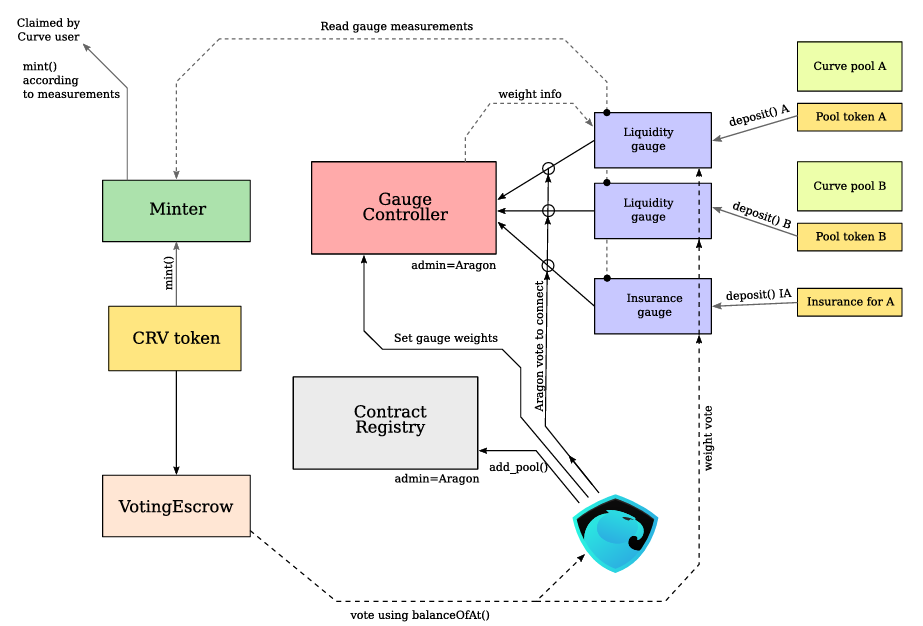

# CurveDAO

CurveDAO构建于AragonDAO的标准化合约之上，下面是其架构图：

**CRV token（ERC20）**：系统的通证，用作治理和激励，可以转移。铸造由 Minter 控制并遵循通胀计划。

**Minter**：负责根据通胀规则 mint（铸造）CRV，并按“gauge 的测量结果”把 CRV 发给各个 Gauge（即按使用/流动性情况分配）。

**VotingEscrow（veCRV）**：用户把 CRV lock 锁入投票托管，锁的数量和剩余锁时长决定其投票权（time-weighted voting）。这是治理权和 boost 的来源。

**Contract Registry**：记录核心合约地址（方便 Aragon/DAO 管理与更新）。

**GaugeController**：DAO（通过 Aragon）控制的核心合约，保存所有 Gauge 的列表、每类 Gauge 的 type weights、以及对各 Gauge 的权重投票结果（即决定各池分配到多少 CRV）。GaugeController 接受用户通过 veCRV 的权重投票并把权重安排到下一周生效（可调频次限制）。

**LiquidityGauge / InsuranceGauge（各类 Gauge）**：每个 pool 对应一个 Gauge，用户把该 pool 的 LP token deposit 到相应的 Gauge，Gauge 会按时间积分记录该用户贡献并在后续把 CRV 分配给用户。也支持保险类的 Gauge（测量保险型贡献）。

下面我们会一一介绍这些合约的具体内容

## 1.VotingEscrow

权重函数
$$
w_i = a\frac{t_{end}-t}{t_{max}}
$$
$t_{max}$ 是常数，为4年

> User voting power wi is linearly decreasing since the moment of lock. So does the total voting power W. In order to avoid periodic check-ins, every time the user deposits, or withdraws, or changes the locktime, we record user’s slope and bias for the linear function wi(t) in user_point_history. We also change slope and bias for the total voting power W(t) and record in point_history. In addition, when user’s lock is scheduled to end, we schedule change of slopes of W(t) in the future in slope_changes. Every change involves increasing the epoch by 1. This way we don’t have to iterate over all users to figure out, how much should W(t) change by, neither we require users to check in periodically. However, we limit the end of user locks to times rounded off by whole weeks. Slopes and biases change both when a user deposits and locks governance tokens, and when the locktime expires. All the possible expiration times are rounded to whole weeks to make number of reads from blockchain proportional to number of missed weeks at most, not number of users (which can be potentially large).

# Economic Incentive Design

Curve早先是以低费率的稳定币互换闻名的。后续由因其出色的token economic设计

**Economic Incentive Design**：staking/vesting reward，bonding curve，gauge system的设计

VotingEscrows&Gauge模式：

通常出现在AMM/Lending 协议中，此类协议有多种代币市场，为了让资金的提供方和项目方利益绑定，会基于这些资金提供方一些随stake时间增长的投票代币奖励。

以Curve为例，当用户提供流动性给AMM后会获得流动性LP代币，会分得项目方赚取的手续费。

此LP代币可以进一步`stake`。

- `stake`将质押在`Reward Gauge`合约中，以获得通胀所分发的代币。其中`Reward Gauge`会需要DAO的vote&approval，且有一个gauge weight 作为emission的权重。
- Stake后可以将`Curve`代币 lock会获得vote-escrowed CRV（veCRV）和2.5倍的`CRV`获取率，lock期间无法取走`CRV`，且`lock`本身会先`stake`才能进行以获得2.5倍boost，故只持有`veCRV`也并不代表获得`CRV`的权利。`veCRV`只能作为投票和获得DAO收入的门票。

这种设计使得资方更希望获得越来越多的投票权`veCRV`以将其`Reward Gauge`的权重增加，从而获得更多的代币，从而促进其积极参与治理和提供流动性。

这种设计也催生了`Bribe`系统，即部分项目方提供现成奖励使得`veCRV`的散户对其`Gauge`进行投票。散户能快速变现同时部分庄家也获得了更高的权重获得更多的手续费收入。

投票权重记录check

