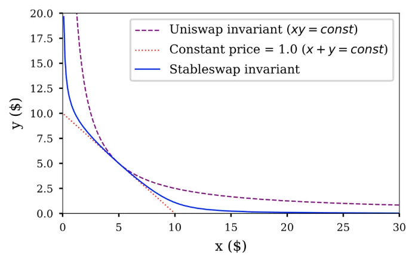

[TOC]

# 1.Curve的Swap机制

## 1.1StableSwap

### 1.1.1Uniswap在稳定币互换中的困境

UniswapV2中我们有不变式
$$
xy = k\tag{1}
$$
因此
$$
y = \frac{k}{x},\quad x>0 \tag{2}
$$
这说明对任意非负数量的代币$x$ 都存在对应的 $y$可以完成互换，这是恒积式AMM的好处。但是对于稳定币互换，比如1DAI<=>1USDC，我们在实际的互换中会遇到一些问题，下面的推导将解释uniswapV2在稳定币中的缺陷：

在理想情况下，我们把$y = \frac{k}{x}$对 (x) 求导得到
$$
\frac{dy}{dx} = -\frac{k}{x^2} \tag{3}
$$

用 $k = xy$代入则有
$$
\frac{dy}{dx} = -\frac{xy}{x^2} = -\frac{y}{x} \tag{4}
$$

假设池中资产数总是1:1时，我们瞬时的token变化$\frac{dy}{dx} = 1$，看上去似乎没什么问题，好像看上去我们能完美地将1DAI换成1USDC。

但关键是用户在池中进行`swap`的数量变化`dx,dy`一般不会小到可以进行微分计算，而流动性池的变化实际上遵循：
$$
(x + \Delta x)(y - \Delta y) = x y \tag{5}
$$
由上式可知，实际的变化量其实为：
$$
\boxed{\frac{\Delta y}{\Delta x} = \frac{y}{x} -\frac{\Delta y}{x}} \tag{6}
$$
而（5）式中的右边换成K我们就能推导出$\Delta y = y-\frac{k}{x+\Delta x}$.

也就是说，除了池中的代币数量以外，我们实际换出来的代币数$\Delta y$还和实际输入的$\Delta x$ 有关。

总结的来讲，uniswapV2中的互换数量和两方面有关：

- 池中的代币存储$x,y$
- 输入的代币$\Delta x$ 

这两点导致我们对于稳定币的互换很大概率会较大偏移1:1，即$\frac{\Delta y}{\Delta x} = 1$大概率难以成立。

------

于是人们想到了另外一个恒等式$x+y=k$，即$y=k-x$，我们对其求导，就知道$dy=-dx$永远在值域中成立。

问题是这个函数的缺点是有限的值域，即$x\in [0,k]$ ，允许$x,y$ 归零，且1个代币A永远能换1个代币B。

如果市场价一旦不是严格的1:1，套利者会瞬间掏空其中一种代币，导致池子失效。

如下图中的红色虚线和紫色虚线就是上述提及的图像对比，其坐标轴x和y都是池中的代币数量（忽略decimal）：

### 1.1.2Curve的解决方法

#### 1.1.2.1恒定式初步推导

Curve顺着了常和式$x+y=k$的想法，但是它为了防止池子被掏空，还引入恒定乘积作为“安全网”。

当池子严重失衡时，这个安全网会让价格变得极其昂贵，从而阻止进一步的套利。

从$x+y=k$ 我们可以看出，$k$其实就是代币$x,y$ 在池中的数量总和，如果池中两代币的数量一样是$k/2$，那么我们对应的恒积公式应该是 $xy=(\frac{k}{2})^2$ 。

现在我既需要恒和式中1：1兑换的部分，又要在极端情况下恒积式中无限长尾的部分。

那么很自然地我们会像做投资组合一样，构造一个虚拟的池子，从而将二者加起来得到下面的式子：
$$
wa(x+y) +(xy)=wak+(\frac{k}{2})^2 \tag{7}
$$
其中：

- $w$是恒和式的权重，亦或者说是杠杆，当$w$变成0时，该池子将退化为uniswapV2的恒积式流动性池。而$W$越大，其对恒和式的敞口就越大。
- $a$是调整项，其作用是将一次方的加法的和调整为二次方的乘法的幂的维度，从而平衡量纲。

**那么问题来了，$w,a$应该等于多少？**

1. $a$ 作为调整项，Curve中直接将其赋值为$a=k$。

2. 而对于$w$，应该是一个能够动态调整恒和式和恒积式组合权重的数，具体而言：

   - 当池子中的代币数量$x,y$ 越接近 $y=x$ 这条中轴线的时候，$w$ 应该越大，来增加$x+y=k$ 的权重，从而保证池子中`swap`中资产变化数$\Delta x,\Delta y$  表现的和恒和式的池子一样
   - 反之如果$x,y$ 之间越原理$y=x$ ,$w$ 应该越小，直到趋近于0，从而退化为一个普通的恒积式池子。

   于是，我们会让$w$ 在$x=y$ 使变成某个常数$c$，即$w$ 的最大值。而$x或y$ 趋于0时,$w$趋于0. 

   由此

$$
w =\frac{cxy}{(k/2)^2} \tag{8}
$$

于是对于两个代币$x,y$我们有:
$$
\frac{cxy}{(k/2)^2}k(x+y) +(xy) = \frac{cxy}{(k/2)^2}k^2+(\frac{k}{2})^2 \tag{9}
$$

#### 1.1.2.2Curve恒定式

在Curve的白皮书中，其项目支持一个流动性池便支持多个代币对的互换，其恒和式在多个代币存在对时，被记作$
 \sum_i x_i = D
 $，其恒积式记作$
 \prod_i x_i = \left(\frac{D}{n}\right)^n
 $

而最终的（9）式则对应记作：
$$
\chi D^{n-1} \sum^n_{i=1} x_i + \prod^n_{i=1} x_i
 = \chi D^n + \left(\frac{D}{n}\right)^n
$$
where:
$$
\chi = \frac{A\prod^n_{i=1} x_i}{(D/n)^2}
$$
其中$A$ 对应我们之前的常数$c$,  $D$ 对应$k$.

# ref

[whitepaper_stableswap.pdf](https://docs.curve.finance/assets/pdf/whitepaper_stableswap.pdf)

