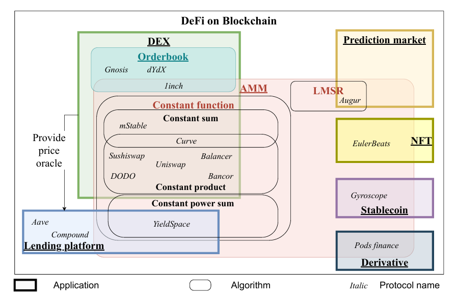

# AMM是什么？

根据一个较多引用的SoK文献[SoK: Decentralized Exchanges (DEX) with Automated Market Maker (AMM) Protocols](https://www.researchgate.net/profile/Jiahua-Xu/publication/365285417_SoK_Decentralized_Exchanges_DEX_with_Automated_Market_Maker_AMM_Protocols/links/63c7b08ae922c50e99a30b3a/SoK-Decentralized-Exchanges-DEX-with-Automated-Market-Maker-AMM-Protocols.pdf) 中所描述的AMM(automated market maker) 和一般的order-book交易的区别：

> With traditional order-book-based exchanges, the market price of an asset is determined by the last matched buy and sell orders, ultimately driven by the supply and demand of the asset. 
>
> In contrast, on an AMM-based DEX, a liquidity pool acts as a single counterparty for each transaction, with a so-called **conservation function** that prices assets algorithmically by only allowing the price to move along predefined trajectories.
>
> AMMs implement a peer-to-pool method, where liquidity providers (LPs) contribute assets to liquidity pools while individual users exchange assets with a pool or pools containing the input and the output assets. Users obtain immediate liquidity without having to find an exchange counterparty, whereas LPs profit from asset supply with exchange fees from users. Furthermore, by using a conservation function for price setting, AMMs render moot the necessity of maintaining the state of an order book, which would be costly on a distributed ledger.

我们可以知道AMM是一个基于peer-to-pool的交易所算法，其资产变动可以根据conservation function（如uniswapV2中的$xy=k$ ）来描述，进而自动化地处理资产的exchange。

其典型的AMM-based Dex包括：**Uniswap,Curve,Balancer,DODO,Sushiswap**等.

除了AMM-based Dex，还有一些采用order-book-based Dex,如**dxdy,Gnosis.**

AMM算法也会被用于非Dex领域，文献内通过了下图进行展示相关的Defi生态：

AMM中会出现的问题：

- Price Impact
- Slippage
- Impermanent Loss
- Capital Efficiency

LP来说会出现的问题

1. 无常损失导致的资产减少

2. 缺乏资金利用率导致的手续费交易减少

Trader会遇见的问题

1. 交易完成后发生的致使的价格变动Price Impact

2. 交易完成钱现货价格与交易完成后实际成交中发生的汇率差距导致的slippage

文献中很好的总结了各个AMM-based的DEX中算法,slippage和Impermanent Loss的区别。

