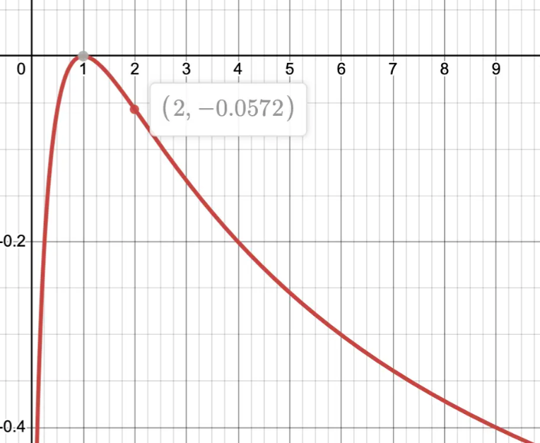

[TOC]


# 1.Do you really know Uniswap V2

UniswapV2可以说是AMM中最基础的项目，但是你真的**完全理解**uniswapV2吗？

如果你真的觉得自己是Defi大师，请回答我以下的问题：

1. ETH/USDC池中，如果ETH价格上涨一倍，请问IL（无常损失）是多少？
2. 告诉我Uniswap中的最优价格路径算法是怎么样的
3. 解释 Pair 合约中的 `sync()` 与 `skim()` 的区别与使用场景
4. UniswapV2中如何分配项目方和众多LP的手续费？


# 2.UniswapV2详解

## 2.1架构分析

UniswapV2的架构相对简单直白：

- peripheral+core的模式分离核心逻辑与用户交互方面的优化逻辑

  > 这一点的是相对于v1的升级，目的是保证core的只有核心代码且有绝对安全性并存储资产，而peripheral部分可以随时替换，保证可升级性。

- core中factory+pair是经典的工厂模式以用一个factory合约控制多个pair合约。


## 2.2 代码解析

### 2.2.1 Core

Core中的项目非常简单，除了几个lib合约外就是一个pair，erc20和factory合约，而其中pair是uniswap实现逻辑的重点，下面我们会详细讲解其中的机制，并试着从0开始自己写一个pair合约。


#### 2.2.1.1 简单地完成一个pair

> 注意！下面的代码都经过一系列简化方便阅读，其安全性和gas优化都会打折扣，生产级别代码参考uniswap源码

假设你是uniswap的开发者，你要开发一个流动性池，你需要开发的功能有哪些？想必会有

1. **提供流动性和取出流动性的函数（Mint/Burn）**
2. **面对trader进行代币互换的函数（Swap）**


现在我们试着解决最简单的`Mint`函数。这个函数应该是LP们提供流动性后，会Mint一些ERC20 token给它作为凭证，以获得手续费。

那么首先我们得思考`Mint`函数该如何分配给LP多少 token，还有edge case的第一次Mint时，我们需要给第一个LP多少 token？

##### Mint函数的实现

我们先从简单的开始，假设LP已经发钱来了，`Mint`首先得看看用户到底转了多少钱，这个好办，我们只需要算一下与上次记录时，`reserve`变量的差值。

```solidity
function Mint() external {
 (uint256 reserve0, uint256 reserve1) = getReserve();
 uint256 diff0 = balanceOf(token0) - reserve0;
 uint256 diff1 = balanceOf(token1) - reserve1;
 ...
}

```

之后我们得想想该mint给用户多少token？既然我们知道`xy=k`的`k`是两个代币数量的积，那不如用`sqrt(k)`作为这个LP token所mint的数量吧。自然地我们有

```solidity
function Mint(address to) external {
 (uint256 reserve0, uint256 reserve1) = getReserve();
 uint256 diff0 = token0.balanceOf(address(this)) - reserve0;
 uint256 diff1 = token1.balanceOf(address(this)) - reserve1;
 ---- new part----
 uint256 liquidity = sqrt(diff0*diff1);
 require(liquidity>0,"zero liquidity");
 _mint(to,liquidity);//继承ERC20
 
 _update(token0.balanceOf(address(this)),token1.balanceOf(address(this)));
}
function _update(uint256 amount0,uint256 amount1) internal {
	reserve0 = amount0; //reserve0,1 as state variable
    reserve1 = amount1;
}

```

#####  Burn函数的实现

那`burn`函数不是更好写？我们只需要和一般的ERC20一样burn掉它就可以了，之后按比例地返回用户所获得的token就好了：

```solidity
function burn(uint256 amount) external {
	uint256 Userbalance = balanceOf(msg.sender);
	require(Userbalance>=amount,"not enough LP token");
	//evenly give back the tokens
	uint256 shareOfUser = Userbalance*10**decimal / totalSupply();
	
	uint256 token0_balance = token0.balanceOf(address(this));
	uint256 token1_balance = token1.balanceOf(address(this));
	
	uint256 amount0 = token0_balance*shareOfUser/(10*token0.decimal()*10**decimal);
	uint256 amount1 = token1_balance*shareOfUser/(10*token1.decimal()*10**decimal);
	
	token0.safeTransfer(msg.sender,amount0);
	token1.safeTransfer(msg.sender,amount1);
	_update(token0.balanceOf(address(this)),token1.balanceOf(address(this)));
}
```

但是你按上面写你会发现如下问题：

- 使用`sqrt(diff0*diff1);`作为mint的流动性代币会导致token decimal的不一致，比如USDC*WETH，最终decimal位数是（6+18）/2 = 12。这种不一致导致`burn`的时候，使用`10**decimal`（比如erc20合约设decimal为18）时多除了6位。

- `sqrt(diff0*diff1);`的记录LP的方式会让不同价值的资产组合获得相同数量的LP。假设某coin的decimal为18位，资产价格为0.1美元。

  1USDC+10coin 和 0.01USDC + 1000coin 两个资产组合获得相同的LP。

  但是前者资产价格为2美元，后者却价值100美元。同时用户还花了非常多的钱扭曲了池子中的流动性，即超额提供了coin。


对于第一个问题，只需要简单修改一下代码顺序即可：

```solidity
function burn(uint256 amount) external {
	uint256 Userbalance = balanceOf(msg.sender);
	require(Userbalance>=amount,"not enough LP token");
	//evenly give back the tokens
	
	uint256 token0_balance = token0.balanceOf(address(this));
	uint256 token1_balance = token1.balanceOf(address(this));
	
	uint256 amount0 = token0_balance*amount/totalSupply;
	uint256 amount1 = token1_balance*amount/totalSupply;
	require(amount0 > 0 && amount1 > 0, 'UniswapV2: INSUFFICIENT_LIQUIDITY_BURNED');
	
	token0.safeTransfer(msg.sender,amount0);
	token1.safeTransfer(msg.sender,amount1);
	_update(token0.balanceOf(address(this)),token1.balanceOf(address(this)));
}
```

而对于第二个问题，我们需要在第一次`mint`后取最小值

```solidity
function Mint(address to) external {
 (uint256 reserve0, uint256 reserve1) = getReserve();
 uint256 diff0 = balanceOf(token0) - reserve0;
 uint256 diff1 = balanceOf(token1) - reserve1;
 if (totalSupply == 0) {
   //第一次mint，L=sqrt(xy) - MINIMUM_LIQUIDITY
   liquidity = Math.sqrt(diff0*diff1) - MINIMUM_LIQUIDITY;
   _mint(address(0), MINIMUM_LIQUIDITY); // permanently lock the first MINIMUM_LIQUIDITY tokens
   } else {
   //后续的mint会按最小比例来计算
   //L = min(amount0*totalSupply/x, amount1*totalSupply/y)
   liquidity = Math.min(diff0*totalSupply/reserve0, diff1*totalSupply/reserve1);
    }
    
 require(liquidity>0,"zero liquidity");
 _mint(to,liquidity);//继承ERC20
 
 _update(token0.balanceOf(address(this)),token1.balanceOf(address(this)));
}
```

其中使用$ΔS =S⋅min(Δx/x, Δy/y)$ 来计算新增流动性token。

虽然这个方法保留了让不同价值的组合可能获得相同流动性的问题。但是却让LP们自己寻找一个平衡位置来提供流动性；**即最优的token提供方案应该是：$Δx/x = Δy/y$ 的情况，否则多余的任何x/y 代币都会是无效的。**


#####  Swap函数的实现

现在做完了`burn/mint`函数，接下来就是面对LP们的swap方法了。swap方法首先得明确我们是swap是输入outAmount还是inAmount，在uniswapV2中，采用的是outAmount

```solidity
function swap(uint256 amount0Out,uint256 amount1Out,address to) external {
        require(amount0Out > 0 || amount1Out > 0, 'UniswapV2: INSUFFICIENT_OUTPUT_AMOUNT');
        (uint256 _reserve0, uint256 _reserve1,) = getReserves(); // gas savings
        require(amount0Out < _reserve0 && amount1Out < _reserve1, 'UniswapV2: INSUFFICIENT_LIQUIDITY');
        //转账
        token0.safeTrasnfer(to,amount0Out);
        token1.safeTransfer(to,amount1Out);
       	//对比前后转账的变化
       	uint256 balance0 = IERC20(_token0).balanceOf(address(this));
        uint256 balance1 = IERC20(_token1).balanceOf(address(this));
        
        uint amount0In = balance0 > _reserve0 - amount0Out ? balance0 - (_reserve0 - amount0Out) : 0;
        uint amount1In = balance1 > _reserve1 - amount1Out ? balance1 - (_reserve1 - amount1Out) : 0;
        require(amount0In > 0 || amount1In > 0, 'UniswapV2: INSUFFICIENT_INPUT_AMOUNT');
        
        //保持xy=k前后成立
        require(balance0*balance1 == _reserve0*_reserve1,"invariant does not hold" );

		_update(balance0,balance1);//更新reserve
}
```

你如果按上面的方式运行代码，会发现很多时候代码会卡在`require`中，这是因为我们使用的是`==`。

考虑以下的情况：

```bash
现在池子有：

token0：300

token1：500

用户希望得到30的token0，那么之后的池子中：

token0：270

token1：150000/270 = 555.555...循环
```

无论token1是555还是556，最终都不满足`==`。

所以一般来说我们会最终取`>=`作为核验的标准，即最终token1应该最终有556个token1，而如果使用`<=`这个校验相当于无效，用户可以盗取所有的token。

```solidity
function swap(uint256 amount0Out,uint256 amount1Out,address to) external {
  ....
        //保持xy=k前后成立
        require(balance0*balance1 >= _reserve0*_reserve1,"invariant does not hold" );
  ....
}
```


#### 2.2.1.2 完成pair中的其他需求

##### swap函数中的费用

上一节中我们似乎完成了一个简单的swap，它有面向LP的函数和swap函数，但是关键的费率还是缺少，毕竟大家都要赚钱的。

于是现在我们有以下的需求：

- LP和协议都从swap中获得交易者的手续费，金额为0.3%
- 这笔手续费LP分5/6，协议分1/6

**思考一下如何去分这个钱？**

首先一个简单暴力的分钱方式是每次swap的时候，我们抽取一部分的钱放在一个指定的treasury合约中，LP们凭着自己持有的代币进行均分，每次分钱时LP们主动call函数`collect()`，`collect()`总是要分1/6的LP获得的金额给协议从而使得LP总拿5/6，而协议会拿到1/6。

但是这种设计方案会导致以下问题：

- **时间相关的问题：**用户可能在$t_1$时调用了`swap`，此时的手续费应该是归给$t_1$时刻前提供流动性的用户。于是我们必然需要记录这笔费用发生的时刻，但是手续费用又是如此的微不足道，以至于每次记录费用的gas都可能比手续费贵。而上万笔交易有上万个交易时间戳，每次我们都要算这笔交易的手续费应该归属哪些LP们。这个相关的问题可能比较头疼。
- **Gas问题：**上面也说了，多出的transfer+记录所用的gas费用可能会增加trader的损耗


于是我们另寻一种方法，即与其让手续费每次都发出去，**不如让它先留在池子中**。

于是我们会将`swap`中的输入的token抽点水，即每次汇款的`amount0In`和`amount1In`中0.3%的资金都不计算在前后的资产变化中。

```solidity
function swap(uint256 amount0Out,uint256 amount1Out,address to) external {
        require(amount0Out > 0 || amount1Out > 0, 'UniswapV2: INSUFFICIENT_OUTPUT_AMOUNT');
        (uint256 _reserve0, uint256 _reserve1,) = getReserves(); // gas savings
        require(amount0Out < _reserve0 && amount1Out < _reserve1, 'UniswapV2: INSUFFICIENT_LIQUIDITY');
        //转账
        token0.safeTrasnfer(to,amount0Out);
        token1.safeTransfer(to,amount1Out);
       	//对比前后转账的变化
       	uint256 balance0 = IERC20(_token0).balanceOf(address(this));
        uint256 balance1 = IERC20(_token1).balanceOf(address(this));
        
        uint amount0In = balance0 > _reserve0 - amount0Out ? balance0 - (_reserve0 - amount0Out) : 0;
        uint amount1In = balance1 > _reserve1 - amount1Out ? balance1 - (_reserve1 - amount1Out) : 0;
        require(amount0In > 0 || amount1In > 0, 'UniswapV2: INSUFFICIENT_INPUT_AMOUNT');
 	-----new----
 		//抽水
 		uint256 balance0Adjusted = balance0*1000 - amount0In*3;
 		uint256 balance1Adjusted = balance1*1000 - amount1In*3;
 	
        //保持抽水后的xy=k前后成立
        require(balance0Adjusted *balance1Adjusted >= _reserve0*_reserve1*1000*1000,"invariant does not hold" );
	------------
		_update(balance0,balance1);//更新reserve
}
```

这样，当LP进行`burn`时，它可以对应取走这部分对应的手续费。


##### _mintfee函数

但是这也带来一个问题，LP拿到了手续费，**但是协议该如何得到手续费呢？**

首先既然是使用了直接`burn`的方法，那么协议希望获取一部分利润就代表着它一定也会持有一部分的LP token，这就出现了几个问题

- 怎么给协议这部分token？
- 该给多少token？


首先回答第一个问题，在每次`swap`被调用时，`k`值除了会受到精度问题导致增加外，还会受到存储的手续费导致`k`值的增加。

假设没有任何的`mint/burn`函数的调用，试想以下情景：

```bash
t1时刻：
token0:10
token1:10

发生了多笔方向的swap，理想情况下：

t2时刻:
token0:16
token1:16

手续费收入为
token0:6
token1:6

流动性变化：sqrt(16*16) - sqrt(10*10) = 6
```

如果期间发生了`mint/burn`，则我们无法直接这样简单的计算得到手续费的收入，因为可能`mint/burn`增加/减少了token数量，**所以我们必会在每次mint/burn之前将LP token作为手续费发给协议**


而对于第二个问题，我们需要做出如下假设：

- $\sqrt{k}$值的增加只源于交易费或者donation，且$\Delta \sqrt{k}$ 能作为分配费用的依据

> 这个意思是按上面例子中，$\Delta \sqrt{k}$ = 6，其中协议占1/6，则会分配1份流动性
>
> 而LP们有5份流动性，且该方法能将手续费按1:5来在burn中进行分配。

现在让我们使用以下符号：

- $s$：在协议手续费稀释性 LP 代币铸造之前的 LP 代币供应量
- $\eta$：将铸造给协议的 LP 代币数量。它应该足以赎回利润流动性的 1/6
- $l_1$：初始时刻的$\sqrt{k}$，即流动性提供者（LPs）提供的流动性
- $l_2$：原始存款加上交易费用产生的流动性总和
- $d$：扣除协议费用后应归流动性提供者的流动性数量。也就是说，流动性提供者应享有其原始存款加上利润的 5/6
- $p$：应归协议的流动性数量。这是 $l_2 - l_1$ 的 1/6

为了计算 $\eta$，我们观察到以下不变式必须成立：
$$
\frac{\eta}{p} = \frac{s}{d}
$$
换句话说，之前的总供应量 $s$ 个 LP 代币可以赎回应归流动性提供者的流动性，而 $\eta$ 个 LP 代币可以赎回应归协议的流动性数量。


最终得到`mint`需要的方程
$$
\eta = \frac{l_2 - l_1}{5l_2 +l_1} S
$$

> 如果带入之前的例子中，假设池中之前已经有100个LP token，按此公式 $\eta =6/(80+10) *100 = 6.667$ 个LP token
>
> 而按照此方法，`burn`时LP会获得16*100/106.667 = 14.99的token0和token1
>
> 而protocal则会获得剩下的1个token0/token1
>
> 完美成功地分配了手续费用。

白皮书中也有另外一种求$\eta $的方法，详解在附录部分


于是我们最终会有以下函数

```solidity
    function _mintFee(uint256 _reserve0, uint256 _reserve1) private returns (bool feeOn) {
        address feeTo = IUniswapV2Factory(factory).feeTo();
        uint _kLast = kLast; //全局记录一个上一段时间的k值
            if (_kLast != 0) {
                // rK= sqrt(xy)
                uint rootK = Math.sqrt(_reserve1*_reserve0);
                uint rootKLast = Math.sqrt(_kLast);
                if (rootK > rootKLast) {//如果rK增加
                    uint numerator = totalSupply*(rootK - rootKLast);
                    uint denominator = 5*rootK - rootKLast;
                    uint liquidity = numerator / denominator;
                     // L = totalSupply * (rK - rKLast) / (5 * rK + rKLast)
                    if (liquidity > 0) _mint(feeTo, liquidity);
                }
            }
      
    }
```

之后我们在`mint/burn`逻辑最前面加入此函数并在最后更新k值

```solidity
function Mint(address to) external {
 (uint256 _reserve0, uint256 _reserve1) = getReserve();
 uint256 diff0 = balanceOf(token0) - reserve0;
 uint256 diff1 = balanceOf(token1) - reserve1;
 ---new---
  _mintFee(_reserve0, _reserve1);
 ---------
 
 
 if (totalSupply == 0) {
   //第一次mint，L=sqrt(xy) - MINIMUM_LIQUIDITY
   liquidity = Math.sqrt(diff0*diff1) - MINIMUM_LIQUIDITY;
   _mint(address(0), MINIMUM_LIQUIDITY); // permanently lock the first MINIMUM_LIQUIDITY tokens
   } else {
   //后续的mint会按最小比例来计算
   //L = min(amount0*totalSupply/x, amount1*totalSupply/y)
   liquidity = Math.min(diff0*totalSupply/reserve0, diff1*totalSupply/reserve1);
   }
    
 require(liquidity>0,"zero liquidity");
 _mint(to,liquidity);//继承ERC20
 
 _update(token0.balanceOf(address(this)),token1.balanceOf(address(this)));
 ---new---
 kLast = reserve0*reserve1
 ---------
}
```

```solidity
function burn(uint256 amount) external {
	uint256 Userbalance = balanceOf(msg.sender);
	require(Userbalance>=amount,"not enough LP token");
	
	(uint256 _reserve0, uint256 _reserve1) = getReserve();
 	---new---
 	 _mintFee(_reserve0, _reserve1);
 	---------
	
	
	//evenly give back the tokens
	
	uint256 token0_balance = token0.balanceOf(address(this));
	uint256 token1_balance = token1.balanceOf(address(this));
	
	uint256 amount0 = token0_balance*amount/totalSupply;
	uint256 amount1 = token1_balance*amount/totalSupply;
	require(amount0 > 0 && amount1 > 0, 'UniswapV2: INSUFFICIENT_LIQUIDITY_BURNED');
	
	token0.safeTransfer(msg.sender,amount0);
	token1.safeTransfer(msg.sender,amount1);
	_update(token0.balanceOf(address(this)),token1.balanceOf(address(this)));
	---new---
 	kLast = reserve0*reserve1
 	---------
}
```


### 2.2.2 Periphery

这一节我们看Periphery中的三类关键的函数：

- addLiquidity
- removeLiquidity
- swap类


#### addLiquidity

下面是其完整函数逻辑：

```solidity
   function addLiquidity(
        address tokenA,
        address tokenB,
        uint amountADesired,
        uint amountBDesired,
        uint amountAMin,
        uint amountBMin,
        address to,
        uint deadline
    ) external virtual override ensure(deadline) returns (uint amountA, uint amountB, uint liquidity) {
        (amountA, amountB) = _addLiquidity(tokenA, tokenB, amountADesired, amountBDesired, amountAMin, amountBMin);
        address pair = UniswapV2Library.pairFor(factory, tokenA, tokenB);
        TransferHelper.safeTransferFrom(tokenA, msg.sender, pair, amountA);
        TransferHelper.safeTransferFrom(tokenB, msg.sender, pair, amountB);
        liquidity = IUniswapV2Pair(pair).mint(to);
    }
        function _addLiquidity(
        address tokenA,
        address tokenB,
        uint amountADesired,
        uint amountBDesired,
        uint amountAMin,
        uint amountBMin
    ) internal virtual returns (uint amountA, uint amountB) {
        // create the pair if it doesn't exist yet
        if (IUniswapV2Factory(factory).getPair(tokenA, tokenB) == address(0)) {
            IUniswapV2Factory(factory).createPair(tokenA, tokenB);
        }
        (uint reserveA, uint reserveB) = UniswapV2Library.getReserves(factory, tokenA, tokenB);
        if (reserveA == 0 && reserveB == 0) {
            (amountA, amountB) = (amountADesired, amountBDesired);
        } else {
            // amountB = amountA.mul(reserveB) / reserveA;
            uint amountBOptimal = UniswapV2Library.quote(amountADesired, reserveA, reserveB);
            if (amountBOptimal <= amountBDesired) {
                //如果用户加多了，先看看最优加入是否大于最小值
                require(amountBOptimal >= amountBMin, 'UniswapV2Router: INSUFFICIENT_B_AMOUNT');
                (amountA, amountB) = (amountADesired, amountBOptimal);
            } else {
                //如果用户加少了，再补点
                uint amountAOptimal = UniswapV2Library.quote(amountBDesired, reserveB, reserveA);
                assert(amountAOptimal <= amountADesired);
                require(amountAOptimal >= amountAMin, 'UniswapV2Router: INSUFFICIENT_A_AMOUNT');
                (amountA, amountB) = (amountAOptimal, amountBDesired);
            }
        }
    }
```

`addLiquidity`只为用户做一个事情：按比例来加入liqudity，防止A/B token的浪费。

即最佳比例为：$r =Δx/x = Δy/y $

这个最佳比例在`_addLiquidity`中被计算。

其核心逻辑为：

```solidity
            //1.先算B token按A的值来加的话，最优不浪费的数量为多少
            // amountB = amountA *reserveB / reserveA;
            uint amountBOptimal = UniswapV2Library.quote(amountADesired, reserveA, reserveB);
            //2.用户希望的比这个optimal大（或者说应该被approve的）
            if (amountBOptimal <= amountBDesired) {
                //先看看最优加入是否大于最小值,如果可以就拿这个数了
                require(amountBOptimal >= amountBMin, 'UniswapV2Router: INSUFFICIENT_B_AMOUNT');
                (amountA, amountB) = (amountADesired, amountBOptimal);
            } else {
            //3.optimal太大了，我们就拿A再试一下
                uint amountAOptimal = UniswapV2Library.quote(amountBDesired, reserveB, reserveA);
                assert(amountAOptimal <= amountADesired);
                require(amountAOptimal >= amountAMin, 'UniswapV2Router: INSUFFICIENT_A_AMOUNT');
                (amountA, amountB) = (amountAOptimal, amountBDesired);
            }
```


#### removeLiquidity

remove逻辑相对简单，有多少burn多少而已，只是比burn函数多了slippage检查

```solidity
    function removeLiquidity(
        address tokenA,
        address tokenB,
        uint liquidity,
        uint amountAMin,
        uint amountBMin,
        address to,
        uint deadline
    ) public virtual override ensure(deadline) returns (uint amountA, uint amountB) {
        address pair = UniswapV2Library.pairFor(factory, tokenA, tokenB);
        IUniswapV2Pair(pair).transferFrom(msg.sender, pair, liquidity); // send liquidity to pair
        (uint amount0, uint amount1) = IUniswapV2Pair(pair).burn(to);
        (address token0, ) = UniswapV2Library.sortTokens(tokenA, tokenB);
        (amountA, amountB) = tokenA == token0 ? (amount0, amount1) : (amount1, amount0);
        require(amountA >= amountAMin, 'UniswapV2Router: INSUFFICIENT_A_AMOUNT');
        require(amountB >= amountBMin, 'UniswapV2Router: INSUFFICIENT_B_AMOUNT');
    }
```


#### swap

Periphery的`swap`类函数允许**Multi-hop Swaps**从而让用户可以优化代币互换的路径，从众多池子中寻求最优价格

1. swapExactTokensForTokens

```solidity
    function swapExactTokensForTokens(
        uint amountIn,
        uint amountOutMin,
        address[] calldata path,
        address to,
        uint deadline
    ) external virtual override ensure(deadline) returns (uint[] memory amounts) {
    	//用getAmountsOut算出路径中的代币换出数量
        amounts = UniswapV2Library.getAmountsOut(factory, amountIn, path);
        //最后一个便是目标代币
        require(amounts[amounts.length - 1] >= amountOutMin, 'UniswapV2Router: INSUFFICIENT_OUTPUT_AMOUNT');
        TransferHelper.safeTransferFrom(path[0], msg.sender, UniswapV2Library.pairFor(factory, path[0], path[1]), amounts[0]);
        //按照路径进行swap
        _swap(amounts, path, to);
    }
    
    function _swap(uint[] memory amounts, address[] memory path, address _to) internal virtual {
        
        for (uint i; i < path.length - 1; i++) {
            (address input, address output) = (path[i], path[i + 1]);
            (address token0, ) = UniswapV2Library.sortTokens(input, output);
            uint amountOut = amounts[i + 1];
            (uint amount0Out, uint amount1Out) = input == token0 ? (uint(0), amountOut) : (amountOut, uint(0));
            address to = i < path.length - 2 ? UniswapV2Library.pairFor(factory, output, path[i + 2]) : _to;
            IUniswapV2Pair(UniswapV2Library.pairFor(factory, input, output)).swap(amount0Out, amount1Out, to, new bytes(0));
        }
    }
    
    
```


```solidity
    function getAmountsOut(address factory, uint amountIn, address[] memory path) internal view returns (uint[] memory amounts) 	{
        require(path.length >= 2, 'UniswapV2Library: INVALID_PATH');
        amounts = new uint[](path.length);
        amounts[0] = amountIn;
        for (uint i; i < path.length - 1; i++) {
        //先拿到这个路径下的能换多少代币
            (uint reserveIn, uint reserveOut) = getReserves(factory, path[i], path[i + 1]);
            amounts[i + 1] = getAmountOut(amounts[i], reserveIn, reserveOut);
        }
    }
    
    function getAmountOut(uint amountIn, uint reserveIn, uint reserveOut) internal pure returns (uint amountOut) {
        require(amountIn > 0, 'UniswapV2Library: INSUFFICIENT_INPUT_AMOUNT');
        require(reserveIn > 0 && reserveOut > 0, 'UniswapV2Library: INSUFFICIENT_LIQUIDITY');
        uint amountInWithFee = amountIn.mul(997);
        uint numerator = amountInWithFee.mul(reserveOut);
        uint denominator = reserveIn.mul(1000).add(amountInWithFee);
       //amountOut = (amountInWithFee × reserveOut) / (reserveIn + amountInWithFee)
        amountOut = numerator / denominator;
    }
```

假设路径是USDC->ETH->DAI，我们先用`getAmountOut`算出USDC换出多少ETH，之后第二次循环时用这个数量的ETH能换出多少DAI。

最终输出的`amounts[amounts.length - 1]`就是目标代币的数量。


`getAmountOut`是一个核心算法，即已知输入数量和池现有reserve来算出应该会获得的token数量

其推导如下：

```bash
恒定量：
(reserveIn + Δin) × (reserveOut - Δout) = k (常数)

新交易后的储备：
newReserveIn = reserveIn + amountInWithFee
newReserveOut = reserveOut - amountOut

保持前后恒定则有：
(reserveIn + amountInWithFee) × (reserveOut - amountOut) = reserveIn × reserveOut

最终得到公式
amountOut = (amountInWithFee × reserveOut) / (reserveIn + amountInWithFee)
```


2. swapTokensForExactTokens

```solidity
    function swapTokensForExactTokens(
        uint amountOut,
        uint amountInMax,
        address[] calldata path,
        address to,
        uint deadline
    ) external virtual override ensure(deadline) returns (uint[] memory amounts) {
        amounts = UniswapV2Library.getAmountsIn(factory, amountOut, path);
        require(amounts[0] <= amountInMax, 'UniswapV2Router: EXCESSIVE_INPUT_AMOUNT');
        TransferHelper.safeTransferFrom(path[0], msg.sender, UniswapV2Library.pairFor(factory, path[0], path[1]), amounts[0]);
        _swap(amounts, path, to);
    }
    function getAmountsIn(address factory, uint amountOut, address[] memory path) internal view returns (uint[] memory amounts) {
        require(path.length >= 2, 'UniswapV2Library: INVALID_PATH');
        amounts = new uint[](path.length);
        amounts[amounts.length - 1] = amountOut;
        for (uint i = path.length - 1; i > 0; i--) {
            (uint reserveIn, uint reserveOut) = getReserves(factory, path[i - 1], path[i]);
            amounts[i - 1] = getAmountIn(amounts[i], reserveIn, reserveOut);
        }
    }
    
    function getAmountIn(uint amountOut, uint reserveIn, uint reserveOut) internal pure returns (uint amountIn) {
        require(amountOut > 0, 'UniswapV2Library: INSUFFICIENT_OUTPUT_AMOUNT');
        require(reserveIn > 0 && reserveOut > 0, 'UniswapV2Library: INSUFFICIENT_LIQUIDITY');
        uint numerator = reserveIn.mul(amountOut).mul(1000);
        uint denominator = reserveOut.sub(amountOut).mul(997);
        //In = reserveIn*amountOut/(0.997(reserveOut-amountOut))
        amountIn = (numerator / denominator).add(1);
    }

```

swapTokensForExactTokens的做法类似，它是确定了out的数量，而非in的数量。


### 2.2.3 Others

#### 最优路径算法


#### TWAP

之前我们写过的`update`函数都经过了简化，去除掉了关于TWAP（时间加权价格）的记录。而uniswapV2中的update如下：

```solidity
    // update reserves and, on the first call per block, price accumulators
    function _update(uint balance0, uint balance1, uint112 _reserve0, uint112 _reserve1) private {
        require(balance0 <= uint112(-1) && balance1 <= uint112(-1), 'UniswapV2: OVERFLOW');

        uint32 blockTimestamp = uint32(block.timestamp % 2**32);//用uint32存的话2106年会溢出
        uint32 timeElapsed = blockTimestamp - blockTimestampLast; // overflow is desired
        if (timeElapsed > 0 && _reserve0 != 0 && _reserve1 != 0) {
            // * never overflows, and + overflow is desired
            price0CumulativeLast += uint(UQ112x112.encode(_reserve1).uqdiv(_reserve0)) * timeElapsed;
            price1CumulativeLast += uint(UQ112x112.encode(_reserve0).uqdiv(_reserve1)) * timeElapsed;
        }
        reserve0 = uint112(balance0);
        reserve1 = uint112(balance1);
        blockTimestampLast = blockTimestamp;
        emit Sync(reserve0, reserve1);
    }
```

Uniswap v2 维护一个**累加器**``priceCumulativeLast`，用于存储从合约开始运行以来**每个时间点（每秒）的价格总和**。具体来说：
$$
a_t = \sum_{i=1}^{t} p_i
$$
其中：

- $p_i$ 是第 *i* 秒时的价格（如果该秒没有交易，则沿用上一个价格）
- $a_t$ 是从开始到时间 *t* 的累计价格和

这样，就会有上面代码中的记录方式：

每次在新区块中第一次交易时，合约会：

- 获取当前价格`reserve0/reserve1`
- 计算自上次更新以来经过的时间 Δt
- 将 p×Δt 加到累加器中

这样得到每秒钟的价格的总累计数，可以做差分来获得一个时间加权的价格$p_{twap}$：
$$
p_{twap} = \frac{p_a-p_b}{t_a-t_b}
$$
要找到最近的价格我们就可以用当前的`price0CumulativeLast`减去上一次合约中的`price0CumulativeLast`的差，除以当前`blockTimestampLast`和上次`blockTimestampLast`的差值。

（uniswapV3中对TWAP做了更好的改良，记得会对比其前后方法的差别）


#### Skim& Sync


#### Impermanent Loss

#####  为什么会出现 Impermanent Loss（IL）

Impermanent loss 是和 **“如果我只是单纯持有（HODL）”** 相比，LP 的资产价值少了多少。

根源在于 AMM 的自动再平衡机制：

* 池子使用公式（比如常见的 `x * y = k`）保持两边资产的比例。
* 当 BTC 价格上涨时，套利者会不断买走 BTC、放进稳定币，让池子价格和外部市场对齐。
* 结果：**池子里的 BTC 数量会越来越少，稳定币数量越来越多**。
* 当你取出流动性时，你得到的 **BTC 比单纯持有时更少**，**稳定币比单纯持有时更多**。

这就是 IL：你“错过了”如果单纯拿着 BTC，本可以获得更多涨幅的收益。

---

**举个例子**

初始条件：

* 你存入 **1 BTC + \$100,000 USDC**，BTC 当时价格 = \$100,000。
* 池子一开始总量：10 BTC + \$1,000,000 USDC（假设）。

你占池子 **10% 份额**。

---

情况 A：BTC 价格不动

* 你一直拿着 LP Token，最后拿回相同数量的 BTC+USDC，加上交易费收益。
* 没有 IL，赚的就是手续费。

---

情况 B：BTC 翻倍到 \$200,000

* **单纯持有**：你的资产 = 1 BTC (\$200k) + \$100k = **\$300k**。
* **做 LP**：池子会不断被套利调整，最终比例会接近 50% BTC + 50% USDC。

  * 你取出时，大约得到 **0.707 BTC + \$141,000 USDC ≈ \$283,000**。
* 差额 ≈ **\$17k (5.7%)**，就是 IL。
* 不过在此期间，你还赚了交易费（比如几千美金）。如果手续费收入 > 17k，那么整体还是正收益。

---

情况 C：BTC 跌到 \$50,000

* **单纯持有**：1 BTC (\$50k) + \$100k = **\$150k**。
* **做 LP**：池子再平衡后，你会得到更多 BTC（大约 1.414 BTC + \$70,700 USDC ≈ \$141k）。
* 差额 ≈ -\$9k (≈ -6%)，依然是 IL。
* 但一样，可能手续费弥补。

下面一段图片能更加直观地对比LP在将资产放入流动性池时和直接HOLD时其portfolio的价值对比。可以看到LP的头寸与P是呈现一个√p的关系


```python
# plotting LP vs HODL value for a constant-product AMM (no fees) and presenting a small table
import numpy as np
import pandas as pd
import matplotlib.pyplot as plt
from math import sqrt
# helper from the jupyter tools (available in this environment)
try:
    from caas_jupyter_tools import display_dataframe_to_user
except Exception as e:
    display_dataframe_to_user = None

# Parameters (the example you gave)
btc0 = 1.0               # initial BTC provided by the LP
usd0 = 100000.0          # initial USD/stablecoin provided by the LP
p0 = usd0 / btc0         # initial price USD per BTC (100,000)
k = btc0 * usd0          # constant-product k

# price multipliers relative to p0 (we'll sweep from down 0.2x to up 2.0x)
multipliers = np.linspace(0.2, 2.0, 181)  # step 0.01 roughly
prices = p0 * multipliers

# compute new reserves for a constant-product AMM after price change
rb_new = np.sqrt(k / prices)      # BTC reserve after price change (if pool sole reserves = user's deposit)
ru_new = np.sqrt(k * prices)      # USD reserve after price change

# values
lp_values = rb_new * prices + ru_new           # value of LP holdings (BTC*price + USD)
hodl_values = btc0 * prices + usd0             # value if we just held BTC+USD

# impermanent loss (fractional)
il_fraction = (lp_values - hodl_values) / hodl_values

# package into dataframe for a few highlighted points
highlight_multipliers = [0.5, 0.70710678, 1.0, 1.41421356, 2.0]  # some canonical points including sqrt(2)
rows = []
for m in highlight_multipliers:
    p = p0 * m
    rb = sqrt(k / p)
    ru = sqrt(k * p)
    lp_val = rb * p + ru
    hodl_val = btc0 * p + usd0
    il_pct = (lp_val - hodl_val) / hodl_val * 100
    rows.append({
        "multiplier": m,
        "price": p,
        "btc_withdrawn": rb,
        "usd_withdrawn": ru,
        "LP_value": lp_val,
        "HODL_value": hodl_val,
        "IL_percent": il_pct
    })
df_highlight = pd.DataFrame(rows)

# full table for display (sampled every 10th point to keep size reasonable)
sample_df = pd.DataFrame({
    "multiplier": multipliers,
    "price": prices,
    "LP_value": lp_values,
    "HODL_value": hodl_values,
    "IL_percent": il_fraction * 100
})
sample_df_sampled = sample_df.iloc[::10].reset_index(drop=True)

# Plot (single figure) - do not set colors or styles explicitly
fig, ax = plt.subplots(figsize=(9,5))
ax.plot(multipliers, hodl_values, label="HODL value (1 BTC + $100k)")
ax.plot(multipliers, lp_values, label="LP value (constant-product, no fees)")
ax.set_xlabel("Price multiplier (relative to initial price)")
ax.set_ylabel("Portfolio value (USD)")
ax.set_title("HODL vs LP value for 1 BTC + $100k in a constant-product AMM (no fees)")
ax.legend()
ax.grid(True)

# show the figure (this cell's output will include the plot)
plt.tight_layout()
plt.show()

# display the highlighted table to the user via the interactive dataframe helper when available
if display_dataframe_to_user is not None:
    display_dataframe_to_user("Highlighted values for selected price multipliers", df_highlight)

# also return the sampled numeric table as output
sample_df_sampled.head(40)


```

##### IL公式推导

假设现有资产token0和token1，二者资产价值相等则:

- token0：$x_0$个（比如4000USDC）
- token1：$y_0$个 (比如1ETH)
- 资产价格：$p_0 = \frac{x_0}{y_0}$ (比如4000USDC/ETH)
- 资产组合价值（token0计价）：$V_0 = x_0 + p_0 *y_0 $ (比如USDC价值，4000USDC+4000USDC)

- 单纯持有时，后续价格波动资产价格为$p_1$时，资产组合价值：

​	$V_1 = x_0 + p_1 *y_0 $


当我们将代币质押流动性，为方便理解假设所有流动性只由我提供，池中有$(x_0,y_0)$代币数量。现在忽略手续费导致的k值变化。资产价格在市场上为$p_1$，池中代币由于套利变为$(x_1,y_1)$，$p_1 = \frac{x_1}{y_1}$。

> 为什么套利后池中代币数也是$(x_1,y_1)$？
>
> 这里是假设amm的代币存储数量的比例，能代表代币在amm中价格。
>
> 而此假设的成立在Appendix中有证明。

那么由于恒定公式我们有：
$$
x_0y_0 = x_1 y_1 \tag{1}
$$
带入价格我们可以知道现有
$$
x_1 = \sqrt{x_0y_0p_1} \tag{2}
$$
此时我们如果将$(x_1,y_1)$代币全部取出时，资产价值为$V_1^s = x_1 +p_1*y_1 = 2x_1$：

此时我们资产价值的绝对损失为：
$$
V_{absoluteloss} = V_1^s - V_1 =(2\sqrt{x_0y_0p_1})- (x_0 + p_1 *y_0)  \tag{3}
$$
我们资产的相对原资产组合的损失大小为：
$$
V_{relative} = \frac{V_1^s -V_1}{V_1} = \frac{2\sqrt{x_0y_0p_1} }{(x_0 + p_1 *y_0)}  -1 \tag{4}
$$
为简化式子，我们设$r = p_1/p_0$ 

带入（4）中可知
$$
V_{relative} = \frac{2\sqrt{x_0y_0rp_0} }{(x_0 + rp_0 *y_0)}  -1 \tag{5}
$$
又由于$p_0 = x_0/y_0$我们可以进一步简化该式,最终消掉所有的$x_0,y_0$可得：
$$
V_{relative} = \frac{2\sqrt{r}} {r+1} -1 \tag{6}
$$
由(6)式，**我们可以知道，资产价格增长倍数$r$ 与LP资产相对hold资产的价值损失：**




# 问题

## 初级

下面是本节的问题，以回顾/验证知识点掌握情况，面试也经常被问，需要全部掌握：

1. uniswap v2中收取的手续费是每次交易时收两个token还是收一个token，如果是一个token这个token是outToken还是inToken？

2. uniswap v2中LP们如何获得手续费？

3. uniswap v2中协议是如何获得手续费的？

4. 为什么swap中最后的invariant不是`==` ?

5. `swap`中如何获得trader的手续费？

6. `swap` 池子中有100代币A和200代币B，用户输入了30 tokenA，会获得多少tokenB?

7. `swap` 池子中有100代币A和200代币B，用户得到了30 tokenA，会花费多少tokenB?

8. `mint`函数如何给用户铸造流动性代币的？

9. `burn` 函数如何给用户返还代币的？

10. 请你设计一下让用户按最优比例加入流动性的方法

11. 解释一下uniswapv2中如何实现 twap的

12. ETH/USDC池中，如果ETH价格上涨一倍，请问IL（无常损失）是多少？

13. 告诉我Uniswap中的最优价格路径算法是怎么样的

14. 解释 Pair 合约中的 `sync()` 与 `skim()` 的区别与使用场景

15. liquidity（sqrt(xy)）和资产价格之间有什么关系？

16. 为什么资产套利后，池中的代币数量比例，应该和资产价格相等？


## 高级

1. fee-on-transfer 代币在多跳交易中的影响是什么？Router 需要修改什么？
2. 如何将 Uniswap V2 流动性与跨链桥集成？有哪些关键注意点？
3. 如果你要实现一个多 DEX 聚合路由（聚合 Uniswap V2 + 其他协议），如何分配大额交易以最小化滑点？
4. 用 Solidity 实现 `getAmountOut(uint amountIn, uint reserveIn, uint reserveOut)` 函数，并写单元测试覆盖极端情况
5. 写一个支持 fee-on-transfer 代币的 swap 函数，能自动识别实际收到数量。
6. 解释 approve / permit (EIP-2612) 的区别与 gas 成本、体验上的取舍。
7. uniswap v2 periphery中提供了很多examples，你知道它们在干什么吗？
8. 写一个在uniswapV中进行套利的算法（可以参考example中的lib）


# reference 

[Uniswap V2 Book | By RareSkills – RareSkills](https://rareskills.io/uniswap-v2-book)

[whitepaper.pdf](https://docs.uniswap.org/whitepaper.pdf)

[解读Dex中的无常损失:原理,机制,公式推导 | 登链社区 | 区块链技术社区](https://www.learnblockchain.cn/article/5319)


# Appendix


## Protocal fee的另一种求法

在白皮书中$t_1 $ 至$t_2$ 时刻的累计费用占当前流动性价值的比例用$f$表示，则我们会有：
$$
f = \frac {\sqrt{k_2} - \sqrt{k_1}} {\sqrt{k_2}}
$$
其中$\sqrt{k_2} - \sqrt{k_1}$ 是这段时间费用导致的流动性增值，这部分增值完全由费用导致

$\sqrt{k_2}$ 是当前的流动性价值。

那么我们要新增加LP token， 数量为$s_m$，已知当前的LP token数是$s$，那么会有：
$$
\frac{s_m}{s_m+s} = \frac{1}{6} f
$$
这公式的含义是：

新铸造的流动性总额$s_m +s$ 对应$\sqrt{k_2}$ 当前的流动性价值，

而$s_m$ 会分得六分之一的$\sqrt{k_2} - \sqrt{k_1}$ 这段时间费用导致的流动性增值。

从而解上述方程，得到新铸造的$s_m $

------

上述步骤有以下关键假设

- 假设在时间区间内，流动性增长完全由交易手续费积累导致，没有其他因素（如流动性存款或提取）影响。

- 假设在任意时刻，LP代币的总供应量$s$与流动性价值 $\sqrt{k}$ 成正比，即 $S∝\sqrt{k}$。


第一个假设好说，我们只需要在每次`mint/burn`之前做一次`mintfee`即可满足，且decimal影响非常细微，所以假设一很好满足

但是第二个假说是什么意思？

这其实就是说$s$ 增长了$s_m $后，

$t_1 $ 时刻原来本来是$s$ 对应 $\sqrt{k_1 }$ ，现在是$s + s_m$ 对应$\sqrt{k_2}$


还记得我们在`mint`中的公式吗？

即在非首次`mint`时，LP token的增长遵循：
$$
ΔS =S⋅min(\frac{Δx}{x}, \frac{Δy}{y}) \tag{1}
$$
我们知道最优的添加比例应该是$Δx/x = Δy/y$，我们设这个比例为$r =Δx/x = Δy/y $

那么有：
$$
Δx = xr \\
Δy = yr \tag{2}
$$

由此，新的$k$就是：
$$
k = (1+r)x (1+r)y \\
\sqrt{k} = (1+r)\sqrt{xy} \tag{3}
$$
结合（1）式，我们知道在最优比例下：
$$
ΔS = S_0 r \tag{4}
$$
而$r$和$\sqrt{k}$的关系是：
$$
r = \frac{\sqrt{k_1}}{\sqrt{k_0}} -1  \tag{5}
$$
将二者带入可知：
$$
ΔS = S_0(\frac{\sqrt{k_1}}{\sqrt{k_0}} -1)  \tag{6}
$$
两边同时加$S_0$则有：
$$
S_1 = S_0\frac{\sqrt{k_1}}{\sqrt{k_0}} \tag{7}
$$


（7）式告诉我们


即使不在最优比例，我们也知道新$k$会满足：
$$
\sqrt{k} = \delta\sqrt{xy} \\
where \ \ \ \delta = \sqrt{(1+r_0)(1+r_1)}
\tag{3}
$$
回忆（1）中可知


## AMM的储备能反映其资产价格的证明

Uniswap V2 的 swap 操作基于恒定乘积公式：

$$(\text{reserveIn} + \text{amountIn}) \times (\text{reserveOut} - \text{amountOut}) = \text{reserveIn} \times \text{reserveOut}$$

其中：
- $\text{reserveIn}$ 是输入代币的储备量（记为 $x$）
- $\text{reserveOut}$ 是输出代币的储备量（记为 $y$）
- $\text{amountIn}$ 是输入代币的数量（$\Delta x>0$）
- $\text{amountOut}$ 是输出代币的数量（$\Delta y>0$）

交易后，新储备为 $x + \Delta x$ 和 $y - \Delta y$，且满足：

$$
(x + \Delta x)(y - \Delta y) = x y
$$
展开方程：

$$
x y - x \Delta y + y \Delta x - \Delta x \Delta y = x y
$$
简化后：

$$
- x \Delta y + y \Delta x - \Delta x \Delta y = 0
$$
对于**小额交易**时（即 $\Delta x$ 和 $\Delta y$ 对$x,y$ 很小），二阶项 $\Delta x \Delta y$ 可以忽略不计，因此：

$$
y \Delta x \approx x \Delta y \\

从而：\frac{\Delta y}{\Delta x} \approx \frac{y}{x}
$$
这里，$\frac{\Delta y}{\Delta x}$ 是交易的**有效价格**，即每单位输入代币能获得的输出代币数量。因此，有效价格近似等于储备比例 $\frac{y}{x}$。

**该假设的核心在于小额，即swap的中换的token相对存储可以无视的情况。**

否则，对于$- x \Delta y + y \Delta x - \Delta x \Delta y = 0$，会有：
$$
\frac{\Delta y}{\Delta x} = \frac{y}{x} -\frac{\Delta y}{x}
$$
而对于套利者，它们会不断地套利使得$\frac{\Delta y}{\Delta x} = p_{market} $，此时
$$
p_{market} = \frac{y}{x} +\frac{\Delta y}{x}
$$
