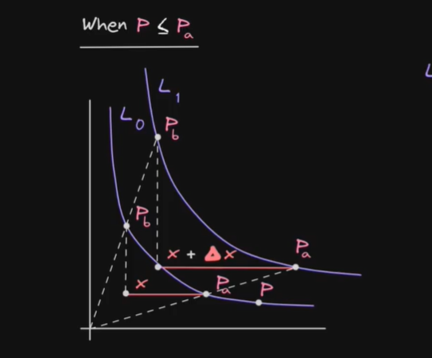
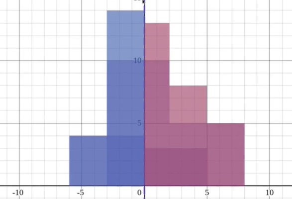
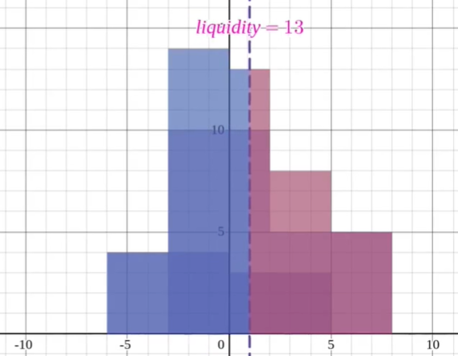

[TOC]

# 0. Intro

UniswapV3相对UniswapV2有较大的改版，其中


# 1. 理论前导

## 1.1 集中流动性

集中流动性就是构造一条虚拟的 liquidity 曲线，从而用更少的资金实现更大的流动性（$K$），提高资金利用率。

这个 virtual liquidity 模拟的是：以当前价格 $c$ 为起点，将价格范围限制在 $a$ 与 $b$ 之间，使得任意在 $[a,b]$ 内的现价 $c$，都可以从 $c$ 兑换到 $a$ 或 $b$。


假设我们想模拟的这条目标曲线的流动性值为 $K$（通常记为 $L^2$，下面也会用 $L$ 表示 $\sqrt{K}$）。

同时假设这条模拟曲线的作用区间在点 $b$ 和 $a$ 之间，即满足任意 $a$ 与 $b$ 之间的现价 $c$ 都可以兑换到 $a$ 或 $b$。这意味着：

- 从 $c$ 到 $a$ 是以 $X$ 存入换取 $Y$（即 $X$ 增加、$Y$ 减少，设需换出的 $Y$ 为 $Y_r$），因此池中至少需要有 $Y_r$ 的 $Y$ 供兑换。
- 从 $c$ 到 $b$ 是以 $Y$ 存入换取 $X$（即 $X$ 减少、$Y$ 增加，设需换出的 $X$ 为 $X_r$），因此池中至少需要有 $X_r$ 的 $X$ 供兑换。

也就是说，池中至少要有 $(X_r, Y_r)$ 的代币储备。现在我们讨论真实代币量与流动性之间的关系。

### 1.1.1 如何通过已有的 $(X_r, Y_r)$ 推出创造出来的池的流动性 $K$？

已知当前点 $c$ 的坐标为 $(X_c, Y_c)$，区间端点 $a$ 与 $b$ 的坐标分别为 $(X_a, Y_a)$ 和 $(X_b, Y_b)$。则有：

- 池中任意满足的曲线满足 $X\cdot Y = K$，因此在 $c$ 点：

  $X_c Y_c = K$

- 当前资金与端点的关系可以写成：

  $X_c = X_a + X_r$

  $Y_c = Y_b + Y_r$

因此得出：
$$
(X_a + X_r)(Y_b + Y_r) = K \tag{1}
$$
若把 $X$ 记作标的资产（例如 WETH，token0），$Y$ 记作计价资产（例如 USDC，token1），在价格 $P$ 定义为 $P=\dfrac{Y}{X}$ 的情况下，端点 $a$ 和 $b$ 对应的价格分别为 $P_a$ 和 $P_b$。

令 $L=\sqrt{K}$，因为在端点上也满足 $X_a Y_a = K = L^2$、$X_b Y_b = L^2$，可以得到常用的表示：
$$
\begin{cases} X_a = \dfrac{L}{\sqrt{P_a}},\\[6pt] Y_b = L\sqrt{P_b}. \end{cases} \tag{2}
$$
将 (2) 代回 (1)，得到区间 $[P_a,P_b]$、真实代币额 $(X_r,Y_r)$ 与流动性 $L$ 的关系式：
$$
\left(X_r + \dfrac{L}{\sqrt{P_a}}\right)\left(Y_r + L\sqrt{P_b}\right) = L^2. \tag{3}
$$
(3) 意味着我们只要知道池中真正有的代币额$(X_r,Y_r)$和对应两个价格区间$[P_a,P_b]$，就知道了我们所模拟的virtual liquidity $L$是多少。而好处，是显而易见的：


------

### 1.1.2 单边流动性

同时，virtual liquidity 也意味着用户可以只构造单边的流动性（例如只存入 USDC 或只存入 WETH），不再像 V2 那样必须同时提供两种代币才能提供流动性。由于多个曲线会叠加在同一 $X$–$Y$ 坐标上，图像会比较复杂，因此 V3 通常使用 $L$–$P$（liquidity–price）坐标轴来表示池中的流动性分布。

在固定价格区间 $[P_a,P_b]$ 中，用户存入 $(X_r,Y_r)$ 后，按上面的公式即可算出新增流动性量 $L$（或 $K=L^2$）。


举例：在真实的交易池中（下图），如果 USDC 为计价资产（token1），ETH 为标的资产（token0），当价格向左移动表示卖出 ETH 换取 USDC（因此左侧更多的是 USDC 的流动性储备）。图中亮起的部分即为**某一价格区间**$[P_a,P_b]$内对应的流动性（例如显示有 38.9 万 USDC 的流动性储备）。


也正是由此，我们能看见，最中间的那个区间，其左边全部是USDC的储备$Y$，而右边全部是WETH的储备$X$，这样我们就可以**分情况能简化（3）式得到更加具体的公式**，假设用户选择加入流动性的那个区间为$[P_a,P_b]$，而现在的价格$P$。

1. **$P<P_a$ 时，即全部是WETH的储备$X_r$，而此时真实需要的USDC储备$Y_r = 0$**

   

$$
\left(X_r + \dfrac{L}{\sqrt{P_a}}\right)\left( 0+ L\sqrt{P_b }\right) = L^2. \tag{4}
$$

可以得到：
$$
L= X_r \dfrac{\sqrt{P_a}\sqrt{P_b}}{\sqrt{P_b} - \sqrt{P_a}}  \tag{5}
$$

2. **$P>P_b$ 时，此时全是USDC的储备，则有：**
   $$
   \left(0 + \dfrac{L}{\sqrt{P_a}}\right)\left(Y_r + L\sqrt{P_b}\right) = L^2.  \tag{6}
   $$

可以得到：
$$
L= \dfrac{Y_r}{\sqrt{P_b} -\sqrt{P_a}} \tag{7}
$$

3. $P_a <P< P_b$ ，**此时就相当于图1中，我们最初设想的 $c$ 到 $a$ 和 $b$点移动的情形，**当向$b$移动，一直出的是$X$，而向$a$点移动则一直出$Y$。$c$ 代表就是代表现在的价格点 $P$ ，那么$[P_a,P]$$[P,P_b]$的区间的移动也符合上面两种单边资产的移动中的一种。

   所以我们在$[P_a,P]$的区间，应该也是类似（4）式可得：
   $$
   \left(X_r + \dfrac{L}{\sqrt{P_a}}\right)\left( 0+ L\sqrt{P}\right) = L^2. \tag{8}
   $$
   最终：
   $$
   L= X_r \dfrac{\sqrt{P_a}\sqrt{P}}{\sqrt{P} - \sqrt{P_a}}  \tag{9}
   $$
   类似地我们可以推理$[P,P_b]$的情况，最终得到：


$$
L= \dfrac{Y_r}{\sqrt{P_b} -\sqrt{P}} \tag{10}
$$
其中（10）和（9）是同一个价格曲线，所以$L$也必定相等，联立二式可得一个无需$L$的算式：
$$
\dfrac{Y_r}{\sqrt{P_b} -\sqrt{P}}= X_r \dfrac{\sqrt{P_a}\sqrt{P}}{\sqrt{P} - \sqrt{P_a}}  \tag{11}
$$

> 由上面的式子，由于价格区间是常数，流动性$L$的变化量$\Delta L$可以通过单个代币的储备的变化量得出。

**总结：**

- 如果价格区间在左侧，（5）式可以得到流动性与代币$X$储备/变化量的关系
- 如果价格区间在右侧，（7）式式可以得到流动性与代币$Y$储备/变化量的关系
- 如果在中间区间，参考式（9），（10），（11）

------

## 1.2 Tick

为了更方便地处理和确定价格区间$[P_a,P_b]$，uniswap引入了tick。

在Uniswap V3 的价格由 tick 表示，定义为：
$$
p = 1.0001^t
$$
其中 $t$ 为当前的 tick（`currentTick`）并使用1基点 (0.0001)作为增长量。因为 V3 支持用户创建任意的价格区间，所以不同 LP 的区间可以部分重叠，也可能存在空隙（没有流动性），为处理这些情况引入了 tick 与 position（价格区间）的设计。

这意味着真实的 $L$–$P$ 图在实现时是按 liquidity–tick 表示的（和官方池图一致）。价格区间由 tick spacing 表示，常见的 tick spacing 有 `1`、`10`、`60` 等（由池的设置决定）。


LP 在提供流动性时需要按 tick spacing 的整数倍来提供。例如，如果 tick spacing 为 1，LP 可以对区间 $[-20,,20]$ 提供流动性，但不能对 $[-20,,-15]$ 这样不对齐 tick spacing 的区间提供流动性（必须“整格”提供）。


在实操中，由于小数和精度问题，uniswap直接使用了$\sqrt{p}$ 而不是 $p$ 来存储价格以方便(3)中的计算。并使用 `fixed point Q64.96`，即64bit存储整数，96bit存储小数来存储 $\sqrt{p}$ ，这使得$\sqrt{p}$ 在 $[2^{-128},2^{128}]$之间。

 而 $t$ 与 $\sqrt{p}$ 的关系如下：
$$
\sqrt{p} = 1.0001^{t/2} \\
t=2·log_{1.0001}\sqrt{p}
$$

## Liqudity Providing

从式（5）（7）的例子中，由于任何的swap中，都是换出单边的储备，所以


现在我们想问的是，如果LP加入了一定的token，那么liquidity $L$ 该如何变化？

其实这和上面（5），（7）的推导逻辑类似。比如现在的流动性池的价格是 $P$，而你对一个价格区间为$[P_a,P_b]$ 流动性为$L_0$ 部分加入流动性，且已知此流动性区间在现价$P$ 的左侧（$P$ < $P_a$ ）这部分加的必然是$X$ USDC token， 


## 1.4 Swap

假设现在池中的liquiduity如下图



左边全是TokenX,右边全TokenY。现在的价格在中间`tick = 0`时，如果有人买入Y而卖出X，Y红色区域就会变少，而蓝色的X则会增加，价格就会上涨，此时流动性$L$下降到13，如下图所示。




## Ref


- https://zhuanlan.zhihu.com/p/448382469
- https://updraft.cyfrin.io/courses/uniswap-v3/spot-price/slot0
- [Uniswap V3 - Uniswap V3 Development Book](https://uniswapv3book.com/milestone_0/uniswap-v3.html)
- [uniswap-v3-liquidity-math.pdf](https://atiselsts.github.io/pdfs/uniswap-v3-liquidity-math.pdf)


# 2. 项目代码

## 2.1 Slot0

在`UniswapV3Pool.sol`的代码中，有一个关键变量`Slot0`存储着一些数据：

```solidity
struct Slot0 {
        // the current price
        uint160 sqrtPriceX96;
        // the current tick
        int24 tick;
        // the most-recently updated index of the observations array
        uint16 observationIndex;
        // the current maximum number of observations that are being stored
        uint16 observationCardinality;
        // the next maximum number of observations to store, triggered in observations.write
        uint16 observationCardinalityNext;
        // the current protocol fee as a percentage of the swap fee taken on withdrawal
        // represented as an integer denominator (1/x)%
        uint8 feeProtocol;
        // whether the pool is locked
        bool unlocked;
    }
```

这个变量之所以叫`slot0`是因为它只用了32字节，即第一个slot来存储了所有的变量。uniswapV3不会缓存token的数量来算得价格，而是直接使用`sqrtPriceX96`和`tick`来显示价格。它们两个是一个时间加权平均值，防止oracle manipulation而为。


1. **sqrtPriceX96**

`sqrtPriceX96`就是64bit存储整数，96bit存储小数来存储 的$\sqrt{p}$ ，共160bit。由于这种方式存储相当于把数字扩大了$2^{96}$ 倍。所以当我们得到此数据时，需要将`sqrtPriceX96`除以$2^{96}$得到正常的$P$

比如在[Uniswap V3: USDT | Address: 0x4e68Ccd3...3960dFa36 | Etherscan](https://etherscan.io/address/0x4e68Ccd3E89f51C3074ca5072bbAC773960dFa36#readContract))这个WETH/USDT的pool中，我们通过`slot0`可以读到`sqrtPriceX96 = 5318802539221741045234587`那么计算$P$ 方法如下：

```python
 sqrtPriceX96 = 5318802539221741045234587
 Q96 = 2**96
 rawPrice = (sqrtPriceX96/Q96)**2
 print(rawPrice) #此时的价格还有decimal，由于是USDT/WETH，所以应该除掉1e6再乘上1e18
 # -> 4.5068029233540776e-09

 P = rawPrice/1e6 *1e18 
 print(P)
 # -> 4506.802923354077
```

> 注意`sqrtPriceX96 `的转化，是最后继续decimal转化，切勿提前进行decimal转化

2. **tick**

`tick`可通过$p = 1.0001^{t}$ 算得 $p$ ，比如我查到的tick为`-192187`

```python
tick = -192187
rawPrice = 1.0001**tick
print(rawPrice)
# -> 4.50652662843139e-09

#同理修正decimal
P = rawPrice/1e6 * 1e18
print(P)
# -> 4506.52662843139
```

## 2.2 Liqudity Provide

### Mint

`UniswapV3Pool::mint()`允许用户向池中提供流动性，并用一个mapping来记录仓位，这个方法在计算完需要的token后会向流动性提供者发出`uniswapV3MintCallback`以获得token。此方法本身面向的是nfpm，而非一般用户。

[v3-core](https://github.com/Uniswap/v3-core/blob/main/contracts/UniswapV3Pool.sol)

```solidity
    /// @inheritdoc IUniswapV3PoolActions
    /// @dev noDelegateCall is applied indirectly via _modifyPosition
    function mint(
        address recipient,
        int24 tickLower,
        int24 tickUpper,
        uint128 amount,//Liqudity added
        bytes calldata data
    ) external override lock returns (uint256 amount0, uint256 amount1)//返回需要的两个token的值
    {
        require(amount > 0);
        (, int256 amount0Int, int256 amount1Int) =_modifyPosition(
                ModifyPositionParams({
                    owner: recipient,
                    tickLower: tickLower,
                    tickUpper: tickUpper,
                    liquidityDelta: int256(amount).toInt128()
                })
            );

        amount0 = uint256(amount0Int);
        amount1 = uint256(amount1Int);

        uint256 balance0Before;
        uint256 balance1Before;
        if (amount0 > 0) balance0Before = balance0();
        if (amount1 > 0) balance1Before = balance1();
        IUniswapV3MintCallback(msg.sender).uniswapV3MintCallback(amount0, amount1, data);
        if (amount0 > 0) require(balance0Before.add(amount0) <= balance0(), 'M0');
        if (amount1 > 0) require(balance1Before.add(amount1) <= balance1(), 'M1');

        emit Mint(msg.sender, recipient, tickLower, tickUpper, amount, amount0, amount1);
    }
```


```solidity
        /// @dev Effect some changes to a position
    /// @param params the position details and the change to the position's liquidity to effect
    /// @return position a storage pointer referencing the position with the given owner and tick range
    /// @return amount0 the amount of token0 owed to the pool, negative if the pool should pay the recipient
    /// @return amount1 the amount of token1 owed to the pool, negative if the pool should pay the recipient
    function _modifyPosition(ModifyPositionParams memory params) private noDelegateCall
        returns (Position.Info storage position,int256 amount0,int256 amount1)
    {
        checkTicks(params.tickLower, params.tickUpper);//检查 valid tick

        Slot0 memory _slot0 = slot0; // SLOAD for gas optimization

        position = _updatePosition(
            params.owner,
            params.tickLower,
            params.tickUpper,
            params.liquidityDelta,
            _slot0.tick
        );

        if (params.liquidityDelta != 0) {
            if (_slot0.tick < params.tickLower) {
                // current tick is below the passed range; liquidity can only become in range by crossing from left to
                // right, when we'll need _more_ token0 (it's becoming more valuable) so user must provide it
                amount0 = SqrtPriceMath.getAmount0Delta(
                    TickMath.getSqrtRatioAtTick(params.tickLower),
                    TickMath.getSqrtRatioAtTick(params.tickUpper),
                    params.liquidityDelta
                );
            } else if (_slot0.tick < params.tickUpper) {
                // current tick is inside the passed range
                uint128 liquidityBefore = liquidity; // SLOAD for gas optimization

                // write an oracle entry
                (slot0.observationIndex, slot0.observationCardinality) = observations.write(
                    _slot0.observationIndex,
                    _blockTimestamp(),
                    _slot0.tick,
                    liquidityBefore,
                    _slot0.observationCardinality,
                    _slot0.observationCardinalityNext
                );

                amount0 = SqrtPriceMath.getAmount0Delta(
                    _slot0.sqrtPriceX96,
                    TickMath.getSqrtRatioAtTick(params.tickUpper),
                    params.liquidityDelta
                );
                amount1 = SqrtPriceMath.getAmount1Delta(
                    TickMath.getSqrtRatioAtTick(params.tickLower),
                    _slot0.sqrtPriceX96,
                    params.liquidityDelta
                );

                liquidity = LiquidityMath.addDelta(liquidityBefore, params.liquidityDelta);
            } else {
                // current tick is above the passed range; liquidity can only become in range by crossing from right to
                // left, when we'll need _more_ token1 (it's becoming more valuable) so user must provide it
                amount1 = SqrtPriceMath.getAmount1Delta(
                    TickMath.getSqrtRatioAtTick(params.tickLower),
                    TickMath.getSqrtRatioAtTick(params.tickUpper),
                    params.liquidityDelta
                );
            }
        }
    }
```


```solidity
    /// @dev Gets and updates a position with the given liquidity delta
    /// @param owner the owner of the position
    /// @param tickLower the lower tick of the position's tick range
    /// @param tickUpper the upper tick of the position's tick range
    /// @param tick the current tick, passed to avoid sloads
    function _updatePosition(
        address owner,
        int24 tickLower,
        int24 tickUpper,
        int128 liquidityDelta,
        int24 tick
    ) private returns (Position.Info storage position) {
        position = positions.get(owner, tickLower, tickUpper);
// uniswapV3使用一个mapping作为存储用户仓位信息的方法        
// function get(
//        mapping(bytes32 => Info) storage self,
//        address owner,
//        int24 tickLower,
//        int24 tickUpper
//    ) internal view returns (Position.Info storage position) {
//        position = self[keccak256(abi.encodePacked(owner, tickLower, tickUpper))];
//    }

// struct Info {
        // the amount of liquidity owned by this position
//        uint128 liquidity;
        // fee growth per unit of liquidity as of the last update to liquidity or fees owed
//         uint256 feeGrowthInside0LastX128;
//         uint256 feeGrowthInside1LastX128;
        // the fees owed to the position owner in token0/token1
//         uint128 tokensOwed0;
//         uint128 tokensOwed1;
//     }
        

        uint256 _feeGrowthGlobal0X128 = feeGrowthGlobal0X128; // SLOAD for gas optimization
        uint256 _feeGrowthGlobal1X128 = feeGrowthGlobal1X128; // SLOAD for gas optimization

        // if we need to update the ticks, do it
        bool flippedLower;
        bool flippedUpper;
        if (liquidityDelta != 0) {
            uint32 time = _blockTimestamp();
            (int56 tickCumulative, uint160 secondsPerLiquidityCumulativeX128) =
                observations.observeSingle(
                    time,
                    0,
                    slot0.tick,
                    slot0.observationIndex,
                    liquidity,
                    slot0.observationCardinality
                );

            flippedLower = ticks.update(
                tickLower,
                tick,
                liquidityDelta,
                _feeGrowthGlobal0X128,
                _feeGrowthGlobal1X128,
                secondsPerLiquidityCumulativeX128,
                tickCumulative,
                time,
                false,
                maxLiquidityPerTick
            );
            flippedUpper = ticks.update(
                tickUpper,
                tick,
                liquidityDelta,
                _feeGrowthGlobal0X128,
                _feeGrowthGlobal1X128,
                secondsPerLiquidityCumulativeX128,
                tickCumulative,
                time,
                true,
                maxLiquidityPerTick
            );

            if (flippedLower) {
                tickBitmap.flipTick(tickLower, tickSpacing);
            }
            if (flippedUpper) {
                tickBitmap.flipTick(tickUpper, tickSpacing);
            }
        }

        (uint256 feeGrowthInside0X128, uint256 feeGrowthInside1X128) =
            ticks.getFeeGrowthInside(tickLower, tickUpper, tick, _feeGrowthGlobal0X128, _feeGrowthGlobal1X128);

        position.update(liquidityDelta, feeGrowthInside0X128, feeGrowthInside1X128);

        // clear any tick data that is no longer needed
        if (liquidityDelta < 0) {
            if (flippedLower) {
                ticks.clear(tickLower);
            }
            if (flippedUpper) {
                ticks.clear(tickUpper);
            }
        }
    }
```


### Collect


## 2.3 Swap


```solidity
    /// @inheritdoc IUniswapV3PoolActions
    function swap(
        address recipient,
        bool zeroForOne,
        int256 amountSpecified,//需要的token，大于0是exactInput，小于0是exactOutput
        uint160 sqrtPriceLimitX96,//限价
        bytes calldata data
    ) external override noDelegateCall returns (int256 amount0, int256 amount1) {
//1. checks & read data         
        require(amountSpecified != 0, 'AS');
        Slot0 memory slot0Start = slot0;
        require(slot0Start.unlocked, 'LOK');
        require(
            zeroForOne
                ? sqrtPriceLimitX96 < slot0Start.sqrtPriceX96 && sqrtPriceLimitX96 > TickMath.MIN_SQRT_RATIO
                : sqrtPriceLimitX96 > slot0Start.sqrtPriceX96 && sqrtPriceLimitX96 < TickMath.MAX_SQRT_RATIO,
            'SPL'
        );

        slot0.unlocked = false;
        SwapCache memory cache =
            SwapCache({
                liquidityStart: liquidity,
                blockTimestamp: _blockTimestamp(),
                feeProtocol: zeroForOne ? (slot0Start.feeProtocol % 16) : (slot0Start.feeProtocol >> 4),
                secondsPerLiquidityCumulativeX128: 0,
                tickCumulative: 0,
                computedLatestObservation: false
            });
//2. 判断swap方式，exactInput还是exactOut，大于0就是前者，小于0则是后者。
        bool exactInput = amountSpecified > 0;
        SwapState memory state =
            SwapState({
                amountSpecifiedRemaining: amountSpecified,
                amountCalculated: 0,
                sqrtPriceX96: slot0Start.sqrtPriceX96,
                tick: slot0Start.tick,
                feeGrowthGlobalX128: zeroForOne ? feeGrowthGlobal0X128 : feeGrowthGlobal1X128,
                protocolFee: 0,
                liquidity: cache.liquidityStart
            });
//3.While loop 计算amount in和amount out
        // continue swapping as long as we haven't used the entire input/output and haven't reached the price limit
        while (state.amountSpecifiedRemaining != 0 && state.sqrtPriceX96 != sqrtPriceLimitX96) {
    //3.1 计算时直到用户输入的需求token为0 并且 出货价格不超过输入的限价
       	    StepComputations memory step;
            step.sqrtPriceStartX96 = state.sqrtPriceX96;
	//3.2 get nextTick，并得到下一个价格sqrt(P_new)，即价格区间的上界
            (step.tickNext, step.initialized) = tickBitmap.nextInitializedTickWithinOneWord(
                state.tick,
                tickSpacing,
                zeroForOne
            );
			
            // ensure that we do not overshoot the min/max tick, as the tick bitmap is not aware of these bounds
            if (step.tickNext < TickMath.MIN_TICK) {
                step.tickNext = TickMath.MIN_TICK;
            } else if (step.tickNext > TickMath.MAX_TICK) {
                step.tickNext = TickMath.MAX_TICK;
            }

            // get the price for the next tick
            step.sqrtPriceNextX96 = TickMath.getSqrtRatioAtTick(step.tickNext);//新的根号价格X96类型格式
	//3.3 算出我们的现在的价格和对应的tick，amountIn/amountOut/手续费
            // compute values to swap to the target tick, price limit, or point where input/output amount is exhausted
         下面是最重要的计算：   
       	//3.3.1我们对computeSwapStep输入`sqrtPriceX96`和`sqrtPriceNextX96`，这个是价格的区间
       	//同时输入Liqudity，amountSpecifiedRemaining
            (state.sqrtPriceX96, step.amountIn, step.amountOut, step.feeAmount) = SwapMath.computeSwapStep(
                state.sqrtPriceX96,
                (zeroForOne ? step.sqrtPriceNextX96 < sqrtPriceLimitX96 : step.sqrtPriceNextX96 > sqrtPriceLimitX96)
                    ? sqrtPriceLimitX96
                    : step.sqrtPriceNextX96,
                state.liquidity,
                state.amountSpecifiedRemaining,
                fee
            );
	//3.4 根据上面的数据来更新amountSpecifiedRemaining，为了下一个循环
            if (exactInput) {
                state.amountSpecifiedRemaining -= (step.amountIn + step.feeAmount).toInt256();
                state.amountCalculated = state.amountCalculated.sub(step.amountOut.toInt256());
            } else {
                state.amountSpecifiedRemaining += step.amountOut.toInt256();
                state.amountCalculated = state.amountCalculated.add((step.amountIn + step.feeAmount).toInt256());
            }
	//3.5更新其他数据：
            // if the protocol fee is on, calculate how much is owed, decrement feeAmount, and increment protocolFee
            if (cache.feeProtocol > 0) {
                uint256 delta = step.feeAmount / cache.feeProtocol;
                step.feeAmount -= delta;
                state.protocolFee += uint128(delta);
            }

            // update global fee tracker
            if (state.liquidity > 0)
                state.feeGrowthGlobalX128 += FullMath.mulDiv(step.feeAmount, FixedPoint128.Q128, state.liquidity);

            // shift tick if we reached the next price
            if (state.sqrtPriceX96 == step.sqrtPriceNextX96) {
                // if the tick is initialized, run the tick transition
                if (step.initialized) {
                    // check for the placeholder value, which we replace with the actual value the first time the swap
                    // crosses an initialized tick
                    if (!cache.computedLatestObservation) {
                        (cache.tickCumulative, cache.secondsPerLiquidityCumulativeX128) = observations.observeSingle(
                            cache.blockTimestamp,
                            0,
                            slot0Start.tick,
                            slot0Start.observationIndex,
                            cache.liquidityStart,
                            slot0Start.observationCardinality
                        );
                        cache.computedLatestObservation = true;
                    }
                    int128 liquidityNet =
                        ticks.cross(
                            step.tickNext,
                            (zeroForOne ? state.feeGrowthGlobalX128 : feeGrowthGlobal0X128),
                            (zeroForOne ? feeGrowthGlobal1X128 : state.feeGrowthGlobalX128),
                            cache.secondsPerLiquidityCumulativeX128,
                            cache.tickCumulative,
                            cache.blockTimestamp
                        );
                    // if we're moving leftward, we interpret liquidityNet as the opposite sign
                    // safe because liquidityNet cannot be type(int128).min
                    if (zeroForOne) liquidityNet = -liquidityNet;

                    state.liquidity = LiquidityMath.addDelta(state.liquidity, liquidityNet);
                }

                state.tick = zeroForOne ? step.tickNext - 1 : step.tickNext;
            } else if (state.sqrtPriceX96 != step.sqrtPriceStartX96) {
                // recompute unless we're on a lower tick boundary (i.e. already transitioned ticks), and haven't moved
                state.tick = TickMath.getTickAtSqrtRatio(state.sqrtPriceX96);
            }
        }
//4. 当知道了amountIn和amountOut，uniswap就知道了新的liquidity/sqrt(P)/tick还有手续费，下面做的就是更新数据和收取手续费
        // update tick and write an oracle entry if the tick change
        if (state.tick != slot0Start.tick) {
            (uint16 observationIndex, uint16 observationCardinality) =
                observations.write(
                    slot0Start.observationIndex,
                    cache.blockTimestamp,
                    slot0Start.tick,
                    cache.liquidityStart,
                    slot0Start.observationCardinality,
                    slot0Start.observationCardinalityNext
                );
            (slot0.sqrtPriceX96, slot0.tick, slot0.observationIndex, slot0.observationCardinality) = (
                state.sqrtPriceX96,
                state.tick,
                observationIndex,
                observationCardinality
            );
        } else {
            // otherwise just update the price
            slot0.sqrtPriceX96 = state.sqrtPriceX96;
        }

        // update liquidity if it changed
        if (cache.liquidityStart != state.liquidity) liquidity = state.liquidity;

        // update fee growth global and, if necessary, protocol fees
        // overflow is acceptable, protocol has to withdraw before it hits type(uint128).max fees
        if (zeroForOne) {
            feeGrowthGlobal0X128 = state.feeGrowthGlobalX128;
            if (state.protocolFee > 0) protocolFees.token0 += state.protocolFee;
        } else {
            feeGrowthGlobal1X128 = state.feeGrowthGlobalX128;
            if (state.protocolFee > 0) protocolFees.token1 += state.protocolFee;
        }

        (amount0, amount1) = zeroForOne == exactInput
            ? (amountSpecified - state.amountSpecifiedRemaining, state.amountCalculated)
            : (state.amountCalculated, amountSpecified - state.amountSpecifiedRemaining);
//5. 转钱清账并且做`uniswapV3SwapCallback`让caller合约（一般是router）转钱进来
        // do the transfers and collect payment
        if (zeroForOne) {
            if (amount1 < 0) TransferHelper.safeTransfer(token1, recipient, uint256(-amount1));

            uint256 balance0Before = balance0();
            IUniswapV3SwapCallback(msg.sender).uniswapV3SwapCallback(amount0, amount1, data);
            require(balance0Before.add(uint256(amount0)) <= balance0(), 'IIA');
        } else {
            if (amount0 < 0) TransferHelper.safeTransfer(token0, recipient, uint256(-amount0));

            uint256 balance1Before = balance1();
            IUniswapV3SwapCallback(msg.sender).uniswapV3SwapCallback(amount0, amount1, data);
            require(balance1Before.add(uint256(amount1)) <= balance1(), 'IIA');
        }

        emit Swap(msg.sender, recipient, amount0, amount1, state.sqrtPriceX96, state.liquidity, state.tick);
        slot0.unlocked = true;
    }
```

[Video: Swap - Swap Algorithm - Uniswap V3](https://updraft.cyfrin.io/courses/uniswap-v3/swap/swap-algorithm)

假设


## Others

### Oracle

#### TWAP计算

#### observations变量

在UniswapV2中，pair合约会在每次调用`update`时记录一个priceCumulated，作为价格累计器以便记录任意时段的TWAP。

而在V3中有类似的机制：

在V3中的每个pool合约都存储了这样一个变量`observations`：

```solidity
Oracle.Observation[65535] public override observations;    
   //每个struct正好一个槽4+7+20+1
   struct Observation {
        // the block timestamp of the observation
        uint32 blockTimestamp;
        // the tick accumulator, i.e. tick * time elapsed since the pool was first initialized
        int56 tickCumulative;
        // the seconds per liquidity, i.e. seconds elapsed / max(1, liquidity) since the pool was first initialized
        uint160 secondsPerLiquidityCumulativeX128;
        // whether or not the observation is initialized
        bool initialized;
    }
```

`observations`是一个长度固定的 **环形数组（ring buffer）**，
 用于保存每个时间点的价格累积信息（`tickCumulative`, `secondsPerLiquidityCumulativeX128`, `blockTimestamp`）。

其机制和V2类似，每次池中发生了`swap`，就增加一条observation，更新其中的`tickCumulative`等其他变量，而这个observation数量的上限是`2^16 - 1 = 65535`，当超过上限时，便会回到第一条开始覆盖之前的记录。而非使用一般的动态数组或者映射，从而来减少storage的使用，减少超过65535条记录后的因为sstore改写0值导致的高额gas。

而`Slot0`中这三个变量控制了 observation 环形数组的行为：

```solidity
 		// the most-recently updated index of the observations array
        uint16 observationIndex;
        // the current maximum number of observations that are being stored
        uint16 observationCardinality;
        // the next maximum number of observations to store, triggered in observations.write
        uint16 observationCardinalityNext;
```

`observationIndex`非常好理解，就是一个指针。

`observationCardinality`和`observationCardinalityNext`看上去有点抽象，下面来解释其存在的背景：

> UniswapV3中的`observation`最大虽然有`65535`这么多条，但是并不是所有的槽都被使用，其可使用的槽数受到`observationCardinality`和`observationCardinalityNext`的控制。`observationCardinality`就是当前最大槽位,`observationCardinalityNext`是下一次更新时的最大槽位.
>
> 如果所有Pool,包括那些不是非常需要uniswap oracle的小众pool都做了65535个观测,那无疑会是一种浪费, 因为用户需要swap 2^16次方才能享受到不调用sstore改写数据到非0的gas优惠.

由此,在初始化的情况下,最大的记录数被设定为1:

```solidity
function initialize(uint160 sqrtPriceX96) external override {
        require(slot0.sqrtPriceX96 == 0, 'AI');
        int24 tick = TickMath.getTickAtSqrtRatio(sqrtPriceX96);
 >>    (uint16 cardinality, uint16 cardinalityNext) = observations.initialize(_blockTimestamp());
        slot0 = Slot0({
            sqrtPriceX96: sqrtPriceX96,
            tick: tick,
            observationIndex: 0,
            observationCardinality: cardinality,
            observationCardinalityNext: cardinalityNext,
            feeProtocol: 0,
            unlocked: true
        });

        emit Initialize(sqrtPriceX96, tick);
    }
function initialize(Observation[65535] storage self, uint32 time)
        internal
        returns (uint16 cardinality, uint16 cardinalityNext)
    {
        self[0] = Observation({
            blockTimestamp: time,
            tickCumulative: 0,
            secondsPerLiquidityCumulativeX128: 0,
            initialized: true
        });
        return (1, 1);
    }

```

而有需求的用户可以通过调用`increaseObservationCardinalityNext`来增加槽位,而调用者自然会承担sstore的20,000单位的改0值费用.

```solidity
    function increaseObservationCardinalityNext(uint16 observationCardinalityNext) external override lock noDelegateCall {
        uint16 observationCardinalityNextOld = slot0.observationCardinalityNext; // for the event
        uint16 observationCardinalityNextNew = observations.grow(observationCardinalityNextOld, observationCardinalityNext);
        slot0.observationCardinalityNext = observationCardinalityNextNew;
        if (observationCardinalityNextOld != observationCardinalityNextNew) emit IncreaseObservationCardinalityNext(observationCardinalityNextOld, observationCardinalityNextNew);
    }
        function grow(
        Observation[65535] storage self,
        uint16 current,
        uint16 next
    ) internal returns (uint16) {
        require(current > 0, 'I');
        // no-op if the passed next value isn't greater than the current next value
        if (next <= current) return current;
        // store in each slot to prevent fresh SSTOREs in swaps
        // this data will not be used because the initialized boolean is still false
        for (uint16 i = current; i < next; i++) self[i].blockTimestamp = 1;//self只占一个槽,所以只改一个数就可以
        return next;
    }

```


#### Observe函数

```solidity
    function observe(
        uint32[] calldata secondsAgos
    ) external view override noDelegateCall returns (int56[] memory tickCumulatives, uint160[] memory secondsPerLiquidityCumulativeX128s) {
        return observations.observe(_blockTimestamp(), secondsAgos, slot0.tick, slot0.observationIndex, liquidity, slot0.observationCardinality);
    }
    
    function observe(
        Observation[65535] storage self,
        uint32 time,
        uint32[] memory secondsAgos,
        int24 tick,
        uint16 index,
        uint128 liquidity,
        uint16 cardinality
    ) internal view returns (int56[] memory tickCumulatives, uint160[] memory secondsPerLiquidityCumulativeX128s) {
        require(cardinality > 0, 'I');

        tickCumulatives = new int56[](secondsAgos.length);
        secondsPerLiquidityCumulativeX128s = new uint160[](secondsAgos.length);
        for (uint256 i = 0; i < secondsAgos.length; i++) {
            (tickCumulatives[i], secondsPerLiquidityCumulativeX128s[i]) = observeSingle(
                self,
                time,
                secondsAgos[i],
                tick,
                index,
                liquidity,
                cardinality
            );
        }
    }
  	
  	function observeSingle(
        Observation[65535] storage self,
        uint32 time,
        uint32 secondsAgo,
        int24 tick,
        uint16 index,
        uint128 liquidity,
        uint16 cardinality
    ) internal view returns (int56 tickCumulative, uint160 secondsPerLiquidityCumulativeX128) {
        if (secondsAgo == 0) {
            Observation memory last = self[index];
            if (last.blockTimestamp != time) last = transform(last, time, tick, liquidity);
            return (last.tickCumulative, last.secondsPerLiquidityCumulativeX128);
        }

        uint32 target = time - secondsAgo;

        (Observation memory beforeOrAt, Observation memory atOrAfter) =
            getSurroundingObservations(self, time, target, tick, index, liquidity, cardinality);

        if (target == beforeOrAt.blockTimestamp) {
            // we're at the left boundary
            return (beforeOrAt.tickCumulative, beforeOrAt.secondsPerLiquidityCumulativeX128);
        } else if (target == atOrAfter.blockTimestamp) {
            // we're at the right boundary
            return (atOrAfter.tickCumulative, atOrAfter.secondsPerLiquidityCumulativeX128);
        } else {
            // we're in the middle
            uint32 observationTimeDelta = atOrAfter.blockTimestamp - beforeOrAt.blockTimestamp;
            uint32 targetDelta = target - beforeOrAt.blockTimestamp;
            return (
                beforeOrAt.tickCumulative +
                    ((atOrAfter.tickCumulative - beforeOrAt.tickCumulative) / observationTimeDelta) *
                    targetDelta,
                beforeOrAt.secondsPerLiquidityCumulativeX128 +
                    uint160(
                        (uint256(
                            atOrAfter.secondsPerLiquidityCumulativeX128 - beforeOrAt.secondsPerLiquidityCumulativeX128
                        ) * targetDelta) / observationTimeDelta
                    )
            );
        }
    }
    function transform(
        Observation memory last,
        uint32 blockTimestamp,
        int24 tick,
        uint128 liquidity
    ) private pure returns (Observation memory) {
        uint32 delta = blockTimestamp - last.blockTimestamp;
        return
            Observation({
                blockTimestamp: blockTimestamp,
                tickCumulative: last.tickCumulative + int56(tick) * delta,
                secondsPerLiquidityCumulativeX128: last.secondsPerLiquidityCumulativeX128 +
                    ((uint160(delta) << 128) / (liquidity > 0 ? liquidity : 1)),
                initialized: true
            });
    }
   	function getSurroundingObservations(
        Observation[65535] storage self,
        uint32 time,
        uint32 target,
        int24 tick,
        uint16 index,
        uint128 liquidity,
        uint16 cardinality
    ) private view returns (Observation memory beforeOrAt, Observation memory atOrAfter) {
        // optimistically set before to the newest observation
        beforeOrAt = self[index];

        // if the target is chronologically at or after the newest observation, we can early return
        if (lte(time, beforeOrAt.blockTimestamp, target)) {
            if (beforeOrAt.blockTimestamp == target) {
                // if newest observation equals target, we're in the same block, so we can ignore atOrAfter
                return (beforeOrAt, atOrAfter);
            } else {
                // otherwise, we need to transform
                return (beforeOrAt, transform(beforeOrAt, target, tick, liquidity));
            }
        }

        // now, set before to the oldest observation
        beforeOrAt = self[(index + 1) % cardinality];
        if (!beforeOrAt.initialized) beforeOrAt = self[0];

        // ensure that the target is chronologically at or after the oldest observation
        require(lte(time, beforeOrAt.blockTimestamp, target), 'OLD');

        // if we've reached this point, we have to binary search
        return binarySearch(self, time, target, index, cardinality);
    }
    function binarySearch(
        Observation[65535] storage self,
        uint32 time,
        uint32 target,
        uint16 index,
        uint16 cardinality
    ) private view returns (Observation memory beforeOrAt, Observation memory atOrAfter) {
        uint256 l = (index + 1) % cardinality; // oldest observation
        uint256 r = l + cardinality - 1; // newest observation
        uint256 i;
        while (true) {
            i = (l + r) / 2;

            beforeOrAt = self[i % cardinality];

            // we've landed on an uninitialized tick, keep searching higher (more recently)
            if (!beforeOrAt.initialized) {
                l = i + 1;
                continue;
            }

            atOrAfter = self[(i + 1) % cardinality];

            bool targetAtOrAfter = lte(time, beforeOrAt.blockTimestamp, target);

            // check if we've found the answer!
            if (targetAtOrAfter && lte(time, target, atOrAfter.blockTimestamp)) break;

            if (!targetAtOrAfter) r = i - 1;
            else l = i + 1;
        }
    }
```


由于`tick`是价格的幂，所以算这段时间的`twap`是


### variable notations in white paper

| Type    | Variable Name        | Notation       |
| ------- | -------------------- | -------------- |
| uint128 | liquidity            | $ L $        |
| uint160 | sqrtPriceX96         | $ \sqrt{P} $ |
| int24   | tick                 | $ i_c $      |
| uint256 | feeGrowthGlobal0X128 | $ f_{g,0} $  |
| uint256 | feeGrowthGlobal1X128 | $ f_{g,1} $  |
| uint128 | protocolFees.token0  | $ f_{p,0} $  |
| uint128 | protocolFees.token1  | $ f_{p,1} $  |
| int128  | liquidityNet                   | $ \Delta L $ |
| uint128 | liquidityGross                 | $ L_g $      |
| uint256 | feeGrowthOutside0X128          | $ f_{o,0} $  |
| uint256 | feeGrowthOutside1X128          | $ f_{o,1} $  |
| uint256 | secondsOutside                 | $ s_o $      |
| uint256 | tickCumulativeOutside          | $ i_o $      |
| uint256 | secondsPerLiquidityOutsideX128 | $ s_{lo} $   |
| uint128 | liquidity                | $ l $            |
| uint256 | feeGrowthInside0LastX128 | $ f_{r,0}(t_0) $ |
| uint256 | feeGrowthInside1LastX128 | $ f_{r,1}(t_0) $ |

