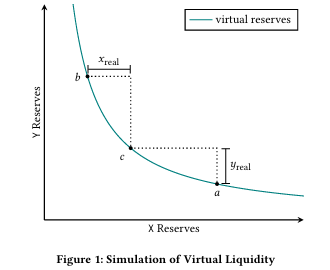
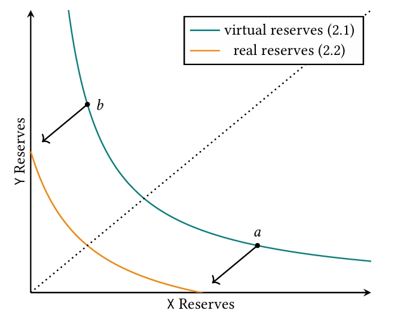
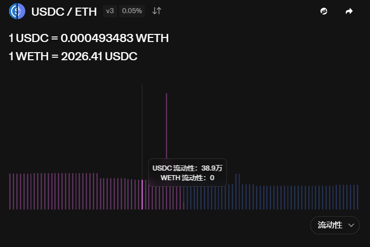
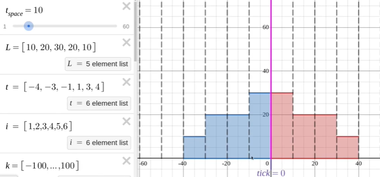

[TOC]

# 1. 理论前导

## 1.1 集中流动性

集中流动性就是构造一条虚拟的 liquidity 曲线，从而用更少的资金实现更大的流动性（$K$），提高资金利用率。

这个 virtual liquidity 模拟的是：以当前价格 $c$ 为起点，将价格范围限制在 $a$ 与 $b$ 之间，使得任意在 $[a,b]$ 内的现价 $c$，都可以从 $c$ 兑换到 $a$ 或 $b$。

假设我们想模拟的这条目标曲线的流动性值为 $K$（通常记为 $L^2$，下面也会用 $L$ 表示 $\sqrt{K}$）。

同时假设这条模拟曲线的作用区间在点 $b$ 和 $a$ 之间，即满足任意 $a$ 与 $b$ 之间的现价 $c$ 都可以兑换到 $a$ 或 $b$。这意味着：

- 从 $c$ 到 $a$ 是以 $X$ 存入换取 $Y$（即 $X$ 增加、$Y$ 减少，设需换出的 $Y$ 为 $Y_r$），因此池中至少需要有 $Y_r$ 的 $Y$ 供兑换。
- 从 $c$ 到 $b$ 是以 $Y$ 存入换取 $X$（即 $X$ 减少、$Y$ 增加，设需换出的 $X$ 为 $X_r$），因此池中至少需要有 $X_r$ 的 $X$ 供兑换。

也就是说，池中至少要有 $(X_r, Y_r)$ 的代币储备。现在我们讨论真实代币量与流动性之间的关系。

### 我如何通过已有的 $(X_r, Y_r)$ 推出创造出来的池的流动性 $K$？

已知当前点 $c$ 的坐标为 $(X_c, Y_c)$，区间端点 $a$ 与 $b$ 的坐标分别为 $(X_a, Y_a)$ 和 $(X_b, Y_b)$。则有：

- 池中任意满足的曲线满足 $X\cdot Y = K$，因此在 $c$ 点：

  $X_c Y_c = K$

- 当前资金与端点的关系可以写成：

  $X_c = X_a + X_r$

  $Y_c = Y_b + Y_r$

因此得出：
$$
(X_a + X_r)(Y_b + Y_r) = K \tag{1}
$$
若把 $X$ 记作标的资产（例如 WETH，token0），$Y$ 记作计价资产（例如 USDC，token1），在价格 $P$ 定义为 $P=\dfrac{Y}{X}$ 的情况下，端点 $a$ 和 $b$ 对应的价格分别为 $P_a$ 和 $P_b$。

令 $L=\sqrt{K}$，因为在端点上也满足 $X_a Y_a = K = L^2$、$X_b Y_b = L^2$，可以得到常用的表示：
$$
\begin{cases} X_a = \dfrac{L}{\sqrt{P_a}},\\[6pt] Y_b = L\sqrt{P_b}. \end{cases} \tag{2}
$$
将 (2) 代回 (1)，得到区间 $[P_a,P_b]$、真实代币额 $(X_r,Y_r)$ 与流动性 $L$ 的关系式：
$$
\left(X_r + \dfrac{L}{\sqrt{P_a}}\right)\left(Y_r + L\sqrt{P_b}\right) = L^2. \tag{3}
$$
(3) 意味着我们只要知道池中真正有的代币额$(X_r,Y_r)$和对应两个价格区间$[P_a,P_b]$，就知道了我们所模拟的virtual liquidity $L$是多少。而好处，是显而易见的：

------

同时，virtual liquidity 也意味着用户可以只构造单边的流动性（例如只存入 USDC 或只存入 ETH），不再像 V2 那样必须同时提供两种代币才能提供流动性。由于多个曲线会叠加在同一 $X$–$Y$ 坐标上，图像会比较复杂，因此 V3 通常使用 $L$–$P$（liquidity–price）坐标轴来表示池中的流动性分布。

在固定价格区间 $[P_a,P_b]$ 中，用户存入 $(X_r,Y_r)$ 后，按上面的公式即可算出新增流动性量 $L$（或 $K=L^2$）。

举例：在真实的交易池中（下图），如果 USDC 为计价资产（token0），ETH 为标的资产（token1），当价格向左移动表示卖出 ETH 换取 USDC（因此左侧更多的是 USDC 的流动性储备）。图中亮起的部分即为**某一价格区间**内对应的流动性（例如显示有 38.9 万 USDC 的流动性储备）。

------

## 1.2 Tick

为了更方便地处理和确定价格区间$[P_a,P_b]$，uniswap引入了tick。

在Uniswap V3 的价格由 tick 表示，定义为：
$$
p = 1.0001^t
$$
其中 $t$ 为当前的 tick（`currentTick`）。因为 V3 支持用户创建任意的价格区间，所以不同 LP 的区间可以部分重叠，也可能存在空隙（没有流动性），为处理这些情况引入了 tick 与 position（价格区间）的设计。

这意味着真实的 $L$–$P$ 图在实现时是按 liquidity–tick 表示的（和官方池图一致）。价格区间由 tick spacing 表示，常见的 tick spacing 有 `1`、`10`、`60` 等（由池的设置决定）。

LP 在提供流动性时需要按 tick spacing 的整数倍来提供。例如，如果 tick spacing 为 1，LP 可以对区间 $[-20,,20]$ 提供流动性，但不能对 $[-20,,-15]$ 这样不对齐 tick spacing 的区间提供流动性（必须“整格”提供）。

------

## Ref

- https://zhuanlan.zhihu.com/p/448382469
- https://updraft.cyfrin.io/courses/uniswap-v3/spot-price/slot0
- [Uniswap V3 - Uniswap V3 Development Book](https://uniswapv3book.com/milestone_0/uniswap-v3.html)

# 2. 项目代码

