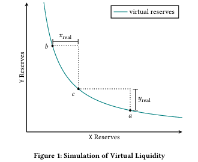
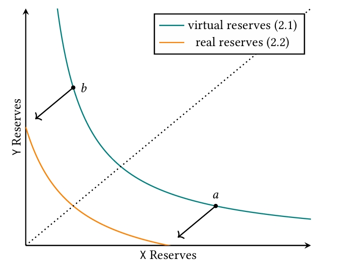
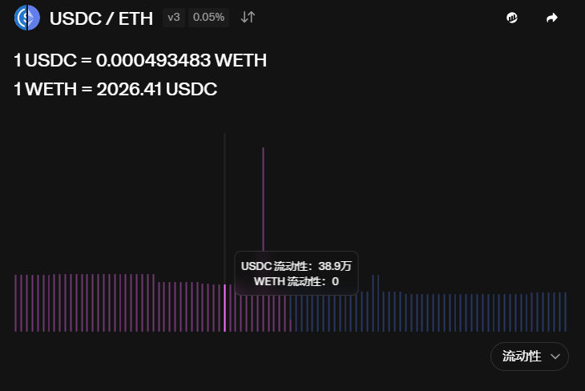
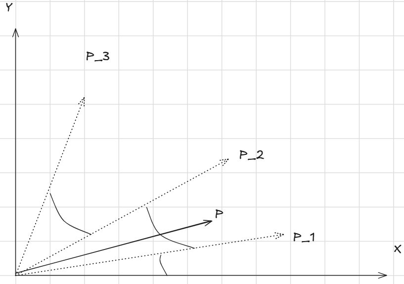
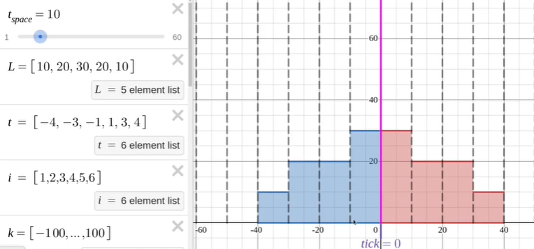
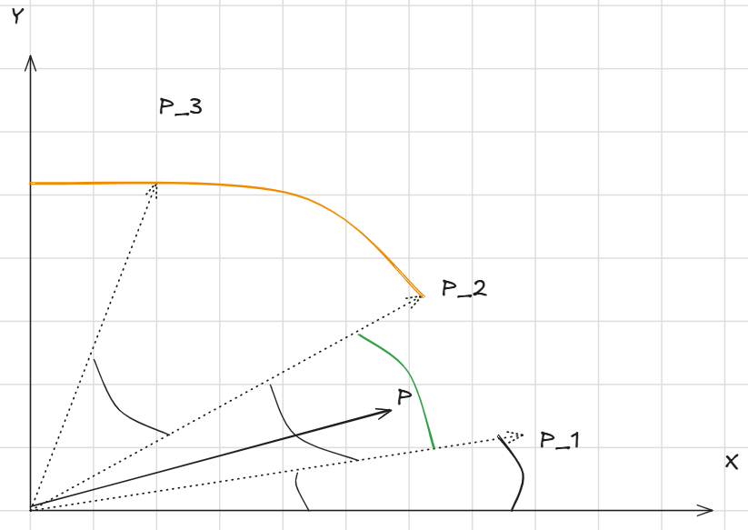

[TOC]

## V2中所面临的困境

当我们回顾过去的V2协议，我们

## 1.1 集中流动性

集中流动性就是构造一条虚拟的 liquidity 曲线，从而用更少的资金实现更大的流动性（$K$），提高资金利用率。

这个 virtual liquidity 模拟的是：以当前价格 $c$ 为起点，将价格范围限制在 $a$ 与 $b$ 之间，使得任意在 $[a,b]$ 内的现价 $c$，都可以从 $c$ 兑换到 $a$ 或 $b$。

假设我们想模拟的这条目标曲线的流动性值为 $K$（通常记为 $L^2$，下面也会用 $L$ 表示 $\sqrt{K}$）。

同时假设这条模拟曲线的作用区间在点 $b$ 和 $a$ 之间，即满足任意 $a$ 与 $b$ 之间的现价 $c$ 都可以兑换到 $a$ 或 $b$。这意味着：

- 从 $c$ 到 $a$ 是以 $X$ 存入换取 $Y$（即 $X$ 增加、$Y$ 减少，设需换出的 $Y$ 为 $Y_r$），因此池中至少需要有 $Y_r$ 的 $Y$ 供兑换。
- 从 $c$ 到 $b$ 是以 $Y$ 存入换取 $X$（即 $X$ 减少、$Y$ 增加，设需换出的 $X$ 为 $X_r$），因此池中至少需要有 $X_r$ 的 $X$ 供兑换。

也就是说，池中至少要有 $(X_r, Y_r)$ 的代币储备。现在我们讨论真实代币量与流动性之间的关系。

### 1.1.1 如何通过已有的 $(X_r, Y_r)$ 推出创造出来的池的流动性 $K$？

已知当前点 $c$ 的坐标为 $(X_c, Y_c)$，区间端点 $a$ 与 $b$ 的坐标分别为 $(X_a, Y_a)$ 和 $(X_b, Y_b)$。则有：

- 池中任意满足的曲线满足 $X\cdot Y = K$，因此在 $c$ 点：

  $X_c Y_c = K$

- 当前资金与端点的关系可以写成：

  $X_c = X_a + X_r$

  $Y_c = Y_b + Y_r$

因此得出：
$$
(X_a + X_r)(Y_b + Y_r) = K \tag{1}
$$
若把 $X$ 记作标的资产（例如 WETH，token0），$Y$ 记作计价资产（例如 USDC，token1），在价格 $P$ 定义为 $P=\dfrac{Y}{X}$ 的情况下，端点 $a$ 和 $b$ 对应的价格分别为 $P_a$ 和 $P_b$。

令 $L=\sqrt{K}$，因为在端点上也满足 $X_a Y_a = K = L^2$、$X_b Y_b = L^2$，可以得到常用的表示：
$$
\begin{cases} X_a = \dfrac{L}{\sqrt{P_a}},\\[6pt] Y_b = L\sqrt{P_b}. \end{cases} \tag{2}
$$
将 (2) 代回 (1)，得到区间 $[P_a,P_b]$、真实代币额 $(X_r,Y_r)$ 与流动性 $L$ 的关系式：
$$
\left(X_r + \dfrac{L}{\sqrt{P_a}}\right)\left(Y_r + L\sqrt{P_b}\right) = L^2. \tag{3}
$$
(3) 意味着我们只要知道池中真正有的代币额$(X_r,Y_r)$和对应两个价格区间$[P_a,P_b]$，就知道了我们所模拟的virtual liquidity $L$是多少。而好处，是显而易见的：

------

### 1.1.2 添加单边流动性

同时，virtual liquidity 也意味着用户可以只构造单边的流动性（例如只存入 USDC 或只存入 WETH），不再像 V2 那样必须同时提供两种代币才能提供流动性。由于多个曲线会叠加在同一 $X$–$Y$ 坐标上，图像会比较复杂，因此 V3 通常使用 $L$–$P$（liquidity–price）坐标轴来表示池中的流动性分布。

在固定价格区间 $[P_a,P_b]$ 中，用户存入 $(X_r,Y_r)$ 后，按上面的公式即可算出新增流动性量 $L$（或 $K=L^2$）。

举例：在真实的交易池中（下图），如果 USDC 为计价资产（token1），ETH 为标的资产（token0），当价格向左移动表示卖出 ETH 换取池中的USDC（因此左侧更多的是 USDC 的流动性储备）而这个行为导致USDC/ETH的价格下降。

图中亮起的部分即为**某一价格区间**$[P_a,P_b]$内对应的流动性（例如显示有 38.9 万 USDC 的流动性储备）。

用户可以选择任意的价格区间$[P_a,P_b]$添加流动性，而这种添加流动性的过程，就是像uniswapV2中一样在增加一个虚拟的流动性曲线的$K$ 值。

**但是uniswapV3提供流动性需要关注当前池中的价格$P$ 。**

如图所示，假设现在资产价格$P$在$[P_c,P_a]$中，我们有三个区间添加流动性：

- $[P_3,P_2]$，**区间价格都大于现价**：此时下笔swap只有可能在$[P_2,P_3]$中带走$X$ 代币，而不可能带走$Y$ ，所以我们对此区间只需要提供代币$X$
- $[0,P_1]$，**区间价格都小于现价**：那么下一笔swap只有可能带走$Y$
- $[P_1,P_2]$，**现价落在区间内**：对于$[P_1,P]$ 区间只可能带走流动性池的$Y$，对于$[P,P_2]$的区间只可能带走$X$

由这三种情况，现在假设有价格区间$[P_a,P_b]$

我们可以简化公式（3），得到下面的区间流动性$L$ 与对应实际reserve token $X_r,Y_r$的关系： 

1. **$P<P_a$ 时：**

$$
\left(X_r + \dfrac{L}{\sqrt{P_a}}\right)\left( 0+ L\sqrt{P_b }\right) = L^2. \tag{4}
$$

可以得到：
$$
L= X_r \dfrac{\sqrt{P_a}\sqrt{P_b}}{\sqrt{P_b} - \sqrt{P_a}}  \tag{5}
$$

2. **$P>P_b$ 时**：
   $$
   \left(0 + \dfrac{L}{\sqrt{P_a}}\right)\left(Y_r + L\sqrt{P_b}\right) = L^2.  \tag{6}
   $$

可以得到：
$$
L= \dfrac{Y_r}{\sqrt{P_b} -\sqrt{P_a}} \tag{7}
$$

3. $P_a <P< P_b$ **时：**

   所以我们在$[P_a,P]$的区间，应该也是类似（4）式可得：
   $$
   \left(X_r + \dfrac{L}{\sqrt{P_a}}\right)\left( 0+ L\sqrt{P}\right) = L^2. \tag{8}
   $$
   最终：
   $$
   L= X_r \dfrac{\sqrt{P_a}\sqrt{P}}{\sqrt{P} - \sqrt{P_a}}  \tag{9}
   $$
   类似地我们可以推理$[P,P_b]$的情况，最终得到：

$$
L= \dfrac{Y_r}{\sqrt{P_b} -\sqrt{P}} \tag{10}
$$
其中（10）和（9）是同一个价格曲线，所以$L$也必定相等，联立二式可得一个无需$L$的算式：
$$
\dfrac{Y_r}{\sqrt{P_b} -\sqrt{P}}= X_r \dfrac{\sqrt{P_a}\sqrt{P}}{\sqrt{P} - \sqrt{P_a}}  \tag{11}
$$

>  在实际的代码中，uniswap的`mint`方法是需要用户输入`liquidityDelta`和价格区间，从而从用户钱包中pull token.
>
> 在之前的内容中我们知道了在不同价格区间，存储代币和流动性之间的关系，现在我们将上面的数据相减，就能知道在输入一定的$\Delta L$，对应需要多少token，其公式基本上就是我们推出的公式对应加上$\Delta$ 符号

------

## 1.2 Tick

为了更方便地处理和确定价格区间$[P_a,P_b]$，uniswap引入了tick。

在Uniswap V3 的价格由 tick 表示，定义为：
$$
p = 1.0001^t
$$
其中 $t$ 为当前的 tick（`currentTick`）并使用1基点 (0.0001)作为增长量。因为 V3 支持用户创建任意的价格区间，所以不同 LP 的区间可以部分重叠，也可能存在空隙（没有流动性），为处理这些情况引入了 tick 与 position（价格区间）的设计。

这意味着真实的 $L$–$P$ 图在实现时是按 liquidity–tick 表示的（和官方池图一致）。价格区间由 tick spacing 表示，常见的 tick spacing 有 `1`、`10`、`60` 等（由池的设置决定）。

LP 在提供流动性时需要按 tick spacing 的整数倍来提供。例如，如果 tick spacing 为 10，LP 可以对区间 $[-20,,20]$ 提供流动性，但不能对 $[-20,,-15]$ 这样不对齐 tick spacing 的区间提供流动性（必须“整格”提供）。

在实操中，由于小数和精度问题，uniswap直接使用了$\sqrt{p}$ 而不是 $p$ 来存储价格以方便(3)中的计算。

并使用 `fixed point Q64.96`，即64bit存储整数，96bit存储小数来存储 $\sqrt{p}$ ，这使得$\sqrt{p}$ 在 $[2^{-128},2^{128}]$之间。

 而 $t$ 与 $\sqrt{p}$ 的关系如下：
$$
\sqrt{p} = 1.0001^{t/2} \\
t=2·log_{1.0001}\sqrt{p}
$$

>  注意solidity中经常使用fixedPoint 数来表示小数，且标记为Qm.n，即m比特整数和n比特小数。这种方法基本上让数据乘以了2^n 次方倍数
>
> 以Q1.1为例，使用两位的数据，`01`在直接算十进制就是1，而作为代表的真正的数据起始是1/(2^1)
>
> 而且如果n越大，小数位的精度越大

## 1.4 Swap

uniswapV3中不像uniswapV2一样记录token reserve, 因为token reserve的总量在集中流动性曲线上没有任何意义.

相反,uniswapV3会记录当前池中的根号价格 $\sqrt{P}$ 和 $P$ 所对应的价格区间的virtual liquidity $L$.

假设当前价格所在区间的virtual reserve token数量为$x,y$, 那么我们知道:
$$
\sqrt{xy}=L \\
\sqrt{P} =\sqrt\frac{y}{x} \tag{7}
$$
由此,我们可以知道:
$$
x = \frac{L}{\sqrt{P}} \\
y=L\sqrt{P} \tag{8}
$$
我们知道,当发生流动性提供时,$L$会发生变化而$P$ 不会发生变化. 

**当发生一笔swap时,$P$会发生变化但是$L$不会发生变化.**

由上面的(8)中,我们可以得到代币数量与价格的变化关系:
$$
\begin{align}
\Delta \sqrt{P} = \frac{\Delta y}{L} \tag{9.1} \\
\Delta y = \Delta \sqrt{P} \cdot L \tag{9.2}
\end{align}
$$
同理,对于$x$ 代币来说:
$$
\begin{align}
\Delta \frac{1}{\sqrt{P}} = \frac{\Delta x}{L} \tag{10.1} \\
\Delta x = \Delta \frac{1}{\sqrt{P}} \cdot L \tag{10.2}
\end{align}
$$

当用户发起一笔swap时,我们必定已知某一个代币的变化量, 

此时可以用公式(9.1)或者(10.1)来计算价格的变化. 从而再带入价格的变化到(9.2)或者(10.2)中计算需要支付/获得的代币.

 Cross - tick

### fee

假设流动性池中的所有累计费用为$f_g$ ，$f_b(l)$表示目标价格范围lower tick所对应的下方所积累的手续费,$f_a(u)$表示upper tick所对应的上方所累积的手续费

那么你所在的$[lowerTick,upperTick]$价格区间的流动性就是公式则是$f_g -f_a(u) - f_b(l)  $。

**举个例子**

回顾我们之前那看到的图，假设现在lower tick对应$P_1$, upper tick对应$P_2$，现在求这段价格区间所有的手续费。

很自然地我们可以拿全局积累的手续费$f_g$减去此流动性区间上面红色部分的手续费和黑色曲线对应下面部分的手续费。

而更具体来说，红色部分的手续费其实是$P_2$这个价格的tick，以上部分所积累的手续费之和$f_a(P_2)$

黑色曲线部分则是$P_1$ 价格以下部分所累积的手续费之和$f_b(P_1)$

那么流动性手续费应该是：$f_g -f_a(P_2) - f_b(P_1)  $

---

似乎手续费的计算非常简单，但是我们得考虑直接记录$f_a,f_b$数据的可行性；比如现在有一笔手续费被加入。那么意味着所有tick的所有$f_a,f_b$都需要被更新。假设有1000个tick，就需要更新2000个数据，很明显这种暴力方案在以太坊上是不可能的。

为解决这个问题，uniswapV3中设置了`feeOutside`的参数$f_o$，意思是现在价格外侧部分所积累的手续费用，其定义式如下：
$$
\begin{cases}
f_o(p_i) = f_a( p_i) \\ 
f_o(p_i) = f_g -f_b( p_i)
\end{cases} 
\ \ \ \ \ \ \ \ \ p < p_i \tag{11}
$$

$$
\begin{cases}
f_o(p_i) = f_b( p_i) \\ 
f_o(p_i) = f_g -f_a( p_i)
\end{cases} 
\ \ \ \\ \ \ \ \ p \geq p_i \tag{12}
$$

如果将上面的公式反过来我们可以得到：
$$
\begin{equation}
f_a(p_i) =
\begin{cases}
f_g - f_o(p_i) & p \geq p_i \\
f_o(p_i) & p < p_i
\end{cases}
\tag{13}
\end{equation}
$$

$$
\begin{equation}
f_b(p_i) =
\begin{cases}
f_o(p_i) & p \geq p_i \\
f_g - f_o(p_i) & p < p_i
\end{cases}
\tag{14}
\end{equation}
$$

根据情况带入$f_g -f_a(P_2) - f_b(P_1)  $可知任意价格区间$[l,u]$ 积累的手续费$f$ 为
$$
f =\begin{equation}
\begin{cases}
f_o(l) - f_o(u) & p \in (0,l) \\
f_g -f_o(l) - f_o(u) &  p \in [l,u)\\
f_o(u)-f_o(l)  &  p \in[u,+\infin)
\end{cases}
\end{equation} \tag{15}
$$
这样我们就能避免记录$f_a,f_b$，而任意一区间的手续费用也变成了一个根据当前价格落在区间内外的情况变成了上述的公式。

而为了维护好这样一个方便的$f_o$，我们遵循以下规则初始化和更新$f_o$

- **Initialization**

1. **When：**

   只有当tick被作为一个仓位的lower,upper tick的时候，才会initialized. 这是因为$f_o$ 本身只是一个记录手续费分配而被需要的参数，这个参数只有在给LP们按公式（13）算他们的手续费时才需要。

   所以如果当前tick如果没有被作为某个仓位的lower/upper tick时，是不会被初始化和记录$f_o$

   

2. **How：**初始化遵循以下公式：

$$
f_o := 
  \begin{cases} 
  f_g & P \geq P_i \\ 
  0 & P < P_i 
  \end{cases} \tag{14}
$$

3. **Why：**

   公式（14）基于以下假设，<u>截至初始化时，所有已产生的费用都发生在该 tick 的下方</u>，如此假设我们就明白，当被选中的tick超过了当前价格时，说明此时tick还没有积累手续费（就像车还没到开到这里一样）。

   就像图中$P$和$P_2$的关系；此时$P_2$所对应的$f_o$ 应该是红色线条部分，即此tick线段的正上方，由于假设费用都发生在tick的正下方，所以$f_o$ 应该是0.

   反之，如果价格已经超过了所选的tick，那么就相当于图中$P_1$ 和$P$的关系一样；此时的$P_1$ 所对应的$f_o$是黑色线条部分，即tick的下方，而由于我们假设所有的费用都发生在该tick下方，那么正好是现在所有费用的总和$f_g$

   > 由于是按假设规则规定的$f_o$ ，所以它只能作为计算手续费的snapshot，而无法做任何其他的比较作用。

- **Update**

  每当tick被cross时，我们就需要将$f_o$ 进行更新，更新为$f_o' = f_g - f_o$。

  这一点较为直观，如果按图中$P$ cross了$P_2$，$P_2$本来的$f_o$是属于红色线段区间的，但是cross后根据定义应该是黑色+绿色线段区间，即$f_g-f_o$的费用。

> 注意在实际代码中，上述所有的参数是以每单位流动性的费用来计算的，从而更方便算出LP们的手续费

---

# Ref

- https://zhuanlan.zhihu.com/p/448382469
- https://updraft.cyfrin.io/courses/uniswap-v3/spot-price/slot0
- [Uniswap V3 - Uniswap V3 Development Book](https://uniswapv3book.com/milestone_0/uniswap-v3.html)
- [uniswap-v3-liquidity-math.pdf](https://atiselsts.github.io/pdfs/uniswap-v3-liquidity-math.pdf)
- [Uniswap v3 Core whitepaper](https://app.uniswap.org/whitepaper-v3.pdf)

Variable notations

| Type    | Variable Name        | Notation       |
| ------- | -------------------- | -------------- |
| uint128 | liquidity            | $ L $        |
| uint160 | sqrtPriceX96         | $ \sqrt{P} $ |
| int24   | tick                 | $ i_c $      |
| uint256 | feeGrowthGlobal0X128 | $ f_{g,0} $  |
| uint256 | feeGrowthGlobal1X128 | $ f_{g,1} $  |
| uint128 | protocolFees.token0  | $ f_{p,0} $  |
| uint128 | protocolFees.token1  | $ f_{p,1} $  |
| int128  | liquidityNet                   | $ \Delta L $ |
| uint128 | liquidityGross                 | $ L_g $      |
| uint256 | feeGrowthOutside0X128          | $ f_{o,0} $  |
| uint256 | feeGrowthOutside1X128          | $ f_{o,1} $  |
| uint256 | secondsOutside                 | $ s_o $      |
| uint256 | tickCumulativeOutside          | $ i_o $      |
| uint256 | secondsPerLiquidityOutsideX128 | $ s_{lo} $   |
| uint128 | liquidity                | $ l $            |
| uint256 | feeGrowthInside0LastX128 | $ f_{r,0}(t_0) $ |
| uint256 | feeGrowthInside1LastX128 | $ f_{r,1}(t_0) $ |

