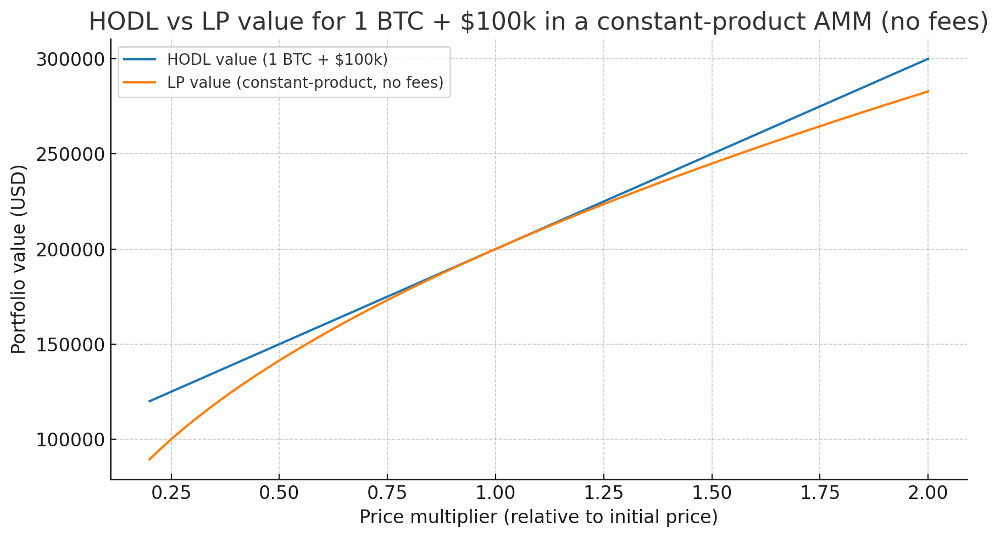

YieldBasis声称它们找到了解决 impermanent Loss 的手段

下面是其白皮书和官方文档的详细解析内容：

# AMM中的问题

YB 团队发现，其 LP 手上的头寸价值 $V$ 与资产价格 $p$ 成平方根关系：

* $X$ 为 USD token 的数量

* $Y$ 为 BTC（资产）的数量，价格为 $p = X / Y$（一个 BTC 值多少 USD token）

* AMM 中的不变量 $X\cdot Y = k$

那么可以推得：

$$
X = \sqrt{k p}
$$

$$
Y = \sqrt{\frac{k}{p}}
$$

而以 USD token 计价的资产的 LP 总价值

$$
V = X + p Y = \sqrt{k p} + p \cdot \sqrt{\frac{k}{p}} = 2\sqrt{k p}
$$

由此得到了 $V$ 与资产价格 $p$ 成平方根关系；也就是 LP 池中的 portfolio 在价格上涨时不如单纯持有时多，而下跌时却比它跌得更快。变成类似下图的效果：

# Compounding Leverage

YB 团队提出了一个名为 *Compounding Leverage* 的方法解决此问题，将 $V$ 与 $p$ 的关系由平方根转为线性的关系以避免无常损失。具体是它们用 LP 池中的 LP 代币作为 collateral，加杠杆获得与用户存入等额 BTC 价值的 crvUSD，之后以杠杆存入流动性池中。

其实这种方法就是建立一个新的带杠杆的 portfolio，这个 portfolio 由两部分组成：

1. 原流动性池中的 LP token
2. 一部分债务

假设作为 collateral 的 LP token 的价值为 $c$，债务价值为 $d$。杠杆投资组合中的抵押品和债务的差值 $N$，那么 $N$ 就是我们这个 portfolio 实际的净值（net asset）。

现在定义杠杆 $L$，这里采用的是 compounding 的定义：

$$
L = \frac{c}{c-d}
$$

由此可知：

$$
d = c\left(1-\frac{1}{L}\right) \tag{1}
$$

由上述的定义我们知道 $N = c - d = \dfrac{c}{L}$。

而 $c$ 又由价格 $p'$ 和数量 $y$ 决定（即 $c = p' y$）。

这意味着 $N$ 的变化来自三部分的变化：

1. LP 价格 $p'$ 的变化
2. 债务 $d$ 的变化
3. 抵押物数量 $y$ 的变化（仓位调整）

如果我们对 $p'$ 求偏导，考察 LP token 价格变化瞬间 $N$ 的变化情形：

$$
\delta N = \delta(c-d) = \delta c \tag{2}
$$

由于 $\delta c = y,\delta p'$，故得到：

$$
\delta N = y\,\delta p' \tag{3}
$$

带入 $N = \dfrac{p' y}{L}$ 到 (3) 中，则可知 $N$ 的相对变化率为：

$$
\frac{\delta N}{N} = \frac{y\,\delta p'}{p' y / L} = L\frac{\delta p'}{p'} \tag{4}
$$

(4) 中的推断非常重要，因为两边积分可得：

$$
\int \frac{\delta N}{N} = L \int \frac{\delta p'}{p'}
$$

因此：

$$
\ln N = L \ln p' + C
$$

两边取指数可得：

$$
N = e^{C} p'^{L} \tag{5}
$$

而我们知道，抵押物 LP token 的价值本身就是流动性池的价值，而流动性池的价值 $V$ 与标的价值 $p$ 呈平方根关系，即

$$
V = 2\sqrt{k p}
$$

所以，如果列出如下假设：

1. LP token 抵押物的数量 $y$ 和杠杆 $L$ 是常数；
2. $c$ 并非一个简单的个人仓位，而是流动性池中的所有 LP token 的价值（此时的 $y$ 为所有的 LP token 数量）。

由 (5) 我们可以得到：

$$
N = e^{C} p'^{L} = \frac{e^{C}}{y^{L}} (p' y)^{L} = C' c^{L}
$$

其中 $C' = \dfrac{e^{C}}{y^{L}}$，而所有的 $c$ 抵押物的代币的价值等同于流动性池的价值 $V$，且 $V = 2\sqrt{k p}$，所以有：

$$
N = 2 C' \big(\sqrt{k p}\big)^{L} \tag{6}
$$

在 (6) 中可以清晰看见，如果 $L$ 取 2，那么我们这个所有 LP token 价值和债务的差值所产生的 portfolio $N$，其实就是一个与资产价格 $p$ 呈线性关系的组合（因为 $(\sqrt{k p})^2 = k p$）。

如果假设 2 不成立，$c$ 只作为 $V$ 价值的一部分，也能保证线性，但是会引入一个新的变量 $S$（shares 占比）：

$$
N = C' c^{L}
$$

$$
c = \frac{V}{S} = \frac{2\sqrt{k p}}{S}
$$

$$
N = C' \cdot 2 \left(\frac{\sqrt{k p}}{S}\right)^{L}
$$

> 在真实的场景下，$S$ 大概率并非常数，因为 $S$ 相当于用户手中的 LP token 占 AMM 池的 LP token 总供应量的比例，而分母在一般的 AMM 中会随时变化。如果要使 $S$ 近似常量，需要限制 AMM 流动性池为 capped ERC20 合约。
> YB 团队的论文中只讨论了如何保证 portfolio 和资产价格 $p$ 保持线性的方法，却忽视了其系数的范式，这可能会导致实操中一些意想不到的问题，这是值得我们未来讨论的。

# How to Keep L=2 ?

实操中，一般 protocol 保证仓位的杠杆率的方法通常是通过一个 `rebalance()` 函数，一旦出现杠杆率不等于 2 的情况时，这个函数会通过买卖资产来保证 $L=2$ 恒成立。

但是这种方法有明显的交易摩擦，频繁的 `rebalance()` 会由于交易手续费而降低用户收益。

YB 团队采用了一种 Releverage AMM 的方法来保证 $L=2$ 成立。

其核心思想是：**既然 AMM 天然能吸引套利者，不如设计一个新的 AMM，把“保持杠杆比例”内生化到 AMM 曲线里，让套利者自动帮忙完成调整。**

具体而言，创建一个全新的 AMM，这个 AMM 就是上面讲的 portfolio，它会：

* 内部通过 Oracle 的价格 $P_o$ 来反映持仓的LP token的价格；
* 用户输入资产后借入$d$债务，以获得$y$数量的LP token

根据 (1) 式，如果我们的Oracle能真实反映市场价格（即$P_o=P$）我们会有：

$$
\tilde{d} = \frac{L-1}{L} P_o \,\tilde{y} \tag{7}
$$

其中波浪号（例如 $\tilde{d}$）表示在此时刻的观测值，即满足$P_o=P$ 时的观察仓位。

我们创建的这个 AMM 也会符合 $XY = K$ 的不变量。但是我们的 $X$ 与一般的 AMM 不同，它由一个锚 $x_0(P_o)$ 来决定。具体而言，让这个 AMM 满足下列不变量：

$$
\big(x_0(P_o) - d\big) y = I(P_o) \tag{8}
$$

其中 $x_0(P_o) - d$ 不代表任何意义，只是一个参数。 $y$ 是此AMM 持有的 LP token 的数量，$I(P_o)$在$P_o$恒定是为一个常量。

于此同时，我们假设一个由LP token和USD代币组合的正常AMM真实地反映着LP token的市场价格。此AMM保持 $xy'=I$,其中$x,y'$分别代表稳定币数量和LP token数量。那么我们就知道：

$$
\begin{align}
P_o = \frac{x_0(P_o) - d}{y} \tag{9}

\\
P=x/y' \tag{10}
\end{align}
$$

我们先将(9)中的$d$去掉，带入（7）可得到$x_0$与$P_o$的关系：

$$
x_0(P_o) = \frac{2L-1}{L}P_o \tilde{y} \tag{11}
$$

由这个公式我们就可以知道，当Oracle正确反映价格时，为了保持杠杆$L=2$时，我们需要的现金头寸。但是这个大前提是$P_o=P$，如果不成立那么（7）中的等式就不会成立，因为$P_oy$不能正确地反映LP token的美元价值。

（11）也可以推导出理想情况下的LP token仓位
$$
\tilde{y} = \frac{x_0 L }{(2L-1)P_o}  \tag{12}
$$
由于在同一个$P_o$下 $I$ 都相同，所以

$$
y \left( x_0 - d \right) = \tilde{y} \left( x_0 - \frac{L - 1}{L} P_o \tilde{y} \right) .  \tag{13}
$$
联立（12）与（13）得到

$$
x_0^2 \left( \frac{L}{2L - 1} \right)^2 - P_o y x_0 + P_o y d = 0
$$
求根公式取更大的 (因为$x_0$必定始终为正) 那个根可得到一个$x_0$和任意$d,y$关系的式子
$$
x_0 (P_o) = \frac{P_o y + \sqrt{P_o^2 y^2 - 4 P_o y d \left( \frac{L}{2L - 1} \right)^2}}{2 \left( \frac{L}{2L - 1} \right)^2} . \tag{14}
$$

知道了$x_0$，为了使这个特殊的AMM能够完成存取兑换，我们还得知道 $I$ 如何用具体的数据来表示。

假设现在处于均衡状态$P_o=P$，无套利。那么我们的组合的净值 $N$ 应该是
$$
N = \tilde{y} P_o - d = \frac{1}{L} \tilde{y} P_o = \frac{x_0}{2L - 1} \tag{15}
$$

而我们结合(7),(8),(12) 知道 $I$有如下关系：
$$
I = \left( x_0 - \tilde{d} \right) \tilde{y} = \frac{x_0^2}{P_o} \left( \frac{L}{2L - 1} \right)^2, \tag{16}
$$

由（16）和（15）可知
$$
N = 2\sqrt{I P_o} - x_0. \tag{17}
$$
这样，我们对这个杠杆AMM就有全部知晓了，从而能知道用户的存取该支付多少token。

# Implementations

**Deposit**
- 用户存入$c_{in}$这么多数量的资产，并在池中借入$\Delta d$的stable coins
- 这两份资产$(c_{in},\Delta d)$ 在正常的AMM中存入得到 $l$ 这么多的LP tokens
- 现在我们只知道这些token的数量，而不知道价值，所以使用（15）来计算池中，用户存入LP token前后的净资产价格$N_t$和$N_{t-1}$
- 根据$N_t$和$N_{t-1}$的差距来成比例地mint此特殊AMM的专属Lp token（ybBTC）给用户

**Withdraw**
- 假设计算得到需用 $t$ 的ybBTC来换资产，此时的ybBTC总供应为$s$，提取的比例即$t/s$
- 此AMM将会同比例地按 $t/s$ 来减少LP token抵押物 $δc = ct/s$ 和债务 $ δd = dt/s$
- 这会要求我们在swap中输入$δc$这么多LP token并换回 $ δd$ stable coin，不能多也不能少
- 而另外换回的资产数量则是一个可变量，保证上述能成功执行
- 债务成功偿还，资产发给用户

## Staking Model
YB协议将用户分为三类
1. 单纯存入池后持有 ybBTC token以获得交易手续费用的用户
2. 将ybBTC stake到YB的协议中源源不断地获得YBtoken（此类用户不会获得手续费）
3. 将YB token lock后获得veYB治理token

LP池子中的fees将有50%给rebalancing the pool, 50%给ybBTC holder和veYB holder，第二个50%的分配方式取决于有多少人在DAO中stake，如果所有人stake了，veYB holder收到的资金会变成100%，如果没有人stake就是10%。

而第二类stake的角色收不到手续费的设定
假设

分配给Admin的：$∆a =(v_1 −v_o)f_a$

分配给unstake的用户的：$ ∆V_{us} = (v_1 −v_0)(1−f_a)$

如果发生了任何的损失，将同时扣除stake用户的，其价值变化为（但是似乎admin不承受损失，否则会出现重复计提损失）：

$ ∆V_s = (S/T) ∆V_{us} $，其中 $S$代表Stake的代表数量，$T$代表总代币数。比如$ ∆V_{us}$ 损失了100，$S/T=0.5$，白皮书上并没有详细将分配的方法，代码中只是说admin在损失填补完前不参与分配

$V_{s*}$作为记录$V_s$在不发生损失前的正常值，当有盈利时会先按比例补充价值，直到达到不损失的情况，满足后$V_s$便不参与分配.

为了使Stake用户遵守规则，系统会给这些代币进行rebase。

# Problems in YB's specification
YB的论文并非是一个严谨的理论，许多推导是经不起推敲的；
在传统的金融数学中，我们知道资产价格的走势一般使用几何布朗运动进行建模，而布朗运动是连续但处处可不可微分的（不平滑的曲线）。在正常AMM中，价格与时间的函数也并非呈现平滑曲线，而是更符合传统资产的走势，所以从一开始进行微分建模就出现了系统上的问题。

比如其中过于强调$P_o=P$的假设，但大多数时候Oracle的价格和市场现价总会有差距，这是由于oracle的设计上就不会有每分每秒一个价格，而是过一段时间更新一段，致使上述许多推断都存在问题。
比如（7）中强调问题。

另外一个方面就是它无视了债务的利息，即假想债务$d$ 是一个常数，但是$d$是一个随时都会变得的数；也就是说，单纯的对价格变化求偏导并不能很好地模拟真实的资产变化情况。

YB的实际工程和理论的关系可以说几乎没有，莫名其妙地捏造了一个.

staking model中第一种用户，准确来说根本没有交易手续费，而只是单纯当用户存入后调用withdraw所获得底层资产增值，其增值是来自正常AMM中的资产增值，