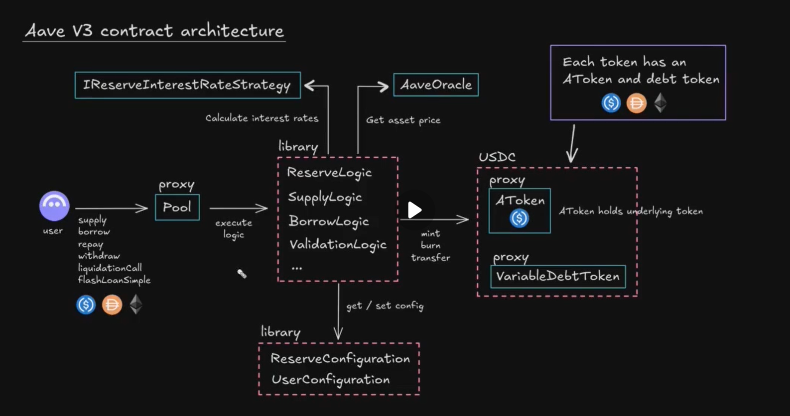

[TOC]


# Intro

## Why do We need V3?

1. 在不增加风险的前提下更加高效利用V2中的idle funds

2. AaveV3能更好的服务借款人；在 Aave V2 中，任何抵押品都可以用来借入任何可借资产。这意味着：

   - 风险参数必须设置得相当保守，以应对各种抵押品和债务资产的组合
   - 用户无法充分利用某些特定抵押品的借贷潜力
   - 协议必须考虑最坏情况下的风险，这限制了用户的借贷能力

   具体而言：

   > Aave 把一个用户在协议中所有collateral的价值“合并”（aggregate）成一个总的抵押价值，然后把这个总值标准化到一个基准货币（USD）。而每种抵押资产都有自己的LTV，Aave 会用每种资产在用户总抵押中所占的价值比例去加权这些 LTV，得到一个**weighted-average LTV**。最终可借额度 = 总抵押价值 × 平均借贷能力。

   > 因为总抵押价值和总借出价值都可能波动（价格波动、被借资产贬值等），所以协议对各资产的 **LTV/清算阈值**等参数通常较保守，以降低被清算的风险。这会在很多情形下降低借款人的可用杠杆。

3. 满足跨链需求

简单来说就是资金利用率不高，有钱没借出去。说白了得想办法**提高借款出去的LTV**

## 解决方法

  **隔离模式（Isolation Mode）**

- 用户可以选择将特定资产作为唯一抵押品进行借贷
- 降低风险，因为协议只需要考虑单一资产的风险参数
- 允许为特定资产设置更高的贷款价值比（LTV），提高借贷能力
  - 比如抵押Uniswap，你只能借出的65.00的LTV的稳定币（只有稳定币USDC/USDT可借），同时就算supply了其他的collateral，你的当前作为LTV分母collateral价值也不会增加


**效率模式（Efficiency Mode，EMode）**

- 允许用户将同一类别中的资产作为抵押品
- 同类别资产通常具有相似的风险特征（如稳定币之间）
- 可以设置更宽松的风险参数，因为资产间的相关性较高
- 提高借贷能力，同时保持风险可控
  - 比如抵押ETH，借weETH/wstETH，借出的LTV高达93%（但是这种东西都没有借的必要，只有做多做空时才有必要）


# 1.架构设计总概



V3的主要合约是`Pool.sol`，它是一个可升级合约，但里面只写了很多external函数。一般简单合约写的internal会包括的逻辑全部分配到了`lib`中。

`pool`合约继承`PoolStorage.sol`以模块化其存储和合约逻辑。另外有一个外部的`PoolConfigurator`合约进行参数设定。


再继续后面的内容前我们需知道几个基础概念：

1. **`LTV(Loan to Value)= Borrowed Amount(USD)/Collateral Amount(USD)`**

初始借款额度和清算都是由上面的值来定义的，

InitialBorrowedAmountRatio=75%

LiquidationRatio=85%

2. **`HealthFactor`**

`HealthFactor` = Debt* LiquidationRatio/CollateralRatio，当HF<=1时任意人员可对其清算，清算

3. **`APY&APR`**

Y=yield，是复利

R=rate，是单利

# 流程拆解

## 1. Supply

```solidity
  function supply(address asset, uint256 amount, address onBehalfOf, uint16 referralCode) public virtual override {
    SupplyLogic.executeSupply(
      _reserves,
      _reservesList,
      _usersConfig[onBehalfOf],
      DataTypes.ExecuteSupplyParams({asset: asset, amount: amount, onBehalfOf: onBehalfOf, referralCode: referralCode})
    );
  }
  
```


```solidity
  function executeSupply(
    mapping(address => DataTypes.ReserveData) storage reservesData,
    mapping(uint256 => address) storage reservesList,
    DataTypes.UserConfigurationMap storage userConfig,
    DataTypes.ExecuteSupplyParams memory params
  ) external {
    DataTypes.ReserveData storage reserve = reservesData[params.asset];
    DataTypes.ReserveCache memory reserveCache = reserve.cache();

    reserve.updateState(reserveCache);

    ValidationLogic.validateSupply(reserveCache, reserve, params.amount);

    reserve.updateInterestRates(reserveCache, params.asset, params.amount, 0);

    IERC20(params.asset).safeTransferFrom(msg.sender, reserveCache.aTokenAddress, params.amount);

    bool isFirstSupply = IAToken(reserveCache.aTokenAddress).mint(msg.sender, params.onBehalfOf, params.amount, reserveCache.nextLiquidityIndex);

    if (isFirstSupply) {
      if (
        ValidationLogic.validateAutomaticUseAsCollateral(reservesData, reservesList, userConfig, reserveCache.reserveConfiguration, reserveCache.aTokenAddress)
      ) {
        userConfig.setUsingAsCollateral(reserve.id, true);
        emit ReserveUsedAsCollateralEnabled(params.asset, params.onBehalfOf);
      }
    }

    emit Supply(params.asset, msg.sender, params.onBehalfOf, params.amount, params.referralCode);
  }

```


## Liquidation 


## Sepcial Tech in Aave V3

### 1. Gas Optimization Tech

1. **L2Pool的设计（calldata optimzation）**

Aave有一个`L2Pool.sol`的合约文件，这个文件在原有`Pool.sol`中又盖了一层逻辑，以`supply()`为例：

```solidity
  function supply(bytes32 args) external override {
    (address asset, uint256 amount, uint16 referralCode) = CalldataLogic.decodeSupplyParams(
      _reservesList,
      args
    );
    //输入的calldata中的数据大小为32bytes
	//对比看，原来输入的是address(20bytes)+amount(32bytes)+address(20bytes)+referralCode(2bytes) = 74bytes
    supply(asset, amount, msg.sender, referralCode);
  }
/////读取storage中的数据，而非直接传入address  
  function decodeSupplyParams(
    mapping(uint256 => address) storage reservesList,
    bytes32 args
  ) internal view returns (address, uint256, uint16) {
    uint16 assetId;
    uint256 amount;
    uint16 referralCode;

    assembly {
      assetId := and(args, 0xFFFF)
      amount := and(shr(16, args), 0xFFFFFFFFFFFFFFFFFFFFFFFFFFFFFFFF)
      referralCode := and(shr(144, args), 0xFFFF)
    }
    return (reservesList[assetId], amount, referralCode);
  }
  
```

乍一看，我们发现这个明明多用了一次`sload`，读取`storage reservesList`，为什么它却写能节省交易成本呢？

>Calldata optimized extension of the Pool contract allowing users to pass compact calldata representation
>
>to reduce transaction costs on rollups.

因为对 L2 rollup 来说，L2 的执行 gas 只是部分成本 —— 另外一大块是把 calldata/数据发布到 L1（data-availability / L1 calldata），这块费用被直接或间接转嫁给用户，所以**减少 calldata 字节往往能节省更多的钱**,（[在很多 L2 上，这部分是决定性开销]([Layer 2 Calldata Gas Optimization | By RareSkills – RareSkills](https://rareskills.io/post/l2-calldata))）

但是这个技术在*<u>Dencun upgrade</u>* 后引入Blob就不是非常重要了


### 2. 费率模型计算

Aave v3中有一个非常重要的计算利率的函数`calculateInterestRates()`，这个函数返回三个全局利率：

- `currentLiquidityRate` —— 存款利率（出借人获得的收益率）
- `currentStableBorrowRate` —— 稳定利率借款人支付的利率
- `currentVariableBorrowRate` —— 可变利率借款人支付的利率

```solidity
  struct CalcInterestRatesLocalVars {
    uint256 availableLiquidity;
    uint256 totalDebt;
    uint256 currentVariableBorrowRate;
    uint256 currentStableBorrowRate;
    uint256 currentLiquidityRate;
    uint256 borrowUsageRatio;
    uint256 supplyUsageRatio;
    uint256 stableToTotalDebtRatio;
    uint256 availableLiquidityPlusDebt;
  }

  /// @inheritdoc IReserveInterestRateStrategy
  function calculateInterestRates(
    DataTypes.CalculateInterestRatesParams memory params
  ) public view override returns (uint256, uint256, uint256) {
    CalcInterestRatesLocalVars memory vars;
//Aave v3中的有两种利率模式，可变与不可变。
//USDC、DAI 这类稳定币 —— 通常 同时 支持 stable 和 variable 两种借款模式；
//而波动性较大的资产（如 WBTC、ETH）—— 常常 仅 支持 variable 模式。
    vars.totalDebt = params.totalStableDebt + params.totalVariableDebt;

    vars.currentLiquidityRate = 0;
    vars.currentVariableBorrowRate = _baseVariableBorrowRate;
    vars.currentStableBorrowRate = getBaseStableBorrowRate();

    if (vars.totalDebt != 0) {
      vars.stableToTotalDebtRatio = params.totalStableDebt.rayDiv(vars.totalDebt);
      vars.availableLiquidity =
        IERC20(params.reserve).balanceOf(params.aToken) +
        params.liquidityAdded -
        params.liquidityTaken;

      vars.availableLiquidityPlusDebt = vars.availableLiquidity + vars.totalDebt;
      //这里就是一般前端写的utilization rate: D/(AL+D)
      vars.borrowUsageRatio = vars.totalDebt.rayDiv(vars.availableLiquidityPlusDebt);
      vars.supplyUsageRatio = vars.totalDebt.rayDiv(
        vars.availableLiquidityPlusDebt + params.unbacked
      );
    }
//如果借款的utilization rate大于了设定的Optimal Ratio，我们会让其以更陡峭的利率递增。
    if (vars.borrowUsageRatio > OPTIMAL_USAGE_RATIO) {
      uint256 excessBorrowUsageRatio = (vars.borrowUsageRatio - OPTIMAL_USAGE_RATIO).rayDiv(
        MAX_EXCESS_USAGE_RATIO
      );

      vars.currentStableBorrowRate +=
        _stableRateSlope1 +
        _stableRateSlope2.rayMul(excessBorrowUsageRatio);

      vars.currentVariableBorrowRate +=
        _variableRateSlope1 +
        _variableRateSlope2.rayMul(excessBorrowUsageRatio);
    } else {
      vars.currentStableBorrowRate += _stableRateSlope1.rayMul(vars.borrowUsageRatio).rayDiv(
        OPTIMAL_USAGE_RATIO
      );

      vars.currentVariableBorrowRate += _variableRateSlope1.rayMul(vars.borrowUsageRatio).rayDiv(
        OPTIMAL_USAGE_RATIO
      );
    }

    if (vars.stableToTotalDebtRatio > OPTIMAL_STABLE_TO_TOTAL_DEBT_RATIO) {
      uint256 excessStableDebtRatio = (vars.stableToTotalDebtRatio -
        OPTIMAL_STABLE_TO_TOTAL_DEBT_RATIO).rayDiv(MAX_EXCESS_STABLE_TO_TOTAL_DEBT_RATIO);
      vars.currentStableBorrowRate += _stableRateExcessOffset.rayMul(excessStableDebtRatio);
    }

    vars.currentLiquidityRate = _getOverallBorrowRate(
      params.totalStableDebt,
      params.totalVariableDebt,
      vars.currentVariableBorrowRate,
      params.averageStableBorrowRate
    ).rayMul(vars.supplyUsageRatio).percentMul(
        PercentageMath.PERCENTAGE_FACTOR - params.reserveFactor
      );

    return (
      vars.currentLiquidityRate,
      vars.currentStableBorrowRate,
      vars.currentVariableBorrowRate
    );
  }

  /**
   * @dev Calculates the overall borrow rate as the weighted average between the total variable debt and total stable
   * debt
   * @param totalStableDebt The total borrowed from the reserve at a stable rate
   * @param totalVariableDebt The total borrowed from the reserve at a variable rate
   * @param currentVariableBorrowRate The current variable borrow rate of the reserve
   * @param currentAverageStableBorrowRate The current weighted average of all the stable rate loans
   * @return The weighted averaged borrow rate
   */
  function _getOverallBorrowRate(
    uint256 totalStableDebt,
    uint256 totalVariableDebt,
    uint256 currentVariableBorrowRate,
    uint256 currentAverageStableBorrowRate
  ) internal pure returns (uint256) {
    uint256 totalDebt = totalStableDebt + totalVariableDebt;

    if (totalDebt == 0) return 0;

    uint256 weightedVariableRate = totalVariableDebt.wadToRay().rayMul(currentVariableBorrowRate);

    uint256 weightedStableRate = totalStableDebt.wadToRay().rayMul(currentAverageStableBorrowRate);

    uint256 overallBorrowRate = (weightedVariableRate + weightedStableRate).rayDiv(
      totalDebt.wadToRay()
    );

    return overallBorrowRate;
  }
```

### 3. 债务Token

Aave v3中的有两种利率模式，可变与不可变。

对应`StableDebtToken.sol`和`VariableDebtToken.sol`，它们在用户进行借款时会mint给用户：

- USDC、DAI 这类稳定币 —— 通常 同时 支持 stable 和 variable 两种借款模式；

- 而波动性较大的资产（如 WBTC、ETH）—— 常常 仅 支持 variable 模式。

这两种记账代币不允许被转移。

下面介绍其利息计算方式：

1. **Stable计息方式**

在`StableDebtToken.sol`中:

```solidity
  function balanceOf(address account) public view virtual override returns (uint256) {
  	//先找到借出的本金数，第一次借入时这个数是按原本的token对应mint，不会变化
  	//第二次借入时会Mint第二次借入时的本金 和 第一次借入到第二次借入时的利息（即每次mint会更新利息到本金中，方便计算）详情见mint函数
    uint256 accountBalance = super.balanceOf(account);
    uint256 stableRate = _userState[account].additionalData;  // 获取用户的当前稳定利率
    
    if (accountBalance == 0) {
      return 0;
    }
    
    // 计算从上次更新时间到现在的复利因子
    uint256 cumulatedInterest = MathUtils.calculateCompoundedInterest(
      stableRate,
      _timestamps[account]
    );
    
    // 返回当前总债务 = 基础债务 × 复利因子
    return accountBalance.rayMul(cumulatedInterest);
}
```

其中，会调用函数`calculateCompoundedInterest`来计算，这是个二次近似计算$(x+y)^n$的函数

**(x+y)ⁿ = C(n, 0)xⁿy⁰ + C(n, 1)xⁿ⁻¹y¹ + C(n, 2)xⁿ⁻²y² + ... + C(n, n)x⁰yⁿ**

其中**C(n, k) = n! / (k! \* (n-k)!)**

Aave中利率是按秒复利的，所以需要计算$(r+1)^n$ ，协议只用了前三项进行二次近似，即

$R= 1+ nx + [n(n-1)/2]x² + [n(n-1)(n-2)/6]x³$ 

```solidity
function calculateCompoundedInterest(
    uint256 rate,
    uint40 lastUpdateTimestamp
) internal view returns (uint256) {
    return calculateCompoundedInterest(rate, lastUpdateTimestamp, block.timestamp);
}

function calculateCompoundedInterest(
    uint256 rate,
    uint40 lastUpdateTimestamp,
    uint256 currentTimestamp
) internal pure returns (uint256) {
    uint256 exp = currentTimestamp - uint256(lastUpdateTimestamp);  // 经过的时间（秒）

    if (exp == 0) {
        return WadRayMath.RAY;  // 1 ray = 1×10²⁷，表示 1.0
    }

    // 为了节省Gas，使用二项式展开近似计算 (1+x)^n
    uint256 expMinusOne;
    uint256 expMinusTwo;
    uint256 basePowerTwo;
    uint256 basePowerThree;
    
    unchecked {
      expMinusOne = exp - 1;
      expMinusTwo = exp > 2 ? exp - 2 : 0;
      
      // 计算 x² 和 x³，其中 x = rate / SECONDS_PER_YEAR
      basePowerTwo = rate.rayMul(rate) / (SECONDS_PER_YEAR * SECONDS_PER_YEAR);
      basePowerThree = basePowerTwo.rayMul(rate) / SECONDS_PER_YEAR;
    }

    // 第二项: n × x
    uint256 firstOrderTerm = (rate * exp) / SECONDS_PER_YEAR;
    
    // 第三项: [n×(n-1)/2] × x²
    uint256 secondTerm = exp * expMinusOne * basePowerTwo;
    unchecked { secondTerm /= 2; }
    
    // 第四项: [n×(n-1)×(n-2)/6] × x³  
    uint256 thirdTerm = exp * expMinusOne * expMinusTwo * basePowerThree;
    unchecked { thirdTerm /= 6; }

    // 返回: 1 + n*x + [n×(n-1)/2]×x² + [n×(n-1)×(n-2)/6]×x³
    return WadRayMath.RAY + firstOrderTerm + secondTerm + thirdTerm;
}
```

当然这种近似也有坏处，就是利率会在长期实际收益与按秒复息的利率会有较大差距。

而计算总债务`totalSupply`的方法则也类似：

```solidity
  function _calcTotalSupply(uint256 avgRate) internal view returns (uint256) {
    uint256 principalSupply = super.totalSupply();
    //totalSupply是包利息的，因为每次进行mint，对于二次mint的用户会把利息保留，重新计算算进totalsupply.

    if (principalSupply == 0) {
      return 0;
    }

    uint256 cumulatedInterest = MathUtils.calculateCompoundedInterest(
      avgRate,
      _totalSupplyTimestamp//每次mint这个数就会更新，以确保误差一致
    );

    return principalSupply.rayMul(cumulatedInterest);
  }
```

2. **Variable Token**

可变利息的难点是每一分每一秒利率都会发生变化，我们该如何记录用户至今的债务？

其实这个和分红有点像，**通过维护一个global index，和每用户的局部index，进行相除就能得到用户的费率**：

```solidity
  function balanceOf(address user) public view virtual override returns (uint256) {
    uint256 scaledBalance = super.balanceOf(user);

    if (scaledBalance == 0) {
      return 0;
    }

    return scaledBalance.rayMul(POOL.getReserveNormalizedVariableDebt(_underlyingAsset));
  }
```

```solidity
function getReserveNormalizedVariableDebt(address asset) external view virtual override returns (uint256) {
    return _reserves[asset].getNormalizedDebt();
  }
//这个函数会先和之前一样算这段时间以来的复利R，之后乘以之前的reserve.variableBorrowIndex（即复利的积）
//得到最新的
function getNormalizedDebt(DataTypes.ReserveData storage reserve) internal view returns (uint256) {
    uint40 timestamp = reserve.lastUpdateTimestamp;

    //solium-disable-next-line
    if (timestamp == block.timestamp) {
      //if the index was updated in the same block, no need to perform any calculation
      return reserve.variableBorrowIndex;
    } else {
      return MathUtils.calculateCompoundedInterest(reserve.currentVariableBorrowRate, timestamp).rayMul(reserve.variableBorrowIndex);
    }
  }
```

这个函数会先和之前一样算这段时间以来的复利`R`，之后乘以一个`reserve.variableBorrowIndex`

`reserve.variableBorrowIndex`存储的是此资产从开始时刻至今的乘积，最终获得最新的利率index：$Index_{new}$

$ Index = (1+r_0)...(1+r_{k-1})(1+r_k), k是上次更新时间$

$Index_{new}=Index *R $

而每次Mint时，会记录一个用户借款时的index

```solidity
  function _mintScaled(
    address caller,
    address onBehalfOf,
    uint256 amount,
    uint256 index
  ) internal returns (bool) {
    uint256 amountScaled = amount.rayDiv(index);
    require(amountScaled != 0, Errors.INVALID_MINT_AMOUNT);

    uint256 scaledBalance = super.balanceOf(onBehalfOf);
    uint256 balanceIncrease = scaledBalance.rayMul(index) -
      scaledBalance.rayMul(_userState[onBehalfOf].additionalData);

@>  _userState[onBehalfOf].additionalData = index.toUint128();

    _mint(onBehalfOf, amountScaled.toUint128());

    uint256 amountToMint = amount + balanceIncrease;
    emit Transfer(address(0), onBehalfOf, amountToMint);
    emit Mint(caller, onBehalfOf, amountToMint, balanceIncrease, index);

    return (scaledBalance == 0);
  }
```

`balanceOf`除以这个用户记录的这个`Index`，就能得到一个用户从借款时刻到现在的债务。

`Atoken`也和`VariableDebtToken`类似，都是按这种`Global_Index/Local_Index`的方式计息，只是利率不一样而已。


### 4. RayMath

