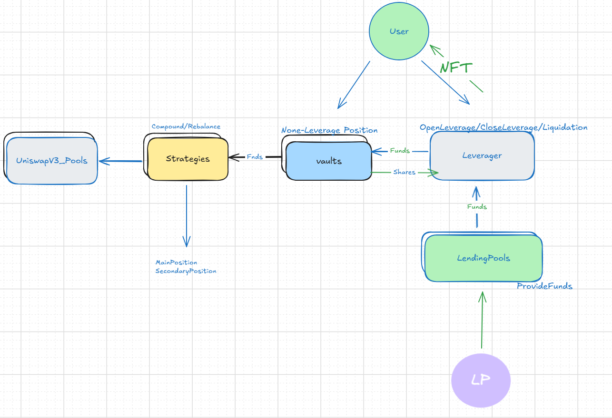

[TOC]


# 1.架构图

一般而言普通的对uniswapV3的Leverage Yield Farming有以下部分组成：

- LendingPool(s)

- LendingPoolToken(类似A token)

- Leverager

- Strategy

- Vault

具体而言，LP们可以将资产存入到LendingPool中，而Leverager合约可以从Pool中取钱加杠杆存入vaults合约，vaults合约mint shares给到Leverager，Leverager会Mint一个NFT给user作为凭证。而钱最终会给到vault对应的strategy中，strategy会自动进行compound和rebalance。



# 2.模块介绍

## 2.1 Vault

Vault有一个核心的问题就是用户给什么样的代币？

- A代币
- B代币
- AB代币

针对这三种情况来mint shares如何mint?

```solidity
  function _calcDeposit(
        uint256 bal0,
        uint256 bal1,
        uint256 depositAmount0,
        uint256 depositAmount1
    ) internal view returns (uint256 shares, uint256 amount0, uint256 amount1) {
        uint256 totalSupply = totalSupply();

        // If total supply > 0, vault can't be empty
        assert(totalSupply == 0 || bal0 > 0 || bal1 > 0);

        if (totalSupply == 0) {
            // For first deposit, just use the amounts desired
            amount0 = depositAmount0;
            amount1 = depositAmount1;
            shares = (amount0 > amount1 ? amount0 : amount1) - (1000);
        } else if (bal0 == 0) {
            amount1 = depositAmount1;
            shares = (amount1 * totalSupply) / bal1;
        } else if (bal1 == 0) {
            amount0 = depositAmount0;
            shares = (amount0 * totalSupply) / bal0;
        } else {
            uint256 cross0 = depositAmount0 * bal1;
            uint256 cross1 = depositAmount1 * bal0;
            uint256 cross = cross0 > cross1 ? cross1 : cross0;
            require(cross > 0, 'cross');

            // Round up amounts
            amount0 = (cross - 1) / bal1 + 1;
            amount1 = (cross - 1) / bal0 + 1;
            shares = (cross * totalSupply) / bal0 / bal1;
        }
    }
```

可以看到如果是一般的一种代币就会直接`(depositAmount0 * totalSupply) / bal0;`来计算shares

而对于两种代币一起传，则采用`cross`，这个`cross`是交叉额度与余额的最大值。

比如现在`cross0 = depositAmount0 * bal1`较大，

`amount0=depositAmount0`

`amount1 = depositAmount0 * bal1/bal0`

`shares = depositAmount0 *totalSupply/bal0`

类似UnswapV2一样，按比例存入amount，但是shares只会mint最大的那个代币的shares.


## 2.2 Strategy

Strategy有两个核心函数

- Compound
- Rebalance

`Compound`没什么好说的，就是`collect`后，将资金复投入仓位中。


`rebalance`则是改变仓位`setPositions`，之后再`addLiquidity`.

在合约中我们设置两个不同的仓位

`mainPosition & secondaryPosition`


`mainPosition` 会按照当前tick找到最近的tickBoarder后 +/-2倍数的tickSpace来加流动性。

由于包裹了当前价格所以两个token都会较为均衡地加入流动性。

```solidity
   function _setMainTicks(int24 tick) internal {
        //positionWidth=4 * tickSpacing
        int24 halfWidth = int24(positionWidth / 2); //positionWidth = x*tickSpacing,x=2,4,6....,in this case x=4。haflwidth =2 (tickspacing =1)
        int24 modulo = tick % tickSpacing; 
        //除余得到多出来的tick
        //比如tick = 31, ts = 10, m =1
        //tick=-31,m = -1
        if (modulo < 0) modulo += tickSpacing; //小于0，加上10，变成9
        bool isLowerSided = modulo < (tickSpacing / 2); //通过module来看，当前的点tick是离其左边刻度近还是右边刻度近

        int24 tickBorder = tick - modulo; //tickBorder落在某个tick刻度上，以此为中心向两边伸展出position
        if (!isLowerSided) tickBorder += tickSpacing;
        //找到当前tick最近的tick边，之后按4倍数的tickspace的范围加流动性。
        mainPosition.tickLower = tickBorder - halfWidth;
        mainPosition.tickUpper = tickBorder + halfWidth;

        emit NewMainTicks(tickBorder - halfWidth, tickBorder + halfWidth);
    }
```

```solidity
    function _addLiquidityToMainPosition(uint160 sqrtPriceX96, uint256 amount0, uint256 amount1) internal returns (uint256, uint256) {
        int24 tickLower = mainPosition.tickLower;
        int24 tickUpper = mainPosition.tickUpper;
        uint128 liquidity = LiquidityAmounts.getLiquidityForAmounts(
            sqrtPriceX96,
            TickMath.getSqrtRatioAtTick(tickLower),
            TickMath.getSqrtRatioAtTick(tickUpper),
            amount0,
            amount1
        ); //按公式算对应的流动性，取最小数量对应的流动性加token进去

        if (liquidity == 0) return (amount0, amount1);
        //按此流动性加入token，由于tickLower和tickerUpper的对应的价格总是包括了当前的tick，所以两个token都会加
        (uint256 used0, uint256 used1) = IUniswapV3Pool(pool).mint(address(this), tickLower, tickUpper, liquidity, 'test');
        uint256 remaining0 = amount0 - used0;
        uint256 remaining1 = amount1 - used1;

        mainPosition.liquidity += liquidity;

        return (remaining0, remaining1);
    }
```

当然AB两个Token肯定会有一个多一点，有一个少一点。

所以我们会有第二个`secondaryPosition`放这些流动性，其规则是：

- 当Atoken 多的时候`tickLower`设为大于当前`tick`的那个最近的边上，从而将这些token加进去
- 当B token多的时候就把就把`tickUpper`设成小于当前`tick`的最近的边，从而把这些流动性单独加进去
