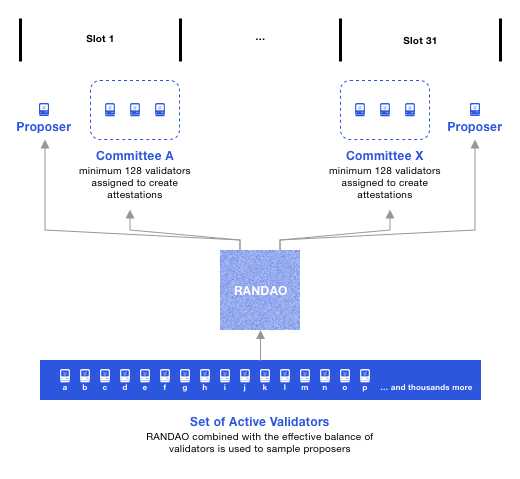
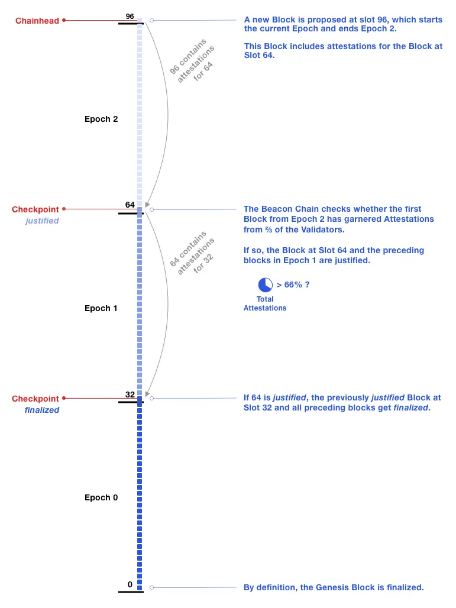

[TOC]

# Theorem Recap

## Byzantine generals Problem

“拜占庭将军问题”是分布式计算和容错系统中的经典难题，最早由 Leslie Lamport 等人在 1982 年提出，用来抽象描述在不完全信任的网络环境里，如何达成可靠一致的决策。其核心内容可以这样理解：

想象有一群拜占庭帝国的将军，他们各自率领军队，分布在城外不同的位置。将军们要共同商议：要么 **进攻**，要么 **撤退**。只有在所有忠诚的将军都选择了同一个行动方案时，才有可能获胜；若出现分歧，则会被敌军各个击破。

- **将军们互相只能通过信使传递消息**，而信使可能被拦截、篡改或延迟。
- **某些将军可能是叛徒**，他们故意发送错误信息，试图让忠诚的将军做出错误决策（进攻 vs 撤退不一致，或错误的多数决定）。

对于一个将军来说，当它收到消息后会有以下的问题：

- 无法从众多的消息中辨别哪个是对的，哪个是错的
- 无法分辨传出消息的时间顺序
- 无法知晓任何遗漏或者延误的消息

 

但是它们都有同样的 **目标**:

1. **一致性**：所有忠诚的将军（非叛徒）必须就相同的决策达成一致——要么都进攻，要么都撤退。
2. **有效性**：如果最高指挥官（假设总司令也可能是忠诚或叛徒）发出“进攻”命令，那么所有忠诚的将军若不受欺骗，最终应当执行进攻；同理，对于“撤退”命令。

## [Practical Byzantine Fault Tolerance](https://www.scs.stanford.edu/nyu/03sp/sched/bfs.pdf) (PBFT)

 Liskov and Castro最早在1999年提出了一个可行的拜占庭将军解决方案PBFT，此共识算法的特点是

1. 无需进行fork
2. 节点数量小的情况下表现好
3. 总是Safe的（保持CAP中的一致性）

以下是算法概括：

 

1. **节点模型与容错边界**

- 系统由 **n ≥ 3f + 1** 个副本（replicas）组成，最多容忍 **f** 个“拜占庭”节点（可任意作恶）。
- 只要不超过 f 个副本失效或作恶（如发出相互矛盾的信息），剩余的 2f + 1 个正确节点就足够形成多数，抵消恶意影响，保证一致性和活性。 

2. **三阶段消息协议：Pre‑Prepare → Prepare → Commit**

- **Pre‑Prepare（主节点提案）**
  - 主节点（Primary）为客户端请求分配一个全局唯一的序号（sequence number），并向所有备份节点广播 `<PRE‑PREPARE, view, seq, digest>`。
  - 该消息承诺“在 view 号下、以 seq 为序，我提议处理这个请求”。

- **Prepare（第一次投票）**
  - 各备份节点收到合法的 pre‑prepare 后，验证签名与摘要一致，即进入准备阶段，并广播 `<PREPARE, view, seq, digest>` 给所有节点。
  - 任何节点一旦收集到 **2f** 个相同 `(view, seq, digest)` 的 prepare（加上自己，共 2f + 1），就认为该请求在本 view 中**已准备就绪**（prepared），保证了全网对该请求的“初步总顺序”共识。

- **Commit（第二次投票与执行）**
  - 在 prepared 后，节点广播 `<COMMIT, view, seq, digest>`。
  - 收到 **2f + 1** 个一致的 commit（包括自己）后，节点即可 **本地提交**（committed‑local），执行该请求并回复客户端；这一步确保至少还有 f + 1 个正确节点也会执行同样顺序的操作。

> **为何能一致？**
>
> - Prepare 阶段需要 2f + 1 信号，防止 f 个恶意节点造成冲突（任意两组 2f + 1 的集合必有至少 f + 1 正常节点交集，不可能因恶意节点造假而达成两种相反的顺序）。
> - Commit 阶段再加一级确认，使得即便发生 View Change，任何已 commit‑local 的请求都能在新 view 中保持相同的序号与顺序，无碍后续一致性。 

3. **视图切换（View Change）：应对主节点失效**

- 若主节点失联或作恶（未发 pre‑prepare、超时等），备份节点启动**视图切换**：
  1. 广播 `<VIEW‑CHANGE>`，附带自己已稳定的 checkpoint 和待定请求日志；
  2. 新主节点收集 ≥2f + 1 的 view‑change 后，发 `<NEW‑VIEW>`，重播未完成的请求；
  3. 保证整个系统在主节点失效时，仍能继续以新的主节点推进三阶段协议，不丢失或重复请求。 

4. **Checkpoint 和垃圾回收**

- 为避免日志无限增长，节点定期（如每 K 个请求）生成 **checkpoint**，并通过类似 commit 的 2f + 1 签名证明其稳定性。
- 一旦 checkpoint 稳定，序号 ≤ checkpoint 的旧消息可安全丢弃，降低存储与验证开销。

## CAP theoreum

CAP定理指的是在一个分布式系统中 **Consistency（C）、Availability（A）、Partition Tolerance（P）** 三者不可兼得，同时只能优先保证其中两个（[reference](https://eth2book.info/capella/part2/consensus/preliminaries/#you-cant-have-both)）。

- Consistency: 所有节点看到的数据要一致，最新写入(write)必须立刻可读。
- Availability: 系统中的非失效节点都能响应每一个请求。
- Partition Tolerance: 节点之间任意数量的信息在传输中遗失或者延迟都不会导致系统的停摆。

对于几乎所有系统，第三点的P几乎是不可或缺的，所以实际上所有的系统都会在前二者C和A中寻找平衡。

而倾向C的系统一般更加safe，这是因为所有写入的数据都会被读取，这也就意味着如double spending这种写入数据没有正确更新导致的问题无法存在。

而倾向A的系统则表现更具有Liveness，会更有活力，也就是说用户的请求总是会被响应，保证了系统能对交易进行及时的落块或者返回error。

**现有系统的比较**

对于允许存在Fork的系统，比如以太坊，它们更加倾向于Liveness；因为如果存在了fork，那么那些最终没有上链的区块中的交易即使已经写入区块内了，也无法在之后被读取---因为它们都因为分叉随着区块被discard了。而且正因为有fork，如果读取不同的节点，它们也可能在分叉收敛前给链上不同的状态信息而无法保证consistency。([reference](https://eth2book.info/capella/part2/consensus/preliminaries/#block-trees))

而倾向C的网络，比如Solana，其共识算法**Tower BFT**则对在出现fork的情况下需要全体2/3的staker进行投票并确定区块，这也就意味着说如果超过1/3的节点出现了宕机，就会使得整个网络出现停机，这也就是为什么Solana从创建以来就一直有停机的问题([reference](https://www.helius.dev/blog/alpenglow#liveness-and-network-partition-tolerance)) 。 而ETH的投票并非全体投票，而是在有效validator中选出一定的validator进行投票，从而保证liveness。

# Ethereum's CL

## 出块流程

以太坊的每一个区块都对应一个slot，这个Slot会持续12秒，而每32个slot构成一个epoch。

- **Proposer:** 现有的有足够抵押的validators会组成一个validator set，每一个slot中会从此集合中分配一个validator作为proposer来添加区块，proposer成功添加区块获得奖励，反之出现异常则会被slash。

- **Committee：**在每一个slot中都会分配一个或者多个 Committee，这个Committee由至少128个以上的随机validator组成。Proposer和Committe member的角色不冲突，一个validator既可以成为Slot1的 Proposer也可以成为对应的Committee A的member。Committee member的主要职责就是对其所在的对应slot创建的区块投票，判断现在的区块是否是之前有效区块的子区块。而以上的随机分配角色的具体算法被称为RANDO。

于是，我们就能理解每个slot的12秒中以下的**三个流程**（每个流程均为4秒）。

1. Proposer提交自己的区块，并广播给其他节点（超过4秒无区块会被视为空slot）
2. Committee Member们应该对区块进行投票（based on fork-choice rule）(超过8秒则视为投票弃权)
3. 投票的结果BLS签名将被聚合，最后广播到整个网络

其中Slot中进行的attestation投票被称为`LMD GHOST vote`

- **CheckPoint**: 如此循环创建slot，直到完成32个slot，形成一个Epoch。当一个完整的Epoch结束，第二个Epoch的第一个Slot将成为一个`checkPoint`，这个`checkPoint`同时会进行另外一个attestation叫`Casper FFG vote`，此投票需要所有有效验证者参与，当投票权重大于所有有效validator的质押余额之和的2/3时则投票成功。
- **Justified & Finalized:**当Check point的投票通过，那么对应的刚刚完成的epoch X会被记录为`justified `，同时Epoch X-1则会被记录为`finalized`，finalized的区块将永远不可变。

## Issue

从上面的两阶段出块流程我们可以看见，当一个区块正式从创建到finalize需要大约15分钟，这就导致极低的效率。而

[Single slot finality](https://ethereum.org/en/roadmap/single-slot-finality/)的方案被提出，并在未来解决这个问题。此方案也是RoadMap--Merge中优先级最高的方案。

# Reference

https://ethos.dev/beacon-chain

https://eth2book.info/capella/part2/consensus/

https://epf.wiki/#/eps/day16

https://github.com/ethereum/consensus-specs/tree/master

