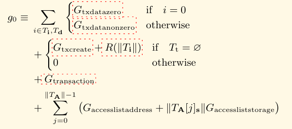

# 1.初识EVM gas机制

gas，即最终花费的ETH按如下公式计算得到：
$$
Tx Cost (ETH)=gasUsed \ × \ effectiveGasPrice
$$

其核心分为两部分

- gasUsed
- effectiveGasPrice

下面我们拆成两块来详细聊聊这些具体的算法（参考黄皮书SHANGHAI VERSION efc5f9a 2025-02-04）

## 1.1 GasUsed

总的来说，以太坊的gasUsed主要由以下三个部分组成：
$$
gasUsed=g_{intrinsic}+g_{exec}−g_{refund}
$$
其中$g_{intrinsic}$ 是交易执行前就需要支付的费用，这部分由以下组成：

从图中式子从上到下解释各部分成本

1. **`calldata`成本：**

遍历交易的数据部分（init code（$T_i$） 或 calldata（$T_d$））的每一个字节：

> - 若该字节是 0：加上 `G_txdatazero = 4`
> - 若非 0：加上 `G_txdatanonzero = 16`

这对应我们平时说的 “calldata 成本：每个 0 字节 4 gas，非 0 字节 16 gas”。这是为了鼓励优化数据，减少链上存储负担（calldata作为交易的记录会被存在s）

2. **合约创建成本：**

- 若 `T_t = ∅`（即 `to` 字段为空）→ 这是一次 **合约创建交易**；
- 则加上：
  - `G_txcreate = 32000`（合约创建额外固定成本）；
  - `R(‖T_i‖)` 是一个函数，用来计算 init code 长度相关的附加 gas（历史遗留或 EIP 调整项）。

若是普通交易（to 不为空），这一项为 0。

3. **固定交易成本**

在黄皮书里用符号 `G_transaction` 定义的常数 21,000（见附录 G），怎么样也逃不掉的基础费用，为的是cover密码学签名验证、存储新区块头信息等基础开销。

4. **Access List 开销（EIP-2930）**

对于 EIP-2930 类型交易中的 `accessList`，每个列出的地址需要支付 `G_accesslistaddress = 2400 Gas`，每个列出的存储键需要支付 `G_accessliststorage = 1900 Gas`。这部分是为了“预热”这些地址和存储位置，降低后续操作的Gas成本。

---

第二部分是在EVM中进行计算所需要花费的费用$g_{exec}$，

在黄皮书中原文如下：

> 9.2. Fees Overview. 
>
> Fees (denominated in gas) are charged under three distinct circumstances, all three as prerequisite to the execution of an operation. 
>
> The first and most common is the fee intrinsic to the computation of the operation (see Appendix G). 
>
> Secondly, gas may be deducted in order to form the payment for a subordinate message call or contract creation; this forms part of the payment for CREATE, CREATE2, CALL and CALLCODE. 
>
> Finally, gas may be paid due to an increase in the usage of the memory. Over an accounts execution, the total fee for memory usage payable is proportional to smallest multiple of 32 bytes that are required such that all memory indices (whether for read or write) are included in the range. This is paid for on a just-in-time basis; as such, referencing an area of memory at least 32 bytes greater than any previously indexed memory will certainly result in an additional memory usage fee. Due to this fee it is highly unlikely addresses will ever go above 32-bit bounds. That said, implementations must be able to manage this eventuality. 
>
> Storage fees have a slightly nuanced behaviour to in centivise minimisation of the use of storage (which corre sponds directly to a larger state database on all nodes), the execution fee for an operation that clears an entry in the storage is not only waived, a qualified refund is given; in fact, this refund is effectively paid up-front since the initial usage of a storage location costs substantially more than normal usage. See Appendix H for a rigorous definition of the EVM gas cost

总结的来说有三类：

- 各类正常opcode计算所消耗的计算费用
-  **`CALL`、`DELEGATECALL`、`CALLCODE` 或 `CREATE` 发起子调用时**所造成的，调用者（caller）必须为被调用者（callee）提供一部分 gas，以保证子执行有足够的gas运行任务。（其中EIP150中规定了上限；调用者（A）最多只能将其当前剩余Gas的 63/64 分配给被调用者（B））
- 由于计算中扩展memory大小时，收取一定的gas费用（费用会指数级上升，控制memory使用也是个技巧）

同时Storage 有特殊的机制导致出现了我们上面写的$g_{refund}$ 的部分，即当你使用storage从非0值变回0值时，会将一部分gas费用返还，从而鼓励减少链上存储数据的大小。

[以太坊柏林硬分叉｜搞懂「Gas开销计算」改变，新增「访问清单」功能又如何使用？ - 知乎](https://zhuanlan.zhihu.com/p/366251673)

## effectiveGasPrice

# 问题

- 以太坊转账需要花费多少gas？
- USDC转账大概需要多少gas？
- EVM下的gas是如何计费的？
- 