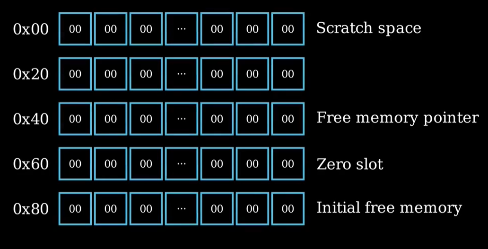

[TOC]


# 1. Storage

## 1.1 Storage by Example

### 1.1.1 Basic

state variable遵循以下的存储规则

- EVM的存储，每个合约一共由 2²⁵⁶ 个槽位组成，每个槽位最大可容纳 32 字节数据。
- 状态变量按照声明顺序依次分配槽位。
- 小于 32 字节的数据会在同一槽位中从右向左进行紧凑存储（即“打包”）。
- `sstore(k, v)` 表示将值 **v** 写入第 **k** 个槽位。
- `sload(k)` 表示从第 **k** 个槽位读取 32 字节的数据。

下面展示了这种规则的应用，使用assembly直接读取slot中的数据：

```solidity
contract EVMStorageSingleSlot {
    // EVM storage
    // 2**256 slots, each slot can store up to 32 bytes
    // Slots are assigned in the order the state variables are declared
    // Data < 32 bytes are packed into a slot (right to left)
    // sstore(k, v) = store v to slot k
    // sload(k) = load 32 bytes from slot k

    // Single variable stored in one slot
    // slot 0
    uint256 public s_x;
    // slot 1
    uint256 public s_y;
    // slot 2
    bytes32 public s_z;

    function test_sstore() public {
        assembly {
            sstore(0, 111)
            sstore(1, 222)
            sstore(2, 0xababab)
        }
    }

    function test_sstore_again() public {
        // Access slot using .slot
        assembly {
            sstore(s_x.slot, 123)
            sstore(s_y.slot, 456)
            sstore(s_z.slot, 0xcdcdcd)
        }
    }

    function test_sload()
        public
        view
        returns (uint256 x, uint256 y, bytes32 z)
    {
        assembly {
            x := sload(0)
            y := sload(1)
            z := sload(2)
        }

        return (x, y, z);
    }

    function test_sload_again()
        public
        view
        returns (uint256 x, uint256 y, bytes32 z)
    {
        assembly {
            x := sload(s_x.slot)
            y := sload(s_y.slot)
            z := sload(s_z.slot)
        }

        return (x, y, z);
    }
}
```
```solidity
contract EVMStoragePackedSlotBytes {
    // slot 0 (packed right to left)
    bytes4 public b4 = 0xabababab;
    bytes2 public b2 = 0xcdcd;

    function get() public view returns (bytes32 b32) {
        assembly {
            b32 := sload(0)
        }
    }
    //你会得到 0x0000000000000000000000000000000000000000000000000000cdcdabababab这个数据
    //这种方式存储将会大量地减少gas消耗，因为我们只使用了一个slot来存储两个变量
}
```
另外，当你使用assembly时，所有的数据会默认为32字节，256位来运行，并且在其中进行加减均和unchecked模式一样，不会自动revert任何overflow/underflow：
```solidity
// SPDX-License-Identifier: MIT
pragma solidity ^0.8.26;

// Yul - language used for Solidity inline assembly
contract YulIntro {
    // Yul assignment
    function test_yul_var() public pure returns (uint256) {
        uint256 s = 0;

        assembly {
            // Declare variable
            let x := 1
            // Reassign
            x := 2
            // Assign to Solidity variable
            s := 2
        }

        return s;
    }

    // Yul types (everything is bytes32)
    function test_yul_types()
        public
        pure
        returns (bool x, uint256 y, bytes32 z)
    {
        assembly {
            x := 1
            y := 0xaaa
            z := "Hello Yul"
        }

        return (x, y, z);
    }
}
```
### 1.1.2 BitMasking

在大多数优秀的项目中，packed slot是一个经常使用的技巧，比如uniswapV2/V3都将大量变量packed到一个slot中。

而如果我们需要使用assembly读取这些变量则需要掌握掩码技巧，因为这些数据都被放在了一个slot中，比如之前例子中的`0x0000000000000000000000000000000000000000000000000000cdcdabababab`。

我们需要对数据进行一些位运算的操作才能获得原数据：

```solidity
contract BitMasking {
	//1.创建一个16位的掩码
    function test_mask() public pure returns (bytes32 mask) {
        assembly {
            // |       256 bits        |
            // 000 ... 000 | 111 ... 111
            //             | 16 bits
            // 0x000000000000000000000000000000000000000000000000000000000000ffff
            mask := sub(shl(16, 1), 1)
            //我们的操作相当于将一个
            // 000 ... 000 | 000 ... 001
            //先左移16位
            // 000 ... 001 | 000 ... 000
            //再减去1得到
            // 000 ... 000 | 111 ... 111
            //这样，当我们使用位运算时可以用位与来删除掩码外的数据
            //使用位或来删除掩码内的数据
        }
    }
	//2.掩码的移动
    function test_shift_mask() public pure returns (bytes32 mask) {
        //当我们第一个变量是uint32，而第二变量是uint16时，
        //数据的摆放是右边32位，左边16位
        //我们会需要移动掩码（或者不移动，直接创建个32位的掩码）
        //接下来我们会有下面的掩码：
        assembly {
            // |               256 bits                |
            // 000 ... 000 | 111 ... 111 | 000 ... 000 |
            //             | 16 bits     | 32 bits
            // 0x0000000000000000000000000000000000000000000000000000ffff00000000
            mask := shl(32, sub(shl(16, 1), 1))
        }
    }
	//3.按位取反
	//这个就是取反掩码，很基础
    function test_not_mask() public pure returns (bytes32 mask) {
        assembly {
            // |               256 bits                |
            // 111 ... 111 | 000 ... 000 | 111 ... 111 |
            //             | 16 bits     | 32 bits
            // 0xffffffffffffffffffffffffffffffffffffffffffffffffffff0000ffffffff
            mask := not(shl(32, sub(shl(16, 1), 1)))
        }
    }
}
```
下面我们使用掩码来写入packed slot中的数据

将下面我们将更新slot0的四个数据[s_a, s_b, s_c, s_d]写入[11, 22, 33, 44].


```solidity
///掩码取数案例：
contract EVMStoragePackedSlot {
    // Data < 32 bytes are packed into a slot
    // Bit masking (how to create 111...111)
    // slot, offset

    // slot 0
    uint128 public s_a;
    uint64 public s_b;
    uint32 public s_c;
    uint32 public s_d;
    // slot 1
    // 20 bytes = 160 bits
    address public s_addr;
    // 96 bits
    uint64 public s_x;
    uint32 public s_y;

    function test_sstore() public {
        assembly {
            // Load 32 bytes from slot0
            let v := sload(0)
			//此时的slot数据如下：
            // s_d | s_c | s_b | s_a
            // 32  | 32  | 64  | 128 bits
			//下面我们的需求是写入数据，令：
            //- s_a=11
            //- s_b=22
            //- s_c=33
            //- s_d=44
            
        //1.创建一个128位全是0的掩码：
            // mask = all 1s at and to the left of 128 bit counting from right
            //        111 ... 111 | 000 ... 000
            //                    |    128 bits
            let mask_a := not(sub(shl(128, 1), 1))
            //常规左移128位减1后取反即可得到
            
        // 2.位与运算，将128位清空
            v := and(v, mask_a)
       	// 3.位或，从而将Set s_a = 11
            v := or(v, 11)
		
		// 4.左移64减一后取反得到对应的空值后位与，之后拿数据左移后进行位或更新第s_b
            // Set s_b = 22
            // mask = 111...111 | 000 ... 000 | 111 ... 111
            //                  |     64 bits |    128 bits
            let mask_b := not(shl(128, sub(shl(64, 1), 1)))
            // Clear previous value of s_b by setting bits (128 to 191 bits) to 0
            v := and(v, mask_b)
            v := or(v, shl(128, 22))
		// 5.s_c操作类似
            // Set s_c = 33
            // mask = 111...111 | 000...000 | 111 ... 111 | 111 ... 111
            //                  |   32 bits |     64 bits |    128 bits
            let mask_c := not(shl(192, sub(shl(32, 1), 1)))
            // Clear previous value of s_c by setting bits (192 to 223 bits) to 0
            v := and(v, mask_c)
            v := or(v, shl(192, 33))
		//6.s_d同理
            // Set s_d = 44
            // mask = 000...000 | 111...111 | 111 ... 111 | 111 ... 111
            //                  |   32 bits |     64 bits |    128 bits
            let mask_d := not(shl(224, sub(shl(32, 1), 1)))
            // Clear previous value of s_d by setting bits (224 to 255 bits) to 0
            v := and(v, mask_d)
            v := or(v, shl(224, 44))
		//7.更新到slot0
            // Store new value to slot0
            sstore(0, v)
        }
    }
	
	//assembly中也允许直接使用.offset来得到同一个slot中的位置
	//从而减少硬编码
	//offset将直接返回字节数，而非bit
	//如果要优化上面的offset数字，将所有数据改为mul(x.offset,8)即可
    function test_slot_0_offset()
        public
        pure
        returns (
            uint256 a_offset,
            uint256 b_offset,
            uint256 c_offset,
            uint256 d_offset
        )
    {	//最终返回0，16，24，28
        // a_offset =  0 =  0 * 8 =   0 bits
        // b_offset = 16 = 16 * 8 = 128 bits
        // c_offset = 24 = 24 * 8 = 192 bits
        // d_offset = 28 = 28 * 8 = 224 bits
        assembly {
            a_offset := s_a.offset
            b_offset := s_b.offset
            c_offset := s_c.offset
            d_offset := s_d.offset
        }
    }

    function test_slot_1_offset()
        public
        pure
        returns (uint256 addr_offset, uint256 x_offset, uint256 y_offset)
    {
        // addr_offset = 0
        // x_offset = 20
        // y_offset = 28
        assembly {
            addr_offset := s_addr.offset
            x_offset := s_x.offset
            y_offset := s_y.offset
        }
    }
    
    
	//下面是通过.offset优化的代码：
    // slot and offset
    function test_sstore_using_offset() public {
        // a_offset =  0 =  0 * 8 =   0 bits
        // b_offset = 16 = 16 * 8 = 128 bits
        // c_offset = 24 = 24 * 8 = 192 bits
        // d_offset = 28 = 28 * 8 = 224 bits
        assembly {
            // Load 32 bytes from slot0
            let v := sload(s_a.slot)

            // s_d | s_c | s_b | s_a
            // 32  | 32  | 64  | 128 bits

            // Set s_a = 111
            // mask = all 1s at and to the left of 128 bit counting from right
            //        111 ... 111 | 000 ... 000
            //                    |    128 bits
            let mask_a := not(sub(shl(128, 1), 1))
            // Set left most 128 bits to 0
            v := and(v, mask_a)
            // Set s_a = 1
            v := or(v, 111)

            // Set s_b = 222
            // mask = 111...111 | 000 ... 000 | 111 ... 111
            //                  |     64 bits |    128 bits
            let mask_b := not(shl(mul(s_b.offset, 8), sub(shl(64, 1), 1)))
            // Clear previous value of s_b by setting bits (128 to 191 bits) to 0
            v := and(v, mask_b)
            v := or(v, shl(mul(s_b.offset, 8), 222))

            // Set s_c = 333
            // mask = 111...111 | 000...000 | 111 ... 111 | 111 ... 111
            //                  |   32 bits |     64 bits |    128 bits
            let mask_c := not(shl(mul(s_c.offset, 8), sub(shl(32, 1), 1)))
            // Clear previous value of s_c by setting bits (192 to 223 bits) to 0
            v := and(v, mask_c)
            v := or(v, shl(mul(s_c.offset, 8), 333))

            // Set s_d = 444
            // mask = 000...000 | 111...111 | 111 ... 111 | 111 ... 111
            //                  |   32 bits |     64 bits |    128 bits
            let mask_d := not(shl(mul(s_d.offset, 8), sub(shl(32, 1), 1)))
            // Clear previous value of s_d by setting bits (224 to 255 bits) to 0
            v := and(v, mask_d)
            v := or(v, shl(mul(s_d.offset, 8), 444))

            // Store new value to slot0
            sstore(s_a.slot, v)
        }
    }
}
```

总结一下，对于packed slot，使用assembly进行更新遵循以下操作

- 创建掩码
- 位与clear
- 位或更新

```solidity
假设slot0有uint128+uint128两个数据

assembly{
 let v := slot(0)
 //左移减一取反
 let mask1 := not(sub(shl(128,1),1))
 //clear
 v := and(v,mask1)
 //update
 v := or(v,值1)
 
 //左移减一
 let mask2 := sub(shl(128,1),1)
 //clear
 v := and(v,mask2)
 //update
 v := or(v,shl(128,值二))
 
 sstore(0,v)
}
```

同时我们可以通过`mul(x.offset,8)`的方式减少硬编码，从而优化代码。

当然这会增加额外的少量因为乘法的gas费用和代码复杂性，使用前需要考虑这些因素。

### 1.1.3 Struct，Constant and Fixed Array in Storage

结构体在Storage也会遵循同样的变量打包方法，例如下面的案例

```solidity
contract EVMStorageStruct {
    struct SingleSlot {
        uint128 x;
        uint64 y;
        uint64 z;
    }

    struct MultipleSlots {
        uint256 a;
        uint256 b;
        uint256 c;
    }

    // slot 0
    SingleSlot public single = SingleSlot({x: 1, y: 2, z: 3});
    // slot 1, 2, 3
    //分别存储a,b,c三个uint256的数据
    MultipleSlots public multi = MultipleSlots({a: 11, b: 22, c: 33});

    function test_get_single_slot_struct()
        public
        view
        returns (uint128 x, uint64 y, uint64 z)
    {
        assembly {
            let s := sload(0)
            //  z |  y | x
            // 64 | 64 | 128 bits
            // Casting cuts off bits to the left
            x := s
            y := shr(128, s)
            z := shr(192, s)
        }
    }

    function test_get_multiple_slots_struct()
        public
        view
        returns (uint256 a, uint256 b, uint256 c)
    {
        assembly {
            a := sload(1)
            b := sload(2)
            c := sload(3)
        }
    }
}
```

简单来说struct声明本身不占用slot，且和一般的c++结构体一样，声明一个struct变量会按顺序存储在storage中。

如果有多个动态变量，也会按动态变量的方法将数据存储。

```solidity
//在结构体中，动态变量按照声明顺序分配存储槽，但实际数据可能分散在不同位置：
struct User {
    uint256 id;
    mapping(address => uint256) balances; // 仅占一个槽位，但数据分散存储
    string name; // 可能占用多个实际存储位置
}
```


而对于一般的constant, immutable变量，它们在部署时便是字节码的一部分，不会占用任何的slot

```solidity
contract EVMStorageConstants {
    // slot 0
    uint256 public s0 = 1;
    // Constants and immutables don't use storage
    uint256 public constant X = 123;
    address public immutable owner;
    // slot 1
    uint256 public s1 = 2;

    constructor() {
        owner = msg.sender;
    }

    function test_get_slots() public view returns (uint256 v0, uint256 v1) {
        assembly {
            v0 := sload(0)
            v1 := sload(1)
        }
    }
}
```


对于fixedArray，其存储形式和struct类似，且也遵循packed的准则

```solidity
contract EVMStorageFixedArray {
    // Fixed array with elements = 32 bytes, slot of element = slot where array is declared + index of array element
    // slots 0, 1, 2
    uint256[3] private arr_0 = [1, 2, 3];
    // slots 3, 4, 5
    uint256[3] private arr_1 = [4, 5, 6];
    // slot + index of packed data
    // slots 6, 6, 7, 7, 8
    uint128[5] private arr_2 = [7, 8, 9, 10, 11];

    function test_arr_0(uint256 i) public view returns (uint256 v) {
        assembly {
            // arr_0 starts from slot 0
            v := sload(add(0, i))
        }
    }

    function test_arr_1(uint256 i) public view returns (uint256 v) {
        assembly {
            // arr_1 starts from slot 3
            v := sload(add(3, i))
        }
    }

    function test_arr_2(uint256 i) public view returns (uint128 v) {
        assembly {
            // arr_2 starts from slot 6
            let b32 := sload(add(6, div(i, 2)))
            // slot 6 = 1st element | 0th element
            // slot 7 = 3rd element | 2nd element
            // slot 8 = 000 ... 000 | 4th element

            // i is even => get right 128 bits => cast bytes32 to uint128 (cut off left 128 bits)
            // i is odd  => get left 128 bits  => shift right 128 bits

            switch mod(i, 2)
            case 1 { v := shr(128, b32) }
            default { v := b32 }
        }
    }
}
```


### 1.1.4  Dynamic varaibles in Storage

 1. **动态数组**

- **长度存储**：在预定义的存储槽位置 `p` 存储数组的长度。
- **元素存储**：数组的元素从 `keccak256(p)` 开始的连续存储位置存储。
- **示例**：`uint256[] public arr;` 存储在槽0。`arr.length` 存储在槽0，`arr[0]` 存储在 `keccak256(0)`，`arr[1]` 存储在 `keccak256(0) + 1`，依此类推。同时遵循packed规则，会将不足32字节的数据打包在一起。

```solidity
contract EVMStorageDynamicArray {
    // slot of element = keccak256(slot where this array is declared) + size of element * index of element
    
    // keccak256(0)，keccak256(0)+1,keccak256(0)+2
    uint256[] private arr = [11, 22, 33];
    // keccak256(1),keccak256(1),keccak256(1)+1
    uint128[] private arr_2 = [1, 2, 3];

    function test_arr(uint256 slot, uint256 i)
        public
        view
        returns (uint256 v, bytes32 b32, uint256 len)
    {
        bytes32 start = keccak256(abi.encode(slot));

        assembly {
            len := sload(slot)
            v := sload(add(start, i))
            b32 := v
        }
    }
    
    //读取得到两个3
    function slotread() public view returns(uint256 slot0,uint256 slot1)
   {	assembly{
   		slot0 :=sload(0)
   		slot1 :=sload(1)
   }
    
    }
}
```


 2. **映射**

- **无集中存储**：映射本身不存储任何元素，只作为一个"起始点"。
- **分散存储**：每个键 `k` 对应的值存储在 `keccak256(h(k) . p)`，其中：
  - `p` 是映射的存储槽位置，不存储任何数据，其数值为0.
  - `h(k)` 是对键 `k` 进行适当填充到32字节的函数
  - `.` 表示连接符
- **示例**：`mapping(address => uint256) public balances;` 在槽1。`balances[0x123...]` 的值存储在 `keccak256( pad(0x123...) . 1 )`。

```solidity
contract EVMStorageMapping {
    // slot of value = keccak256(key, slot where mapping is declared)
    mapping(address => uint256) public balances;

    constructor() {
        balances[address(1)] = 11;
        balances[address(2)] = 22;
        balances[address(3)] = 33;
    }

    function test_mapping(address key) public view returns (uint256 v) {
        uint256 slot = 0;
        bytes32 slot_v = keccak256(abi.encode(key, slot));

        assembly {
            v := sload(slot_v)
        }
    }
   //得到0，mapping本身不会存储任何数据
   function slotread() public view returns(uint256 slot0)
   {	assembly{
   		slot0 :=sload(0)
   }
}
```


对于嵌套映射，其方法也是嵌套的，先将第一个映射得到一个slot，之后这个slot作为mapping声明的地方进行套公式：

```solidity
contract EVMStorageNestedMapping {
    // key0 => key1 => val
    // slot of value = keccak256(key1, keccak256(key0, slot where nested mapping is declared))
    mapping(address => mapping(address => uint256)) public map;

    address public constant ADDR_1 = address(1);
    address public constant ADDR_2 = address(2);
    address public constant ADDR_3 = address(3);

    constructor() {
        map[ADDR_1][ADDR_2] = 11;
        map[ADDR_2][ADDR_3] = 22;
        map[ADDR_3][ADDR_1] = 33;
    }

    function test_nested_mapping(address key_0, address key_1)
        public
        view
        returns (uint256 v)
    {
        uint256 slot = 0;
        bytes32 s0 = keccak256(abi.encode(key_0, slot));
        bytes32 s1 = keccak256(abi.encode(key_1, s0));

        assembly {
            v := sload(s1)
        }
    }
}
```


套公式的方法我们可以知道映射+数组，动态数组结构体的存储方式：

```solidity
contract EVMStorageMappingArray {
    // slot of value in a mapping = keccak256(key, slot)
    // slot of array element = keccak256(slot) + index
    // mapping -> array -> keccak256(keccak256(key, slot of map declaration)) + index
    mapping(address => uint256[]) public map;

    address public constant ADDR_1 = address(1);
    address public constant ADDR_2 = address(2);

    constructor() {
        map[ADDR_1].push(11);
        map[ADDR_1].push(22);
        map[ADDR_1].push(33);
        map[ADDR_2].push(44);
        map[ADDR_2].push(55);
        map[ADDR_2].push(66);
    }

    function test_map_arr(address addr, uint256 i)
        public
        view
        returns (uint256 v, uint256 len)
    {
        uint256 map_slot = 0;
        bytes32 map_hash = keccak256(abi.encode(addr, map_slot));
        bytes32 arr_hash = keccak256(abi.encode(map_hash));

        assembly {
            len := sload(map_hash)
            v := sload(add(arr_hash, i))
        }
    }
}

contract EVMStorageDynamicArrayStruct {
    struct Point {
        uint256 x;
        uint128 y;
        uint128 z;
    }

    // slot of element = keccak256(slot where this array is declared) + index of element
    // keccak256(0) + index * size of struct
    Point[] private arr;

    constructor() {
        arr.push(Point(11, 22, 33));
        arr.push(Point(44, 55, 66));
        arr.push(Point(77, 88, 99));
    }

    function test_struct_arr(uint256 i)
        public
        view
        returns (uint256 x, uint128 y, uint128 z, uint256 len)
    {
        uint256 slot = 0;
        bytes32 start = keccak256(abi.encode(slot));

        assembly {
            len := sload(slot)
            // s0 = keccak256(0)
            // index | slot        | values
            //     0 | slot s0 + 0 | arr[0].x
            //     0 | slot s0 + 1 | arr[0].z | arr[0].y
            //     1 | slot s0 + 2 | arr[1].x
            //     1 | slot s0 + 3 | arr[1].z | arr[1].y
            //     2 | slot s0 + 4 | arr[2].x
            //     2 | slot s0 + 5 | arr[2].z | arr[2].y
            x := sload(add(start, mul(i, 2)))
            let zy := sload(add(start, add(mul(i, 2), 1)))
            // uint128 cuts off left most 128 bits from 32 bytes
            y := zy
            z := shr(128, zy)
        }
    }
}
```


3. **字节数组和字符串**

字节和字符串的编码方式相同。一般来说，其编码方式与 bytes1 [] 类似，即存在一个用于数组本身的槽位，以及一个通过该槽位位置的 keccak256 哈希计算得到的数据区域。不过，对于短值（短于 32 字节），数组元素会和长度一起存储在同一个槽位中。

具体而言：如果数据长度最多为 31 字节，元素会存储在高位字节（左对齐），而最低位字节存储的值为长度 ×2。对于存储的数据长度为 32 字节或更长的字节数组，主槽位 p 存储长度 ×2 + 1

- **短（length ≤ 31）**：值直接存放在槽 `p` 本身。具体地，槽内最低有效字节（least-significant byte，LSB）保存 `length * 2`（即 `length << 1`）；其余高位字节存放数据（data 被移位放在槽的高位部分）。换句话说，槽的布局是 `(data << 8) | (length << 1)`.而之所以要左移一位，是为了最低位置放一个0/1的flag，来告诉程序这到底是短的还是长的存储方法，如果是短的就是0，会直接读取这里的数据

  此时数据应该长这样：

  ```solidity
  storage[p] = (data << 8) | (length << 1) | flag=0
  ```

  

- **长（length ≥ 32）**：槽 `p` 不直接放数据，而在槽中存放一个奇偶标志形式的长度编码：`(length << 1) | 1`（即 `length * 2 + 1`，最低位为 1 标识为“外部存储”）。数据本体从 `keccak256(p)` 开始按 32 字节块顺序连续存储（`keccak256(p) + 0`、`+1` …）。

  此时数据应该是：

  ```solidity
  storage[p] = (length << 1) | 1
  storage[keccak256(p)] = data1
  storage[keccak256(p)+1] = data2 
  ....
  ```


# 2.Memory

## 2.1 内存结构

solidity的内存是由一个个32字节的槽组成，初始状态下会有四个槽，分别是：

- `0x00` - `0x3f` (64 bytes): scratch space for hashing methods
- `0x40` - `0x5f` (32 bytes): currently allocated memory size (aka. free memory pointer)
- `0x60` - `0x7f` (32 bytes): zero slot



scratch space 主要是为了作为assembly的缓冲区，用来存放临时变量 / 中间值 / 哈希前置数据，以便立刻用于 `keccak256`、`mload`/`mstore` 等操作。比如下面的操作：

```solidity
assembly {
    // store two words to scratch area
    mstore(0x00, a)        // scratch[0:32]
    mstore(0x20, b)        // scratch[32:64]
    let h := keccak256(0x00, 0x40) // hash 两个 word
}
//mstore(offset,value)中，offset永远按字节数来算
//比如纯数字mstore(32,value)，对应的就是[32:64]
```

zero slot作为一个默认零值槽，主要是作为动态数组的初始值，比如

```solidity
uint[] memory safeArray = new uint[](0); // 明确指向0x60
```

作为初始的0值，这个地方永远不该写入东西


另外内存中**不会像storage一样打包**，而是直接一个数存一个槽，

当使用`mload(p)`时就是读取`p`位置开始的32字节，

使用`mstore(p,value)`就是将value赋值到`p`位置，到的`p+32字节`的位置。

下面的例子解释了指针初始的指向以及`mstore,mload`的用法：

```solidity
// SPDX-License-Identifier: MIT
pragma solidity 0.8.26;

// Memory layout
// array of length 2**256 (32 bytes), each element stores 1 byte (0x00 to 0xff)
// index    0    1    2   ...   0xfff...fff = 2**256 - 1
// memory | 00 | 00 | 00 | ... | 00 |

// Reserved slots
// 0x00 - 0x3f (64 bytes): scratch space for hashing methods
// 0x40 - 0x5f (32 bytes): free memory pointer - pointer to next available location in memory to store data
// 0x60 - 0x7f (32 bytes): zero slot - used as initial value for dynamic memory arrays and should never be written to

// Free memory pointer (0x40)
// 0x80 = Free memory pointer initially points here
contract MemBasic {
    // mstore(p, v) = store 32 bytes to memory starting at memory location p
    // mload(p) = load 32 bytes from memory starting at memory location p
    function test_1() public pure returns (bytes32 b32) {
        assembly {
            // Free memory pointer
            // p = 0x80
            let p := mload(0x40)
            mstore(p, 0xababab)
            b32 := mload(p)
        }
    }
	//p位置如果按非32字节倍数赋值，则会像下面一样
    function test_2() public pure {
        assembly {
            mstore(0, 0x11)
            // index: 32 bytes of data stored in memory from index
            //  0x00: 0x0000000000000000000000000000000000000000000000000000000000000011
            mstore(1, 0x22)
            //           0 1
            //  0x00: 0x0000000000000000000000000000000000000000000000000000000000000000
            //  0x20: 0x2200000000000000000000000000000000000000000000000000000000000000
            mstore(2, 0x33)
            //           0 1 2
            //  0x00: 0x0000000000000000000000000000000000000000000000000000000000000000
            //  0x20: 0x0033000000000000000000000000000000000000000000000000000000000000
            mstore(3, 0x44)
            //           0 1 2 3
            //  0x00: 0x0000000000000000000000000000000000000000000000000000000000000000
            //  0x20: 0x0000440000000000000000000000000000000000000000000000000000000000
        }
    }
}
```

## 2.2 指针

一般而言，只有以下类型的变量会需要使用heap内存：

- 结构体：`MyStruct memory st;`
-  静态数组：`uint[5] memory arr;`
- 动态数据类型：`uint[] memory arr;  bytes memory b;  string memory s; `

而其他的所有数据类型包括`bytes32`，都小于32字节，能被EVM的stack所容纳，不会使用memory，如果对这些变量声明memory则会报错。

---

而内存指针，即0x40上的数据，会在声明<u>**结构体和静态数组**</u>时发生变化，更新到下一个地方。

而如果声明动态变量，如声明` string memory str;
    bytes memory data;uint[] memory arr;` 这些暂时不知道大小的变量时，则不会发生指针的改变，只有当变量被确定赋值后才会改变指针的指向。

比如下面的例子`MemStruct::test_write()` 方法内声明了一个结构体p，即使这个p没有赋值，指针也在声明的那时刻发生了改变。

而在`test_dynamic`中，声明了几个动态变量，却没有发生指针的改变，而是在真正赋值后才发生了指针的改变

总结地来讲：

- 如果对象大小 **已知**（如 `struct` 的固定部分、定长数组），编译器能在声明处计算所需字节并**立刻**把 free pointer 增加相应量，从而保证局部变量有确定的内存区域可用。
- 如果对象大小 **未知**（动态类型），编译器无法在声明时决定要占多少连续内存，所以延迟到实际赋值/`new` 时再分配。
- 而对于结构体中存在动态变量的部分，在初始情况下会分配一个指针指向0x60 zero slot，之后发生的数据变化会改变此地址的指针，并在指针指向的地方存发具体的数据。

```solidity
contract MemoryTest {
    // Memory data is not packed - all data stored in chunks of 32 bytes
    struct Point {
        uint256 x;
        uint32 y;
        uint32 z;
    }
    struct DynamicStruct{
		string str;
		Point[] points;
		uint256 value;
	}

    function test_static_struct1()
        public
        pure
        returns (bytes32 free_mem_ptr1,bytes32 free_mem_ptr2, uint256 x, uint256 y, uint256 z)
    {
        // Allocates memory 0x80 to 0xdf to Point
        // Free memory pointer = 0xdf + 1 = 0xe0
        Point memory p;
        //当你声明一个p的时候，就会占用0x80之后的三个槽，此时的指针将会自动更新
        //这样是为什么，当我们声明一个不知道大小的动态的数据时
        //编译器会报错，因为它不知道下一步指针应该指向哪里
        //具体而言，我们可以声明string memory k; 但是声明这样的一个变量不会分配内存和改变指针，
        //而是只有最终赋值的时候，即知道大小后才会类似上面结构体p一样发生指针的改变

        // Write
        assembly {
        	// 0xe0
        	free_mem_ptr1 := mload(0x40)//在write发生前就已经改写了
            // store to 0x80
            mstore(p, 11)
            // store to 0xa0
            mstore(add(p, 0x20), 22)
            // store to 0xc0
            mstore(add(p, 0x40), 33)
            // 0xe0
            free_mem_ptr2 := mload(0x40)
        }

        x = p.x;
        y = p.y;
        z = p.z;
    }
    
    
    function test_static_struct2()
        public
        pure
        returns (bytes32 prt,uint256 x, uint256 y, uint256 z)
    {
        // Point is loaded to memory starting at 0x80
        // 0x80 = initial free memory
        
        Point memory p = Point(1, 2, 3);

        assembly {
        	//指向0xe0
        	prt:=mload(0x40)
            // load 32 bytes starting from 0x80
            x := mload(0x80)
            // load 32 bytes starting from 0xa0 (0x80 + 32 = 0xa0)
            y := mload(0xa0)
            // load 32 bytes starting from 0xc0 (0xa0 + 32 = 0xc0)
            z := mload(0xc0)
        }
    }
    function test_dynamic() public pure returns(bytes32 prt1,bytes32 prt2,bytes32 data1,bytes32 data2)
    {	    string memory str;
    		bytes memory data;
    		uint[] memory arr;
    	assembly {
			//指向依旧是0x80
			prt1:= mload(0x40)
		}
			//赋值后发生改变,用掉了0x80和0xa0槽
			str = "hello";
		assembly {
			//指向c0
			prt2 := mload(0x40)
			//存入长度5，即string的字节数
			data1 := mload(0x80)
			//存入了数据
			data2 := mload(0xa0)
		
		}

	}
	
	function test_dynamic_struct() public pure returns(bytes32 prt,bytes32 data1,bytes32 data2,bytes32 data3)
	{		DynamicStruct memory ds;
			assembly{
			//指针指向0xe0
			prt := mload(0x40)
			//下面两个槽，作为动态数组都是指针数据，指向 0x60，即zero Slot
			data1 := mload(0x80)
			data2:=mload(0xa0)
			//而作为静态数据，uint256默认值为0，就直接赋值为0
			data3 :=mload(0xc0)
			}
			
			//赋值时
            ds.str = "hello";
            ds.value= 1;
            assembly{
            //指针指向0x120
            prt1 := mload(0x40)
            //string更新后也是更新指针，此时指向0xe0
            data1 := mload(0x80)
            //point未发生更新，继续指向0x60的zero slot
			data2 :=mload(0xa0)
			//发生更新直接变1
            data3 :=mload(0xc0)
            }
	}
}
```


| 数据类型\指针变化  | 声明时                                                       | 赋值/new                                                     |
| ------------------ | ------------------------------------------------------------ | ------------------------------------------------------------ |
| Struct（静态部分） | 直接分配内存，<br />内存中存入数值，<br />更新指针           | 更新对应内存中的数据                                         |
| Struct（动态部分） | 直接分配内存，<br />内存中存入指针（指向zero slot）,<br />更新指针 | 更新对应内存中指针，<br />在空闲指针处更新动态变量的具体数据<br />更新空闲指针 |
| 静态数组           | 直接分配内存，<br />内存中存入数值，<br />更新指针           | 更新对应内存中的数据                                         |
| 动态数组           | 什么都不干                                                   | 对数据分配内存（长度+数据）<br />更新指针                    |


xxx

```solidity
contract MemFixedArray {
    function test_read()
        public
        pure
        returns (uint256 a0, uint256 a1, uint256 a2)
    {
        // arr is loaded to memory starting at 0x80
        // Each array element is stored as 32 bytes
        uint32[3] memory arr = [uint32(1), uint32(2), uint32(3)];

        assembly {
            a0 := mload(0x80)
            a1 := mload(0xa0)
            a2 := mload(0xc0)
        }
    }

    function test_write()
        public
        pure
        returns (uint256 a0, uint256 a1, uint256 a2)
    {
        uint32[3] memory arr;

        assembly {
            // 0x80
            mstore(arr, 11)
            // 0xa0
            mstore(add(arr, 0x20), 22)
            // 0xc0
            mstore(add(arr, 0x40), 33)
        }

        a0 = arr[0];
        a1 = arr[1];
        a2 = arr[2];
    }
}
```
xxx
```solidity
contract MemDynamicArray {
    function test_read()
        public
        pure
        returns (bytes32 p, uint256 len, uint256 a0, uint256 a1, uint256 a2)
    {
        uint256[] memory arr = new uint256[](5);
        arr[0] = uint256(11);
        arr[1] = uint256(22);
        arr[2] = uint256(33);
        arr[3] = uint256(44);
        arr[4] = uint256(55);

        assembly {
        	//此时的就是arr在memory的reference，值为0x80
            p := arr
            // 0x80上第一个数据是长度5
            len := mload(arr)
            // 0xa0，数据1
            a0 := mload(add(arr, 0x20))
            // 0xc0，数据2
            a1 := mload(add(arr, 0x40))
            // 0xe0，数据3
            a2 := mload(add(arr, 0x60))
        }
    }

    function test_write() public pure returns (bytes32 p, uint256[] memory) {
        uint256[] memory arr = new uint256[](0);

        assembly {
            p := arr
            // Store length of arr
            mstore(arr, 3)
            // Store 1, 2, 3
            mstore(add(arr, 0x20), 11)
            mstore(add(arr, 0x40), 22)
            mstore(add(arr, 0x60), 33)
            // Update free memory pointer
            mstore(0x40, add(arr, 0x80))
        }

        // Data will be ABI encoded when arr is returned to caller
        return (p, arr);
    }
}
```
xxx

## 2.3 内存gas费计算

```solidity
// Memory expansion gas cost
// Gas cost is quadratic to memory allocation.
contract MemExp {
    function alloc_mem(uint256 n) external view returns (uint256) {
        uint256 gas_start = gasleft();
        uint256[] memory arr = new uint256[](n);
        uint256 gas_end = gasleft();
        return gas_start - gas_end;
    }
}

// arr size | gas
//        0 |    120
//        1 |    178
//       10 |    232
//       20 |    293
//       30 |    354
//       40 |    415
//       50 |    477
//       60 |    540
//       70 |    602
//       80 |    666
//       90 |    729
//      100 |    793
//      110 |    857
//      120 |    922
//      130 |    987
//      140 |   1053
//      150 |   1118
//      160 |   1185
//      170 |   1251
//      180 |   1318
//      190 |   1386
//      200 |   1454

//     1000 |   8144
//     2000 |  20023
//     3000 |  35808
//     4000 |  55500
//     5000 |  79097
//     6000 | 106601
//     7000 | 138011
//     8000 | 173328
//     9000 | 212550
//    10000 | 255679
//    11000 | 302715
//    12000 | 353656
//    13000 | 408504
//    14000 | 467257
//    15000 | 529918
//    16000 | 596484
//    17000 | 666957
//    18000 | 741336
//    19000 | 819621
//    20000 | 901812
```


# 3.Calldata


## 3.1 msg.xxx

假设我的函数有多个call frame，请问msg.data里包含的calldata是哪个call 的信息，是原始fn0函数接受到的calldata还是fn1所收到fn1的calldata？

答案是：**msg.data 包含的是 fn0（原始入口函数）接收到的 Calldata。**

核心原因

在 Solidity 中，**internal（内部）函数调用**和外部调用（external call）有本质的区别：

1. **Internal Call (fn1)**:
   - 内部函数调用在 EVM 层面**不会**发起新的 CALL、STATICCALL 或 DELEGATECALL 指令。
   - 它们仅仅是代码执行流程的跳转（JUMP 指令）。
   - 因此，**执行上下文（Context）没有改变**。msg.sender、msg.value 和 **msg.data** 仍然保持为当前交易（或当前外部调用）的原始值。
   - fn1 的参数是通过栈（Stack）或内存（Memory）传递的，而不是通过 Calldata 传递的。
2. **External Call (fn0)**:
   - 这是合约的入口，它接收了来自外部的 Calldata。

```
    function fn0() external pure returns(bytes memory data) {
    // 假设调用 fn0()，此时 msg.data = 函数选择器(fn0)
    return fn1();
}

function fn1() internal view returns(bytes memory data) {
    // 这里是 internal 调用，上下文未变
    // msg.data 依然是 fn0 的 calldata
    return data = msg.data; 
}
  
```

- 当你从外部调用 fn0 时，msg.data 的内容是 fn0 的函数选择器（Function Selector, 前4个字节）加上任何传递给 fn0 的参数编码。
- 进入 fn1 后，因为是内部跳转，msg.data 指针没有变，它指的依然是内存中那段原始的请求数据。

对比：如果 fn1 是通过外部方式调用

只有一种情况 msg.data 会变成 fn1 的信息，那就是你显式地发起了一个**外部调用**（即使是在合约内部调用自己）：

```
    function fn0() external view returns(bytes memory) {
    // 下面这行代码会发起一个新的 EVM CALL
    // 此时 fn1 内的 msg.data 就会变成 fn1 的 calldata
    return this.fn1(); 
}

function fn1() public view returns(bytes memory) { 
    return msg.data;
}
  
```

但在你的示例中，你使用的是直接调用 fn1() 且 fn1 定义为 internal，所以答案肯定是 **fn0 的 calldata**。


# 4. Transient

> Transient manipulate state that behaves identically to storage, except that transient storage is discarded after every transaction, and `TSTORE` is not subject to the gas stipend check as defined in [EIP-2200](https://eips.ethereum.org/EIPS/eip-2200). In other words, the values of transient storage are **never deserialized from storage or serialized to storage.** Thus transient storage is cheaper since it never requires disk access.

1. transient变量不和storage共用存储空间，同样的位置的slot不会影响storage slot。
2. `tload/tstore`操作码没有storage那般复杂的动态gas费机制，它们只需要100gas


# 5.Assembly

## 5.1 Basic

### 5.1.1 return/revert/keccak

和一般的编程语言一样，如果调用内部函数返回的是一般的uint256等较小的数据，返回值会直接被存入stack中/

如果返回的值较大，被memory声明，则会在栈上返回一个指针，指向内存条的地方。

```solidity
contract MemInternalFuncReturn {
    function internal_func_return_val() private pure returns (uint256) {
        return uint256(0xababab);
    }

    function test_val() public pure {
        // 0xababab will be stored in top of the stack
        internal_func_return_val();
    }

    function internal_func_return_mem()
        private
        pure
        returns (bytes32[] memory)
    {
        bytes32[] memory arr = new bytes32[](3);
        arr[0] = bytes32(uint256(0xaaa));
        arr[1] = bytes32(uint256(0xbbb));
        arr[2] = bytes32(uint256(0xccc));
        return arr;
    }

    function test_mem()
        public
        pure
        returns (uint256 len, bytes32 a0, bytes32 a1, bytes32 a2)
    {
        // Stores 0x80 to top of the stack
        // 0x80 = memory pointer to beginning of arr
        internal_func_return_mem();
        // Read data from arr, initialized in internal_func_return_mem, using assembly
        assembly {
            len := mload(0x80)
            a0 := mload(0xa0)
            a1 := mload(0xc0)
            a2 := mload(0xe0)
        }
    }
}
```

下面是如何将数据return的assemly展示，`return()`需要两个参数，一个是memory的起始位置，第二个是长度length，从而在内存中将数据return出去。一旦调用该opcode，函数的允许也会终止。

```solidity
contract MemReturn {
    function test_return_vals() public pure returns (uint256, uint256) {
        // return(start, len) - Halt execution and return data stored in memory from start to start + len
        assembly {
            mstore(0x80, 11)
            mstore(0xa0, 22)
            //从0x80开始，64字节长度
            return(0x80, 0x40)
        }
    }

    function test_return_dyn_arr() public pure returns (uint256[] memory) {
        // ABI encode uint256[] array with 3 elements 11, 22 and 33
        assembly {
            // offset
            mstore(0x80, 0x20)
            // length
            mstore(add(0x80, 0x20), 3)
            // array elements
            mstore(add(0x80, 0x40), 11)
            mstore(add(0x80, 0x60), 22)
            mstore(add(0x80, 0x80), 33)
            // No need to update free memory pointer - function execution ends here
            return(0x80, mul(5, 0x20))
        }
    }

    function test_return() public pure returns (uint256, uint256) {
        // Returns (11, 22)
        test_return_vals();
        // This code will never execute because return halts the function
        return (333, 444);
    }
}
```
xxx
```solidity
contract MemRevert {
    function test_revert() public pure {
        // revert(start, len) - Revert execution and return data store in memory from start to start + len
        assembly {
            mstore(0x80, "ERROR HERE")
            revert(0x80, 0x20)
        }
    }

    function test_revert_with_error_msg() public pure {
        assembly {
            let p := mload(0x40)
            // function selector of Error(string)
            // 0x08c379a000000000000000000000000000000000000000000000000000000000
            // 0x08c379a0 is 32 bits, shift left by 224 to make it 256 bits
            // 255 - 31 = 224
            mstore(p, shl(224, 0x08c379a0))
            // String offset
            mstore(add(p, 0x04), 0x20)
            // String length
            mstore(add(p, 0x24), 5)
            // Message (must be less than 32 bytes)
            mstore(add(p, 0x44), "ERROR")
            // function selector + offset + string length + string message
            // = 0x04 + 0x20 + 0x20 + 0x20
            // = 0x64
            revert(p, 0x64)
        }
    }
}
```
xxx
```solidity
contract MemKeccak {
    function test_keccak() public pure returns (bytes32) {
        // keccak256(start, len) - Keccak256 from data in memory from start to start + len
        assembly {
            mstore(0x80, 1)
            mstore(0xa0, 2)

            let h := keccak256(0x80, 0x40)
            mstore(0xc0, h)

            return(0xc0, 0x20)
        }
    }

    function keccak() public pure returns (bytes32) {
        return keccak256(abi.encodePacked(uint256(1), uint256(2)));
    }
}
```

### 5.1.2 memory-safe

部分使用汇编开发时会看见`assembly("memory-safe"){}`的模式，这种模式主要是由于Yul的IR编译优化涉及把**局部变量放到内存、重用内存区域、避免 stack-too-deep**。

这种优化依赖solidity默认的内存模型，而汇编可以随意改变内存，所以当`assembly`中存在内存操作时，这种优化会被默认关闭。

当声明`"memory-safe"` 时，就是在告诉编译器，虽然我的汇编存在内存操作，但是合法不会造成内存模型的破坏，从而叫编译器打开优化。

此时你的汇编只应该操作以下的内存

- **被你自己更新过指针的内存**

  比如使用函数，每次空闲指针指向的位置被占有后，你得更新指针，保证指针指向的地方是空的，要不然到时候IR会把局部变量放在内存上，覆盖指针的数据

  ```solidity
  function allocate(length) -> pos {
    pos := mload(0x40)           // 读 free memory pointer
    mstore(0x40, add(pos, length)) // 更新 free pointer，表示你“拿走”这段内存
  }
  ```

- **Solidity更新过的内存**

  比如你创建的bytes memory b = new bytes(n)，这种情况下，指针已经发生更新。而那些bytes数据对应的内存可以随意更改

- **The scratch space between memory offset 0 and 64**

  scratch space就是给你玩的，但是它只有64字节。所以如果数据过大，则会把数据覆盖到0x40，导致指针数据错乱

  比如下面的操作将returndata的数据从0-size放到0开始的内存，但是这是危险的，因为返回的数据可能超过64字节

  ```solidity
  assembly {
    returndatacopy(0, 0, returndatasize())
    revert(0, returndatasize())
  }
  最佳操作是找到指针的空内存地址，将数据放过去后revert，此时由于revert了，也没更新指针指向：
  assembly ("memory-safe") {
    let p := mload(0x40)
    returndatacopy(p, 0, returndatasize())
    revert(p, returndatasize())
  }
  ```

- 初次使用`mload(0x40)`时，只将这部分内存区域作为**缓存区域**，当assembly执行完后，指针还是指向这些内存，而后续的solidity代码会覆盖这些内存，而这种覆盖不会导致任何问题的时候。

  说白了就是省了`mstore`不会发生问题的时候，你在汇编中使用临时内存无所谓的情况，比如之前的revert例子，已经revert了无所谓更新不更新指针。


当然这些规则并不完全死板，你当然可以在会汇编中随意操作内存，甚至改写`0x40`的指针和zero slot为数据内容，只要你在最终结束时重新写回正确的样式，

保证这些地址在高级语言中正常工作就可以（或者在结束后根本没有高级内容）。


## 5.2 ABI：

编码：

```solidity
contract ABIEncode {
    // js code to split string into chunks of length 64
    // str.match(/.{1,64}/g)
	//1.小于32字节值，会被左边填满0
    // Value types < 32 bytes -> zero padded on the left side
    // 0x000000000000000000000000abababababababababababababababababababab
    function encode_addr() public pure returns (bytes memory) {
        address addr = 0xABaBaBaBABabABabAbAbABAbABabababaBaBABaB;
        return abi.encode(addr);
    }
	//2.固定大小的字节则是右边填满0
	//如果你对一个字节数进行casting，比如bytes16->bytes32
	//这个也是一样的，会将右侧填满0，这是因为字节数会和数组一样，它是在屁股后面填充数据的
    // Fixed sized bytes -> zero padded on the right side
    // 0xaabbccdd00000000000000000000000000000000000000000000000000000000
    function encode_bytes4() public pure returns (bytes memory) {
        bytes4 b4 = 0xaabbccdd;
        return abi.encode(b4);
    }
	//3.动态变量数据会有偏移量+length+data
    // Dynamic size types
    // offset | length | data
    // offset = 32 bytes index where data starts
    // length = 32 bytes data length

    // 0x0000000000000000000000000000000000000000000000000000000000000020(因为没有其他变量，所以只会指向03的槽)
    //   0000000000000000000000000000000000000000000000000000000000000003
    //   ababab0000000000000000000000000000000000000000000000000000000000
    function encode_bytes() public pure returns (bytes memory) {
        bytes memory b = new bytes(3);
        b[0] = 0xab;
        b[1] = 0xab;
        b[2] = 0xab;
        return abi.encode(b);
    }

    // 0x0000000000000000000000000000000000000000000000000000000000000020
    //   0000000000000000000000000000000000000000000000000000000000000003
    //   0000000000000000000000000000000000000000000000000000000000000001
    //   0000000000000000000000000000000000000000000000000000000000000002
    //   0000000000000000000000000000000000000000000000000000000000000003
    function encode_uint8_arr() public pure returns (bytes memory) {
        uint8[] memory a = new uint8[](3);
        a[0] = 1;
        a[1] = 2;
        a[2] = 3;
        return abi.encode(a);
    }
	
	//4.固定大小则就是填满
    // Fixed size arrays
    // 0x0000000000000000000000000000000000000000000000000000000000000001
    //   0000000000000000000000000000000000000000000000000000000000000002
    //   0000000000000000000000000000000000000000000000000000000000000003
    function encode_uint256_fixed_size_arr()
        public
        pure
        returns (bytes memory)
    {
        uint8[3] memory a;
        a[0] = 1;
        a[1] = 2;
        a[2] = 3;
        return abi.encode(a);
    }

    // Struct
    struct Point {
        uint256 x;
        uint128 y;
        uint128 z;
    }
	
    // 0x0000000000000000000000000000000000000000000000000000000000000001
    //   0000000000000000000000000000000000000000000000000000000000000002
    //   0000000000000000000000000000000000000000000000000000000000000003
    function encode_struct() public pure returns (bytes memory) {
        Point memory p = Point(1, 2, 3);
        return abi.encode(p);
    }
	
    // 5.Dynamic sized array of structs
    // offset | length | struct data
    // 0x0000000000000000000000000000000000000000000000000000000000000020
    //   0000000000000000000000000000000000000000000000000000000000000003
    //   0000000000000000000000000000000000000000000000000000000000000001
    //   0000000000000000000000000000000000000000000000000000000000000002
    //   0000000000000000000000000000000000000000000000000000000000000003
    //   0000000000000000000000000000000000000000000000000000000000000004
    //   0000000000000000000000000000000000000000000000000000000000000005
    //   0000000000000000000000000000000000000000000000000000000000000006
    //   0000000000000000000000000000000000000000000000000000000000000007
    //   0000000000000000000000000000000000000000000000000000000000000008
    //   0000000000000000000000000000000000000000000000000000000000000009
    function encode_struct_array() public pure returns (bytes memory) {
        Point[] memory arr = new Point[](3);
        arr[0] = Point(1, 2, 3);
        arr[1] = Point(4, 5, 6);
        arr[2] = Point(7, 8, 9);
        return abi.encode(arr);
    }
}
```


解码规则就是将按编码规则和输入类型进行解码，其输入必须是bytes memory类型

- **静态类型**（如 uint256, address, bool）：数据在编码中占据固定的 32 字节。如果是 uint8，也会被填充零扩展到 32 字节。
- **动态类型**（如 bytes, string, T[]）：在“头部”区域只存储一个 32 字节的**偏移量（offset）**，该偏移量指向数据实际存储的地方，而存储的地方则是按`length|data`的padding组合。

值得注意的是，当你使用`abi.decode(data,(动态数据))`时，会进行如下检查

- **越界检查**：如果编码数据声称某个动态数组长度为 100，但提供的 bytes 数据总长度不够，交易会 **Revert**（长度过了没关系，但是短了会revert）。
- **格式检查**：确保偏移量指向有效的位置，如果offset指向的数据是空也会revert

比如以下面的动态数组`uint256[]`为例

```solidity
contract DecodeSafetyCheck {
 
    function attemptDecode(bytes calldata data) external pure returns (uint256[] memory) {
        // 这里尝试将输入的字节解码为 uint数组
        // 如果 data 的长度不符合 data 内部声明的长度，这里应该 Revert
        // 注意这里calldata自动拷贝到了memory中
        return abi.decode(data, (uint256[]));
    }

    function proveSafetyCheck() public view returns (string memory result, string memory reason) {
        
        // --- 构造恶意数据 ---
        // 第一部分：Offset（偏移量）。
        // 设置为 32 (0x20)，表示数组长度信息存储在紧接这 32 字节之后的位置。
        bytes memory offset = abi.encode(uint256(32)); 
        // 第二部分：Length（数组长度）。
        // 我们撒谎说这个数组有 2 个元素！
        // 正常情况下，这意味着后面应该还有 2 * 32 = 64 字节的数据。
        bytes memory fakeLength = abi.encode(uint256(2));
        
        //但是我们却只给了1个数据，1
        bytes memory malformedData = abi.encodePacked(offset, fakeLength,uint256(1));

        // --- 执行测试 ---
        this.attemptDecode(malformedData);
        //如果你将上面的数据增加多个uint256(1)，使得数据确实大于等于2，都会正常decode
    }
}
```


对于`string`类型，规则则又不一样了。因为string 的 length 永远代表**字节数**，即length后面跟着的内容，截断到多少是需要获取的UTF-8类型数据，比如`hello`是5字节

length远远超过了实际的内容时，可能会导致OOG的DoS


## Call

我们在solidity中有以下的call类型

- delegate call
- call
- static call

这些call会创建新的call frame，从而建立新的stack+memory

而调用internal函数时则不同，它只是简单地使用了`jump`的opcode，跳转执行了另外一个合约中的函数，从而和原函数共享同一个stack+memory


Yul call function :

```solidity
contract Target {
    function return_uint256(uint256 x) public pure returns (uint256) {
        return x;
    }

    function return_bytes(uint256 n) public pure returns (bytes memory) {
        bytes memory out = new bytes(n);
        for (uint256 i; i < n; i++) {
            out[i] = 0xab;
        }
        return out;
    }

    function return_uint256_arr(uint256 n)
        public
        pure
        returns (uint256[] memory)
    {
        uint256[] memory out = new uint256[](n);
        for (uint256 i = 0; i < n; i++) {
            out[i] = i + 1;
        }
        return out;
    }
}
```
xxx
```solidity
// calldatacopy(p, start, size) - Copy start to start + size calldata to memory starting at pointer p
// returndatasize - Get size of returned data from call, staticcall or delegatecall
// returndatacopy(p, start, size) - Copy start to start + size return data to memory starting at pointer p
// call(g, a, v, in, in_size, out, out_size)
// - call contract at a, use max g gas, send v wei
// - with input from memory in to in + in_size
// - use memory out to out + out_size for output
// staticcall(g, a, in, in_size, out, out_size) - read only version of call
contract YulStaticCall {
    function test_staticcall(address a, bytes calldata data) public view {
        assembly {
            let p := mload(0x40)
            // Copy calldata to memory
            calldatacopy(p, data.offset, data.length)

            let ok := staticcall(gas(), a, p, data.length, 0, 0)

            if iszero(ok) { revert(0, 0) }

            // p := mload(0x40)
            let return_data_size := returndatasize()
            // Copy returned data to memory
            // Is it safe to overwrite memory that was used for inputs?
            returndatacopy(p, 0, return_data_size)
            return(p, return_data_size)
        }
    }

    function test_abi_decode_uint256(address a, bytes calldata data)
        public
        view
        returns (uint256)
    {
        test_staticcall(a, data);
    }

    function test_abi_decode_bytes(address a, bytes calldata data)
        public
        view
        returns (bytes memory)
    {
        test_staticcall(a, data);
    }

    function test_abi_decode_uint256_arr(address a, bytes calldata data)
        public
        view
        returns (uint256[] memory)
    {
        test_staticcall(a, data);
    }

    function test_staticcall_return_abi_encoded_bytes(
        address addr,
        bytes calldata data
    ) public view returns (bytes memory out, uint256 return_data_size) {
        assembly {
            let p := mload(0x40)
            // Copy calldata to memory
            calldatacopy(p, data.offset, data.length)
            // Update free memory pointer
            mstore(0x40, add(p, data.length))

            let ok := staticcall(gas(), addr, p, data.length, 0, 0)

            if iszero(ok) { revert(0, 0) }

            // return_data_size = 32  for calling Target.return_uint256 -> uint256
            //                  = 96  for calling Target.return_bytes -> bytes[] (32 offset, 32 length, 3 bytes padded to 32)
            //                  = 160 for calling Target.return_uint256_arr -> uint256[] (32 offset, 32 length, 32 x 3 elements)
            return_data_size := returndatasize()
            // Store length of return data to out
            // pointer to out = 0x60 (zero slot)
            mstore(out, return_data_size)
            // Copy return data to out
            returndatacopy(add(out, 0x20), 0, return_data_size)
            // Update free memory pointer
            mstore(0x40, add(out, add(0x20, return_data_size)))
        }
    }
}

contract Counter {
    uint256 public count;

    function inc() public returns (uint256) {
        count += 1;
        return count;
    }
}
```
xxx
```solidity
contract YulCall {
    function test_call(address a, bytes memory data)
        public
        payable
        returns (bytes memory out)
    {
        assembly {
            // 0x80
            let data_ptr := data
            // 0x60
            let out_ptr := out

            let data_size := mload(data)
            let data_start := add(data, 0x20)
            let ok := call(gas(), a, callvalue(), data_start, data_size, 0, 0)

            if iszero(ok) { revert(0, 0) }

            let return_data_size := returndatasize()
            // Store length of return data to out
            mstore(out, return_data_size)
            // Copy return data to out
            returndatacopy(add(out, 0x20), 0, return_data_size)
            // Update free memory pointer
            mstore(0x40, add(out, add(0x20, return_data_size)))
        }
    }

    function test_inc(address counter) public returns (uint256 count) {
        bytes memory res = test_call(counter, abi.encodeCall(Counter.inc, ()));
        count = abi.decode(res, (uint256));
    }
}


````


# 问题

1. 解释storage的存储规则，至少需要告诉我slot一共有多少个，每个多大，如何排序和打包的？
1. 当我在assembly中赋值x:=2**32时，会不会出现overflow？
1. 下面函数中的x应该是多少？

```solidity
// SPDX-License-Identifier: MIT
pragma solidity ^0.8.26;
contract test1{
	//find x?
    function overflow() public pure returns(uint256 x){
        x = 2**256 -1;
        assembly {
            x := add(x,1)
        }

    }
}
```

4. 假设我现在有一个slot 按`uint128 x`,`uint32 y` ，请写一段将x,y分别改为99和88的assembly操作。
5. 为什么有时候要写memory-safe这个标识？
6. memory-safe的gui'ze


# ref

[Yul — Solidity 0.8.28 documentation](https://docs.soliditylang.org/en/v0.8.28/yul.html#evm-dialect)

[memory in solidity, youtube](https://youtu.be/L_XtJbBwxWQ?si=gEYAcR-DMgnOlY-6)