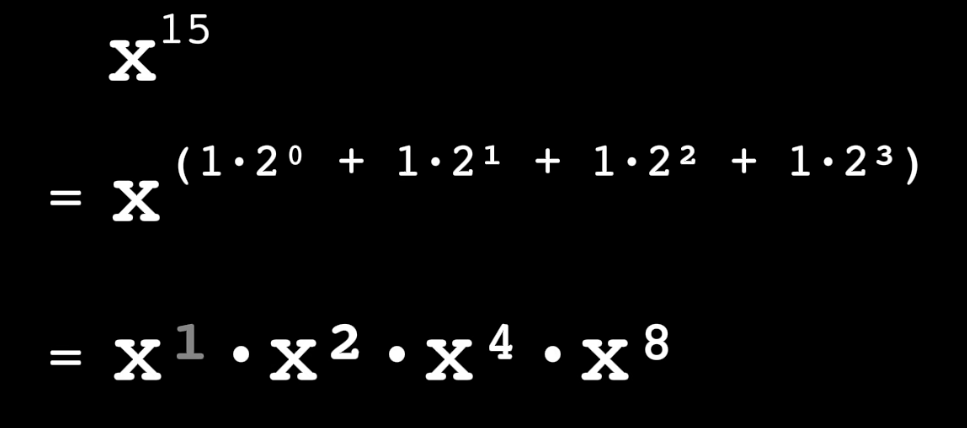
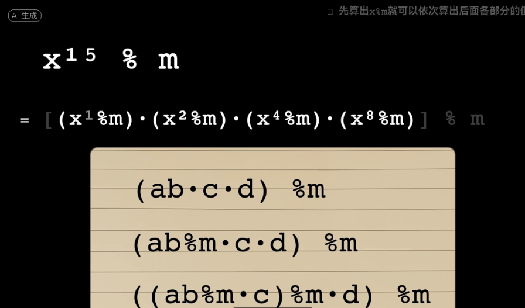

Statemind算法题目:

# 题目1：快速幂取模

1. 找到下面 `binаry exponentiation with mоdulо`的函数bug

```python
def bin_pow(x,y,mod):
    v = x
    res = 0  # <- res = 1
    if y & 1: # 如果最低为1，则设置res = 1
        res = 1
    else:
        res = x
    y<<=1 #一定错 
    while y > 0:
        v = v * v  #一定错，本来就是简化算法，这一下又多一个overflow的点
        if y & 1: #一定错，顺序都弄反了，肯定是先算第一个
            res = (v * res) % mod
        y = y >> 1
    return res
```

以上是一种经典`x**y mod m`的算法，又叫 **“快速幂取模”**。它利用 “分治” 和 “指数二进制拆分” 的思想，将指数运算从 O(y) 降到 O(log y)，同时在每一步都做模运算以控制中间结果规模。


其作用就是算`x**y mod m`，而幂取模常在加密算法，如RSA加密中使用，一般都是X非常大，要快速算出结果。比如123**1234，不用这种算法根本算不出来，这也只是一共7位数。


- 算法核心

对于一个梅森数（全是1的二进制数）如`x^15`有以下拆分法



由于后面的数总是前面数的二次方，所以当算出`x % m`时，`x^2 %m = (x %m * x %m)%m`, 而 `x^4 =(x^2 %m * x^2 %m) %m `，以此类推，将非常大位数的计算变成了m对应的上限位数的计算




```javascript
/**
 * base : 底数
 * exp  : 指数
 * mod  : 模数
 */
function modExp(base, exp, mod) {
    let result = 1;
    base = base % mod; //得到x % m
    while (exp > 0) {//比如 exp =15
        result = (result * base) % mod;
        base = (base * base) % mod;

        exp = exp >> 1; // Math.floor(exp / 2); 右移一位
    }

    return result;
}
```

对于非梅森数（有0的二进制数），如`x^13`，其实就是中间一项指数为0


```javascript
/**
 * base : 底数
 * exp  : 指数
 * mod  : 模数
 */
function modExp(base, exp, mod) {
    let result = 1;
    base = base % mod; //得到x % m
    while (exp > 0) {
+       if(exp%2 ==1 )//取模与整除中可知，这段是为了判断当前二进制数的最低位是0还是1，是1则继续否则跳过
    { 
       result = (result * base) % mod;
      }

        base = (base * base) % mod;

        exp = exp >> 1; // Math.floor(exp / 2); 右移一位
    }

    return result;
}
```


## 基础回顾

- **二进制与幂的关系**

如果我们看5432这个十进制的数，其实它等同于`5432=5e3 + 4e2+ 3e1 + 2e0`

都是 具体数字乘以10^(位数-1)。

对于其他进制，包括二进制数也是一样，比如二进制数据`1101`其实等同于：

`1101 = 1x2**3 + 1x2**2 + 0x2**1 + 1x2**0`

对应的十进制就是`1x2**3 + 1x2**2 + 0x2**1 + 1x2**0 = 8+4+1 = 13`


- **取模与整除**

对于取模，在十进制中，1234%10 = 123 ...4，整除10相当于砍掉最后一位，取模则是得到最后一位

对于其他进制，比如八进制数 231%8 = 23 ...1，也是砍掉最后一位，取模得到最后一位。

二进制也一样，十进制数1234%2相当于得到二进制最后一位，1234/2是去掉二进制的最后一位。

即1234的二进制

`10011010010 / 2  = 1001101001` 等价于让x=1234 , x>>1，右移1

`10011010010 % 2  = 0`

那么，按照二进制与幂的关系，我们就能将一个二进制数转为幂运算`1x2**3 + 1x2**2 + 0x2**1 + 1x2**0`的形式，

其算法就是用模取最后一位后，再右移取下一位的模，以此来取每个位置上的二进制数值是1还是0。

- **模运算分配律**

对于任意 `(a*b*c...*x)% m`，将模运算提前在括号内进行一次或多次，与原结果一样。

比如`(7*2)% 4 = (7%4 *2)%4 = (7%4 *2%4)%4 =2`


# 题目2
You are given a tree represented in the illustration. Your task is to transform this tree into a bamboo, which is a tree where each node has a degree of at most 2, using the minimum number of edge replacements.

An edge replacement is defined as the operation where you:

* remove one existing edge

* insert a new edge

What is the minimum number of edge replacements required to convert the given tree into a bamboo?

Here is the tree structure in mermaid

graph TD;
A --> B;
A --> C;
A --> D;
B --> E;
B --> F;
B --> G;
C --> H;
C --> I;
C --> J;
D --> K;
D --> L;
D --> M;


# 题目3
Let's suppose that in a parallel universe, the mining difficulty was set to 1 at block #892539. In this universe, all other block data (the previous block’s hash, the set of transactions, timestamp, version) remains the same as in our own. Your goal is to mine block #892539 under these conditions. What would be the minimal possible nonce of this block be in the parallel universe?

# 题目4
How many numbers between 0 and hash of 22222222 block in Ethereum (inclusive) have symmetrical hexadecimal representations?

# 题目5
Given three Uniswap V2 liquidity pools, each with a 0.3% swap fee, and the following reserves (without decimals):

Pool 1: USDC 100k / DAI 130k

Pool 2: DAI 130k / USDT 100k

Pool 3: USDT 70k / USDC 100k

Determine the maximum profit in USD that can be earned from a single arbitrage transaction.

Assume the arbitrage is performed using a flashloan, meaning the transaction must form a closed loop (start and end with the same token).

Assume all tokens (USDC, DAI, USDT) are worth exactly $1 and ignore gas and flashloan fees.