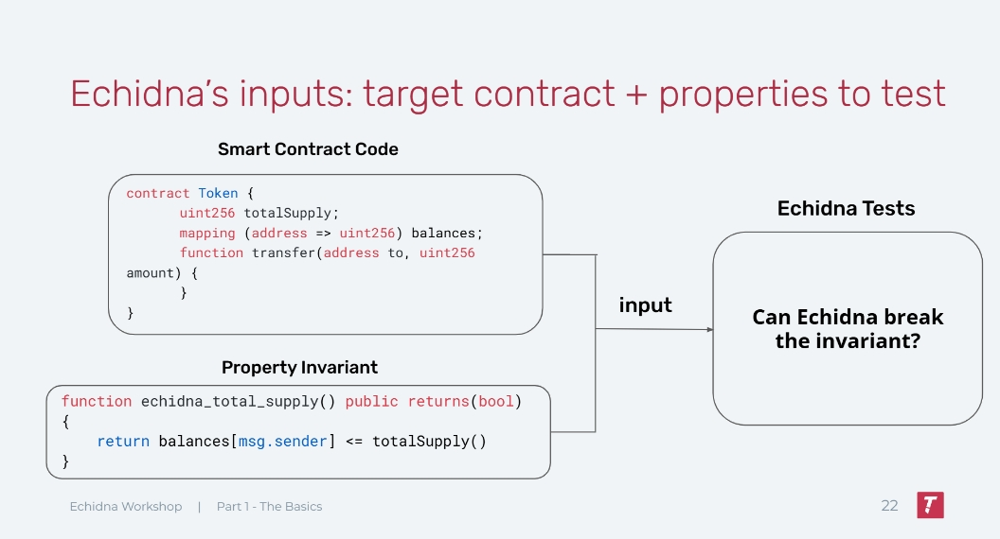
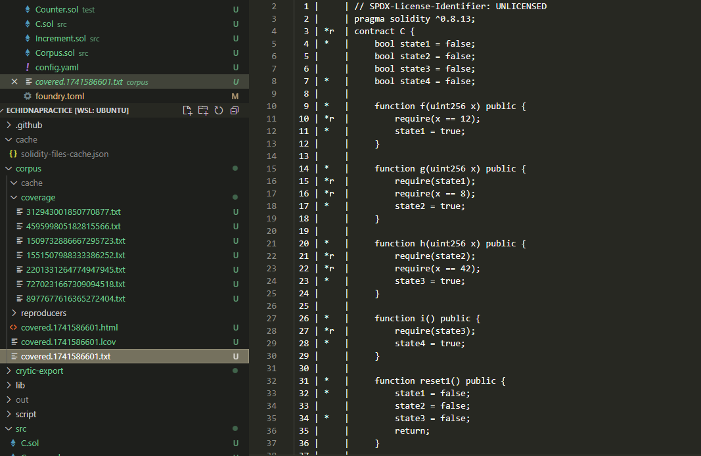
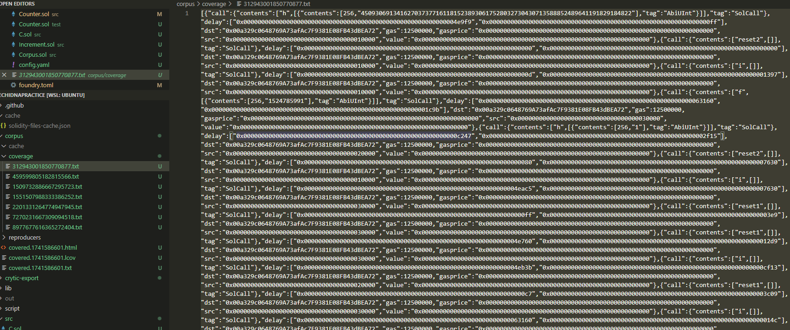

# Echidna，从入门到入土

[TOC]

为理解本文，你至少需要有以下方面的基本技能：

1. 掌握Solidity（毫无疑问）
2. 掌握Foundry的基本测试知识
3. 了解Fuzzing是什么，什么是Stateless Fuzzing，什么是stateful Fuzzing
4. 了解一些基本的Defi知识（如AMM，LP，staking等）

## 1. Echidna介绍

- **什么是Echidna**

Echidna是一个专注于Fuzzing的实用工具，也是一般审计合约时最常使用的工具之一，相比Foundry，它在进行stateful fuzzing的时候会更加方便和实用。本教程会更加深入echidna在不同的场景需求下的实际操作流程，此教程仅结合我个人知识和经验，若有不足或疏漏的地方，欢迎随时提出意见。

官方参考文档：[Echidna](https://secure-contracts.com/program-analysis/echidna/index.html)


- **Echidna如何工作的？**

Echidna通过你提供的合约代码和你写的Invariant作为输入，来在一个个sequence中尝试打破你的invariant。值得注意的是echidna默认就是stateful fuzzing的模式，这也意味着每个sequence中都是一笔笔真实而随机的函数调用。





- **与Foundry的初步对比**

如果你没用过，或者不熟悉foundry的fuzzing方法，Cyfrin有一个非常棒的Repo介绍了foundry的stateful fuzzing 和stateless fuzzing的区别，以及实际用法：

[Invariant-break](https://github.com/Cyfrin/sc-exploits-minimized/blob/main/src/invariant-break/README.md)

Stateless fuzzing过于简单，这里就不作介绍，我们主要对比stateful fuzzing。

在Foundry中，一个简单的stateful fuzzing会类似下面代码结构：

```solidity
//Target合约：
contract StatefulFuzzCatches{
    uint256 public myValue = 1;
    uint256 public storedValue = 100;
    // Invariant: This function should never return 0
    function doMoreMathAgain(uint128 myNumber) public returns (uint256) {
        uint256 response = (uint256(myNumber) / 1) + myValue;
        storedValue = response;
        return response;
    }
    function changeValue(uint256 newValue) public {
        myValue = newValue;
    }
}
    
// 测试合约继承Test,并引入myContract合约
contract testMyContract is Test {
    // Setup，创建实例并且锁定fuzz合约对象
    function setUp() public {
        sfc = new StatefulFuzzCatches();
        targetContract(address(sfc));
    }

    // StatefulFuzz或者invariant作为前缀关键词
    function statefulFuzz_testMathDoesntReturnZero() public view {
        assert(sfc.storedValue() != 0);
    }
}   
// forge test --mt statefulFuzz_testMathDoesntReturnZero 启动！
```

<br/>

而Echidna也类似，你会在文件中创建一个测试合约`testtoken.sol`

```solidity
//Target合约：
contract Token {
    mapping(address => uint256) public balances;

    function airdrop() public {
        balances[msg.sender] = 1000;
    }

    function consume() public {
        require(balances[msg.sender] > 0);
        balances[msg.sender] -= 1;
    }

    function backdoor() public {
        balances[msg.sender] += 1;
    }
}

//echidna的测试合约，一般需要继承原合约，并以constructor作为setUp
contract TestToken is Token {
	///不需要创建实例和锁定合约对象，继承之后echidna就对Token合约中的函数随便点点点
    constructor() public {}

    function echidna_balance_under_1000() public view returns (bool) {
        return balances[msg.sender] <= 1000;
    }
}
//echidna testtoken.sol --contract TestToken 启动！
```

从上面的代码中我们可以看见foundry 和echidna在stateful fuzz中的区别，这只是一个非常简单的初步案例，作为一个大体的印象。下面的内容我们会深入探讨更多关于echidna的细节。

<br/>

### 1.1 测试模式

Echidna有许多测试模式，包括：

1. **Property Mode**: 无参数输入的stateful fuzzing测试模式
2. **Assertion Mode**:有参数输入的stateful fuzzing测试模式
3. **Dapptest**:有参数输入的，包含类似foundry assume作弊码的stateless fuzzing测试
4. **Overflow Mode**:专注于Overflow的assertion模式，它只会在出现溢出时才会报告错误
5. **Optimization Mode**:用于求极值的模型，函数会尽可能输出一个最大值
6.  **Exploration Mode**:自动模式，不需要添加任何Invariant，该模式将会自动以test coverage最大化进行测试

本章中，我们会着重介绍前两个模式，因为这两个模式也是我们在实操中经常使用的模式。

<br/>

#### Property Mode

Property模式是Echidna的默认模式，我们在上面和foundry做对比时写的函数`echidna_balance_under_1000()`其实就使用的该模式。

```solidity
    function echidna_balance_under_1000() public view returns (bool) {
        return balances[msg.sender] <= 1000;
    }
```

此模式有以下几个特点:

- 需要有识别前缀（默认echidna_），前缀名称可以在echidna配置文件中修改
- 该函数永远return bool，且没有任何输入值
- 在最后执行Property函数后，之前所有对合约执行的状态都会初始化，再进行下一个sequence
- 如果property函数return true则表示为测试通过，如果property函数中出现revert或者返回false则会被视为失败并报告。
- 对于期望有revert的测试（类似foudry中的`expectRevert`）使用echidna_revert前缀，将会使property函数模式出现改变，此时只有函数出现revert才会视为成功，反之都会视为失败。

下面是官方给出的代码总结此模式的用法:

```solidity
function echidna_property() public returns (bool) { // No arguments are required
  // The following statements can trigger a failure if they revert
  publicFunction(...);
  internalFunction(...);
  contract.function(...);

  // The following statement can trigger a failure depending on the returned value
  return ...;
} // side effects are *not* preserved

function echidna_revert_property() public returns (bool) { // No arguments are required
  // The following statements can *never* trigger a failure
  publicFunction(...);
  internalFunction(...);
  contract.function(...);

  // The following statement will *always* trigger a failure regardless of the value returned
  return ...;
} // side effects are *not* preserved
```

<br/>

#### Assertion Mode

Assertion模式也是最常用的一种模式，它主要使用`assert(condition)`来进行判断，assertion模式支持参数输入。Assertion有两种情况会报告测试失败：

1. **执行 `assert()` 时发生revert或者false**：当代码执行到 `assert` 这个操作的时候，如果它出现了revert或者false，Echidna 就会检测到并认为这是一个断言失败。值得注意的是，只有执行`assert()`时出现的问题echidna才会报错，而包含`assert()`函数本身在`assert()`前后出现的任何错误都不会被考虑在内，如果需要考虑可以试着用try-catch写法，比如：

```solidity
function checkAssertion(...) public {
  require(...)//require产生的回退并不会报告错误
  
  try token.transferFrom(...)//如果不使用try catch，assert只能捕捉转账成功的错误路径
  {assert(...)}
  catch(bytes memory err)
  {assert(false)}//转账失败，我们需要echidna报告原因err
}

```

<br/>

2. **任何合约发出 `AssertionFailed` 事件**：只要有合约发出了 `AssertionFailed` 这个事件，不管它带了多少个参数，Echidna 都会报告断言违规。例如，合约里有个函数，在某些特定条件下会发出 `emit AssertionFailed(...)` 这样的代码，一旦这个事件被发出，Echidna 就会认为出现了断言违规的情况。

下面是官方给出的代码总结此模式的用法:

```solidity
function checkInvariant(...) public { // Any number of arguments is supported
  // The following statements can trigger a failure using `assert`
  assert(...);
  publicFunction(...);
  internalFunction(...);

  // The following statement will always trigger a failure even if the execution ends with a revert
  emits AssertionFailed(...);

  // The following statement will *only* trigger a failure using `assert` if using solc 0.8.x or newer
  // To make sure it works in older versions, use the AssertionFailed(...) event
  anotherContract.function(...);

} // side effects are preserved
```

除此之外，还有几个assertion模式的特点：

- 测试函数不需要任何前缀，但是需要在配置文件或者CLI中明确assertion mode才能进行。
- 包含`assert()`函数会被像一般函数一样被执行，这也就意味着此函数通过后，之前的状态不会像property函数一样被删除，而是会继续保存。
- 如果原合约中有`assert()`函数，它也会被用起来做判断依据。这个可能会造成一些障碍，比如目标合约中包含了以下函数，就会出现一些没必要的failure：

```solidity
function deposit(uint256 tokens) public {
  assert(tokens > 0); // echidna输入0时就会报错，但是这个并不能算bug，
  					 //开发者应该尽量使用require/if-else作为判断
  ...
}
```

Assertion 模式在多数复杂场景下非常实用，对于function-level的invariant，**Pre-condition**+**Action**+**Post-condition-cheks**模式是一种非常高效和清晰的结构：

```solidity
function testStake(uint256 toStake) public {///测试一个stake质押token的函数
    uint256 balance = balanceOf(msg.sender);
    toStake = toStake % (balance + 1);///参数限制：固定toStake的数量不超过balance，保证测试的质量
    
    if (toStake < MINSTAKE) return; // Pre-condition: 保证发生的token大于最低限制的要求
    
    stake(msg.sender, toStake); // Action: token staking
    
    assert(staked(msg.sender) == toStake); // Post: staking amount is toStake
    assert(balanceOf(msg.sender) == balance - toStake); // Post: balance decreased
}

```

这里的关键其实在于合理的参数限制和precondition，如果参数未经限制，echidna很容易会在balance数量上revert，从而浪费很多时间；如果pre-condition未经妥善限制，则echidna便会在minstake的判定中revert，而这两种情况都不利于我们寻找潜在bug。

<br/>

### 1.2 Testing Method & Coverage

#### Internal Testing

在我们之前介绍的测试中，一般是通过继承原合约，再写Invariant进行测试，比如之前的代码：
```solidity
//Target合约：
contract Token {
    mapping(address => uint256) public balances;

    function airdrop() external {
        balances[msg.sender] = 1000;
    }

    function consume() internal {
        require(balances[msg.sender] > 0);
        balances[msg.sender] -= 1;
    }

    function backdoor() interal {
        balances[msg.sender] += 1;
    }
}

//echidna的测试合约，一般需要继承原合约，并以constructor作为setUp
contract TestToken is Token {
	///不需要创建实例和锁定合约对象，继承之后echidna就对Token合约中的函数随便点点点
    constructor() public {}

    function echidna_balance_under_1000() public view returns (bool) {
        return balances[msg.sender] <= 1000;
    }
}
//echidna testtoken.sol --contract TestToken 启动！
```

在这里，我们继承了Token合约，而这种测试方式被定义为**internal testing**

**Internal Testing**有以下的优点和缺点：

**优点：**

- 简单设置，快速测试

- 可以对内部函数进行单点测试，并且也可以快速测试所有public/external函数

- 多个msg.sender的状态可以被保存

  > echidna有三个模拟账户轮番进行函数调用，他们的地址分别是`0x10000`，`0x20000`，`0x30000`，其中`0x30000`会call合约的constructor，之后随机轮番调用。
  >
  > 每个msg.sender在调用函数后有着不同的状态，提高了某些bug发现的概率。

<br/>

**缺点**：

- 对于复杂系统并不是那么高效，最适合的是那些只有少量入口的系统

  > 对于有着许多个合约文件的系统，同时又依赖许多外部合约和oracle的系统，这会变得相当复杂。
  >
  > 比如，你现在只想测试系统中一个合约A的某个函数X，但是继承合约A后，A的constructor中要填入呼应的合约B,C,D的地址，而new出来合约B,C,D也会像建立合约A一样，需要constructor中填入一堆合约地址，oracle合约地址，oracle合约又要弄个mock，如果依赖uniswap之类的外部合约也需要mock，甚至是fork主网来测试。
  >
  > 但是你最初只是需要测试A合约的X函数，如果E合约还有个函数Y要测试，你又要重新经历这种痛苦的过程。
  >
  > 但是，对于只有一个或者非常有限入口的系统，这种setup是可以接受的，毕竟你只需搭建一次就好。

<br/>

#### External Testing

如果你看完了[Invariant-break](https://github.com/Cyfrin/sc-exploits-minimized/blob/main/src/invariant-break/README.md)或者[foundryBook](https://book.getfoundry.sh/forge/invariant-testing)中对handler-base Testing中的内容，你可能发现foudry会需要建立一个handler合约，来通过fuzzer调用handler来间接调用目标合约的函数。

类似的，echidna的external testing中也会应用一个中间合约，来进行一系列的setup和测试函数的撰写，之后我们使用echidna调用这个中间合约来实现对目标合约的测试。具体可以参考[Echidna_Examples](https://github.com/CoheeYang/SmartContract-Vulnerabilities/blob/main/Tooling/Echidna_Example)中的例子

而external testing的模式会有以下**优缺点：**

**优点**

- 对于之前说的复杂系统来说，这一点比较可接受，因为你只需要对中间人合约进行setup，并以此基础搭积木就好
- 这也是实操中最常使用的方法

**缺点**

- set up的过程会很繁琐
- 由于是通过中间合约间接调用的，你并没有很多msg.sender的状态（这个问题可以通过再创建代理合约来call解决）

<br/>

关于更多foundry和echidna(medusa)的test suite对比以及test之间的转化可以参考：

https://github.com/devdacian/solidity-fuzzing-comparison/tree/main

<br/>

#### Testing Coverage

Echidna有一个非常强大的功能，语料库（Corpus），它能够自动记录每次测试的执行轨迹和覆盖情况（coverage）数据。为了生成corpus，你需要在配置文件中添加`corpusDir: <name-of-dirctory>`

此时测试完成后将产生两类关键文件：
• `covered.xxx.txt`：详细代码覆盖率报告
• `xxx.txt`：函数调用路径记录文件

下图是一个`covered.xxx.txt` 文件的案例；在这里，文件会清楚地告诉你哪些函数的多少行在测试中被cover了，哪些没有。



在覆盖率报告中，Echidna使用以下标记系统指示代码执行状态：

| 标记 | 含义说明                       | 典型场景                |
| ---- | ------------------------------ | ----------------------- |
| `*`  | 正常执行路径                   | 成功执行的代码行        |
| `r`  | 执行时触发回滚操作             | require/revert 语句触发 |
| `o`  | Gas耗尽导致执行中断            | 循环逻辑中的Gas消耗异常 |
| `e`  | 运行时错误（除零、断言失败等） | 算数运算错误            |

这项Coverage的报告对于各种测试非常有用，以便于我们在测试通过时能够确认，**这些代码是真实被运行后通过了测试，而不是因为某种原因被跳过后通过了测试**

<br/>

此外，Corpus也会在coverage的文件夹中生成`xxx.txt`文件，这些文件就是过去echidna在调用函数时产生的路径，这个路径包括了call了什么函数，call函数的参数是多少。



<br/>

而这些路径放入json文件中格式化大概长这个样子（以函数`function1(uint256,uint256,uint256,uint256)`为例）：

```json
[
    {
        "_gas'": "0xffffffff",
        "_delay": ["0x13647", "0xccf6"],
        "_src": "00a329c0648769a73afac7f9381e08fb43dbea70",
        "_dst": "00a329c0648769a73afac7f9381e08fb43dbea72",
        "_value": "0x0",
        "_call": {
            "tag": "SolCall",
            "contents": [
                "function1",  //echidna所call的函数名
                [
                    {
                        "contents": [
                            256,//第一个参数类型uint256
                            "93723985220345906694500679277863898678726808528711107336895287282192244575836"//第一个参数的值
                        ],
                        "tag": "AbiUInt"
                    },
                    {
                        "contents": [256, "334"],//第二个输入参数的类型和值
                        "tag": "AbiUInt"
                    },
                    {
                        "contents": [
                            256,
                            "68093943901352437066264791224433559271778087297543421781073458233697135179558"
                        ],//第三个输入参数的类型和值
                        "tag": "AbiUInt"
                    },
                    {
                        "tag": "AbiUInt",
                        "contents": [256, "332"]//第四个输入参数的类型和值
                    }
                ]
            ]
        },
        "_gasprice'": "0xa904461f1"
    }
]
```

在这里有一个值得注意的技巧，**定向测试参数设置**，就是当遇到函数中有难以触发的参数组合时，你可以通过修改corpus中的值，来保证下次运行时能快速运行指定的参数，特别适用于边界条件测试和复杂参数组合场景，具体见：[collecting corpus](https://github.com/crytic/building-secure-contracts/blob/master/program-analysis/echidna/advanced/collecting-a-corpus.md)

<br/>

## 2. Echidna实操

### 2.1 Echidna的能力边界

Echidna虽然在多数情况的statefull fuzzing会比foundry更加顺手，但是它确实也有一定的能力边界，以下**缺点**是你必须值得注意的：

1. 有限的cheat-code
2. 对部分lib的支持不足

 <br/>

#### 有限的cheat-code

不同于foundry丰富到爆炸的cheat-code，echidna所支持的cheat-code明显略逊一筹，甚至在某些场景都不够用。

Echidna从2.05版本之后支持了cheat-code，虽然和foundry一样，是基于[HEVM](https://github.com/ethereum/hevm)的cheat-code，但是foundry在此之上也另外添加了更多功能，比如`hoax()`和给代币充值的`deal()`等等，而目前Echidna 2.2.6版本并没有此种功能。

而echidna则只有原有的HEV所支持的cheat-code，而且应用需要先写出interface，再实例化一个hevm对象进行（类似vm.xxx），比如下方的`prank`

````solidity
interface IHevm {
    function prank(address) external;
}

contract TestPrank {
  address constant HEVM_ADDRESS = 0x7109709ECfa91a80626fF3989D68f67F5b1DD12D;//keccak("hevm cheat code")
  IHevm hevm = IHevm(HEVM_ADDRESS);
  Contract c = ...

  function prankContract() public payable {
    hevm.prank(address(0x42424242);
    c.f(); // `c` will be called with `msg.sender = 0x42424242`
  }
}
````

更多支持的cheatcode请参考[HEVM cheatcode]([https://hevm.dev/controlling-the-unit-testing-environment.html#cheat-codes](https://hevm.dev/std-test-tutorial.html#supported-cheat-codes).)

echidna官方也提供了[HEVM接口](https://github.com/crytic/properties/blob/main/contracts/util/Hevm.sol)可以帮我们快速使用HEVM的功能

有限的CheatCode带来了很多问题；比如最常见的是，如果你要fork测试一个和Uniswap v3对接的资产管理相关的协议，那么很自然的你会需要fork uniswap v3的代币池和相关代币的状态，但你测试时却没有给代币充值的作弊码，导致你测试中的角色根本没有token进行测试。

**关于这个问题，一个比较有用的解决思路是**：由于给ETH充值的deal()还是支持的，所以我们需要将ETH转为WETH（对WETH合约进行deposit后会根据`msg.sender`的数量mint对应的WETH），之后将WETH再通过Uniswap router转为其他代币。

比如说下面的hardhat代码，将WETH转为了DAI,然后进行了对应的测试(详见[mixbytes-blog](https://mixbytes.io/blog/fuzzing-smart-contracts-practical-aspects-echidna))：

```solidity
pragma solidity ^0.7.6;
pragma abicoder v2;

import "./interfaces.sol";
import '@uniswap/v3-core/contracts/interfaces/IUniswapV3Factory.sol';                                                           
import '@uniswap/v3-core/contracts/interfaces/IUniswapV3Pool.sol';                                                               
import '@uniswap/v3-core/contracts/interfaces/IERC20Minimal.sol';                                                   
import '@uniswap/v3-periphery/contracts/interfaces/ISwapRouter.sol';
import '@uniswap/v3-periphery/contracts/libraries/PoolAddress.sol';
import '@uniswap/v3-periphery/contracts/base/LiquidityManagement.sol'; 
import '@openzeppelin/contracts/token/ERC721/IERC721Receiver.sol';

interface IWETH {
    receive() external payable;
    function deposit() external payable;
    function withdraw(uint256 wad) external;
    function transfer(address to, uint256 value) external returns (bool);
    function balanceOf(address account) external view returns (uint256);
}


contract FuzzingTest2 {

    address payable public constant WETH = payable(0xC02aaA39b223FE8D0A0e5C4F27eAD9083C756Cc2);//ETH MAINNET
    address public constant DAI = 0x6B175474E89094C44Da98b954EedeAC495271d0F;
    
    IUniswapV3Factory public constant factory = IUniswapV3Factory(address(0x1F98431c8aD98523631AE4a59f267346ea31F984));
    ISwapRouter public constant uniswapRouter = ISwapRouter(address(0xE592427A0AEce92De3Edee1F18E0157C05861564));
    
    IUniswapV3Pool pool;
    uint24 public constant POOL_FEE = 3000;

    uint24 tickDiff = 0;
    // uint256 profitWETH = 0;
    uint256 liquidityPutWETH = 0;
    uint256 relativeProfit = 0;
    
    function get_ticks_range(int24 _curtick, uint24 _tickDiff) private pure returns(int24 startTick, int24 endTick) {
        startTick = _curtick - (_curtick % 60) - int24(_tickDiff - (_tickDiff % 60));
        endTick = _curtick - (_curtick % 60)  + int24(_tickDiff - (_tickDiff % 60));
    }

    function uniswapV3MintCallback(                                                                                                    
        uint256 amount0Owed,                                                                                                           
        uint256 amount1Owed,                                                                                                           
        bytes calldata data                                                                                                            
    ) external { 
        IDAI(DAI).transfer(msg.sender, amount0Owed);
        IWETH(WETH).transfer(msg.sender, amount1Owed);
    }        

    constructor() payable {
       pool = IUniswapV3Pool(factory.getPool(WETH, DAI, POOL_FEE));
    }

    function univ3_fuzzing_test(uint24 _tickDiff) payable public {
        require(_tickDiff <= 360);
        
        liquidityPutWETH = 0;
        relativeProfit = 0;
        tickDiff = _tickDiff;

        // in Echidna config we put 100 ETH on the contract's balance
        // in Hardhat we send enough ETH to the contract in the test
        IWETH(WETH).deposit{ value: 100 ether}();
        IWETH(WETH).approve(address(uniswapRouter), 100 ether);
        uint256 actualDAIOutput = uniswapRouter.exactInputSingle( 
            ISwapRouter.ExactInputSingleParams(
                WETH,
                DAI,
                POOL_FEE,
                address(this),
                block.timestamp,
                50 ether,
                1,
                0
            )
        );

        put_liquidity(IWETH(WETH).balanceOf(address(this)) / 2);
        perform_swaps();
        put_liquidity(1); // need to put liquidity to recalculate fees
        collect_rewards();
    }
    

    function put_liquidity(uint256 _amountOfWETHToPut) private {
        
        // determine tics where to put liquidity
        (uint160 sqrtPriceX96, int24 curtick, , , , , ) = pool.slot0();
        (int24 startTick, int24 endTick) = get_ticks_range(curtick, tickDiff);

        // calculate the needed liquidity amount 
        uint160 sqrtRatioAX96 = TickMath.getSqrtRatioAtTick(curtick);
        uint160 sqrtRatioBX96 = TickMath.getSqrtRatioAtTick(endTick);
        uint128 liquidity = LiquidityAmounts.getLiquidityForAmounts(
            sqrtPriceX96,
            sqrtRatioAX96,
            sqrtRatioBX96,
            _amountOfWETHToPut,
            IDAI(DAI).balanceOf(address(this))
        );

        bytes memory callbackdata = new bytes(0);
        (uint256 amount0, uint256 amount1) = pool.mint(
            address(this),
            startTick,
            endTick,
            liquidity,
            callbackdata
        );
        liquidityPutWETH += amount0;
        // console.log("[MINT] Minted %s liquidity for amounts, WETH: %s, DAI: %s", liquidity, amount0, amount1);
        
    }
 
    function perform_swaps() private {
        // STEP 4. perform the swap (LP receives a profit)
        uint256 inTokens = IDAI(DAI).balanceOf(address(this));
        IDAI(DAI).approve(address(uniswapRouter), inTokens);
        
        uint256 output = uniswapRouter.exactInputSingle( 
            ISwapRouter.ExactInputSingleParams(
                DAI,
                WETH,
                POOL_FEE,
                address(this),
                block.timestamp,
                inTokens,
                1,
                0
            )
        );
        // // console.log("   [SWAP] %s DAI swapped to %s WETH", inTokens, output);

        inTokens = IWETH(WETH).balanceOf(address(this));
        IWETH(WETH).approve(address(uniswapRouter), inTokens);
        output = uniswapRouter.exactInputSingle( 
            ISwapRouter.ExactInputSingleParams(
                WETH,
                DAI,
                POOL_FEE,
                address(this),
                block.timestamp,
                inTokens,
                1,
                0
            )
        );
        // // console.log("   [SWAP] %s WETH swapped to %s DAI", inTokens, output);

        inTokens = IDAI(DAI).balanceOf(address(this)) / 2;
        IDAI(DAI).approve(address(uniswapRouter), inTokens);
        output = uniswapRouter.exactInputSingle( 
            ISwapRouter.ExactInputSingleParams(
                DAI,
                WETH,
                POOL_FEE,
                address(this),
                block.timestamp,
                inTokens,
                1,
                0
            )
        );
        // // console.log("   [SWAP] %s DAI swapped to %s WETH", inTokens, output);
    }

    function collect_rewards() private {
        
        (uint160 sqrtPriceX96, int24 curtick, , , , , ) = pool.slot0();
        (int24 startTick, int24 endTick) = get_ticks_range(curtick, tickDiff);

        bytes32 position_key = keccak256(abi.encodePacked(address(this), startTick, endTick));
        (,,, uint128 tokensOwed0, uint128 tokensOwed1) = pool.positions(position_key);
        
        // calculate profit as simple amount of received WETH tokens
        relativeProfit = tokensOwed1 * 10**18 / liquidityPutWETH;
        // console.log("[COLLECT] %s WETH for %s tickDiff", tokensOwed1, tickDiff);
        // console.log("[COLLECT] relative profit: %s", relativeProfit);
    }


    function echidna_optimize_returned_rewards() public view returns (uint256) {
        // which % of liquidity was returned as profit
        return relativeProfit;
    }

}
```

但是这可能需要你去uniswap找你想换的token的pool地址，如果你知道链上有某个地址已经有满足量的token，你也可以去直接尝试用它的地址，之后去prank该地址即可。

如果你认为这种方法太麻烦，也可以尝试直接拿uniswap合约mock出来一个dex交易所+mock代币合约，而不是直接fork以太坊上的合约状态。

（我也曾经试过直接让我的echidna合约继承forge-std中有充值token的`deal()`函数的文件StdCheats.sol，但是我尝试后失败了，如果有尝试其他有效且更快方法的朋友欢迎PR）

<br/>

#### 对部分lib的支持不足

这个是echidna官方说明过的问题，对于含有external函数的lib，如果会在你的echidna合约中被使用，且最终会被编译，都会直接失败报错`unlinked lib`，此时你需要在配置文件中声明以下内容：

```yaml
//以ConvertLib这个lib为例
deployContracts: [["0x1f", "ConvertLib"],["0x2f","lib2"]]//先指定lib部署的地址0x1f
cryticArgs: ["--compile-libraries=(ConvertLib,0x1f),(lib2,0x2f)"]//将lib和编译器Link
```

```solidity
library ConvertLib{
	function A() internal {...}//如果只有这个没事，solidity会直接将他作为原合约bytecode的一部分一起编译部署，不需要在yaml文件中声明上述内容
	function B() external {...}//lib中有了external，根据solidity的特性，需要让echidna部署到一个地址，就像其他正常合约一样，之后原合约call这个lib
}
```

具体参考官方文档：[external-lib](https://secure-contracts.com/program-analysis/echidna/advanced/working-with-libraries.html)

这个问题还是比较傻逼的，因为你可能并没有直接使用或者import任何一个lib，但是你import的合约中却使用了一个含external函数的lib；如果依赖很多，这可能会让你找半天这个lib到底叫啥，而且echidna并不会告诉你这个lib的任何有效信息，所以切记这一点。

<br/>

但是解决方法还是有的，只需要你创建一个shell文件，并提前运行该sh文件将目标路径下的lib文件中external/public全部替换为internal函数即可

```bash
#!/usr/bin/env bash

# Directory containing the files
directory_path="silo-core/contracts/lib"

# Word replacement配置
old_word1="external"
new_word1="internal /*ori_ext*/"  # 无需转义注释符号，sed 分隔符已用 @
old_word2="public"
new_word2="internal /*ori_pub*/"

# 遍历文件，确保处理所有 .sol 文件
find "$directory_path" -type f -name "*.sol" | while read -r file; do
    echo "Modifying file: $file"
    # 使用 @ 作为分隔符，避免路径中的 / 干扰
    sed -i.bak "s@${old_word1}@${new_word1}@g" "$file"
    sed -i.bak "s@${old_word2}@${new_word2}@g" "$file"
    # 删除备份文件（若不需要备份）
    rm -f "${file}.bak"
done

```

`./silo-core/scripts/echidnaBefore.sh`命令窗口运行文件即可将所有相关的external/public改为internal


### 2.2 Test Invariant like Pro

#### 2.2.1 Toolings

##### Fuzzing脚手架

不论你测试哪个项目，你都会经历一个非常重复性的工作：setup。

同时，不同测试工具（foundry/medsua/echidna）之间的切换也是个非常痛苦的过程。

[Recon](https://getrecon.xyz/dashboard/build)提供了一个有效的脚手架工具解决了以上的两个痛点；Recon通过你将文件的ABI文档复制到Recon-build-your-handler网页来输出一个结构化测试脚手架；

它需要[chimera](https://github.com/Recon-Fuzz/chimera)，一个非常简单的模板工具，作为依赖。对于简单项目以及部分新手，Recon的结构提供了一个有效的模块化思路。

而输出的主要由以下几个文件构成:

`Setup.sol`--->将你的合约写写在这里，并进行setup

```solidity

// SPDX-License-Identifier: GPL-2.0
pragma solidity ^0.8.0;

import {BaseSetup} from "@chimera/BaseSetup.sol";

import "src0";

abstract contract Setup is BaseSetup {

    Proposal proposal;

    function setup() internal virtual override {
      proposal = new Proposal(); // TODO: Add parameters here
    }
}

```

<br/>

`BeforeAfter.sol`--->继承Setup，并会找到所有`view`函数，放在一个struct中，同时放在`__before()`和`__after()`两个函数中，通过调用这两个函数，对比before和after两个struct中的内容。

```solidity

// SPDX-License-Identifier: GPL-2.0
pragma solidity ^0.8.0;

import {Setup} from "./Setup.sol";

abstract contract BeforeAfter is Setup {

    struct Vars {
        uint256 __IGNORE_AVOID_COMPILE_ERROR;
        address proposal_getCreator;//view函数1

        uint256 proposal_getTotalAllowedVoters;//view函数2

        bool proposal_isActive;////view函数3

    }

    Vars internal _before;
    Vars internal _after;

    function __before() internal {
        _before.proposal_getCreator = proposal.getCreator();
        _before.proposal_getTotalAllowedVoters = proposal.getTotalAllowedVoters();
        _before.proposal_isActive = proposal.isActive();
    }

    function __after() internal {
        _after.proposal_getCreator = proposal.getCreator();
        _after.proposal_getTotalAllowedVoters = proposal.getTotalAllowedVoters();
        _after.proposal_isActive = proposal.isActive();
    }
}

```

<br/>

`Properties.sol`--->继承`BeforeAfter`，这里你可以写你的properties。

```solidity

// SPDX-License-Identifier: GPL-2.0
pragma solidity ^0.8.0;

import {Asserts} from "@chimera/Asserts.sol";
import {BeforeAfter} from "./BeforeAfter.sol";

abstract contract Properties is BeforeAfter, Asserts {

	///property_x() public view returns(bool){
	//	__before();
	//  __after();
	//return(...)
	//}
}

```

<br/>

`TargetFunctions.sol`继承`Properties`和HEVM的cheatcode，并会找到所有的public/external函数，这里你可以写你的assertion

```solidity

// SPDX-License-Identifier: GPL-2.0
pragma solidity ^0.8.0;

import {BaseTargetFunctions} from "@chimera/BaseTargetFunctions.sol";
import {Properties} from "./Properties.sol";
import {vm} from "@chimera/Hevm.sol";

abstract contract TargetFunctions is BaseTargetFunctions, Properties {

    function proposal_vote(bool voteInput) public {
    	//precondition
    	...
    	//action
        proposal.vote(voteInput);
        
        //postcondition(assertion)
        ...
    }
}

```

<br/>

`CryticTester.sol`--->继承`TargetFunctions`，在这里写你echidna/medusa兼容的invariant写法

```solidity

// SPDX-License-Identifier: GPL-2.0
pragma solidity ^0.8.0;

import {TargetFunctions} from "./TargetFunctions.sol";
import {CryticAsserts} from "@chimera/CryticAsserts.sol";

// echidna . --contract CryticTester --config echidna.yaml
// medusa fuzz
contract CryticTester is TargetFunctions, CryticAsserts {
    constructor() payable {
        setup();//一般没啥加的，因为都在前面写好了
    }
}

```

<br/>

`CryticToFoundry.sol`--->也继承`TargetFunctions`，但是不同的是这里是foundry兼容的写法，你可以用一些foundry的cheatcode，由于foundry没有config.yaml文件，所以也要在这里写foundry invariant必须使用的select限制函数`targetContract`，`targetSelector`，`targetSender`

```solidity

// SPDX-License-Identifier: GPL-2.0
pragma solidity ^0.8.0;

import {Test} from "forge-std/Test.sol";
import {TargetFunctions} from "./TargetFunctions.sol";
import {FoundryAsserts} from "@chimera/FoundryAsserts.sol";

contract CryticToFoundry is Test, TargetFunctions, FoundryAsserts {
    function setUp() public {
        setup();//使用之前的setup（记得这里是小写的
        

      targetContract(address(this));//合约筛选

      bytes4[] memory selectors = new bytes4[](2);//函数筛选
      selectors[0] = this.function1.selector;
      selectors[1] = this.function2.selector;
      targetSelector(FuzzSelector({ addr: address(this), selectors: selectors }));
      
       targetSender(address(0x1337));//msg.sender筛选
    
    
    function invariant_property_test() external {
        t(property_x(), "之前的property函数失败");
    }
    }
}

```

总的来说，整个脚手架的继承路径如下：

`Setup.sol`-->`BeforeAfter.sol`-->`Properties.sol`-->`TargetFunctions.sol`

--->`CryticTester.sol`(Echidna/Medusa)

**Or**

--->`CryticToFoundry.sol`(Foundry)

<br/>


> [!NOTE]
>
> Recon不足的是，它并不是和如nextjs等前端项目一样通过CLI快速在你的测试中添加脚手架，你需要登网页，如果不付钱就得一个个找ABI放上去手动弄（但其实这样比你自己弄更清晰高效）
>

<br/>

##### Medusa

Medusa是TrailofBits团队继Echidna推出的另一个基于Geth（以太坊客户端）的Fuzz工具，它基本兼容所有你写过的用于Echinda测试的代码。

由于是基于Geth，Medusa还能提供低级的Go API，允许用户在Go中通过事件和钩子来自定义测试方法，比如修改值生成器、添加自定义的测试逻辑。以进行可如修改链状态、自定义交易生成策略、注入EVM追踪器等复杂行为的测试。

未来Medusa也将添加更高级的API，以便简化整个过程。

详细教程请看[Medusa](https://secure-contracts.com/program-analysis/medusa/docs/src/index.html)

<br/>

TOB团队为什么创建了Echidna还要Medusa？

- Haskell底层语言（基本没几个人懂，难以contribute）

- 依赖HEVM

> HEVM虽然没什么不好的，但是它也是Haskell写的，可能会在未来由于维护难度而被放弃，所以
>
> TOB团队寻求另外的VM

<br/>

Medusa特点：

- OpenSource，可以看到fuzzing mutation算法的底层（https://github.com/crytic/medusa）
- Medusa基于Go写的，相对好维护
- 基于Geth作为基础的Fuzzer，相比HEVM来说能提升的测试能力的边界，也更好定位L1和L2区别所会产生的问题


##### Further More...

这里会更新Fuzzing相关的其他有用工具和资料，欢迎contribute：

| NAME         | Description                                                  | Link                                                    |
| ------------ | ------------------------------------------------------------ | ------------------------------------------------------- |
| Fuzz-utils   | TOB团队所做的新的工具，能把corpus跑出来的结果，转化为UintTest写成PoC | https://github.com/crytic/fuzz-utils                    |
| Properties   | TOB团队所收集的关于ERC20/ERC4626/ERC721的经典Property        | https://github.com/crytic/properties                    |
| Publications | TOB团队的审计报告和学术集合，值得学习和借鉴                  | https://github.com/trailofbits/publications/tree/master |
|              |                                                              |                                                         |
|              |                                                              |                                                         |


#### 2.2.2 Practical Guidance

Fuzzing的主题思想就是寻找Invariant，但是Invariant到底怎么找？如何系统性地找，以更快地找到bug是困扰许多auditor的难题。

接下来的内容会梳理一些指导性的理论思路以及案例来让各位在操作中头脑更加清晰。

##### Invariants

- ---

  **总体框架与分类逻辑**

  下面内容将介绍一种系统化的不变量分类方法，核心围绕**系统层级**，**智能合约生命周期** 和 **不变量来源** 三个维度展开，并举出 **4 种具体类型**。其分类逻辑如下：

  1. **Invariant按系统层级划分：**
  
     - **Function-Level Invariant**：对于一般个别函数级别的不变量，多为白盒检测
     - **System-Level Invariant**：系统设计上的不变量，案例如下
     
     > | 典型场景              | 系统级不变量示例                                       | 安全意义                   |
     > | :-------------------- | :----------------------------------------------------- | :------------------------- |
     > | 借贷协议              | 总存款 ≥ 总借款（Asset-Liability，也可以适用其他协议） | 避免资不抵债（Insolvency） |
     > | 去中心化交易所（DEX） | 流动性池资产价值比恒定（如Uniswap的x*y=k）             | 防止套利攻击或计算错误     |
     > | 跨链桥                | 锁定资产总量 = 目标链铸造资产总量                      | 避免双花或超额铸造         |
     > | 稳定币系统            | 抵押品总价值 ≥ 稳定币流通量 × 锚定价格                 | 维持价格稳定性             |

​    <br/>

  2. **合约生命周期阶段划分**

  - **初始化（Construction/Initialization）**: 合约部署时的初始状态验证（如构造函数参数合法性）。
  - **常规运行（Regular Functioning）**: 合约正常操作时的持续状态约束（如资金余额关系）。
  - **结束状态（End State）**: 合约完成特定目标后的最终状态（如代币分发完毕后的零余额）。

  <br/>

  3. **不变量来源分类**

  - **黑盒不变量（Black Box）**:  
    基于协议设计文档和外部行为定义，无需了解代码实现。  
    *示例*: "用户还款前不能退出借贷市场"（逻辑规则）。
  - **白盒不变量（White Box）**:  
    基于合约内部代码实现细节（如存储结构、数学运算）。  
    *示例*: "映射 `X` 的总和必须等于存储变量 `Y`"（数据一致性）。

------

**不变量具体类型**

  基于上述三个维度，进一步将不变量分为 **4 种类型**：

  ① **存储关系不变量（Storage Relationships）**  
  - **特征**: 验证合约内部存储变量间的逻辑一致性。    
  
  - **示例**:  
    
    ```solidity
    // 映射 X 的总值必须等于独立存储变量 Y （白盒+常规运行阶段）
    assert(sum(X.values()) == Y);
    // EnumerableSet 中的地址必须在映射 Y 中有对应条目（白盒+常规运行阶段）
    assert(all(addr in EnumerableSetX → Y[addr] exists));
    ```

  ② **资金与偿付不变量（Monetary & Solvency）**  
  - **特征**: 确保合约资金安全，避免资不抵债。    
  
  - **示例**:  
    
    ```solidity
    // 代币分发完成后余额必须为 0（黑盒+结束状态）
    assert(endState → balance == 0);
    // 合约始终有足够代币覆盖负债（黑盒+常规运行）
    assert(totalLiabilities <= tokenBalance);
    ```

   ③ **逻辑状态不变量（Logical State Validity）**  
  - **特征**: 防止协议进入无效或矛盾状态。  
  
  - **示例**:  
    ```solidity
    // 有未偿还借款的账户不能退出市场（黑盒+常规运行）
    assert(hasActiveBorrow(account) → !canExitMarket(account));
    // 协议不应允许用户可被清算但无法还款（黑盒+常规运行）
    assert(!(canBeLiquidated(account) && !canRepay(account)));
    ```

 ④ **防DoS错误不变量（DoS Prevention）**  
  - **特征**: 避免因意外错误（如溢出、越界访问）导致操作中断。  

  - **示例**:  
    ```solidity
    // 清算操作不应因算术错误或无效索引失败（白盒+常规运行阶段）
    assert(liquidationNeverRevertsWith(Overflow|Underflow|OutOfBounds));
    ```


---

 **实践建议**

为什么要提出分类维度？因为维度的划分可以让你有一个系统性思考invariant的框架：

>
> | *Initial-State/Regular/ActionEnd* | Black-Box | WhiteBox |
> | ---------------------------- | --------- | -------- |
> | **Function-Level**           |           |          |
> | **System-Level**             |           |          |
>


具体而言：

- **先按系统层级开始**：决定是哪个层级的invariant是最高效的


  - **黑盒不变量优先**: 从协议设计文档中提取核心规则，确保业务逻辑正确性。  
  - **白盒不变量补充**: 针对代码实现细节（如存储结构、数学运算）添加防御性检查。  
  - **阶段化测试**: 为每个生命周期阶段（初始化→运行→结束）设计针对性不变量（如结束状态验证仅在最终阶段触发）。
  - **按表格回顾：**在真实的审计环境下，回到表格来查漏补缺，是否有特定维度的invariant没有被覆盖

  这一分类方法为智能合约模糊测试提供了结构化指导，帮助开发者高效识别关键风险点并提升测试覆盖率。


##### Actor Management

在测试中，我们时常会引入很多Actor角色。比如在一个dex合约中，有LP，Swapper，Manager等，而对于LP和Swapper来说，一般都不能只有一个，所以如何管理角色也是一个需要思考的问题。

从管理角色的方法而言，具体有两种：

- 创建合约角色实例

- 使用HEVM&Foundry.vm的方法

###### 角色实例

创建角色实例，即创建一个合约，并暴露其函数，再通过entrypoint合约调用，比如最简单的：

```solidity
contract Users {
		event userCall(address,bytes memory)
    function proxy(address target, bytes memory data) public returns (bool success, bytes memory retData) {
        emit userCall(target,data);
        return target.call(data);
    }
}

contract entryPoint{
	User user1 = new User();
	User user2 = new User()
	
	function action1() public {
        user1.proxy(address(testToken1),abi.encodeWithSelector(testToken1.approve.selector, address(pair),uint(-1)));
	}
}
```

这种方法虽然看上去复杂，但是对于一些存在`callback`的合约，其实也是唯一的方法（比如uniswap v4，flashloan）。

例如，在trailofbits对Uniswap v4进行初步的end2end测试时（[Testing Code](https://github.com/trailofbits/v4-core/tree/add-stateful-properties/test/trailofbits)），他们将所有的swap/donation/LP动作做成了三个合约中的public函数，对应三个角色，并在每个合约中直接写明swap/donation/LP行为，和各自的callback行为。

此时我们只需要像下面一样调用合约就可以：

```solidity
    // 1. 创建多个actors
    LiquidityActor[] LiquidityActors;
    DonationActor[] DonationActors;
    SwapActor[] SwapActors;
	
	//2.创建角色选择器
	function _clampLiquidityActor(uint8 actorIndex) internal returns (LiquidityActor) {
        actorIndex = uint8(clampBetween(actorIndex, 0, NUMBER_LIQUIDITY_ACTORS - 1));
        emit LogUint256("LiquidityActor index", actorIndex);
        return LiquidityActors[actorIndex];
    }
	
	//3.Fuzzing目标函数动作
	function e2e_ProvideLiquidity(
        uint8 actorIndex,
        uint256 poolIndex,
        int24 minTick,
        int24 maxTick,
        int256 liquidityDelta
    ) public {
        LiquidityActor actor = _clampLiquidityActor(actorIndex);
        PoolKey memory poolKey = _clampToValidPool(poolIndex);

        (minTick, maxTick) = _clampToUsableTicks(minTick, maxTick, poolKey);
        actor.ProvideLiquidity(poolKey, minTick, maxTick, liquidityDelta);///call actor合约，调用LiquidityActor合约中的动作提供流动性
    }

```

>  虽然说这种角色分配方式对于uniswap v4来说并不是最好的方式，因为uniswap  v4不具备原子性特征，不像其他合约一样会把每个动作暴露成一个单独的函数给外部调用，v4是需要调用`unlock()`之后`unlock()`调用msg.sender的`callback()`函数，来进行后续的动作合集。


######  HEVM&Foundry方法

对于对角色要求不高的情况，只需要创建一个`address user= address(1)`这样，进行prank即可

```solidity
interface IHevm {
    function prank(address) external;
}

contract TestPrank {
  address constant HEVM_ADDRESS = 0x7109709ECfa91a80626fF3989D68f67F5b1DD12D;//keccak("hevm cheat code")
  IHevm hevm = IHevm(HEVM_ADDRESS);
  Contract c = ...

  function prankContract() public payable {
    hevm.prank(address(0x42424242);
    c.f(); // `c` will be called with `msg.sender = 0x42424242`
  }
}
```


在https://github.com/Recon-Fuzz/chimera/blob/main/src/Hevm.sol，有比较好用的方法

```solidity
// SPDX-License-Identifier: MIT
pragma solidity ^0.8.0;

// slither-disable-start shadowing-local

interface IHevm {
    // Set block.timestamp to newTimestamp
    function warp(uint256 newTimestamp) external;

    // Set block.number to newNumber
    function roll(uint256 newNumber) external;

    // Add the condition b to the assumption base for the current branch
    // This function is almost identical to require
    function assume(bool b) external;

    // Sets the eth balance of usr to amt
    function deal(address usr, uint256 amt) external;

    // Loads a storage slot from an address
    function load(address where, bytes32 slot) external returns (bytes32);

    // Stores a value to an address' storage slot
    function store(address where, bytes32 slot, bytes32 value) external;

    // Signs data (privateKey, digest) => (v, r, s)
    function sign(uint256 privateKey, bytes32 digest) external returns (uint8 v, bytes32 r, bytes32 s);

    // Gets address for a given private key
    function addr(uint256 privateKey) external returns (address addr);

    // Performs a foreign function call via terminal
    function ffi(string[] calldata inputs) external returns (bytes memory result);

    // Performs the next smart contract call with specified `msg.sender`
    function prank(address newSender) external;

    // Sets msg.sender to the specified sender until stopPrank() is called
    // NOTE: not currently supported by Medusa
    function startPrank(address sender) external;

    // Resets msg.sender to the default sender
    function stopPrank() external;

    // Creates a new fork with the given endpoint and the latest block and returns the identifier of the fork
    function createFork(string calldata urlOrAlias) external returns (uint256);

    // Takes a fork identifier created by createFork and sets the corresponding forked state as active
    function selectFork(uint256 forkId) external;

    // Returns the identifier of the current fork
    function activeFork() external returns (uint256);

    // Labels the address in traces
    function label(address addr, string calldata label) external;

    /// Sets an address' code.
    function etch(address target, bytes calldata newRuntimeBytecode) external;
}

IHevm constant vm = IHevm(0x7109709ECfa91a80626fF3989D68f67F5b1DD12D);

// slither-disable-end shadowing-local
```


##### Mutation Test

如何测试你的testsuite是否能够足够好？

使用Mutation Test是一个很好的方法，这种方法的意思是将原来被测试的源代码通过工具自动改写某些行以特意地生成bug，并再次使用你的Test Suite来测试是否能够测到这些bug。

具体可以参考Owen的视频[Mutation Test](https://youtu.be/HIN8lmj597M?si=o_meMLlH8Y3i6Jft)

具体的MutationTest会使用的工具：[Certora/gambit](https://github.com/Certora/gambit)


## 2.3 Helpers

```yaml
// echidna . --contract CryticTester --config echidna.yaml --format text --workers 16 --test-limit 1000000 --test-mode assertion


testMode: "assertion"
prefix: "invariant_"
coverage: true
corpusDir: "echidna"
balanceAddr: 0x1043561a8829300000
balanceContract: 0x1043561a8829300000
filterFunctions: []
cryticArgs: ["--foundry-compile-all"]
deployer: "0x7FA9385bE102ac3EAc297483Dd6233D62b3e1496"
contractAddr: "0x7FA9385bE102ac3EAc297483Dd6233D62b3e1496"
shrinkLimit: 100000
```


```yaml
// medusa fuzz
{
  "fuzzing": {
    "workers": 16,
    "workerResetLimit": 50,
    "timeout": 0,
    "testLimit": 0,
    "callSequenceLength": 100,
    "corpusDirectory": "medusa",
    "coverageEnabled": true,
    "deploymentOrder": [
      "CryticTester"
    ],
    "targetContracts": [
      "CryticTester"
    ],
    "targetContractsBalances": [
      "0x27b46536c66c8e3000000"
    ],
    "constructorArgs": {},
    "deployerAddress": "0x7FA9385bE102ac3EAc297483Dd6233D62b3e1496",
    "senderAddresses": [
      "0x10000",
      "0x20000",
      "0x30000"
    ],
    "blockNumberDelayMax": 60480,
    "blockTimestampDelayMax": 604800,
    "blockGasLimit": 125000000,
    "transactionGasLimit": 12500000,
    "testing": {
      "stopOnFailedTest": false,
      "stopOnFailedContractMatching": false,
      "stopOnNoTests": true,
      "testAllContracts": false,
      "traceAll": false,
      "assertionTesting": {
        "enabled": true,
        "testViewMethods": true,
        "panicCodeConfig": {
          "failOnCompilerInsertedPanic": false,
          "failOnAssertion": true,
          "failOnArithmeticUnderflow": false,
          "failOnDivideByZero": false,
          "failOnEnumTypeConversionOutOfBounds": false,
          "failOnIncorrectStorageAccess": false,
          "failOnPopEmptyArray": false,
          "failOnOutOfBoundsArrayAccess": false,
          "failOnAllocateTooMuchMemory": false,
          "failOnCallUninitializedVariable": false
        }
      },
      "propertyTesting": {
        "enabled": true,
        "testPrefixes": [
          "invariant_"
        ]
      },
      "optimizationTesting": {
        "enabled": false,
        "testPrefixes": [
          "optimize_"
        ]
      }
    },
    "chainConfig": {
      "codeSizeCheckDisabled": true,
      "cheatCodes": {
        "cheatCodesEnabled": true,
        "enableFFI": false
      },
      "skipAccountChecks": true,
      "forkConfig": {
        "forkModeEnabled": false,
        "rpcUrl": "",
        "rpcBlock": 1,
        "poolSize": 20
      }
    }
  },
  "compilation": {
    "platform": "crytic-compile",
    "platformConfig": {
      "target": ".",
      "solcVersion": "",
      "exportDirectory": "",
      "args": [
        "--foundry-compile-all"
      ]
    }
  },
  "logging": {
    "level": "info",
    "logDirectory": ""
  }
}
```


## Reference

https://blog.trailofbits.com/2023/07/21/fuzzing-on-chain-contracts-with-echidna/

https://mixbytes.io/blog/fuzzing-smart-contracts-practical-aspects-echidna

https://www.youtube.com/@trailofbits/streams

[Fuzz-Fest-Youtube](https://www.youtube.com/watch?v=Cqmu-mhSLt8)

https://github.com/devdacian/solidity-fuzzing-comparison/tree/main

https://dacian.me/

https://github.com/trailofbits/v4-core/tree/add-stateful-properties/test/trailofbits


