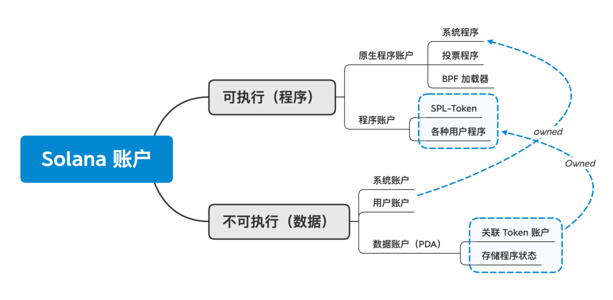
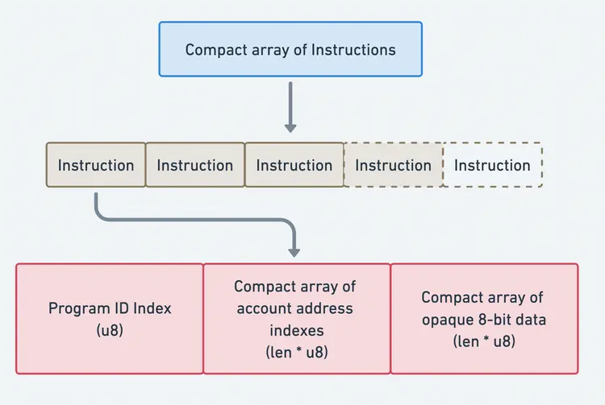

[TOC]


# **共识层**

## Intro

Solana也是一条PoS为共识算法的区块链，但是不同的是它是用TowerBFT算法来进行PoS的运行，其特点是**没有固定质押量**，但质押越多则越可能被选择作为validator出块，从而获得收入。

此时validator对出的区块投票进行，并完成fianalize

但是具体细节更加复杂，下面将介绍一些solana中的具体名称，以便于后续介绍其具体出块的内容。

[reference](https://learnblockchain.cn/article/10458)

### PoS & PoW & PoH


虽然有很多不同的去中心化账本（decentralized ledger protocols），但区块链是最流行的分布式账本类型(distributed ledger)。

区块链的基本结构是仅追加的（append-only），从第一个区块（Genesis Block）开始，这意味着包含新交易的区块被追加到现有的区块链上。为了明确前一个区块是什么，追加的区块包含前一个区块的哈希。


而为了解决不同的节点上传都有着上一个区块hash的不同的两个区块，到底该选哪个作为下一个区块的问题，共识机制被引入了。

- **PoW**:在 PoW 区块链中，节点竞争解决加密难题。第一个解决难题的节点可以将下一个区块添加到链中。这意味着拥有**更多计算能力**的矿工更有可能将自己的区块追加到区块链并获得奖励。如果出现了分叉，则选最长的链是共识链。


- **PoS：**在 PoS 中，validator所stake的代币越多，越可能参与区块的出块。而其他的validator则会验证该出块者的正确性来进行投票（Attestation），投票通过则获得奖励，而如果参与出块的validator出现了恶意行为则会被slash所抵押的token。

  PoS 通常使用“heaviest Fork”来确定共识链。这意味着选择具有most stake-weighted votes的分叉，或者选择大多数其他validator append的那个的分叉。


- **PoH:** PoH是solana独有的一个hash chain, 是用来辅助其PoS以创建基于stake的random stake-based leader sequence.（随机的验证者序列）。

  具体而言，PoH是为了establish a verifiable passage of time within the blockchain而产生的一个可验证的时钟。

  PoH operates by creating a sequence of cryptographic hashes, where each hash verifies that a specific amount of time has elapsed since the previous one. 

  This process uses the `SHA256` algorithm due to its widespread optimization and availability across various hardware platforms. Each hash computation necessitates the previous hash value. This ensures that no parallelization is possible. 

  Since each hash operation takes a minimum amount of time, we can make some assurances as to the time a hash was generated. 

  By incorporating a data point (such as a transaction) along with the previous hash to compute the current hash, **PoH can prove that this data point existed at the time when the hash was computed**. This method ensures a verifiable link between the sequence of transactions and the passage of time.


### Slot & Epoch

具体而言，出块和ETH一样是是按照每一轮`Epoch`来分的，而每个Epoch下又有众多`Slot`。

- **Epoch:** 每一轮Epoch大概持续两天时间，每论Epoch总共有`432,000`个slot

- **Slot:** 每个slot就是`slot leader`消化交易并产生一个区块的时间，slot是400ms(0.4s)的时间窗口，每个slot包含大量交易，每个 slot 中可容纳的交易数量则取决于网络负载与大小限制；截至目前，Solana 峰值 TPS 约为 2,909 tx/s，对应单 slot（0.4 s）可达约 1,163 笔交易。

- **Slot Leader:** Slot leader就是每个Epoch下被选中可以出块的validators, 每个Slot leader**最少**负责4个slot窗口的出块。

  每一轮的slot leaders是在每次Epoch启动前的一轮Epoch就被选中并排序好的，这种计划执行被叫做`leader schedule`。具体的Leader Rotation机制如下([see code](https://github.com/solana-labs/solana/blob/master/ledger/src/leader_schedule.rs))：

  > 1. 找出Active set
  >
  > 在“leader schedule”生成点（默认是下一个 epoch 开始前一个 epoch 长度的 PoH tick）取当时的**Bank 状态**(即此时的区块链的数据快照状态)，从中筛选出最近有参与投票（voting）且staked的validator——这就是活跃集合(Active set)。
  >
  > 2. 算出Stake Weight
  >
  > 对Active Set中的validator的stake数量进行累加排序，形成一个“区间图”。总 stake 越多的验证者，在这一条“权重区间”中占的长度就越大，就越有机会被选中
  >
  > 3. 算出Random Seed
  >
  >  利用 PoH（Proof‑of‑History）的 tick 计数器作为**伪随机数发生器**的种子
  >
  > 4. 分配slot与validator
  >
  > 按照ActiveSet中validator的公钥，根据StakeWeight中的加权分布，在用一致的伪随机数生成器从分布中抽样，按每 `repeat` 个 slot 分配一个 leader。

## Solana中的出块流程

Solana出块分为以下的步骤

1. 决定Leader Sequence
2. 收到和验证交易
3. 通过PoH创建区块
4. 分发创建的区块给其他验证者
5. 其他验证者（非leader）验证区块并投票


TODO


# **程序和数据**

solana的数据和代码是分离的，可以充分利用并发优势。

比如:

在一次性给数万个地址进行 NFT 铸造或空投操作。每个目标地址对应一个独立的 SPL Token 帐户。每笔铸造交易只读写自己那份帐户数据，不会与其他铸造交易冲突，从而可以 **同时** 发起成百上千笔交易。而不像ETH那样For循环单线程一个个执行而导致触发gasLimit

## 账户模型

Solana 的账户和 Linux 的文件很类似，**一切皆是账户**，这意味着：

所有链上状态都存放在“账户”里，不管是存用户的 SOL 余额、程序的可执行字节码，还是某个 DeFi 协议的合约状态、投票程序的元数据，甚至系统保留的“原生程序”也都是特殊类型的账户。

所有数据都存储在所谓的“账户”中。 Solana 上的数据视类似一个公共数据库，其中只有一个“账户”表，该表的键就是账户，值则是账户的基本类型，其账户是一个唯一的 32 字节地址，为Ed25519公钥的base58 编码的字符串（例如 `14grJpemFaf88c8tiVb77W7TYg2W3ir6pfkKz3YjhhZ5`）


```rust
pub struct Account {
  
    pub lamports: u64,
    //该账户持有的 SOL 最小单位数（1 SOL = 10⁹ lamports）。也就是账户的余额，用于支付交易费和租金。
    
    #[cfg_attr(feature = "serde", serde(with = "serde_bytes"))]
    pub data: Vec<u8>, 
    /// data held in this account
    //– 对于普通用户账户，通常为空或存放少量自定义元数据；
    //– 对于数据账户，则存放合约状态、账户映射或其它结构化信息；
    //– 对于程序账户，存放编译后的 BPF 可执行码。
    
    pub owner: Pubkey,
    //拥有并被授权修改此账户 data 的程序的公钥：
//– 普通钱包账户的 owner 通常是系统程序（11111111111111111111111111111111），表示它可以自由地转移 lamports；
//– 程序账户和数据账户的 owner 指向具体的智能合约程序公钥，只有该程序能修改其 data。
    
    pub executable: bool,
    //标记此账户是否已加载为可执行程序（read-only）：
//– false 表示普通账户或数据账户；
//– true 表示这是一个程序账户，运行时将其 data 当作 BPF 代码执行，并且此后无法再修改其 data。
    
    pub rent_epoch: Epoch,//已弃用字段
    //下一次该账户需被收取租金（rent）的 epoch 编号。
//Solana 要求所有账户支付 rent，或维持足够的 lamports 保证“rent-exempt”（免租金）状态；达到免租金标准后，rent_epoch 会保持为当前 epoch 或更大，不再扣费。
}
```

- 账户最多可以存储 [10MiB](https://github.com/anza-xyz/agave/blob/v2.1.13/sdk/program/src/system_instruction.rs#L85) 的数据，这些数据可以是可执行的程序代码或程序状态。
- 账户需要支付与存储数据量成比例的 [租金押金](https://github.com/anza-xyz/agave/blob/v2.1.13/sdk/rent/src/lib.rs#L93-L97)（以 lamports 或 SOL 计），当您关闭账户时可以完全取回。
- 每个账户都有一个程序 [所有者](https://github.com/anza-xyz/agave/blob/v2.1.13/sdk/account/src/lib.rs#L55)。只有拥有账户的程序可以更改其数据或扣除其 lamport 余额，但任何人都可以增加余额。
- **程序账户** 存储智能合约的可执行代码。
- **数据账户** 由程序创建，用于存储和管理程序状态。


## 账户和程序类型

在solana中，账户按可执行和不可执行分为程序和"账户"：




### 1. 系统程序

默认情况下，所有新账户都归[系统程序](https://github.com/anza-xyz/agave/tree/v2.1.13/programs/system/src)（SystemProgram）所有。系统程序执行以下几个关键操作：

- [新账户创建](https://github.com/anza-xyz/agave/blob/v2.1.13/programs/system/src/system_processor.rs#L146)：只有系统程序可以创建新账户。
- [空间分配](https://github.com/anza-xyz/agave/blob/v2.1.13/programs/system/src/system_processor.rs#L71)：为每个账户的数据字段设置字节容量。
- [转移/分配程序所有权](https://github.com/anza-xyz/agave/blob/v2.1.13/programs/system/src/system_processor.rs#L113)：一旦系统程序创建了一个账户，它可以将指定的程序所有权重新分配给另一个程序账户。这就是自定义程序如何接管由系统程序创建的新账户的所有权。

在 Solana 上，所有“钱包”账户实际上只是由系统程序拥有的账户。这些账户中的 lamport 余额显示了钱包拥有的 SOL 数量。只有由系统程序拥有的账户才能支付交易费。

具体而言，一个用户的钱包所包含的信息一般如下图案例：


### 2. SysVar账户

**Sysvar 账户** 系统变量账户，用来存储solana系统的变量（如 EpochSchedule，Fees & RecentBlockhashes等），这些数据被放在了一个提前布置好的地址上，以供外部调用访问其集群网络（即以太坊的网络群）所产生的数据和系统的固定常量。

储存数据字段具体见：

https://docs.anza.xyz/runtime/sysvars


### 3.程序账户

部署一个 Solana 程序会创建一个可执行的程序账户。程序账户存储程序的可执行代码。

程序账户由[加载程序](https://solana.com/docs/core/programs#loader-programs)拥有。


为了简化理解，您可以将程序账户视为程序本身。当您调用程序的指令时，您需要指定程序账户的地址（通常称为“程序 ID”）。

但具体而言，当您部署一个 Solana 程序时，它会存储在一个程序账户中。程序账户由[加载程序](https://solana.com/docs/core/programs#loader-programs)拥有。

加载程序有多个版本，但除了 loader-v3 以外，所有版本都将可执行代码直接存储在程序账户中。

loader-v3 将可执行代码存储在一个单独的“程序可执行数据账户”中，而程序账户仅指向它而不直接存储代码（如下图）。


当您部署一个新程序时，Solana CLI 默认使用最新的加载程序版本。

Loader-v3 还有一种特殊的<u>缓冲账户</u>类型，用于在部署或重新部署/升级期间临时存储程序的上传。在 loader-v4 中，仍然存在缓冲区，但它们只是普通的程序账户。


### 4.数据账户

在 Solana 上，程序的可执行代码存储在与程序状态不同的账户中。这类似于操作系统通常将程序和其数据分开存储在不同的文件中。

为了维护状态，程序定义了指令来创建它们拥有的独立数据账户。这些账户每个都有自己唯一的地址，并可以存储程序定义的任意数据。


请注意，只有 [System Program](https://solana.com/docs/core/accounts#system-program) 可以创建新账户。一旦 System Program 创建了一个账户，它可以将新账户的所有权转移或分配给另一个程序。

换句话说，为自定义程序创建数据账户需要两个步骤：

1. 调用 System Program 创建一个账户，然后将所有权转移给自定义程序
2. 调用现在拥有该账户的自定义程序，根据程序的指令初始化账户数据

这个账户创建过程通常被抽象为一个步骤，但了解其底层过程是有帮助的

### 5. PDA

PDA是一个极其重要的概念，它有以下的特征

1. 无私钥，但是由ProgramID+特定的seed来决定public key
2. 当系统程序确定调用PDA的程序的programId和seed结合能推导出公钥时就允许修改此账户的数据
3. PDA的生产需要一个interger `bump`来保证 seed+ProgramID的组合推导出来的公钥没有对应的私钥


# 交易

和ETH一样，solana中的transaction可以包括多个函数调用且都是原子性的（一个失败则全部失败）

不同的是，

- ETH是以call某个合约中的某个函数，这个函数再按照逻辑继续向下call另外的函数来实现的。

- Solana则是一个transaction中，本身就能一笔交易call多个instruction(函数)。

具体而言，交易中的信息会如下所示

 **Transaction**

交易中包含两大元素：签名和message，简化的示意图可以概括如下：

```rust
signatures: [ s, s ]
message:
    header: 000
    addresses: [ aaa, aaa ]
    recent_blockhash: int
    instructions: [ ix, ix ]
```
```rust
（每一个Instruction所含信息）
program_id: xxx  //接收指令的program地址
accounts: [ aaa, aaa ] //指令中所涉及的账户地址
instruction_data: b[]  //intruction数据，bytes形式，但是可以被去序列化为rust语言告诉program该做什么
```

<br/>

 具体的rust交易结构体是

```rust
pub struct Transaction {
    #[wasm_bindgen(skip)]
    #[serde(with = "short_vec")]
    pub signatures: Vec<Signature>, //An array of signatures included on the transaction.

    #[wasm_bindgen(skip)]
    pub message: Message,
}
```

而Message类型则包括了

```rust
pub struct Message {
    /// The message header, identifying signed and read-only `account_keys`.
    pub header: MessageHeader,

    /// All the account keys used by this transaction.
    #[serde(with = "short_vec")]
    pub account_keys: Vec<Pubkey>,

    /// The id of a recent ledger entry.
    pub recent_blockhash: Hash,

    /// Programs that will be executed in sequence and committed in
    /// one atomic transaction if all succeed.
    #[serde(with = "short_vec")]
    pub instructions: Vec<CompiledInstruction>,
}
```

下面的内容我们将具体解析各个元素具体结构和作用

## 编码

我们在上面的结构中看见，基本上每个vec类型的字段中，都引用了`#[serde(with = "short_vec")]`的属性。

其中`serde`是一个用于对 Rust 数据结构进行序列化和反序列化框架，而`#[serde(with = "module")]`这类的属性，则是告诉rust，在序列化与序列化中使用custom module中的逻辑。

在这里`#[serde(with = "short_vec")]`其实就是说对下面的所有向量采用`"short_vec"`这个序列化方式。

- **short_vec**

short_vec将向量按以下方式压缩：

1. 对array的length进行compact-u16编码
2. array中的数据依次排列

其中，`compact-u16`是solana设计的一种针对u16数据进行压缩的算法，目的在于将u16数据动态压缩至1-3字节，而非固定的两字节。

**具体而言：**

`compact-u16`将 16 位整数(最大值 65535)用 1 到 3 个字节表示, 具体字节数取决于数值的大小. 

它的编码规则类似于传统 vlq 编码, 通过在每个字节中使用 7 位来存储实际数据, 并用最高位(第 8 位)作为"延续位"来指示是否需要读取后续字节.

这样，对于小于 128(0x7f)的值, 只需 1 个字节. 

如果最高位为 0, 表示没有后续字节. 剩余 7 位存储数值。

**比如：**

数值 5(二进制 00000101)的编码：

```python
import pxsol

assert pxsol.core.compact_u16_encode(5) == bytearray([0x05])
```

- 128 到 16383(0x3fff)的值, 需要 2 个字节. 第一个字节的最高位设为 1, 表示有后续字节; 低 7 位存储数值的低 7 位. 第二个字节的最高位设为 0, 表示结束; 低 7 位存储数值的剩余部分.

数值 132(二进制 10000100)编码是多少?

第一个字节: 0x84(10000100, 延续位 1, 数据 0000100). 第二个字节: 0x01(00000001, 延续位 0, 数据 0000001).

```py
import pxsol

assert pxsol.core.compact_u16_encode(132) == bytearray([0x84, 0x01])
//132对应0x84,第一个字节够存，所以不会给更多数据到第二个字节元素中
```


- 大于 16383 的值, 需要 3 个字节. 前两个字节的延续位都设为 1, 分别存储低 14 位. 第三个字节的延续位设为 0, 存储剩余部分.

例: 数值 65535(二进制 11111111 11111111)编码是多少?

答:

```py
import pxsol

assert pxsol.core.compact_u16_encode(65535) == bytearray([0xff, 0xff, 0x03])
```

在 solana 中, 交易内部的数据通常较小, 长度一般会在 128 以内. 使用 compact-u16, 这些值可以用单个字节表示, 而不是固定使用 2 个字节, 从而减少传输和存储成本.

以下是更多案例，以便理解：

```jav
hex     |  compact-u16
--------+------------
0x0000  |  [0x00]
0x0001  |  [0x01]
0x007f  |  [0x7f]
0x0080  |  [0x80 0x01]
0x3fff  |  [0xff 0x7f]//十进制 16383
0x4000  |  [0x80 0x80 0x01]
0xc000  |  [0x80 0x80 0x03]
0xffff  |  [0xff 0xff 0x03]

        // Decodes an unsigned 16 bit integer one-to-one encoded as follows:
        // 1 byte  : 0xxxxxxx                   => 00000000 0xxxxxxx :      0 -    127
        // 2 bytes : 1xxxxxxx 0yyyyyyy          => 00yyyyyy yxxxxxxx :    128 - 16,383
        // 3 bytes : 1xxxxxxx 1yyyyyyy 000000zz => zzyyyyyy yxxxxxxx : 16,38
```


## MessageHeader

MessageHeader的rust结构体如下，它使用了三个u8，即三字节的空间来定义一个交易的信息头

```rust
pub struct MessageHeader {
    /// The number of signatures required for this message to be considered
    /// valid. The signers of those signatures must match the first
    /// `num_required_signatures` of [`Message::account_keys`].
    pub num_required_signatures: u8,

    /// The last `num_readonly_signed_accounts` of the signed keys are read-only
    /// accounts.
    pub num_readonly_signed_accounts: u8,

    /// The last `num_readonly_unsigned_accounts` of the unsigned keys are
    /// read-only accounts.
    pub num_readonly_unsigned_accounts: u8,
}
```


## Account_keys

`account_keys`字段采用了编码中提及的编码方式，compact-u16来记录总共涉及的账户数量，

之后的item则会涉及

- Accounts that are writable and signers
- Accounts that are read-only and signers
- Accounts that are writable and not signers
- Accounts that are read-only and not signers

每个item32字节


## Recent Blockhash

Recent Blockhash是每个交易中的区块对应的hash值，这个值是作为时间戳和类似ETH中nonce值的作用以防止重放攻击，

blockhas也为交易提供了ddl的功能，因为经过150个区块后，之前的blockhash就会过期从而无法使得交易通过。


## Instruction

### 交易中的Instruction

交易中包含的`instruction : Vec<CompiledInstruction>`也和`account_keys`一样使用上述的编码格式，compact-u16来显示多少个instruction，后续item则跟随具体的信息，而每一个单独的信息`CompiledInstruction` 其具体类型如下

```rust
pub struct CompiledInstruction {
    /// Index into the transaction keys array indicating the program account that executes this instruction.
    pub program_id_index: u8,
    /// Ordered indices into the transaction keys array indicating which accounts to pass to the program.
    #[serde(with = "short_vec")]
    pub accounts: Vec<u8>,
    /// The program input data.
    #[serde(with = "short_vec")]
    pub data: Vec<u8>,
}
```

- `program_id_index`：是一个指针，指向Account_keys中的元素，告诉solana哪个是program的目标地址

- `accounts` :指针的向量，指向Account_keys的元素，告诉solana哪些是指向当前program所涉及的地址（毕竟一个交易可能包含多个instruction，而`Account_keys`是一个全量的向量，包含多个instruction所需要的地址）
- `data`: bytes array that告诉solana哪个函数该调用，以及相关的参数

整个的instruction输入和大小，如下图所示




### 程序中的instruction

总结地来讲，每一个单独的一个Instruction需要如下的信息：

```rust
program_id: xxx  //接收指令的program地址的index
accounts: [ aaa, aaa ] //指令中所涉及的账户地址的index（最终以AccountInfo格式信息）
instruction_data: b[]  //intruction数据，bytes形式，但是可以被去序列化为rust语言告诉program该做什么
```


```rust
//Instruction的三大要素会被native程序代码作为输入值
use solana_program::{
    account_info::AccountInfo, entrypoint, entrypoint::ProgramResult, msg, pubkey::Pubkey,
};

// Tells Solana that the entrypoint to this program
//  is the "process_instruction" function.
//
entrypoint!(process_instruction);

// Our entrypoint's parameters have to match the
//  anatomy of a transaction instruction (see README).
//
fn process_instruction(
    program_id: &Pubkey,
    _accounts: &[AccountInfo],
    _instruction_data: &[u8],
) -> ProgramResult {
    msg!("Hello, Solana!");

    msg!("Our program's Program ID: {}", &program_id);

    Ok(())
}
```


值得我们注意的，`process_instruction`函数中传入的`accounts`并非是什么单独的地址，而是`AccountInfo`类型的数组，

如果我们以转账Sol这个案例来举例，一个instruction会要求接收三大输入：

- **program_id**:对应`systemProgram`地址，因为钱包转账，任意钱包的owner都是`systemProgram`
- **accounts**: 对应图中的AccountMeta，其结构就是AccountInfo这个类型中包含的数据
  - 下图中写的是一个公钥地址+ `is_signer`+`is+_writable`
- **instruction_data**: 这里就是对应的参数，transferAmount


那么，这个`AccountInfo`类型到底包含了哪些字段？

[AccountInfo](https://docs.rs/solana-account-info/latest/solana_account_info/struct.AccountInfo.html)是 [solana-program](https://crates.io/crates/solana-program)这个crate中的一个结构体，包含以下字段：

```rust
pub struct AccountInfo<'a> {
    pub key: &'a Pubkey, //公钥地址，对应上述的sender/reciver address
    pub lamports: Rc<RefCell<&'a mut u64>>, //此账户的现有余额
    pub data: Rc<RefCell<&'a mut [u8]>>, //此地址下的data字段的内容
    pub owner: &'a Pubkey, //此地址的owner字段（地址的owner是谁）
    pub rent_epoch: u64, //此地址的rent_epoch字段（下次收租时间）
    
    pub is_signer: bool, //是否为签名者
    pub is_writable: bool, //是否为可写地址？
    pub executable: bool, //是否是可执行的程序地址？
}
```

可以看出，前五个字段是和`Account`基础类型的字段一致的，只有后面的三个布尔值是额外加入以供系统识别的。


但是之前我们在`CompiledInstruction`中看到，实际用户发送的交易没有非常复杂，只是一群指针指向对应的account地址。

但是实际solana在接收到交易后，它会把`CompiledInstruction`类型转为如下的`Instruction`类型，然后按这里的内容变成填充完整的`AccountInfo`输入形式调用程序。

```rust
pub struct Instruction {
    /// Pubkey of the program that executes this instruction.
    pub program_id: Pubkey,
    /// Metadata describing accounts that should be passed to the program.
    pub accounts: Vec<AccountMeta>,
    /// Opaque data passed to the program for its own interpretation.
    pub data: Vec<u8>,
}
```

```rust
pub struct AccountMeta {
    /// An account's public key.
    pub pubkey: Pubkey,
    /// True if an `Instruction` requires a `Transaction` signature matching `pubkey`.
    pub is_signer: bool,
    /// True if the account data or metadata may be mutated during program execution.
    pub is_writable: bool,
}
```

也就是说实际上关于account的转换如下

`CompiledInstruction::Vec<u8>` -> `Instruction:: Vec<AccountMeta>` -> `[AccountInfo]`


### 交易和Instruction对比

下面是真实的一个转账的Instruction JSON，由rust中的`solana_sdk`生成

```json
{
  "program_id": "11111111111111111111111111111111",
  "accounts": [
    {
      "pubkey": "Hhh6vrA6xUNwaNftJVAXSTzfHiRiAKFKLGmHdcRH6Pmo",
      "is_signer": true,
      "is_writable": true
    },
    {
      "pubkey": "6RYMY3mFLixELbfNCMA7zNtzgNfRyEZs5YYkZQb8aK4t",
      "is_signer": false,
      "is_writable": true
    }
  ],
  "data": [2, 0, 0, 0, 128, 150, 152, 0, 0, 0, 0, 0]
}
```


但是实际上，一个更加完整的序列化后的transaction应该如下json （由solana_client + solana_sdk生成，官网有rust代码）

```json
{
  "signatures": [
    "2fPXZtQGWWj6suxfc55FBQiexS8hEhNELqasSL5DRYa1RB1GChHz86Cyy8ukiVwA6qbq91P4cY1FuvTuYtmTHmJP"
  ],
  "message": {
    "header": {
      "num_required_signatures": 1,
      "num_readonly_signed_accounts": 0,
      "num_readonly_unsigned_accounts": 1
    },
    "account_keys": [
      "9CpbtdXfUTgLMJL8DEAeEm8thERJPwDuruohjvUuzY7m",
      "6jELNgS8Q35sF4QZCvwgyKGaKrbcm8P5QcNWUyAb5ekJ",
      "11111111111111111111111111111111"
    ],
    "recent_blockhash": "3P7CVQ9nwXx4B37MvBzghzbcM9K9p5xo7ivDE8W78dCi",
    "instructions": [
      {
        "program_id_index": 2,
        "accounts": [0, 1],
        "data": [2, 0, 0, 0, 128, 150, 152, 0, 0, 0, 0, 0]
      }
    ]
  }
```


# References

[Solana官方资源](https://solana.com/developers)

[Solana官方文档](https://solana.com/zh/docs/core/accounts)

[SolanaBytes视频](https://www.youtube.com/watch?v=pRYs49MqapI&list=PLilwLeBwGuK51Ji870apdb88dnBr1Xqhm&index=1)

[PDA](https://learnblockchain.cn/article/12928)

[Solana序列化](https://accu.cc/content/solana/tx_serialize/)

