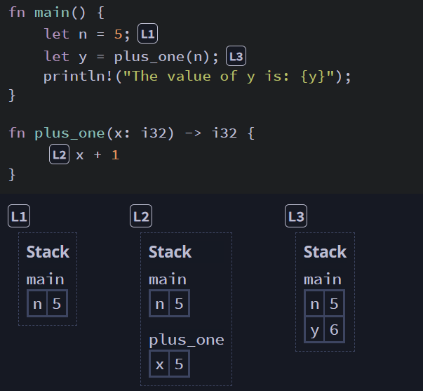
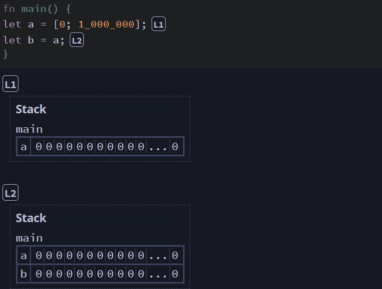
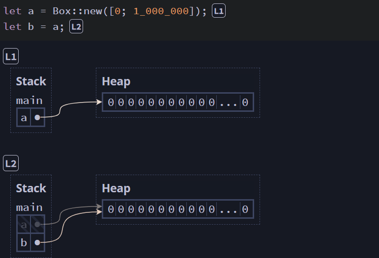

[TOC]


# Rust内存管理模型

rust的内存管理模型是其最出彩的特征，C++语言具备良好的性能但是由于其需要程序员自己管理内存导致前在的内存泄漏等问题而产生了安全性的问题；其他的如Go, java，python等具备GC垃圾回收机制的语言又由于其GC线程导致STW（stop the world）问题从而降低了程序的性能。而Rust则通过其独特的内存管理模型使得其即具备GC类似的内存安全性，又有C++一般的性能。

其内存管理模型主要由以下的部分组成：

1. Ownership System
2. Borrowing
3. LifeTime
4. Reference Counting

## Ownership System

Rust对于stack与heap的管理模式是理解其ownership的基础，我们先说说stack。

1. Stack & Heap

以下图为例，当L1的时候stack中塞入了一个`n=5`的变量和值的映射，但是stack不光是一层层压下去，同时它也有一个根据作用域区别的分类，这个作用域的分类就是stack frame，比如L2中调用函数时就会出现一个frame标记为`plus_one`，此frame中`x=5`，但函数所在的作用域执行完成后此frame就会连同`x=5`消失。



栈的运行速度很快，但是空间有限（通常主线程几 MB，子线程更小），如果将所有的数据都存在stack上会面临stackoverflow的风险。比如将下面的一个长度为1百万的数组从a复制到b，stack将积累重复记录的数据。



而heap就会让这一起变得更加简单，rust中通过`Box::new()`就能创建一个heap内存的指针，使得括号里的数据被存入heap中，同时赋予stack变量一个指向heap的指针，一旦需要将a的数据转移给b，只需要转移指针即可。




## 迭代器


# Macro

宏分用法分为：

1. **声明式宏( *declarative macros* )** `macro_rules!`
2. **过程宏( *procedural macros* )**

## Declarative macros

声明宏就是写一个宏的逻辑，给外部调用，比如`vec!`的逻辑如下：

```rust
#[macro_export]
macro_rules! vec {
    ( $( $x:expr ),* ) => {
        {
            let mut temp_vec = Vec::new();
            $(
                temp_vec.push($x);
            )*
            temp_vec
        }
    };
}
```

`#[macro_export]`是明确导出，`macro_rules!`是声明我在写一个宏，`vec`为宏的名称，调用时使用`vec!`以区分正常的函数调用。

## Procedural macros

过程宏则是一个函数generator，它会自动补充函数，其又分为三种宏

- Custom Derive
- Attribute-Like
- Function-Like


```rust
use proc_macro;

#[proc_macro_derive(HelloMacro)]
pub fn some_name(input: TokenStream) -> TokenStream {
}
```


