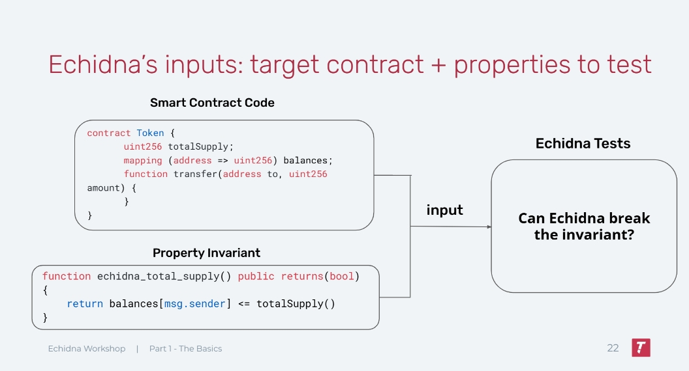
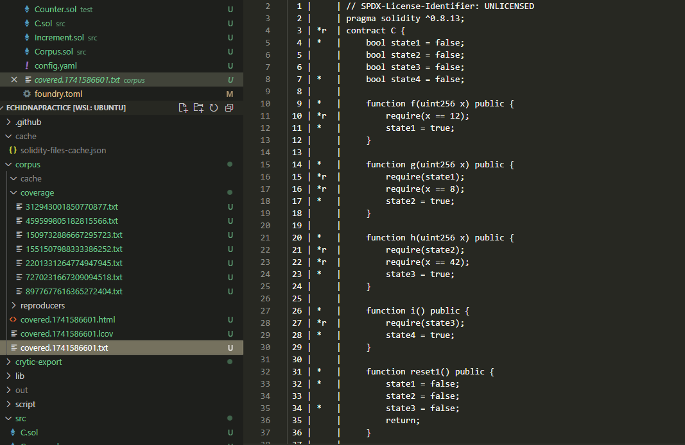
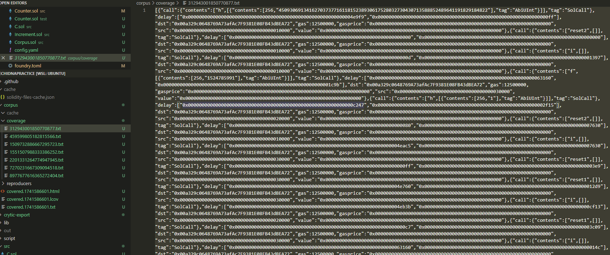

# Echidna，从入门到入土

[TOC]

为理解本文，你至少需要有以下方面的基本技能：

1. 掌握Solidity（毫无疑问）
2. 掌握Foundry的基本测试知识
3. 了解Fuzzing是什么，什么是Stateless Fuzzing，什么是stateful Fuzzing
4. 了解一些基本的Defi知识（如AMM，LP，staking等）

## 1. Echidna介绍

- **什么是Echidna**

Echidna是一个专注于Fuzzing的实用工具，也是一般审计合约时最常使用的工具之一，相比Foundry，它在进行stateful fuzzing的时候会更加方便和实用。本教程会更加深入echidna在不同的场景需求下的实际操作流程，此教程仅结合我个人知识和经验，若有不足或疏漏的地方，欢迎随时提出意见。

官方参考文档：[Echidna](https://secure-contracts.com/program-analysis/echidna/index.html)


- **Echidna如何工作的？**

Echidna通过你提供的合约代码和你写的Invariant作为输入，来在一个个sequence中尝试打破你的invariant。值得注意的是echidna默认就是stateful fuzzing的模式，这也意味着每个sequence中都是一笔笔真实而随机的函数调用。





- **与Foundry的初步对比**

如果你没用过，或者不熟悉foundry的fuzzing方法，Cyfrin有一个非常棒的Repo介绍了foundry的stateful fuzzing 和stateless fuzzing的区别，以及实际用法：

[Invariant-break](https://github.com/Cyfrin/sc-exploits-minimized/blob/main/src/invariant-break/README.md)

Stateless fuzzing过于简单，这里就不作介绍，我们主要对比stateful fuzzing。

在Foundry中，一个简单的stateful fuzzing会类似下面代码结构：

```solidity
//Target合约：
contract StatefulFuzzCatches{
    uint256 public myValue = 1;
    uint256 public storedValue = 100;
    // Invariant: This function should never return 0
    function doMoreMathAgain(uint128 myNumber) public returns (uint256) {
        uint256 response = (uint256(myNumber) / 1) + myValue;
        storedValue = response;
        return response;
    }
    function changeValue(uint256 newValue) public {
        myValue = newValue;
    }
}
    
// 测试合约继承Test,并引入myContract合约
contract testMyContract is Test {
    // Setup，创建实例并且锁定fuzz合约对象
    function setUp() public {
        sfc = new StatefulFuzzCatches();
        targetContract(address(sfc));
    }

    // StatefulFuzz或者invariant作为前缀关键词
    function statefulFuzz_testMathDoesntReturnZero() public view {
        assert(sfc.storedValue() != 0);
    }
}   
// forge test --mt statefulFuzz_testMathDoesntReturnZero 启动！
```

<br/>

而Echidna也类似，你会在文件中创建一个测试合约`testtoken.sol`

```solidity
//Target合约：
contract Token {
    mapping(address => uint256) public balances;

    function airdrop() public {
        balances[msg.sender] = 1000;
    }

    function consume() public {
        require(balances[msg.sender] > 0);
        balances[msg.sender] -= 1;
    }

    function backdoor() public {
        balances[msg.sender] += 1;
    }
}

//echidna的测试合约，一般需要继承原合约，并以constructor作为setUp
contract TestToken is Token {
	///不需要创建实例和锁定合约对象，继承之后echidna就对Token合约中的函数随便点点点
    constructor() public {}

    function echidna_balance_under_1000() public view returns (bool) {
        return balances[msg.sender] <= 1000;
    }
}
//echidna testtoken.sol --contract TestToken 启动！
```

从上面的代码中我们可以看见foundry 和echidna在stateful fuzz中的区别，这只是一个非常简单的初步案例，作为一个大体的印象。下面的内容我们会深入探讨更多关于echidna的细节。

<br/>

### 1.1 测试模式

Echidna有许多测试模式，包括：

1. **Property Mode**: 无参数输入的stateful fuzzing测试模式
2. **Assertion Mode**:有参数输入的stateful fuzzing测试模式
3. **Dapptest**:有参数输入的，包含类似foundry assume作弊码的stateless fuzzing测试
4. **Overflow Mode**:专注于Overflow的assertion模式，它只会在出现溢出时才会报告错误
5. **Optimization Mode**:用于求极值的模型，函数会尽可能输出一个最大值
6.  **Exploration Mode**:自动模式，不需要添加任何Invariant，该模式将会自动以test coverage最大化进行测试

本章中，我们会着重介绍前两个模式，因为这两个模式也是我们在实操中经常使用的模式。

<br/>

#### Property Mode

Property模式是Echidna的默认模式，我们在上面和foundry做对比时写的函数`echidna_balance_under_1000()`其实就使用的该模式。

```solidity
    function echidna_balance_under_1000() public view returns (bool) {
        return balances[msg.sender] <= 1000;
    }
```

此模式有以下几个特点:

- 需要有识别前缀（默认echidna_），前缀名称可以在echidna配置文件中修改
- 该函数永远return bool，且没有任何输入值
- 在最后执行Property函数后，之前所有对合约执行的状态都会初始化，再进行下一个sequence
- 如果property函数return true则表示为测试通过，如果property函数中出现revert或者返回false则会被视为失败并报告。
- 对于期望有revert的测试（类似foudry中的`expectRevert`）使用echidna_revert前缀，将会使property函数模式出现改变，此时只有函数出现revert才会视为成功，反之都会视为失败。

下面是官方给出的代码总结此模式的用法:

```solidity
function echidna_property() public returns (bool) { // No arguments are required
  // The following statements can trigger a failure if they revert
  publicFunction(...);
  internalFunction(...);
  contract.function(...);

  // The following statement can trigger a failure depending on the returned value
  return ...;
} // side effects are *not* preserved

function echidna_revert_property() public returns (bool) { // No arguments are required
  // The following statements can *never* trigger a failure
  publicFunction(...);
  internalFunction(...);
  contract.function(...);

  // The following statement will *always* trigger a failure regardless of the value returned
  return ...;
} // side effects are *not* preserved
```

<br/>

#### Assertion Mode

Assertion模式也是最常用的一种模式，它主要使用`assert(condition)`来进行判断，assertion模式支持参数输入。Assertion有两种情况会报告测试失败：

1. **执行 `assert()` 时发生revert或者false**：当代码执行到 `assert` 这个操作的时候，如果它出现了revert或者false，Echidna 就会检测到并认为这是一个断言失败。值得注意的是，只有执行`assert()`时出现的问题echidna才会报错，而包含`assert()`函数本身在`assert()`前后出现的任何错误都不会被考虑在内，如果需要考虑可以试着用try-catch写法，比如：

```solidity
function checkAssertion(...) public {
  require(...)//require产生的回退并不会报告错误
  
  try token.transferFrom(...)//如果不使用try catch，assert只能捕捉转账成功的错误路径
  {assert(...)}
  catch(bytes memory err)
  {assert(false)}//转账失败，我们需要echidna报告原因err
}

```

<br/>

2. **任何合约发出 `AssertionFailed` 事件**：只要有合约发出了 `AssertionFailed` 这个事件，不管它带了多少个参数，Echidna 都会报告断言违规。例如，合约里有个函数，在某些特定条件下会发出 `emit AssertionFailed(...)` 这样的代码，一旦这个事件被发出，Echidna 就会认为出现了断言违规的情况。

下面是官方给出的代码总结此模式的用法:

```solidity
function checkInvariant(...) public { // Any number of arguments is supported
  // The following statements can trigger a failure using `assert`
  assert(...);
  publicFunction(...);
  internalFunction(...);

  // The following statement will always trigger a failure even if the execution ends with a revert
  emits AssertionFailed(...);

  // The following statement will *only* trigger a failure using `assert` if using solc 0.8.x or newer
  // To make sure it works in older versions, use the AssertionFailed(...) event
  anotherContract.function(...);

} // side effects are preserved
```

除此之外，还有几个assertion模式的特点：

- 测试函数不需要任何前缀，但是需要在配置文件或者CLI中明确assertion mode才能进行。
- 包含`assert()`函数会被像一般函数一样被执行，这也就意味着此函数通过后，之前的状态不会像property函数一样被删除，而是会继续保存。
- 如果原合约中有`assert()`函数，它也会被用起来做判断依据。这个可能会造成一些障碍，比如目标合约中包含了以下函数，就会出现一些没必要的failure：

```solidity
function deposit(uint256 tokens) public {
  assert(tokens > 0); // echidna输入0时就会报错，但是这个并不能算bug，
  					 //开发者应该尽量使用require/if-else作为判断
  ...
}
```

Assertion 模式在多数复杂场景下非常实用，对于function-level的invariant，**Pre-condition**+**Action**+**Post-condition-cheks**模式是一种非常高效和清晰的结构：

```solidity
function testStake(uint256 toStake) public {///测试一个stake质押token的函数
    uint256 balance = balanceOf(msg.sender);
    toStake = toStake % (balance + 1);///参数限制：固定toStake的数量不超过balance，保证测试的质量
    
    if (toStake < MINSTAKE) return; // Pre-condition: 保证发生的token大于最低限制的要求
    
    stake(msg.sender, toStake); // Action: token staking
    
    assert(staked(msg.sender) == toStake); // Post: staking amount is toStake
    assert(balanceOf(msg.sender) == balance - toStake); // Post: balance decreased
}

```

这里的关键其实在于合理的参数限制和precondition，如果参数未经限制，echidna很容易会在balance数量上revert，从而浪费很多时间；如果pre-condition未经妥善限制，则echidna便会在minstake的判定中revert，而这两种情况都不利于我们寻找潜在bug。

<br/>

### 1.2 Testing Method & Coverage

#### Internal Testing

在我们之前介绍的测试中，一般是通过继承原合约，再写Invariant进行测试，比如之前的代码：
```solidity
//Target合约：
contract Token {
    mapping(address => uint256) public balances;

    function airdrop() external {
        balances[msg.sender] = 1000;
    }

    function consume() internal {
        require(balances[msg.sender] > 0);
        balances[msg.sender] -= 1;
    }

    function backdoor() interal {
        balances[msg.sender] += 1;
    }
}

//echidna的测试合约，一般需要继承原合约，并以constructor作为setUp
contract TestToken is Token {
	///不需要创建实例和锁定合约对象，继承之后echidna就对Token合约中的函数随便点点点
    constructor() public {}

    function echidna_balance_under_1000() public view returns (bool) {
        return balances[msg.sender] <= 1000;
    }
}
//echidna testtoken.sol --contract TestToken 启动！
```

在这里，我们继承了Token合约，而这种测试方式被定义为**internal testing**

**Internal Testing**有以下的优点和缺点：

**优点：**

- 简单设置，快速测试

- 可以对内部函数进行单点测试，并且也可以快速测试所有public/external函数

- 多个msg.sender的状态可以被保存

  > echidna有三个模拟账户轮番进行函数调用，他们的地址分别是`0x10000`，`0x20000`，`0x30000`，其中`0x30000`会call合约的constructor，之后随机轮番调用。
  >
  > 每个msg.sender在调用函数后有着不同的状态，提高了某些bug发现的概率。

<br/>

**缺点**：

- 对于复杂系统并不是那么高效，最适合的是那些只有少量入口的系统

  > 对于有着许多个合约文件的系统，同时又依赖许多外部合约和oracle的系统，这会变得相当复杂。
  >
  > 比如，你现在只想测试系统中一个合约A的某个函数X，但是继承合约A后，A的constructor中要填入呼应的合约B,C,D的地址，而new出来合约B,C,D也会像建立合约A一样，需要constructor中填入一堆合约地址，oracle合约地址，oracle合约又要弄个mock，如果依赖uniswap之类的外部合约也需要mock，甚至是fork主网来测试。
  >
  > 但是你最初只是需要测试A合约的X函数，如果E合约还有个函数Y要测试，你又要重新经历这种痛苦的过程。
  >
  > 但是，对于只有一个或者非常有限入口的系统，这种setup是可以接受的，毕竟你只需搭建一次就好。

<br/>

#### External Testing

如果你看完了[Invariant-break](https://github.com/Cyfrin/sc-exploits-minimized/blob/main/src/invariant-break/README.md)或者[foundryBook](https://book.getfoundry.sh/forge/invariant-testing)中对handler-base Testing中的内容，你可能发现foudry会需要建立一个handler合约，来通过fuzzer调用handler来间接调用目标合约的函数。

类似的，echidna的external testing中也会应用一个中间合约，来进行一系列的setup和测试函数的撰写，之后我们使用echidna调用这个中间合约来实现对目标合约的测试。具体可以参考[Echidna_Examples](https://github.com/CoheeYang/SmartContract-Vulnerabilities/blob/main/Tooling/Echidna_Example)中的例子

而external testing的模式会有以下**优缺点：**

**优点**

- 对于之前说的复杂系统来说，这一点比较可接受，因为你只需要对中间人合约进行setup，并以此基础搭积木就好
- 这也是实操中最常使用的方法

**缺点**

- set up的过程会很繁琐
- 由于是通过中间合约间接调用的，你并没有很多msg.sender的状态（这个问题可以通过再创建代理合约来call解决）

<br/>

#### Testing Coverage

Echidna有一个非常强大的功能，语料库（Corpus），它能够自动记录每次测试的执行轨迹和覆盖情况（coverage）数据。为了生成corpus，你需要在配置文件中添加`corpusDir: <name-of-dirctory>`

此时测试完成后将产生两类关键文件：
• `covered.xxx.txt`：详细代码覆盖率报告
• `xxx.txt`：函数调用路径记录文件

下图是一个`covered.xxx.txt` 文件的案例；在这里，文件会清楚地告诉你哪些函数的多少行在测试中被cover了，哪些没有。



在覆盖率报告中，Echidna使用以下标记系统指示代码执行状态：

| 标记 | 含义说明                       | 典型场景                |
| ---- | ------------------------------ | ----------------------- |
| `*`  | 正常执行路径                   | 成功执行的代码行        |
| `r`  | 执行时触发回滚操作             | require/revert 语句触发 |
| `o`  | Gas耗尽导致执行中断            | 循环逻辑中的Gas消耗异常 |
| `e`  | 运行时错误（除零、断言失败等） | 算数运算错误            |

这项Coverage的报告对于各种测试非常有用，以便于我们在测试通过时能够确认，**这些代码是真实被运行后通过了测试，而不是因为某种原因被跳过后通过了测试**

<br/>

此外，Corpus也会在coverage的文件夹中生成`xxx.txt`文件，这些文件就是过去echidna在调用函数时产生的路径，这个路径包括了call了什么函数，call函数的参数是多少。



<br/>

而这些路径放入json文件中格式化大概长这个样子（以函数`function1(uint256,uint256,uint256,uint256)`为例）：

```json
[
    {
        "_gas'": "0xffffffff",
        "_delay": ["0x13647", "0xccf6"],
        "_src": "00a329c0648769a73afac7f9381e08fb43dbea70",
        "_dst": "00a329c0648769a73afac7f9381e08fb43dbea72",
        "_value": "0x0",
        "_call": {
            "tag": "SolCall",
            "contents": [
                "function1",  //echidna所call的函数名
                [
                    {
                        "contents": [
                            256,//第一个参数类型uint256
                            "93723985220345906694500679277863898678726808528711107336895287282192244575836"//第一个参数的值
                        ],
                        "tag": "AbiUInt"
                    },
                    {
                        "contents": [256, "334"],//第二个输入参数的类型和值
                        "tag": "AbiUInt"
                    },
                    {
                        "contents": [
                            256,
                            "68093943901352437066264791224433559271778087297543421781073458233697135179558"
                        ],//第三个输入参数的类型和值
                        "tag": "AbiUInt"
                    },
                    {
                        "tag": "AbiUInt",
                        "contents": [256, "332"]//第四个输入参数的类型和值
                    }
                ]
            ]
        },
        "_gasprice'": "0xa904461f1"
    }
]
```

在这里有一个值得注意的技巧，**定向测试参数设置**，就是当遇到函数中有难以触发的参数组合时，你可以通过修改corpus中的值，来保证下次运行时能快速运行指定的参数，特别适用于边界条件测试和复杂参数组合场景，具体见：[collecting corpus](https://github.com/crytic/building-secure-contracts/blob/master/program-analysis/echidna/advanced/collecting-a-corpus.md)

<br/>

## 2. Echidna实操

### 2.1 Echidna的能力边界

Echidna虽然在多数情况的statefull fuzzing会比foundry更加顺手，但是它确实也有一定的能力边界，以下**缺点**是你必须值得注意的：

1. 有限的cheat-code
2. 对部分lib的支持不足

 <br/>

#### 有限的cheat-code

不同于foundry丰富到爆炸的cheat-code，echidna所支持的cheat-code明显略逊一筹，甚至在某些场景都不够用。

这是因为echidna虽然和foundry一样，是基于[HEVM](https://github.com/ethereum/hevm)的cheat-code，但是foundry在此之上也另外添加了更多功能，比如`hoax()`，`assume()`，和给代币充值的`deal()`等等。

而echidna则只有原有的HEV所支持的cheat-code，而且应用需要先写出interface，再实例化一个hevm对象进行（类似vm.xxx），比如下方的`prank`

````solidity
interface IHevm {
    function prank(address) external;
}

contract TestPrank {
  address constant HEVM_ADDRESS = 0x7109709ECfa91a80626fF3989D68f67F5b1DD12D;//keccak("hevm cheat code")
  IHevm hevm = IHevm(HEVM_ADDRESS);
  Contract c = ...

  function prankContract() public payable {
    hevm.prank(address(0x42424242);
    c.f(); // `c` will be called with `msg.sender = 0x42424242`
  }
}
````

更多支持的cheatcode请参考[HEVM cheatcode]([https://hevm.dev/controlling-the-unit-testing-environment.html#cheat-codes](https://hevm.dev/std-test-tutorial.html#supported-cheat-codes).)

有限的CheatCode带来了很多问题；比如最常见的是，如果你要fork测试一个和Uniswap v3对接的资产管理相关的协议，那么很自然的你会需要fork uniswap v3的代币池和相关代币的状态，但你测试时却没有给代币充值的作弊码，导致你测试中的角色根本没有token进行测试。

**关于这个问题，一个比较有用的解决思路是**：由于给ETH充值的deal()还是支持的，所以我们需要将ETH转为WETH（对WETH合约进行deposit后会根据`msg.sender`的数量mint对应的WETH），之后将WETH再通过Uniswap router转为其他代币。

比如说下面的hardhat代码，将WETH转为了DAI,然后进行了对应的测试(详见[mixbytes-blog](https://mixbytes.io/blog/fuzzing-smart-contracts-practical-aspects-echidna))：

```solidity
pragma solidity ^0.7.6;
pragma abicoder v2;

import "./interfaces.sol";
import '@uniswap/v3-core/contracts/interfaces/IUniswapV3Factory.sol';                                                           
import '@uniswap/v3-core/contracts/interfaces/IUniswapV3Pool.sol';                                                               
import '@uniswap/v3-core/contracts/interfaces/IERC20Minimal.sol';                                                   
import '@uniswap/v3-periphery/contracts/interfaces/ISwapRouter.sol';
import '@uniswap/v3-periphery/contracts/libraries/PoolAddress.sol';
import '@uniswap/v3-periphery/contracts/base/LiquidityManagement.sol'; 
import '@openzeppelin/contracts/token/ERC721/IERC721Receiver.sol';

interface IWETH {
    receive() external payable;
    function deposit() external payable;
    function withdraw(uint256 wad) external;
    function transfer(address to, uint256 value) external returns (bool);
    function balanceOf(address account) external view returns (uint256);
}


contract FuzzingTest2 {

    address payable public constant WETH = payable(0xC02aaA39b223FE8D0A0e5C4F27eAD9083C756Cc2);//ETH MAINNET
    address public constant DAI = 0x6B175474E89094C44Da98b954EedeAC495271d0F;
    
    IUniswapV3Factory public constant factory = IUniswapV3Factory(address(0x1F98431c8aD98523631AE4a59f267346ea31F984));
    ISwapRouter public constant uniswapRouter = ISwapRouter(address(0xE592427A0AEce92De3Edee1F18E0157C05861564));
    
    IUniswapV3Pool pool;
    uint24 public constant POOL_FEE = 3000;

    uint24 tickDiff = 0;
    // uint256 profitWETH = 0;
    uint256 liquidityPutWETH = 0;
    uint256 relativeProfit = 0;
    
    function get_ticks_range(int24 _curtick, uint24 _tickDiff) private pure returns(int24 startTick, int24 endTick) {
        startTick = _curtick - (_curtick % 60) - int24(_tickDiff - (_tickDiff % 60));
        endTick = _curtick - (_curtick % 60)  + int24(_tickDiff - (_tickDiff % 60));
    }

    function uniswapV3MintCallback(                                                                                                    
        uint256 amount0Owed,                                                                                                           
        uint256 amount1Owed,                                                                                                           
        bytes calldata data                                                                                                            
    ) external { 
        IDAI(DAI).transfer(msg.sender, amount0Owed);
        IWETH(WETH).transfer(msg.sender, amount1Owed);
    }        

    constructor() payable {
       pool = IUniswapV3Pool(factory.getPool(WETH, DAI, POOL_FEE));
    }

    function univ3_fuzzing_test(uint24 _tickDiff) payable public {
        require(_tickDiff <= 360);
        
        liquidityPutWETH = 0;
        relativeProfit = 0;
        tickDiff = _tickDiff;

        // in Echidna config we put 100 ETH on the contract's balance
        // in Hardhat we send enough ETH to the contract in the test
        IWETH(WETH).deposit{ value: 100 ether}();
        IWETH(WETH).approve(address(uniswapRouter), 100 ether);
        uint256 actualDAIOutput = uniswapRouter.exactInputSingle( 
            ISwapRouter.ExactInputSingleParams(
                WETH,
                DAI,
                POOL_FEE,
                address(this),
                block.timestamp,
                50 ether,
                1,
                0
            )
        );

        put_liquidity(IWETH(WETH).balanceOf(address(this)) / 2);
        perform_swaps();
        put_liquidity(1); // need to put liquidity to recalculate fees
        collect_rewards();
    }
    

    function put_liquidity(uint256 _amountOfWETHToPut) private {
        
        // determine tics where to put liquidity
        (uint160 sqrtPriceX96, int24 curtick, , , , , ) = pool.slot0();
        (int24 startTick, int24 endTick) = get_ticks_range(curtick, tickDiff);

        // calculate the needed liquidity amount 
        uint160 sqrtRatioAX96 = TickMath.getSqrtRatioAtTick(curtick);
        uint160 sqrtRatioBX96 = TickMath.getSqrtRatioAtTick(endTick);
        uint128 liquidity = LiquidityAmounts.getLiquidityForAmounts(
            sqrtPriceX96,
            sqrtRatioAX96,
            sqrtRatioBX96,
            _amountOfWETHToPut,
            IDAI(DAI).balanceOf(address(this))
        );

        bytes memory callbackdata = new bytes(0);
        (uint256 amount0, uint256 amount1) = pool.mint(
            address(this),
            startTick,
            endTick,
            liquidity,
            callbackdata
        );
        liquidityPutWETH += amount0;
        // console.log("[MINT] Minted %s liquidity for amounts, WETH: %s, DAI: %s", liquidity, amount0, amount1);
        
    }
 
    function perform_swaps() private {
        // STEP 4. perform the swap (LP receives a profit)
        uint256 inTokens = IDAI(DAI).balanceOf(address(this));
        IDAI(DAI).approve(address(uniswapRouter), inTokens);
        
        uint256 output = uniswapRouter.exactInputSingle( 
            ISwapRouter.ExactInputSingleParams(
                DAI,
                WETH,
                POOL_FEE,
                address(this),
                block.timestamp,
                inTokens,
                1,
                0
            )
        );
        // // console.log("   [SWAP] %s DAI swapped to %s WETH", inTokens, output);

        inTokens = IWETH(WETH).balanceOf(address(this));
        IWETH(WETH).approve(address(uniswapRouter), inTokens);
        output = uniswapRouter.exactInputSingle( 
            ISwapRouter.ExactInputSingleParams(
                WETH,
                DAI,
                POOL_FEE,
                address(this),
                block.timestamp,
                inTokens,
                1,
                0
            )
        );
        // // console.log("   [SWAP] %s WETH swapped to %s DAI", inTokens, output);

        inTokens = IDAI(DAI).balanceOf(address(this)) / 2;
        IDAI(DAI).approve(address(uniswapRouter), inTokens);
        output = uniswapRouter.exactInputSingle( 
            ISwapRouter.ExactInputSingleParams(
                DAI,
                WETH,
                POOL_FEE,
                address(this),
                block.timestamp,
                inTokens,
                1,
                0
            )
        );
        // // console.log("   [SWAP] %s DAI swapped to %s WETH", inTokens, output);
    }

    function collect_rewards() private {
        
        (uint160 sqrtPriceX96, int24 curtick, , , , , ) = pool.slot0();
        (int24 startTick, int24 endTick) = get_ticks_range(curtick, tickDiff);

        bytes32 position_key = keccak256(abi.encodePacked(address(this), startTick, endTick));
        (,,, uint128 tokensOwed0, uint128 tokensOwed1) = pool.positions(position_key);
        
        // calculate profit as simple amount of received WETH tokens
        relativeProfit = tokensOwed1 * 10**18 / liquidityPutWETH;
        // console.log("[COLLECT] %s WETH for %s tickDiff", tokensOwed1, tickDiff);
        // console.log("[COLLECT] relative profit: %s", relativeProfit);
    }


    function echidna_optimize_returned_rewards() public view returns (uint256) {
        // which % of liquidity was returned as profit
        return relativeProfit;
    }

}
```

（我也曾经试过直接让我的echidna合约继承forge-std中有充值token的`deal()`函数的文件StdCheats.sol，但是我尝试后失败了，如果有尝试其他有效且更快方法的朋友欢迎PR）

<br/>

#### 对部分lib的支持不足

这个是echidna官方说明过的问题，对于含有external函数的lib，如果会在你的echidna合约中被使用，且最终会被编译，都会直接失败报错`unlinked lib`，此时你需要在配置文件中声明以下内容：

```yaml
//以ConvertLib这个lib为例
deployContracts: [["0x1f", "ConvertLib"]]//先指定lib部署的地址0x1f
cryticArgs: ["--compile-libraries=(ConvertLib,0x1f)"]//将lib和编译器Link
```

```solidity
library ConvertLib{
	function A() internal {...}//如果只有这个没事，solidity会直接将他作为原合约bytecode的一部分一起编译部署，不需要在yaml文件中声明上述内容
	function B() external {...}//lib中有了external，根据solidity的特性，需要让echidna部署到一个地址，就像其他正常合约一样，之后原合约call这个lib
}
```

具体参考官方文档：[external-lib](https://secure-contracts.com/program-analysis/echidna/advanced/working-with-libraries.html)

这个问题还是比较傻逼的，因为你可能并没有直接使用或者import任何一个lib，但是你import的合约中却使用了一个含external函数的lib；如果依赖很多，这可能会让你找半天这个lib到底叫啥，而且echidna并不会告诉你这个lib的任何有效信息，所以切记这一点。


## Reference

https://blog.trailofbits.com/2023/07/21/fuzzing-on-chain-contracts-with-echidna/

https://mixbytes.io/blog/fuzzing-smart-contracts-practical-aspects-echidna

https://www.youtube.com/@trailofbits/streams


