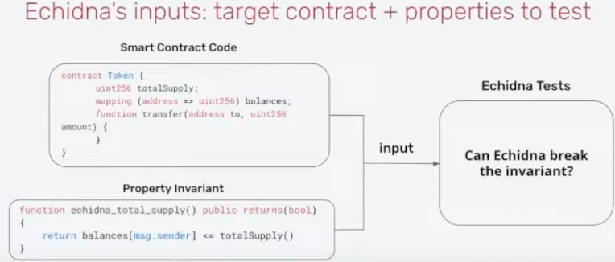

# Intro

为理解本文，你至少需要有以下方面的基本技能：

1. 掌握Solidity（毫无置疑）
2. 掌握Foundry的基本测试知识
3. 了解Fuzzing是什么，什么是Stateless Fuzzing，什么是stateful Fuzzing
4. 了解一些基本的Defi知识（如AMM）

## 1. Echidna介绍

- **什么是Echidna**

Echidna是一个专注于Fuzzing的实用工具，也是一般审计合约时最常使用的工具之一，相比Foundry，它在进行stateful fuzzing的时候会更加方便和实用。本教程会更加深入echidna在不同的场景需求下的实际操作流程，此教程仅结合我个人知识和经验，若有不足或疏漏的地方，欢迎随时PR。

官方参考文档：[Echidna](https://github.com/crytic/building-secure-contracts/tree/master/program-analysis/echidna)


- **Echidna如何工作的？**

Echidna通过你提供的合约代码和你写的Invariant作为输入，来在一个个sequence中尝试打破你的invariant。值得注意的是echidna默认就是stateful fuzzing的模式，这也意味着每个sequence中都是一笔笔真实而随机的函数调用。





- **与Foundry的初步对比**

如果你没用过，或者不熟悉foundry的fuzzing方法，Cyfrin有一个非常棒的Repo介绍了foundry的stateful fuzzing 和stateless fuzzing的区别，以及实际用法：

[Invariant-break](https://github.com/Cyfrin/sc-exploits-minimized/blob/main/src/invariant-break/README.md)

Stateless fuzzing过于简单，这里就不作介绍，我们主要对比stateful fuzzing。


在Foundry中，一个简单的stateful fuzzing会类似下面代码结构：

```solidity
//Target合约：
contract StatefulFuzzCatches{
    uint256 public myValue = 1;
    uint256 public storedValue = 100;
    // Invariant: This function should never return 0
    function doMoreMathAgain(uint128 myNumber) public returns (uint256) {
        uint256 response = (uint256(myNumber) / 1) + myValue;
        storedValue = response;
        return response;
    }
    function changeValue(uint256 newValue) public {
        myValue = newValue;
    }
}
    
// 测试合约继承Test,并引入myContract合约
contract testMyContract is Test {
    // Setup，创建实例并且锁定fuzz合约对象
    function setUp() public {
        sfc = new StatefulFuzzCatches();
        targetContract(address(sfc));
    }

    // StatefulFuzz或者invariant作为前缀关键词
    function statefulFuzz_testMathDoesntReturnZero() public view {
        assert(sfc.storedValue() != 0);
    }
}   
// forge test --mt statefulFuzz_testMathDoesntReturnZero 启动！
```


而Echidna也类似，你会在文件中创建一个测试合约`testtoken.sol`

```solidity
//Target合约：
contract Token {
    mapping(address => uint256) public balances;

    function airdrop() public {
        balances[msg.sender] = 1000;
    }

    function consume() public {
        require(balances[msg.sender] > 0);
        balances[msg.sender] -= 1;
    }

    function backdoor() public {
        balances[msg.sender] += 1;
    }
}

//echidna的测试合约，一般需要继承原合约，并以constructor作为setUp
contract TestToken is Token {
	///不需要创建实例和锁定合约对象，继承之后echidna就对Token合约中的函数随便点点点
    constructor() public {}

    function echidna_balance_under_1000() public view returns (bool) {
        return balances[msg.sender] <= 1000;
    }
}
//echidna testtoken.sol --contract TestToken 启动！
```

从上面的代码中我们可以看见foundry 和echidna在fuzz中的部分区别，这只是一个非常简单的初步案例，作为一个大体的印象。下面的内容我们会深入探讨更多关于echidna的细节。


### 1.1 测试模式

