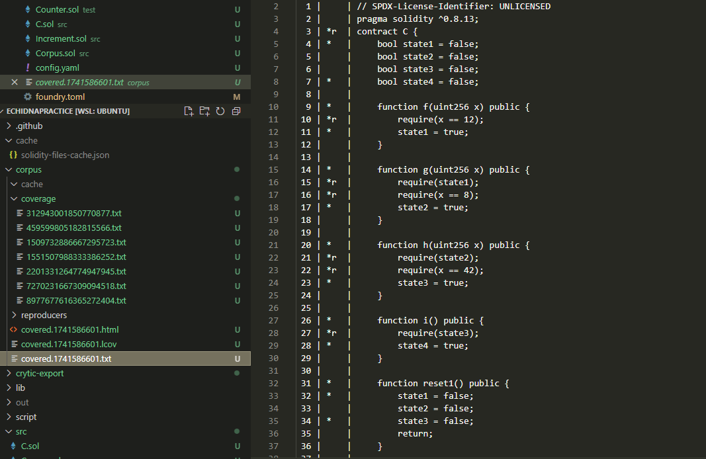
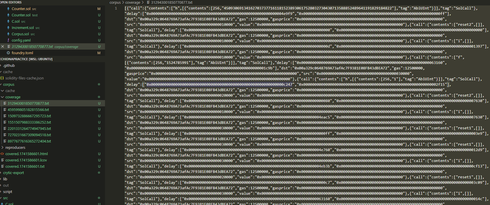

# Basic Intro

[TOC]

为理解本文，你至少需要有以下方面的基本技能：

1. 掌握Solidity（毫无疑问）
2. 掌握Foundry的基本测试知识
3. 了解Fuzzing是什么，什么是Stateless Fuzzing，什么是stateful Fuzzing
4. 了解一些基本的Defi知识（如AMM，LP，staking等）

## 1. Echidna介绍

- **什么是Echidna**

Echidna是一个专注于Fuzzing的实用工具，也是一般审计合约时最常使用的工具之一，相比Foundry，它在进行stateful fuzzing的时候会更加方便和实用。本教程会更加深入echidna在不同的场景需求下的实际操作流程，此教程仅结合我个人知识和经验，若有不足或疏漏的地方，欢迎随时PR。

官方参考文档：[Echidna](https://github.com/crytic/building-secure-contracts/tree/master/program-analysis/echidna)


- **Echidna如何工作的？**

Echidna通过你提供的合约代码和你写的Invariant作为输入，来在一个个sequence中尝试打破你的invariant。值得注意的是echidna默认就是stateful fuzzing的模式，这也意味着每个sequence中都是一笔笔真实而随机的函数调用。


- **与Foundry的初步对比**

如果你没用过，或者不熟悉foundry的fuzzing方法，Cyfrin有一个非常棒的Repo介绍了foundry的stateful fuzzing 和stateless fuzzing的区别，以及实际用法：

[Invariant-break](https://github.com/Cyfrin/sc-exploits-minimized/blob/main/src/invariant-break/README.md)

Stateless fuzzing过于简单，这里就不作介绍，我们主要对比stateful fuzzing。


在Foundry中，一个简单的stateful fuzzing会类似下面代码结构：

```solidity
//Target合约：
contract StatefulFuzzCatches{
    uint256 public myValue = 1;
    uint256 public storedValue = 100;
    // Invariant: This function should never return 0
    function doMoreMathAgain(uint128 myNumber) public returns (uint256) {
        uint256 response = (uint256(myNumber) / 1) + myValue;
        storedValue = response;
        return response;
    }
    function changeValue(uint256 newValue) public {
        myValue = newValue;
    }
}
    
// 测试合约继承Test,并引入myContract合约
contract testMyContract is Test {
    // Setup，创建实例并且锁定fuzz合约对象
    function setUp() public {
        sfc = new StatefulFuzzCatches();
        targetContract(address(sfc));
    }

    // StatefulFuzz或者invariant作为前缀关键词
    function statefulFuzz_testMathDoesntReturnZero() public view {
        assert(sfc.storedValue() != 0);
    }
}   
// forge test --mt statefulFuzz_testMathDoesntReturnZero 启动！
```


而Echidna也类似，你会在文件中创建一个测试合约`testtoken.sol`

```solidity
//Target合约：
contract Token {
    mapping(address => uint256) public balances;

    function airdrop() public {
        balances[msg.sender] = 1000;
    }

    function consume() public {
        require(balances[msg.sender] > 0);
        balances[msg.sender] -= 1;
    }

    function backdoor() public {
        balances[msg.sender] += 1;
    }
}

//echidna的测试合约，一般需要继承原合约，并以constructor作为setUp
contract TestToken is Token {
	///不需要创建实例和锁定合约对象，继承之后echidna就对Token合约中的函数随便点点点
    constructor() public {}

    function echidna_balance_under_1000() public view returns (bool) {
        return balances[msg.sender] <= 1000;
    }
}
//echidna testtoken.sol --contract TestToken 启动！
```

从上面的代码中我们可以看见foundry 和echidna在stateful fuzz中的区别，这只是一个非常简单的初步案例，作为一个大体的印象。下面的内容我们会深入探讨更多关于echidna的细节。


### 1.1 测试模式

Echidna有许多测试模式，包括：

1. **Property Mode**: 无参数输入的stateful fuzzing测试模式
2. **Assertion Mode**:有参数输入的stateful fuzzing测试模式
3. **Dapptest**:有参数输入的，包含类似foundry assume作弊码的stateless fuzzing测试
4. **Overflow Mode**:专注于Overflow的assertion模式，它只会在出现溢出时才会报告错误
5. **Optimization Mode**:用于求极值的模型，函数会尽可能输出一个最大值
6.  **Exploration Mode**:自动模式，不需要添加任何Invariant，该模式将会自动以test coverage最大化进行测试

本章中，我们会着重介绍前两个模式，因为这两个模式也是我们在实操中经常使用的模式。


#### Property Mode

Property模式是Echidna的默认模式，我们在上面和foundry做对比时写的函数`echidna_balance_under_1000()`其实就使用的该模式。

```solidity
    function echidna_balance_under_1000() public view returns (bool) {
        return balances[msg.sender] <= 1000;
    }
```

此模式有以下几个特点:

- 需要有识别前缀（默认echidna_），前缀名称可以在echidna配置文件中修改
- 该函数永远return bool，且没有任何输入值
- 在最后执行Property函数后，之前所有对合约执行的状态都会初始化，再进行下一个sequence
- 如果property函数return true则表示为测试通过，如果property函数中出现revert或者返回false则会被视为失败并报告。
- 对于期望有revert的测试（类似foudry中的`expectRevert`）使用echidna_revert前缀，将会使property函数模式出现改变，此时只有函数出现revert才会视为成功，反之都会视为失败。

下面是官方给出的代码总结此模式的用法:

```solidity
function echidna_property() public returns (bool) { // No arguments are required
  // The following statements can trigger a failure if they revert
  publicFunction(...);
  internalFunction(...);
  contract.function(...);

  // The following statement can trigger a failure depending on the returned value
  return ...;
} // side effects are *not* preserved

function echidna_revert_property() public returns (bool) { // No arguments are required
  // The following statements can *never* trigger a failure
  publicFunction(...);
  internalFunction(...);
  contract.function(...);

  // The following statement will *always* trigger a failure regardless of the value returned
  return ...;
} // side effects are *not* preserved
```


#### Assertion Mode

Assertion模式也是最常用的一种模式，它主要使用`assert(condition)`来进行判断，assertion模式支持参数输入。Assertion有两种情况会报告测试失败：

1. **执行 `assert()` 时发生revert或者false**：当代码执行到 `assert` 这个操作的时候，如果它出现了revert或者false，Echidna 就会检测到并认为这是一个断言失败。值得注意的是，只有执行`assert()`时出现的问题echidna才会报错，而包含`assert()`函数本身在`assert()`前后出现的任何错误都不会被考虑在内，如果需要考虑可以试着用try-catch写法，比如：

```solidity
function checkAssertion(...) public {
  require(...)//require产生的回退并不会报告错误
  
  try token.transferFrom(...)//如果不使用try catch，assert只能捕捉转账成功的错误路径
  {assert(...)}
  catch(bytes memory err)
  {assert(false)}//转账失败，我们需要echidna报告原因err
}

```


2. **任何合约发出 `AssertionFailed` 事件**：只要有合约发出了 `AssertionFailed` 这个事件，不管它带了多少个参数，Echidna 都会报告断言违规。例如，合约里有个函数，在某些特定条件下会发出 `emit AssertionFailed(...)` 这样的代码，一旦这个事件被发出，Echidna 就会认为出现了断言违规的情况。

下面是官方给出的代码总结此模式的用法:

```solidity
function checkInvariant(...) public { // Any number of arguments is supported
  // The following statements can trigger a failure using `assert`
  assert(...);
  publicFunction(...);
  internalFunction(...);

  // The following statement will always trigger a failure even if the execution ends with a revert
  emits AssertionFailed(...);

  // The following statement will *only* trigger a failure using `assert` if using solc 0.8.x or newer
  // To make sure it works in older versions, use the AssertionFailed(...) event
  anotherContract.function(...);

} // side effects are preserved
```


除此之外，还有几个assertion模式的特点：

- 测试函数不需要任何前缀，但是需要在配置文件或者CLI中明确assertion mode才能进行。
- 包含`assert()`函数会被像一般函数一样被执行，这也就意味着此函数通过后，之前的状态不会像property函数一样被删除，而是会继续保存。
- 如果原合约中有`assert()`函数，它也会被用起来做判断依据。这个可能会造成一些障碍，比如目标合约中包含了以下函数，就会出现一些没必要的failure：

```solidity
function deposit(uint256 tokens) public {
  assert(tokens > 0); // echidna输入0时就会报错，但是这个并不能算bug，
  					 //开发者应该尽量使用require/if-else作为判断
  ...
}
```


Assertion 模式在多数复杂场景下非常实用，对于function-level的invariant，**Pre-condition**+**Action**+**Post-condition-cheks**模式是一种非常高效和清晰的结构：

```solidity
function testStake(uint256 toStake) public {///测试一个stake质押token的函数
    uint256 balance = balanceOf(msg.sender);
    toStake = toStake % (balance + 1);///参数限制：固定toStake的数量不超过balance，保证测试的质量
    
    if (toStake < MINSTAKE) return; // Pre-condition: 保证发生的token大于最低限制的要求
    
    stake(msg.sender, toStake); // Action: token staking
    
    assert(staked(msg.sender) == toStake); // Post: staking amount is toStake
    assert(balanceOf(msg.sender) == balance - toStake); // Post: balance decreased
}

```

这里的关键其实在于合理的参数限制和precondition，如果参数未经限制，echidna很容易会在balance数量上revert，从而浪费很多时间；如果pre-condition未经妥善限制，则echidna便会在minstake的判定中revert，而这两种情况都不利于我们寻找潜在bug。


### 1.2 Testing Method & Coverage

#### Internal Testing

在我们之前介绍的测试中，一般是通过继承原合约，再写Invariant进行测试，比如之前的代码：
```solidity
//Target合约：
contract Token {
    mapping(address => uint256) public balances;

    function airdrop() external {
        balances[msg.sender] = 1000;
    }

    function consume() internal {
        require(balances[msg.sender] > 0);
        balances[msg.sender] -= 1;
    }

    function backdoor() interal {
        balances[msg.sender] += 1;
    }
}

//echidna的测试合约，一般需要继承原合约，并以constructor作为setUp
contract TestToken is Token {
	///不需要创建实例和锁定合约对象，继承之后echidna就对Token合约中的函数随便点点点
    constructor() public {}

    function echidna_balance_under_1000() public view returns (bool) {
        return balances[msg.sender] <= 1000;
    }
}
//echidna testtoken.sol --contract TestToken 启动！
```

在这里，我们继承了Token合约，而这种测试方式被定义为**internal testing**

**Internal Testing**有以下的优点和缺点：

**优点：**

- 简单设置，快速测试

- 可以对内部函数进行单点测试，并且也可以快速测试所有public/external函数

- 多个msg.sender的状态可以被保存

  > echidna有三个模拟账户轮番进行函数调用，他们的地址分别是`0x10000`，`0x20000`，`0x30000`，其中`0x30000`会call合约的constructor，之后随机轮番调用。
  >
  > 每个msg.sender在调用函数后有着不同的状态，提高了某些bug发现的概率。


**缺点**：

- 对于复杂系统并不是那么高效，最适合的是那些只有少量入口的系统

  > 对于有着许多个合约文件的系统，同时又依赖许多外部合约和oracle的系统，这会变得相当复杂。
  >
  > 比如，你现在只想测试系统中一个合约A的某个函数X，但是继承合约A后，A的constructor中要填入呼应的合约B,C,D的地址，而new出来合约B,C,D也会像建立合约A一样，需要constructor中填入一堆合约地址，oracle合约地址，oracle合约又要弄个mock，如果依赖uniswap之类的外部合约也需要mock，甚至是fork主网来测试。
  >
  > 但是你最初只是需要测试A合约的X函数，如果E合约还有个函数Y要测试，你又要重新经历这种痛苦的过程。
  >
  > 但是，对于只有一个或者非常有限入口的系统，这种setup是可以接受的，毕竟你只需搭建一次就好。


#### External Testing

如果你看完了[Invariant-break](https://github.com/Cyfrin/sc-exploits-minimized/blob/main/src/invariant-break/README.md)或者[foundryBook](https://book.getfoundry.sh/forge/invariant-testing)中对handler-base Testing中的内容，你可能发现foudry会需要建立一个handler合约，来通过fuzzer调用handler来间接调用目标合约的函数。

类似的，echidna的external testing中也会应用一个中间合约，来进行一系列的setup和测试函数的撰写，之后我们使用echidna调用这个中间合约来实现对目标合约的测试。

而external testing的模式会有以下**优缺点：**

**优点**

- 对于之前说的复杂系统来说，这一点比较可接受，因为你只需要对中间人合约进行setup，并以此基础搭积木就好
- 这也是实操中最常使用的方法

**缺点**

- set up的过程会很繁琐
- 由于是通过中间合约间接调用的，你并没有很多msg.sender的状态（但是这个问题也可以被解决）


#### Testing Coverage

Echidna有一个非常强大的功能，语料库（Corpus），它能够自动记录每次测试的执行轨迹和覆盖情况（coverage）数据。为了生成corpus，你需要在配置文件中添加`corpusDir: <name-of-dirctory>`

此时测试完成后将产生两类关键文件：
• `covered.xxx.txt`：详细代码覆盖率报告
• `xxx.txt`：函数调用路径记录文件

下图是一个`covered.xxx.txt` 文件的案例；在这里，文件会清楚地告诉你哪些函数的多少行在测试中被cover了，哪些没有。



在覆盖率报告中，Echidna使用以下标记系统指示代码执行状态：

| 标记 | 含义说明                       | 典型场景                |
| ---- | ------------------------------ | ----------------------- |
| `*`  | 正常执行路径                   | 成功执行的代码行        |
| `r`  | 执行时触发回滚操作             | require/revert 语句触发 |
| `o`  | Gas耗尽导致执行中断            | 循环逻辑中的Gas消耗异常 |
| `e`  | 运行时错误（除零、断言失败等） | 算数运算错误            |

这项Coverage的报告对于各种测试非常有用，以便于我们在测试通过时能够确认，**这些代码是真实被运行后通过了测试，而不是因为某种原因被跳过后通过了测试**


此外，Corpus也会在coverage的文件夹中生成`xxx.txt`文件，这些文件就是过去echidna在调用函数时产生的路径，这个路径包括了call了什么函数，call函数的参数是多少。




而这些路径放入json文件中格式化大概长这个样子（以函数`function1(uint256,uint256,uint256,uint256)`为例）：

```json
[
    {
        "_gas'": "0xffffffff",
        "_delay": ["0x13647", "0xccf6"],
        "_src": "00a329c0648769a73afac7f9381e08fb43dbea70",
        "_dst": "00a329c0648769a73afac7f9381e08fb43dbea72",
        "_value": "0x0",
        "_call": {
            "tag": "SolCall",
            "contents": [
                "function1",  //echidna所call的函数名
                [
                    {
                        "contents": [
                            256,//第一个参数类型uint256
                            "93723985220345906694500679277863898678726808528711107336895287282192244575836"//第一个参数的值
                        ],
                        "tag": "AbiUInt"
                    },
                    {
                        "contents": [256, "334"],//第二个输入参数的类型和值
                        "tag": "AbiUInt"
                    },
                    {
                        "contents": [
                            256,
                            "68093943901352437066264791224433559271778087297543421781073458233697135179558"
                        ],//第三个输入参数的类型和值
                        "tag": "AbiUInt"
                    },
                    {
                        "tag": "AbiUInt",
                        "contents": [256, "332"]//第四个输入参数的类型和值
                    }
                ]
            ]
        },
        "_gasprice'": "0xa904461f1"
    }
]
```

在这里有一个值得注意的技巧，**定向测试参数设置**，就是当遇到函数中有难以触发的参数组合时，你可以通过修改corpus中的值，来保证下次运行时能快速运行指定的参数，特别适用于边界条件测试和复杂参数组合场景，具体见：[collecting corpus](https://github.com/crytic/building-secure-contracts/blob/master/program-analysis/echidna/advanced/collecting-a-corpus.md)


