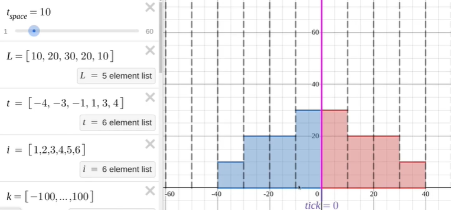

# Uniswap V3

## 1. 集中流动性

集中流动性就是造出虚拟的liquidity曲线，从而用更少的资金做出更大的K值从而提高资金利用率。

而这个virtual liquidity就是模拟现价c，到点b或到a的交易。

假设我们想模拟的这条目标曲线的流动性值为K (L^2)。

同时假设这条模拟的曲线的能力边界在b和a点之间，即满足任意a和b之间的现价c点，可以从c换到a点或者c换到b点。

这意味着：

- c点到a点是存入X来换Y，即X增加而Y减少(y_r)，也就是池中至少有y_r这么多Y token给换出

- c点到b点是X减少(x_r)而Y增加，也就是说池中至少有x_r这么多X token换出

也就是说池中至少要有(x_r,y_r)的代币储存。
那么请问真实代币和流动性的关系是什么呢？

**我如何通过手中已有的(x_r,y_r)推出创造出来的池的流动性K是多少呢**
$$
已知c坐标(X_c,Y_c)，a坐标（X_a,Y_a），b坐标(X_b,Y_b)\\
则有：\\

X_c*Y_c=K;\\
X_c=X_a+X_r\\
Y_c=Y_b+Y_r\\
可知:
(X_a+X_r)(Y_b+Y_r)=K ~~~~~(1)\\

\\
而如果Xtoken是WETH，标的资产token0\\
Ytoken是USDC,计价资产token1\\
则在a点上标的资产的价格P_a=Y_a/X_a\\
在b点上标的资产价格P_b=Y_b/X_b

\\而又因a和b点均满足XY=K=L^2
\\
则可以得到:\\
 
\left\{
\begin{array}{ll}
X_a=\frac{L}{\sqrt{P_a}}\\
Y_b=L\sqrt{P_b}
\end{array}
\right.
~~~~~~~~(2)

\\
\\
将(2)带入(1)中将得到一个价格区间[P_a,P_b]，真实代币额(X_r,Y_r)和流动性L的公式：\\
(X_r+\frac{L}{\sqrt{P_a}})(Y_r+L\sqrt{P_b})=L^2 \\
只要知道其中任意两个要素，就能知道第三个要素。\\
$$
同时，virtual Liquidity也意味着，用户可以只构造单边的swap，而不用像V2一样必须提供代币对才能提供流动性。

由于这种构造会导致多个曲线在一个X-Y坐标轴上出现，使得图片变得复杂，因此V3多使用如下的L-P坐标轴表示池中的流动性情况。

此时根据我们上面的公式就能算出在固定价格区间[P_a,P_b]中，用户存入(X_r,Y_r)后流动性的（增加）多少。

而在真实的交易池中，比如下面图中，ETH是Xtoken，也是标的资产token0;USDC是Ytoken，也是计价资产token1。

当你向左边走（对应X-Y坐标中向左边走），就是卖出X（ETH）而获得USDC，所以有左边全是USDC的流动性储备。图中亮起的部分就是**那一个价格区间**有38.9万的USDC储备流动性。

## 2. Tick

Uniswap V3的价格是由tick来表示的，有点像几何布朗运动，具体来说是：

`p = 1.0001^t`，其中t代表的currentTick

这是由于v3版本支持用户创建任意的价格区间，所以可能会出现两个价格区间会有部分重叠，也有可能出现两个价格之间没有流动性等等情况，针对这些复杂场景，v3引入tick和position（价格区间）的设计来解决。

这意味着真实的L-P坐标轴其实是按liquidity-tick表示（如下图）也就是和官方中池的图片一样。价格的区间由tickspace表示，常见tickspace有1，10，60这样的。

而LP们在提供流动性时也需要按tickspace的整数倍数的范围来提供，比如他们可以对[-20,20]区间提供流动性，但是他们不能对[-20,-15]这样地提供流动性。也是就他们必须整格整格的提供token。

Reference

https://zhuanlan.zhihu.com/p/448382469

https://updraft.cyfrin.io/courses/uniswap-v3/spot-price/slot0
