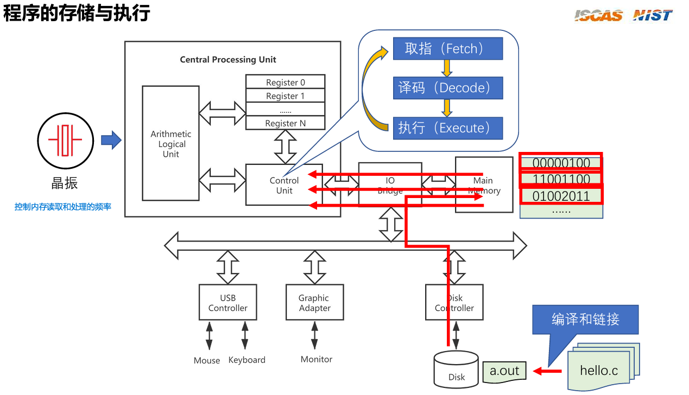
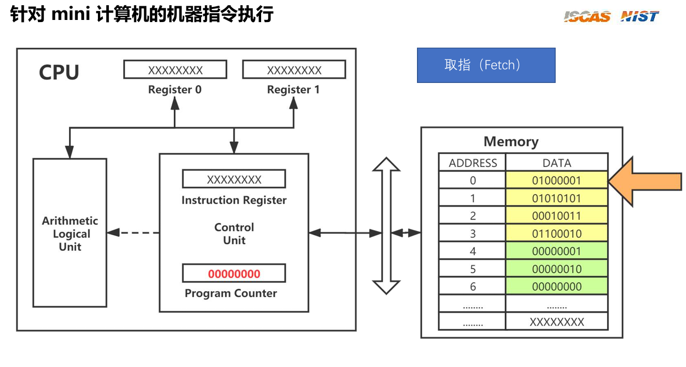
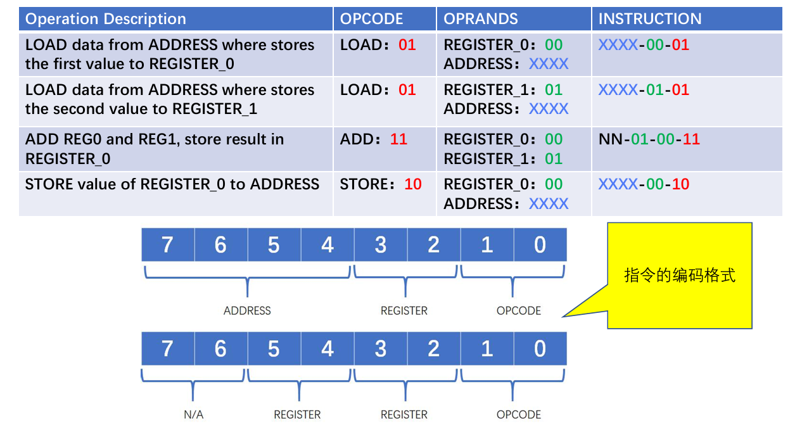
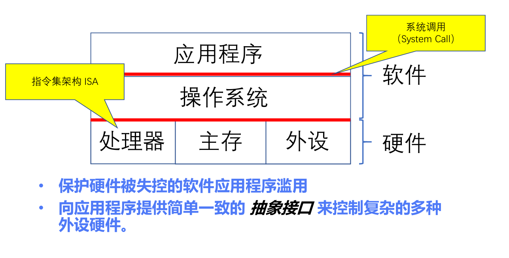

[TOC]


## 1. 计算机运行原理

### 1.1 程序的存储与执行



假设 `hello.c`：

```c
#include <stdio.h>
int main() {
    printf("Hello, world\n");
    return 0;
}
```

简单来说会发生以下的事情：

1. hello.c被编译为二进制可执行文件a.out，此文件被disk加载到内存空间
2. program counter指向的内存开始，Control Unit会将内存中的数据fetch到各个寄存器中
3. Control Unit开始decode并根据指令对进行execute
4. 晶振的频率就是决定了CU进行这些动作的频率，频率越高CPU速度执行三步动作越快。

具体而言，更加细节的过程如下：

------

1. 编辑 → 编译 → 链接（源码变成磁盘上的可执行文件）

- 你在编辑器中写 `hello.c`（源代码，文本）。
- 编译器工具链把它变成机器能理解的二进制：
  1. **预处理**（`#include`、宏展开）→ 生成纯 C 源。
  2. **编译**（`gcc -c`）把 C 变成汇编（每条语句对应指令序列）。
  3. **汇编** 把汇编变成目标文件（object file，二进制片段，含机器指令与符号）。
  4. **链接器（linker）** 把目标文件和所需的库（libc）合并，做地址重定位，生成完整的可执行文件（例如 `a.out`）。
- 最终的可执行文件被写到 **磁盘（Disk）** 上 —— 图右下角 `a.out` 所在位置。

（图中：一堆 `hello.c` 输入 → 编译/链接 → `a.out` 写入 Disk；Disk 通过 Disk Controller 接入总线。）

------

2. 加载（Loader）——从磁盘把程序搬到内存

- 你在命令行运行 `./a.out`，这是由操作系统（内核）接管的动作。
- **操作系统的 loader**：通过 **Disk Controller → IO Bridge → 主内存（Main Memory）** 把 `a.out` 的字节块读入内存，并建立该进程的地址空间（代码段、数据段、堆、栈、以及动态链接器可能映射的共享库）。
- OS 还设置进程的初始 CPU 寄存器（程序计数器 PC 指向程序入口）、栈指针等。
   （图中：红色箭头从 Disk 经过 IO Bridge 和 Main Memory 指向 CPU/Control Unit。）

------

3. CPU 执行：取指 → 译码 → 执行（Fetch → Decode → Execute）

- 现在机器代码在内存里（在图右上红框显示的二进制行），CPU 开始工作：
  - **时钟（晶振）** 驱动步骤速率（决定取指/执行频率）。
  - **Control Unit（控制单元）** 发起取指（Fetch）——通过总线从主内存读取下一条指令到指令寄存器。
  - **Decode（译码）**：把指令翻译成微操作（告诉 ALU/寄存器做什么）。
  - **Execute（执行）**：ALU 做算术/逻辑运算，或发出内存读写请求，或发出系统调用/中断等。
- 寄存器（Register 0..N）用于临时保存操作数与结果，加速运算。
   (图中 CPU 方块分别表示 ALU、Register、Control Unit，Fetch/Decode/Execute 流程用蓝色框展示。)

------

4. 程序做 I/O（例如打印 “Hello”）时发生什么

- 典型 `hello.c` 会调用标准库函数（如 `printf` 或 `write`），最终会触发 **系统调用（syscall）** 进入内核，由内核把数据写到标准输出（通常是终端）。
- 内核会把字符流传给对应的设备驱动（例如 **TTY driver** → 最终到 **Graphic Adapter/Monitor** 或终端窗口）。这些数据通过 **IO Bridge → 总线 → Graphic Adapter / USB / Disk Controller** 等控制器和设备交互。
- 如果输出到屏幕，Graphics Adapter（或终端仿真器）负责把字节渲染到显示器。
   (图中：从 CPU → IO Bridge → Graphic Adapter → Monitor，或通过 Disk/USB Controller 与外设交互。)

------

5. 虚拟内存与分页（现代系统的细节）

- OS 通常给进程**虚拟地址空间**，物理内存由页表映射，若某页尚未加载则触发 **缺页（page fault）**，OS 再从磁盘加载对应页。
- 这使得 loader 可能只在运行时按需把部分代码/数据页加载到物理内存。图中 Main Memory 与 Disk 的交互也反映这一点。

------

6. 中断、调度与并发

- CPU 执行程序时也会响应**中断**（例如键盘按键、定时器、IO 完成），由控制单元/中断控制器中断当前流并转去处理。
- 操作系统会**调度**多个进程在 CPU 之间切换（时间片），保存/恢复寄存器状态，从而让用户感觉多个程序同时运行。

------

7. 把图里元素对应回整个流程（快速对照）

- **hello.c**（源码） → 编译/链接 → **a.out** 写入 **Disk**（图右下）。
- 运行时：OS loader 通过 **Disk Controller** 把 `a.out` 的字节读入 **Main Memory**（图右上二进制区域）。
- CPU（控制单元 + 寄存器 + ALU）按 **取指→译码→执行** 循环运行内存里的机器码；晶振（时钟）为 CPU 节拍提供频率（图左侧）。
- 当需要 IO（打印），CPU/内核通过 **IO Bridge → Graphic Adapter / Disk Controller / USB Controller** 与外设通信，最终在 **Monitor** 上看到输出（图下方外设链路）。

------

总结来说：

1. `gcc hello.c -o a.out` → 生成 `a.out`（二进制可执行文件）写到磁盘。
2. 你在 shell 里输入 `./a.out` → shell 请求内核执行该文件。
3. 内核 loader 把 `a.out` 的代码段和数据段映射/读入主存，并设置进程初始上下文（PC、SP）。
4. CPU 从 PC 指向的内存地址开始执行机器码（fetch/decode/execute）。
5. 执行到 `printf` 时，libc 最终调用 `write` 系统调用；CPU 发起 syscall，切换到内核模式。
6. 内核把字节写到控制台设备（TTY），通过图形终端或显示驱动把字符渲染到显示器。
7. `a.out` 运行结束后返回，OS 回收进程资源。


### 1.2 计算机指令

我们来看到之前讲的fetch那一步，我们从内存中fetch，到底是在fetch什么？

比如以下一个简单的8位的计算机，它被设计只能做一些简单的动作。

现在PC指向的是内存地址0的位置，那么拿到了一个`01000001`的东西，这个东西就是一个指令，我们的计算机多数是冯诺依曼价格，其特点是指令和数据都在一个地方（内存）中存储，而绿色的部分就是我们对内存上传的数据。（与之相反的哈佛架构，数据指令分家存储）



但是光fetch也不够啊，计算机的CU得明白你指令是什么意思。这也就意味着指令设计和CPU设计必须得同步一个接口，这个作为接口同步的东西就是ISA，指令架构集。然后我们聊聊指令架构集中最重要的部分指令是如何被设计的：

比如下面，我们设计的一个指令，由于这个是一个极简的计算机，所以只有8位空间给我做指令，现在我们设计`Load`,`Add`,`Store`三个指令，分别意思是从内存地址中将数据读到寄存器中，将寄存器的两个数相加，从寄存器中将数据搬到内存中。



其中`Load`和`Store`都只需要一个寄存器和一个内存地址，所以被设计成了上面那种格式。而`Add`需要多个寄存器相加，所以被设计成了下面的方式。最低位的`opcode`的id，就代表了不同的指令，高位则代表各个参数。

由此，我们就知道上面的`01000001`意思应该是`Load`操作，将内存地址`0100`的数据搬到寄存器`00`中。

由此我们就知道了CU中的decode步骤是如何读懂指令的。


上面提到的ISA就是操作系统和底层硬件的交互接口，同时应用程序和底层硬件中一般会设置一层操作系统，以防止人为输入糟糕的指令使得损坏底层硬件。同时向软件提供一个接口来使其对不同的硬件都兼容使用（比如只要是符合x86的ISA的CPU，都能按x86那套指令跑）



### X

GCC vs LLVM

API vs ABI


## Reference

[[完结] 循序渐进，学习开发一个RISC-V上的操作系统 - 汪辰 - 2021春](https://www.bilibili.com/video/BV1Q5411w7z5/?p=2&share_source=copy_web&vd_source=03848fedb0d9e50472e7d3176f314e01)

[riscv-operating-system-mooc/slides at main · plctlab/riscv-operating-system-mooc](https://github.com/plctlab/riscv-operating-system-mooc/tree/main/slides)

https://rcore-os.cn/rCore-Tutorial-Book-v3

[专业阶段 - OS设计实现 - 2025 春夏季开源操作系统训练营 - 开源操作系统社区 - 训练营](https://opencamp.cn/os2edu/camp/2025spring/stage/2?tab=video)
