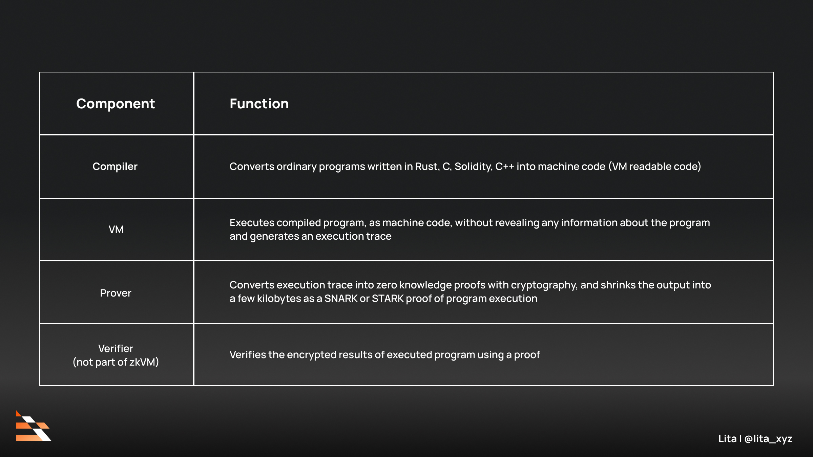
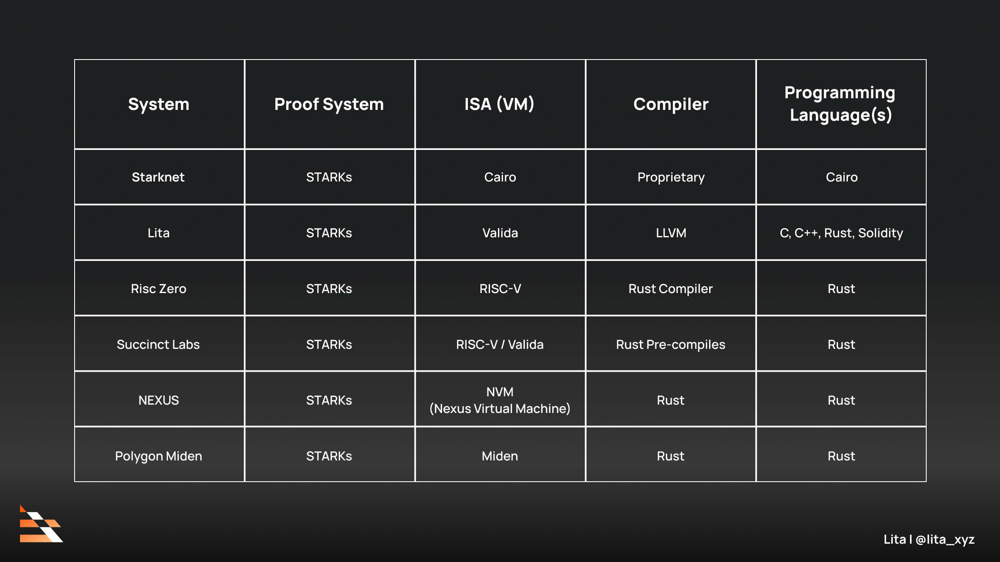

[TOC]


# 1. Intro

## 1.1 什么是zkvm？它的作用是什么？

- **zkvm是什么：**就像一般的vm提供运行环境一样，zkvm也提供了特定程序代码的运行环境。但是不同的是，zkvm作为一个程序的运行环境，会记录程序的运行轨迹和结果，这些程序的运行内容会被prover抽象为一个证明。而verifier只需要关注证明是否通过即可。比如我写了一个验证用户是否成年的程序，用户在我的程序上输入其隐私信息，并生成是否成年的这个结果。而zkvm会在跑程序的时候将上述过程抽象为proof，这个proof后续会在特定的verifier中被验证，如果一个证明自己成年的proof被验证成功后，就可以证明用户是成年人

- **为什么我们需要zkvm？**

  1. <u>解决“信任”问题：可验证的计算</u>

  在传统模式下，如果你将计算任务外包给第三方（比如云服务商），你必须**完全信任**它：

  - 信任它会正确执行程序。
  - 信任它不会篡改结果。
  - 信任它的硬件和软件没有漏洞或后门。

  zkVM 通过密码学彻底改变了这种模式。 它允许你不信任对方，但依然可以验证结果的正确性。你不需要自己重算一遍（可能非常耗时耗力），只需要花几毫秒验证一个小小的证明，就能从数学上确信计算结果100%正确。

  2. <u>实现“隐私”保护：计算可以不用公开数据</u>

  很多时候，你需要用敏感数据做计算，但又不想泄露数据本身。

  - 传统方式：你必须把原始数据交给计算方，隐私尽失。
  - zkVM 方式：你可以在本地用 zkVM 运行一个程序，程序会处理你的敏感数据，最终只输出一个**证明**和**公开的结果**，而不会泄露任何原始数据。就像我们之前举的例子一样，用户在本地程序中上传了身份证等隐私信息，但是最终zkvm输出的内容不会包含任何此类信息，但是依旧可以通过verifier来进行验证用户是否已成年。


## 1.2 zkvm的架构

在构建ZKVM时，开发者需要在指令集架构、证明系统（如SNARK或STARK）和内存管理等方面做出多种设计选择，以优化性能和效率。

zkvm的架构也通常分有前后端。之所以有类似前后端之分，也是为了像软件开发一样便于模块化处理，以便于选择不同的技术栈实现不同的目的。

总结地来说，**zkvm的前端就是在选择不同的ISA，而后端则就是在选择不同的proof system。**

更加具体的，我们的zkvm有以下组成部件：



下面是现有项目中的架构选择:



接下来我们仔细讲讲ISA和proving system是什么，为什么是这样的架构。


### 1.2.1 ISA

**指令集架构（Instruction Set Architecture, ISA）**是计算机科学中的一个核心概念，它扮演着软件和硬件之间至关重要的**桥梁或接口**角色。简单来说，ISA定义了处理器（CPU）能听懂什么“语言”以及能做什么事。其最主要的作用是提供一个**抽象层**，将软件开发者与具体的硬件实现细节分离开来。这一点带来了如下的好处：

1. **兼容性与可移植性**：只要不同的CPU处理器实现了相同的ISA，那么为这个ISA编写的程序（机器码）就可以在这些不同的处理器上运行，无需修改。这意味着你可以升级你的电脑硬件（例如，从英特尔的旧款CPU换成新款CPU），而无需更换你的操作系统和应用程序。
2. **分离硬件和软件的开发**：ISA提供了一个明确的规范。硬件工程师可以专注于设计性能更高、功耗更低的处理器来实现这套ISA，而软件开发者则可以专注于为这套ISA编写高效的程序和编译器，两者可以并行进行，互不干扰。
3. **为程序员提供规范**：ISA可以被看作是“程序员手册”，它精确地告诉了编译器编写者和底层系统开发者，可以利用哪些指令来控制硬件。

> 一个完整的ISA规范通常由以下几个核心部分组成：
>
> 1. **指令集 (Instruction Set)**：这是ISA最核心的部分，定义了处理器能够执行的所有操作。这些指令通常包括：
>    - **算术和逻辑运算指令**：如加、减、乘、除、与、或、非等。
>    - **数据传输指令**：在寄存器和内存之间移动数据，例如加载（load）和存储（store）。
>    - **控制流指令**：改变程序的执行顺序，如跳转（jump）、分支（branch）和函数调用。
>    - **输入/输出 (I/O) 指令**：用于和外部设备通信。
> 2. **数据类型 (Data Types)**：定义了指令可以操作的数据的类型和大小，例如整数（8位、32位、64位）、浮点数和字符等。
> 3. **寄存器 (Registers)**：ISA会规定处理器内部有哪些可供程序直接访问的高速存储单元（寄存器），以及它们的数量、大小和用途。寄存器用于在计算过程中暂存数据，其访问速度远快于主内存。
> 4. **寻址模式 (Addressing Modes)**：定义了指令如何指定其操作数的位置。 换句话说，它规定了寻找指令所需数据的方法，例如数据是直接包含在指令中（立即数寻址），还是在某个寄存器里，或者是在内存的某个地址上。
> 5. **内存模型 (Memory Architecture)**：定义了程序如何与系统内存进行交互，包括内存地址如何组织、数据如何在内存中对齐，以及在多核处理器中保证内存访问一致性的规则等。
> 6. **指令格式 (Instruction Formats)**：规定了机器指令在内存中是如何用二进制编码的。 这包括了操作码（opcode，指明要执行什么操作）和操作数（operands，指明操作的对象）的布局和长度。
>
> 总的来说，指令集架构的核心是指令集，类似于opcode之于EVM。

#### 1.2.1.1 ISA的作用

我们先直接解释ISA在zkvm中起到了什么作用，以**RISC-ZERO**的项目为例，其使用RISC-V作为ISA。这样当用户写了一段rust程序后，rust能直接编译为RISC-V对应的ELF二进制可执行文件（`*.elf`）。这个过程类似我们在写合约后，solidity将代码编译成字节码类似（solidity会生成一个json文件，里面既包含ABI也包含对应的bytecode字节码）。


接下来，这个 `*.elf` 文件会被送入 RISC Zero zkVM 的执行环境executor中。之后进行以下步骤：

- **加载**：zkVM 的执行器（一个 RISC-V 模拟器）会将这个 ELF 文件加载到虚拟的 RISC-V 内存中。
- **执行**：执行器开始从程序的入口点（`_start`）逐条**解释执行** RISC-V 指令。它模拟 CPU 的行为：处理指令、更新寄存器状态、读写虚拟内存。
- **记录痕迹**：这是最关键的一步。在执行指令的同时，zkVM 会忠实地**记录下完整的执行痕迹**。这个痕迹包括了每一条执行的指令、所有寄存器的值、所有内存访问的地址和值等。这份痕迹是生成证明的“原材料”。在这里这个trace被RISC-ZERO称为`session`。这个`session`其实就是指令集转化成的约束集，也就是circuit。

我们从图中可以看到，选择了ISA，就决定了executor的程序该如何写，该按哪种指令进行任务的执行和session的记录。所以选择ISA就是选择zkvm的前端。

ISA defines the format of machine code generated by the compiler and executed by the VM.


#### 1.2.1.2 EVM与传统ISA对比

为了便于深入地理解ISA，我们拿EVM来举例说明。因为EVM就是一种ISA，它也由以上的组成：

1. **指令集 (Instruction Set)**

- **传统ISA**: 拥有一系列由硬件直接执行的指令（如x86的 MOV, ADD, JMP）。
- **EVM对应**: **操作码 (Opcodes)**。EVM拥有大约140个操作码，它们构成了EVM的字节码指令集。这些指令由以太坊客户端软件解释执行，而不是由物理芯片执行。
  - **算术/逻辑运算**: ADD (加法), SUB (减法), AND (按位与), GT (大于比较)。这些指令通常直接操作堆栈顶部的元素。
  - **数据传输**: PUSH1 到 PUSH32 (将1到32字节的数据推入堆栈), MLOAD (从内存加载), SLOAD (从存储加载), MSTORE (存入内存), SSTORE (存入存储)。
  - **控制流**: JUMP (无条件跳转), JUMPI (有条件跳转), STOP (停止执行), REVERT (回滚状态并停止)。
  - **区块链相关**: CALLER (获取调用者地址), BLOCKHASH (获取区块哈希), BALANCE (获取账户余额)。这些是EVM特有的指令，用于与区块链状态交互。

2. **数据类型 (Data Types)**

- **传统ISA**: 定义了如8位、32位、64位的整数和浮点数等。
- **EVM对应**: 核心数据类型是 **256位（32字节）的字 (word)**。
  - EVM中的所有堆栈项目、内存和存储操作都以256位为基本单位。这个设计选择是为了方便处理密码学操作，如Keccak-256哈希和椭圆曲线签名。
  - 虽然Solidity等高级语言中有uint8或bool等更小的数据类型，但在EVM层面，它们通常会被打包在一个256位的字中进行处理，只是在存取时通过位运算进行操作。

3. **寄存器 (Registers)**

- **传统ISA**: 拥有一组通用的高速硬件寄存器（如EAX, R1, R2），用于暂存数据和地址。
- **EVM对应**: EVM是一个基于堆栈的简单机器，**没有通用的寄存器**。计算操作数直接从堆栈中获取。不过，它有一些类似寄存器功能的特殊指针和变量来维护虚拟机的状态：
  - **程序计数器 (Program Counter, PC)**: 指向当前正在执行的字节码指令的地址。
  - **堆栈指针 (Stack Pointer, SP)**: 虽然没有一个明确的SP寄存器，但堆栈的顶部位置是被虚拟机隐式跟踪的。
  - **Gas计数器 (Gas Counter)**: 跟踪剩余的Gas量，这是EVM独有的，用于计量计算成本。
  - **内存大小 (Memory Size)**: 跟踪当前已分配内存的大小。

4. **寻址模式 (Addressing Modes)**

- **传统ISA**: 定义了多种寻找操作数的方法，如立即数寻址、寄存器寻址、直接寻址等。
- **EVM对应**: EVM的寻址模式相对简单，主要有：
  - **堆栈寻址 (Stack Addressing)**: 这是最主要的模式。大多数指令（如ADD, MUL）的操作数都隐式地指向堆栈的顶部。
  - **立即数寻址 (Immediate Addressing)**: PUSHx系列指令的操作数直接跟在指令后面，编码在字节码中。例如，PUSH1 0x80这条指令会将0x80这个立即数推入堆栈。
  - **内存/存储间接寻址**: MLOAD, MSTORE, SLOAD, SSTORE等指令的操作数地址来自于堆栈。它们会从堆栈顶部弹出一个值，并将其用作访问内存或存储的地址。

5. **内存模型 (Memory Architecture)**

- **传统ISA**: 定义了程序如何与主内存（RAM）交互。
- **EVM对应**: 定义了三个截然不同的数据存储区域：
  - **堆栈 (Stack)**: 一个后进先出（LIFO）的临时数据区，大小限制为1024个256位的字。用于存放函数参数、局部变量和计算过程中的中间值。每次调用结束后，堆栈被清空。
  - **内存 (Memory)**: 一个临时的、可按字节寻址的线性字节数组。它在每次消息调用开始时被清空，主要用于暂存复杂数据结构（如数组或字符串）以及在内外函数调用时传递数据。使用内存需要消耗Gas，且会随内存的扩展而增加。
  - **存储 (Storage)**: 一个永久的、位于区块链状态中的键值对存储区（256位的键映射到256位的值）。这是智能合约状态（如用户余额）的最终存放地。对存储的读写操作是所有操作中Gas成本最高的。

6. **指令格式 (Instruction Formats)**

- **传统ISA**: 指令长度可以是固定的或可变的，由操作码和操作数字段组成。
- **EVM对应**: 指令格式非常简单。（在EOF之前是这样的，EOF对其opcode格式进行了规范，但是又由于RISC-V替代EVM的提议，导致EOF变得不是那么重要了）
  - 每个操作码本身是**一个字节**（例如，0x01代表ADD）。
  - 对于PUSHx指令，操作码后面会紧跟1到32字节的数据作为其操作数。
  - 除此之外，指令不包含其他寻址模式或操作数字段，因为所有信息都来自于堆栈或指令本身。


#### 1.2.1.3 RISC-V

如果你关注了以太坊的消息就应该直到RISC-V(（Reduced Instruction Set Computer V）)即将成为可能替代EVM的ISA，那么RISC-V是什么呢？为什么它能替代EVM？

- **EVM **：EVM是一种**虚拟**机，它没有直接对应的物理硬件。它是一个在以太坊网络中的每个节点上运行的软件沙盒环境VM的规范定义了智能合约如何执行，确保无论在哪台计算机上运行，只要输入相同，输出结果就完全一致，这是区块链达成共识的关键。

  EVM采用**基于堆栈（Stack-based）**的架构。这意味着大多数指令都是从一个名为“堆栈”的数据结构中弹出（pop）操作数，并将结果推入（push）回堆栈。这种设计相对简单，易于实现和保证安全性，但对于某些计算任务而言效率不高。

- **RISC-V **：RISC-V是一个**物理**指令集架构的开放标准，用于设计和构建实际的处理器芯片。它类似于ARM和x86，为硬件设计师提供了一套蓝图，用于制造从嵌入式设备到超级计算机等各种应用的CPU。

  RISC-V采用现代主流的**基于寄存器（Register-based）**的架构。操作通常在CPU核心的一组高速存储单元（寄存器）之间进行。这种架构能更好地被现代编译器利用，通过优化寄存器的使用来生成更高效、更快速的代码。

  它被设计为一个适用于所有计算场景的通用ISA。 其核心是一个极简的指令集，并可以通过标准扩展（如用于浮点计算或向量处理的扩展）来满足不同应用的需求。这种灵活性和开放性使其能够被定制用于AI加速、移动设备、服务器等多种硬件。RISC-V的通用和精简特性使其比EVM更适合生成零知识证明，这对于提升以太坊的可扩展性至关重要。

| 特性         | 以太坊虚拟机 (EVM)            | RISC-V                     |
| ------------ | ----------------------------- | -------------------------- |
| **类型**     | 虚拟ISA，软件实现             | 物理ISA，硬件实现蓝图      |
| **架构**     | 基于堆栈                      | 基于寄存器                 |
| **用途**     | 专用：执行智能合约            | 通用：从嵌入式到高性能计算 |
| **字长**     | 固定的256位                   | 模块化的32/64/128位        |
| **性能**     | 较低，受Gas机制和解释执行限制 | 高，为原生硬件速度设计     |
| **设计重点** | 安全性、确定性、共识          | 性能、能效、灵活性、开放性 |

但是传统的ISA在zkVM领域有以下的不足导致部分项目使用自定义的ISA+LLVM创建自己的编译工具来创建zkVM（如Lita）：

1. **传统 ISA 的设计逻辑：为硬件 “物理限制” 服务**

   传统 ISA 针对实体硬件（如 CPU）设计，核心痛点是**物理内存访问延迟**—— 硬件中数据在硅片上传输时，距离越远延迟越高。为解决这一问题，传统 ISA 引入 “通用寄存器”：这类存储单元紧邻 CPU 的算术逻辑单元（ALU），能临时存放数据，让 ALU 快速获取运算所需的操作数，避免频繁从远距离内存调取数据，从而提升硬件执行效率，通用寄存器也因此成为传统 ISA 的核心组件。

2. **zkVM 的本质差异：打破硬件限制，让传统设计 “失效”**

   在 zkVM 的 SNARK 证明场景中，硬件的物理限制不再适用：

- 内存访问无成本差异：zkVM 中访问 RAM（内存）与访问 “寄存器” 的开销完全一致，传统 ISA 依赖通用寄存器降低延迟的核心动机，在 zkVM 中彻底失效，通用寄存器变得多余；

- 分支处理效率相反：实体处理器能高效处理 “条件分支”（如 if-else），仅执行符合条件的代码路径；但 zk 电路需为**所有可能的分支**消耗计算资源（无论分支是否实际执行），传统 ISA 的分支处理逻辑会导致 zkVM 中严重的资源浪费。

3. **zkVM 的优化方向：**合并指令以减少分支开销, 针对 zkVM 分支处理的低效问题，核心优化思路是 **“指令合并”**：将多个功能关联的简单指令，整合为单个更复杂的指令。尽管这可能增加程序的总指令数，但能大幅减少 “条件分支” 的数量，从而降低 zk 电路为冗余分支消耗的计算资源，最终实现 SNARK 证明效率的提升。


### 1.2.2 Prover


```bash
WARNING: proving in dev mode. This will not generate valid, secure proofs.
2025-10-01T14:52:45.811117Z  INFO risc0_zkvm::host::server::exec::executor: execution time: 15.748385ms
2025-10-01T14:52:45.811284Z  INFO risc0_zkvm::host::server::session: number of segments: 1
2025-10-01T14:52:45.811292Z  INFO risc0_zkvm::host::server::session: 32768 total cycles
2025-10-01T14:52:45.811295Z  INFO risc0_zkvm::host::server::session: 3797 user cycles (11.59%)
2025-10-01T14:52:45.811359Z  INFO risc0_zkvm::host::server::session: 20245 paging cycles (61.78%)
2025-10-01T14:52:45.811392Z  INFO risc0_zkvm::host::server::session: 8726 reserved cycles (26.63%)
2025-10-01T14:52:45.811399Z  INFO risc0_zkvm::host::server::session: ecalls
2025-10-01T14:52:45.811405Z  INFO risc0_zkvm::host::server::session:    4 Sha2 calls, 296 cycles, (0.90%)
2025-10-01T14:52:45.811410Z  INFO risc0_zkvm::host::server::session:    8 Read calls, 21 cycles, (0.06%)
2025-10-01T14:52:45.811414Z  INFO risc0_zkvm::host::server::session:    1 Terminate calls, 2 cycles, (0.01%)
2025-10-01T14:52:45.811417Z  INFO risc0_zkvm::host::server::session:    0 Write calls, 0 cycles, (0.00%)
2025-10-01T14:52:45.811421Z  INFO risc0_zkvm::host::server::session:    0 User calls, 0 cycles, (0.00%)
2025-10-01T14:52:45.811425Z  INFO risc0_zkvm::host::server::session:    0 Poseidon2 calls, 0 cycles, (0.00%)
2025-10-01T14:52:45.811432Z  INFO risc0_zkvm::host::server::session:    0 BigInt calls, 0 cycles, (0.00%)
2025-10-01T14:52:45.811438Z  INFO risc0_zkvm::host::server::session: syscalls
2025-10-01T14:52:45.811443Z  INFO risc0_zkvm::host::server::session:    1 Write calls
2025-10-01T14:52:45.811472Z  INFO risc0_zkvm::host::server::session:    1 Read calls
2025-10-01T14:52:45.811503Z  INFO risc0_zkvm::host::server::session:    0 VerifyIntegrity2 calls
2025-10-01T14:52:45.811534Z  INFO risc0_zkvm::host::server::session:    0 VerifyIntegrity calls
2025-10-01T14:52:45.811565Z  INFO risc0_zkvm::host::server::session:    0 ProveKeccak calls
2025-10-01T14:52:45.811594Z  INFO risc0_zkvm::host::server::session:    0 Keccak calls
WARNING: Proving in dev mode does not generate a valid receipt. Receipts generated from this process are invalid and should never be used in production.
```


# Ref

[What is zkVM? A Zero Knowledge Paradigm (Part 1)](https://www.lita.foundation/blog/zero-knowledge-paradigm-zkvm)
